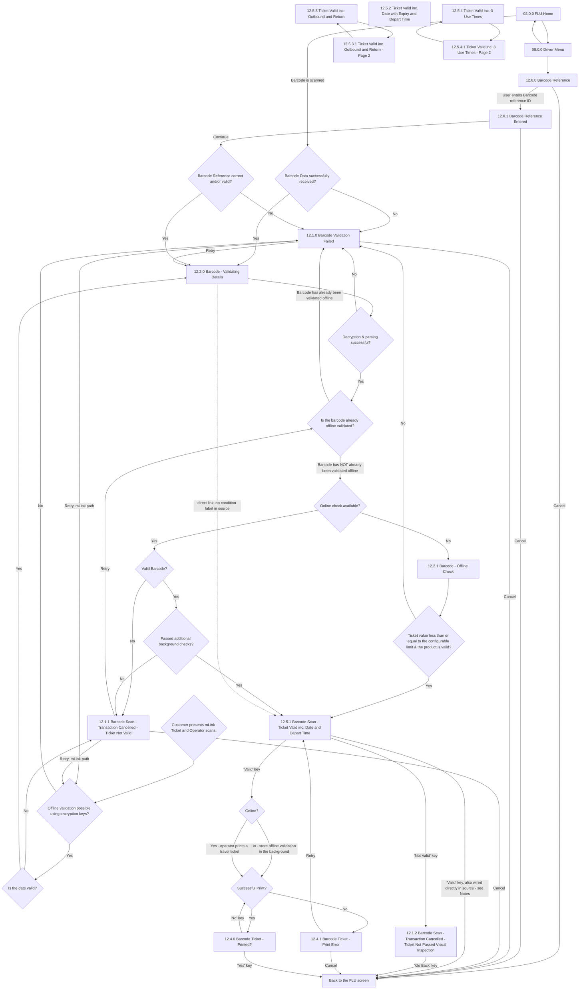

# Flow: Translink ETM — Barcode Scanning

- Source: Overflow project `ETM-TFTS-V15.0.4` (https://overflow.io/s/NDLGF6NF/), board "12.
  Barcode Scanning". Transcribed verbatim via the Claude Chrome extension, 2026-08-05. Raw source:
  `knowledge/flows/translink-etm-full-transcription-v15.0.4.md`.
- Project: translink   Device: ETM   Feature: barcode ticket scan / manual barcode reference / mLink
- Transcription confidence: **medium** — screens, decisions, and annotations are verbatim, but
  several connections in the raw source are incomplete, duplicated, or contradictory (see Notes /
  unknowns below); those are flagged rather than resolved by guessing.
- **Provisional board**: annotation states "This flow will be finalised upon reviewing the
  Corethree Barcode Approach post R2.0. Multi-use barcodes will also be reviewed post R2.0." —
  treat the whole board as subject to change.
- **Mode note**: no Metro/Ulsterbus/Rail branching found in this board.

## Diagram

## Paths (each = one candidate scenario)
| # | Path | Feature | Tags | Covered by |
|---|---|---|---|---|
| 1 | FLU Home → scan barcode → data received → Validating Details → decryption OK → not already offline-validated → online check available → Valid Barcode → passed background checks → Ticket Valid (12.5.1) → 'Valid' key → Online (Yes, operator prints) → Successful Print → Printed? → 'Yes' → back to FLU | barcode | @bos | FRAGMENTED — see consolidation-audit.md |
| 2 | Barcode Data successfully received? → **No** → Barcode Validation Failed | barcode | @destructive | 4105044 |
| 3 | Validating Details → Decryption & parsing **fails** → Barcode Validation Failed | barcode | @destructive | 4104531 |
| 4 | Barcode already offline-validated → Barcode Validation Failed | barcode | @destructive | 4104533 |
| 5 | Online check available → Valid Barcode? **No** → Transaction Cancelled - Ticket Not Valid | barcode | @destructive | 4104532 |
| 6 | Online check available → Valid Barcode? Yes → Passed additional background checks? **No** → Transaction Cancelled - Ticket Not Valid | barcode | @destructive | 4104532 |
| 7 | Online check **not** available → Offline Check → ticket value ≤ configurable limit & product valid → Ticket Valid (12.5.1) | barcode | — | 4100624 |
| 8 | Offline Check → ticket value/product check **fails** → Barcode Validation Failed | barcode | @destructive | 4100624 |
| 9 | Barcode Validation Failed → 'Retry' → back to Validating Details | barcode | @destructive | 4105044 |
| 10 | Barcode Validation Failed → 'Cancel' → back to FLU screen | barcode | @destructive | 4105044 |
| 11 | Driver Menu → Barcode Reference → enter reference ID → 'Continue' → reference correct/valid → Validating Details | barcode | — | 4100627 |
| 12 | Driver Menu → Barcode Reference → enter reference ID → 'Continue' → reference **not** correct/valid → Barcode Validation Failed | barcode | @destructive | 4100627 |
| 13 | Barcode Reference / Barcode Reference Entered → 'Cancel' → back to FLU screen | barcode | @destructive | 4105045 |
| 14 | Ticket Valid (12.5.1) → operator presses 'Not Valid' key → Transaction Cancelled - Ticket Not Passed Visual Inspection → 'Go Back' → back to FLU screen | barcode | @destructive | 4104538 |
| 15 | Ticket Valid (12.5.1) → 'Valid' key → Online? **No** → offline validation stored in background → Successful Print? | barcode | — | GAP — see proposals/coherence-audit/gap-register.md |
| 16 | Ticket Valid (12.5.1) → 'Valid' key → Online? **Yes** → operator prints a travel ticket → Successful Print? | barcode | — | 4100628 (see also proposals/coherence-audit/gap-register.md — conflicting source wiring affects this path too) |
| 17 | Successful Print? **No** → Barcode Ticket - Print Error → 'Retry' → back to Ticket Valid (12.5.1) | barcode | @destructive | 4100628 |
| 18 | Successful Print? No → Print Error → 'Cancel' → back to FLU screen | barcode | @destructive | 4105046 |
| 19 | Successful Print? Yes → Barcode Ticket - Printed? → 'Yes' key → back to FLU screen | barcode | — | 4100628 |
| 20 | Barcode Ticket - Printed? → 'No' key → re-asks Successful Print? | barcode | @destructive | 4105046 |
| 21 | mLink: customer presents mLink ticket, operator scans → Offline validation possible using encryption keys? **No** → Barcode Validation Failed | barcode-mlink | @destructive | 4105047 |
| 22 | mLink: Offline validation possible using encryption keys? Yes → Is the date valid? **No** → Transaction Cancelled - Ticket Not Valid | barcode-mlink | @destructive | 4105047 |
| 23 | mLink: Offline validation possible using encryption keys? Yes → Is the date valid? Yes → Validating Details | barcode-mlink | — | 4100626 |
| 24 | Transaction Cancelled - Ticket Not Valid → 'Retry' → re-enters "Is the barcode already offline validated?" | barcode | @destructive | 4105048 |
| 25 | Transaction Cancelled - Ticket Not Valid → 'Retry' (mLink path) → re-enters "Offline validation possible using encryption keys?" | barcode-mlink | @destructive | 4105048 |
| 26 | Ticket Valid inc. Outbound and Return (12.5.3) ↔ page 2 (12.5.3.1) paging | barcode | — | GAP — see proposals/coherence-audit/gap-register.md |
| 27 | Ticket Valid inc. 3 Use Times (12.5.4) ↔ page 2 (12.5.4.1) paging | barcode | — | GAP — see proposals/coherence-audit/gap-register.md |
| 28 | FLU Home ↔ Driver Menu navigation | barcode | — | MISSING — low-value pure UI nav, adequately implied by every case that reaches Barcode Reference via Driver Menu; not separately authored |

> `Covered by` stays `?`. Paths 26-27 (page-2 paging on the Outbound-and-Return and 3-Use-Times
> ticket-valid variants) and path 12.5.2 (Date with Expiry and Depart Time, no page-2 in the source)
> are **not wired into the main decision tree** in the raw transcription — see Notes / unknowns.

## Screen states (Given/Then anchors)
- **12.1.0 Barcode Validation Failed** is a shared terminal-failure screen reached from many
  different decision failures (data not received, decryption failure, already offline-validated,
  ticket value/product limit exceeded, barcode reference invalid, mLink encryption-key check
  failed). Per the annotation, the underlying causes bucketed into this one screen can be: barcode
  decryption failure, ticket not valid, ticket already used, ticket not valid on this date, ticket
  expired, or ticket value exceeds the offline validation limit.
- **12.0.0 Barcode Reference** — manual barcode-reference entry point, reached only via **Driver
  Menu** (08.0.0), per the annotation "Accessing Barcode Ref. via Driver menu." Not reachable from a
  direct scan.
- **12.5.1 Barcode Scan - Ticket Valid inc. Date and Depart Time** is the only "ticket valid" screen
  variant that is wired into the decision tree in this transcription; 12.5.2/12.5.3/12.5.4 (and their
  page-2s) are listed screens with the annotation "Ticket Validation screen examples" but the raw
  source only shows their own page-1↔page-2 paging links, not how the decision tree routes into them.
- **12.4.0 Barcode Ticket - Printed?** and **12.4.1 Barcode Ticket - Print Error** are distinct
  screens from the **07.0.0 Printer Error** screen covered in
  `translink-etm-flu-printer-travel-mode.md` — this board's raw source shows no connection between
  the two printer-error flows. Do not conflate the barcode ticket print-error/retry loop with the
  shared FLU printer-error flow referenced from other boards (e.g. `translink-etm-supervisor-menu.md`
  Versions/Waybills printing, or `translink-etm-flu-printer-travel-mode.md`'s 07.0.0 Printer Error) —
  they appear to be separate screens/flows per this transcription.
- **mLink** ("Customer presents mLink Ticket and Operator scans.") is a distinct entry trigger from
  the main scanned-barcode flow, per the "mLink Scan Validation" annotation, with its own
  encryption-key offline-validation check and date-validity check before rejoining Validating
  Details.

## Notes / unknowns
- **Provisional flow**: annotation states this board "will be finalised upon reviewing the
  Corethree Barcode Approach post R2.0" and that "Multi-use barcodes will also be reviewed post
  R2.0." Treat the whole board, especially any multi-use-ticket variant (12.5.3/12.5.4), as subject
  to change.
- TODO: confirm whether the "Back to the FLU screen" decision node actually returns to screen
  02.0.0 FLU Home — the raw source never draws an explicit connection from "Back to the FLU screen"
  to 02.0.0; it is only ever a *target*, never a source, in the Connections/Flow list. This mirrors
  the node's plain-English name but is not literally wired in the transcription.
- TODO: confirm the routing on 12.5.1's 'Valid' key press — the raw source lists **two**
  contradictory connections from "12.5.1 - Barcode Scan - Ticket Valid inc. Date and Depart Time"
  on the same 'Valid' key trigger: one to decision "Online?" and a separate one straight to "Back to
  the FLU screen." Both are transcribed verbatim in the Diagram above; do not assume one supersedes
  the other without checking the live Overflow board.
- TODO: confirm the direct, unconditioned connection from "12.2.0 Barcode - Validating Details" to
  "12.5.1 Barcode Scan - Ticket Valid inc. Date and Depart Time" — the raw source lists this link
  with no decision/condition label, separate from the main Decryption → Offline-check →
  Online-check → Valid-Barcode → Background-checks chain that also reaches 12.5.1. It's unclear
  whether this is a shortcut for a specific case (e.g. mLink re-entry) or a duplicate/stray
  connection in the source export.
- TODO: confirm the real trigger/routing for 12.5.2 "Ticket Valid inc. Date with Expiry and Depart
  Time" — it is listed as a screen and named in the annotations as one of the "Ticket Validation
  screen examples," but has zero connections (in or out) in the raw Connections/Flow list.
- See `translink-etm-flu-printer-travel-mode.md` for the separate, shared FLU printer-error/retry
  flow (07.0.0 Printer Error) — this board's own print-error loop (12.4.1 Barcode Ticket - Print
  Error → Retry → 12.5.1) is not shown as connected to it in the source and should not be merged
  with it in test design.
- `/audit-flows` pass 2026-08-05 — path 1 is FRAGMENTED: happy path split across cases 4100622
  (scan-to-result) and 4100628 (issue/print), neither reading end-to-end — logged to
  consolidation-audit.md. Highest-risk gaps: path 2 (no-data-received isn't in the failure taxonomy
  anywhere), the entire Retry/Cancel button cluster on failure screens (paths 9,10,13,18,20,24,25 —
  seven unverified navigation branches), and path 15 (silent background offline-store path
  completely untested). Paths 15/16/26/27 rest on unconfirmed source wiring (conflicting or unwired
  connections in the raw transcription) — escalated to proposals/coherence-audit/gap-register.md.
