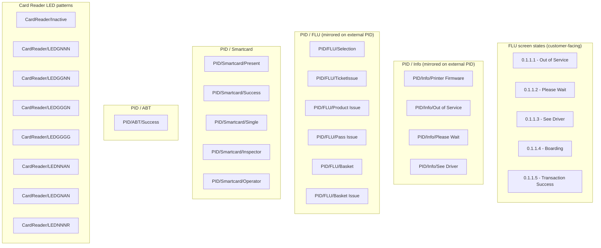

# Flow: Translink ETM — Displays, LEDs and Audio Tones

- Source: Overflow project `ETM-TFTS-V15.0.4` (https://overflow.io/s/NDLGF6NF/), board "11.
  Displays LEDs and Audio Tones". Transcribed verbatim via the Claude Chrome extension, 2026-08-05.
  Raw source: `knowledge/flows/translink-etm-full-transcription-v15.0.4.md`.
- Project: translink   Device: ETM   Feature: passenger displays (PID), card reader LEDs, audio tones
- Transcription confidence: **high** — verbatim, not summarized. The source lists this board's 29
  screens with **zero decision points, zero annotations, and zero connections** — it is a screen-state
  inventory/reference board, not a navigable flow. No paths, triggers, or transitions are invented
  below; none exist in the source.
- **Mode note**: no Metro/Ulsterbus/Rail branching found in this board.

## Diagram

> No edges are drawn between nodes — the raw transcription records 0 connections for this board. The
> subgraph groupings above reflect the screens' own naming (`0.1.1.x`, `PID/Info/…`, `PID/FLU/…`,
> `PID/Smartcard/…`, `PID/ABT/…`, `CardReader/LED…`), not an inferred navigation order.

## Paths (each path = one candidate scenario)
| # | Path | Feature | Tags | Covered by |
|---|------|---------|------|------------|
| — | N/A — source has 0 decision points and 0 connections for this board; see Notes | displays/leds/audio | — | N/A — see Screen states section for per-screen coverage (all 29 states covered). |

> This board does not describe a click-through flow. It is a reference inventory of the screen/LED
> states that other flows (Idle, FLU ticketing, Smartcard, ABT, card-reader hardware states) put the
> device into. Candidate scenarios are "device reaches state X and shows/behaves as Y" — but *which*
> other flow triggers each state is not stated on this board, so no path can be transcribed without
> guessing. See Notes / unknowns.

## Screen states (Given/Then anchors)
- **0.1.1.1 - Out of Service** — FLU screen state. (case 4100833)
- **0.1.1.2 - Please Wait** — FLU screen state. (case 4100834)
- **0.1.1.3 - See Driver** — FLU screen state. (case 4100835)
- **0.1.1.4 - Boarding** — FLU screen state. (case 4100836)
- **0.1.1.5 - Transaction Success** — FLU screen state. (case 4100837)
- **PID/Info/Printer Firmware** — PID (external Passenger Information Display) mirror screen. (case 4100706)
- **PID/Info/Out of Service** — PID mirror of the FLU "Out of Service" state. (case 4100704)
- **PID/Info/Please Wait** — PID mirror of the FLU "Please Wait" state. (case 4100705)
- **PID/Info/See Driver** — PID mirror of the FLU "See Driver" state. (case 4100707)
- **PID/FLU/Selection** — PID mirror of an FLU selection screen. (case 4100702)
- **PID/FLU/TicketIssue** — PID mirror of an FLU ticket-issue screen. (case 4100703)
- **PID/FLU/Product Issue** — PID mirror of an FLU product-issue screen. (case 4100701)
- **PID/FLU/Pass Issue** — PID mirror of an FLU pass-issue screen. (case 4100700)
- **PID/FLU/Basket** — PID mirror of an FLU basket screen. (case 4100698)
- **PID/FLU/Basket Issue** — PID mirror of an FLU basket-issue screen. (case 4100699)
- **PID/Smartcard/Present** — PID state shown while a smartcard is presented. (case 4100710)
- **PID/Smartcard/Success** — PID state for a successful smartcard transaction. (case 4100712)
- **PID/Smartcard/Single** — PID state, single smartcard use. (case 4100711)
- **PID/Smartcard/Inspector** — PID state, inspector smartcard use. (case 4100708)
- **PID/Smartcard/Operator** — PID state, operator smartcard use. (case 4100709)
- **PID/ABT/Success** — PID state for a successful ABT (Account-Based Ticketing) transaction. (case 4100697)
- **CardReader/Inactive** — card reader LED pattern: reader inactive. (cases 4100689, 4100643)
- **CardReader/LEDGNNN** — card reader LED pattern (segment code as named — see Notes). (case 4100694)
- **CardReader/LEDGGNN** — card reader LED pattern. (case 4100692)
- **CardReader/LEDGGGN** — card reader LED pattern. (case 4100691)
- **CardReader/LEDGGGG** — card reader LED pattern. (case 4100690)
- **CardReader/LEDNNAN** — card reader LED pattern. (case 4100695)
- **CardReader/LEDGNAN** — card reader LED pattern. (case 4100693)
- **CardReader/LEDNNNR** — card reader LED pattern. (case 4100696)

## Notes / unknowns
- The raw transcription for this board (`## 11. Displays LEDs and Audio Tones` in
  `translink-etm-full-transcription-v15.0.4.md`) lists only a "Screens (29)" section — Decision
  Points, Annotations/Spec Notes, and Connections/Flow are all explicitly `(0)`. `etm-flow-annotations.md`
  confirms "29 screens · 0 annotation notes" for this board. Nothing beyond the screen name list is
  transcribable; no path, trigger, or screen-meaning claim beyond what's stated here should be assumed.
- TODO: confirm which other flows/boards actually navigate *into* each of these states (e.g. does
  "PID/Info/Out of Service" mirror the FLU going out of service from the Selling flow, from a hardware
  fault, or both?). Not stated on this board.
- TODO: confirm the meaning of the `CardReader/LEDxxxx` naming convention (each letter position is
  presumably a coloured LED segment state — G/N/A/R — but no legend or annotation defines this on the
  board or in the annotations file).
- TODO: confirm how "Audio Tones" (named in the board title) map onto these screens/LED states — no
  audio-tone screen, annotation, or note appears anywhere in the raw transcription for this board.
  It's possible tones are paired with the LED patterns above but this is not stated.
- No genuine sub-flow split was applied (unlike e.g. `translink-etm-driver-menu-options.md` /
  `translink-etm-driver-menu-annulment.md`) — this board has no connections or decision points to
  divide into separate flows; it is a single flat screen-state inventory, kept as one file. The
  Diagram groups screens by their own naming prefix for readability only.
- `/audit-flows` pass 2026-08-05 — all 29 screen states have a dedicated Screen Validation case
  (visual/static check only). Trigger-mapping for every PID/Info and CardReader/LED state (which
  upstream flow drives each one) is unconfirmed on the source board — flagged to proposals/coherence-audit/gap-register.md,
  not chargeable as a suite gap since it's a flow-map fidelity gap. The CardReader LED letter-code
  legend (G/N/A/R meaning) is also undefined in the source — same gap-register escalation. Audio
  Tones (named in this board's title) have zero distinct screens/annotations in the source; generic
  case 4100644 exists but can't be tied to a specific state here. Regression defect 300751 (Customer
  Display GDPR) is folded into case 4100946, but that case's Refs field is empty — traceability gap,
  worth a Refs backfill.
