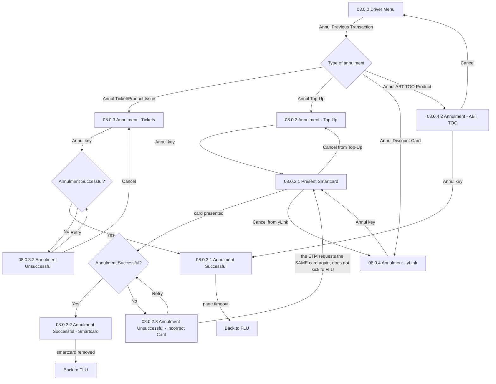

# Flow: Translink ETM — Driver Menu: Annulment

- Source: Overflow project `ETM-TFTS-V15.0.4` (https://overflow.io/s/NDLGF6NF/), board "8. Driver
  Menu / Options" — the Annulment portion only. Transcribed verbatim via the Claude Chrome
  extension, 2026-08-04. Raw source: `knowledge/flows/translink-etm-full-transcription-v15.0.4.md`.
- Project: translink   Device: ETM   Feature: annulment / transaction reversal
- Split note: highest financial-risk sub-flow of the "Driver Menu / Options" board — split out from
  the rest (ticket history, totals, reboots, device settings) which is covered in
  `translink-etm-driver-menu-options.md`.
- Transcription confidence: **high** — verbatim, not summarized.
- **Mode note**: no Metro/Ulsterbus/Rail branching found in this sub-flow.

## Diagram

## Paths (each = one candidate scenario)
| # | Path | Feature | Tags | Covered by |
|---|---|---|---|---|
| 1 | Annul the last ticket/product issue, within a minute, succeeds | annulment | @destructive | 4100551 |
| 2 | Annul the last ticket/product issue fails → "Unsuccessful" → Retry → succeeds | annulment | @destructive | 4100551,4100721,4100722 |
| 3 | Annul a top-up: present smartcard → succeeds | annulment | @destructive | 4100576,4100716,4100717,4100718 |
| 4 | Annul a top-up: incorrect card presented → ETM re-prompts for the **same** card (does not return to FLU) | annulment | @destructive | 4100719 |
| 5 | Annul a yLink/discount-card transaction: present smartcard → succeeds | annulment | @destructive | 4100723 |
| 6 | Annul an ABT TOO product | annulment | @destructive | 4100724 |
| 7 | Annulment of a **basket transaction** → the whole basket annuls at once, not one item | annulment | @destructive | 4100566 |
| 8 | Attempt to annul after a boarding-stage change has occurred → the annulment list has cleared, nothing to annul | annulment | @destructive | 4100551 |
| 9 | Attempt to annul a transaction older than 1 minute → not available (implied by the "less than a minute ago" rule; no explicit "too old" screen shown) | annulment | @destructive | GAP — see proposals/coherence-audit/gap-register.md |

> `Covered by` has been filled in against the live TestRail `cases.json` — see Notes/unknowns below.

## Screen states (Given/Then anchors)
- **Annulment eligibility rule**: only the **last transaction**, and only if it occurred **less than
  a minute ago**. A stage change clears the annulment list entirely.
- **Basket transactions annul as a whole** — annulling a basket sale reverses the entire basket in
  one action, not per line item.
- **Incorrect-card behaviour differs from the norm**: most flows return the user to FLU when a
  smartcard is removed; this one explicitly does **not** — it re-prompts for the correct card on the
  same screen instead.
- Both **08.0.3.1 Annulment Successful** (tickets) and **08.0.2.2 Annulment Successful - Smartcard**
  (top-up/yLink) print an annulled ticket/receipt and "follow print flows seen on the FLU board"
  (see `translink-etm-flu-printer-travel-mode.md` for that shared mechanism).

## Notes / unknowns
- `/audit-flows` pass 2026-08-05 — path 9's underlying flow-map row is itself an unresolved source
  GAP (what happens annulling a transaction outside the 1-minute window); escalated to
  proposals/coherence-audit/gap-register.md, not classified. Path 4's incorrect-card re-prompt behaviour (does NOT return to
  FLU) has no functional case — highest-risk partial. Register's two NEEDS GEORGE rows (301937,
  301828) can't be ruled out as annulment-related — flagged, not acted on.
- **GAP**: no screen shows what happens when the tester tries to annul a transaction that's already
  outside the 1-minute window — confirm live whether the Annul option is simply hidden/disabled, or
  whether some other error surfaces.
