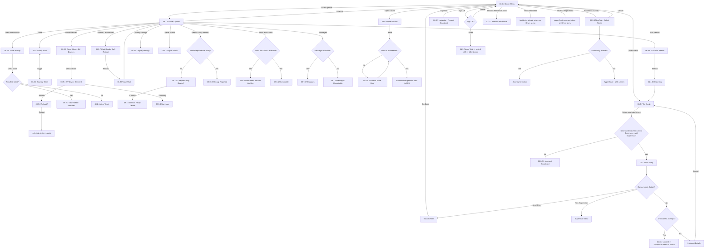

# Flow: Translink ETM — Driver Menu: Options (everything except Annulment)

- Source: Overflow project `ETM-TFTS-V15.0.4` (https://overflow.io/s/NDLGF6NF/), board "8. Driver
  Menu / Options" — everything except Annulment. Transcribed verbatim via the Claude Chrome
  extension, 2026-08-04. Raw source: `knowledge/flows/translink-etm-full-transcription-v15.0.4.md`.
- Project: translink   Device: ETM   Feature: driver menu (ticket history, totals, inspector,
  device management, break, new journey, sign off)
- Split note: see `translink-etm-driver-menu-annulment.md` for the annulment sub-flow.
- Transcription confidence: **high** — verbatim, not summarized.
- **Mode note**: no Metro/Ulsterbus/Rail branching found in this sub-flow.

## Diagram

## Paths (each = one candidate scenario)
| # | Path | Feature | Tags | Covered by |
|---|---|---|---|---|
| 1 | View Ticket History → select a non-annulled ticket → normal view | driver-menu | — | 4102170 |
| 2 | View Ticket History → select an annulled ticket → shown with the annulled marker | driver-menu | — | 4102170,4100738 |
| 3 | View Duty Totals ↔ Journey Totals toggle | driver-menu | — | 4102169 |
| 4 | Inspector mode: valid smartcard presented → back to FLU | driver-menu | — | 4100607 |
| 5 | Inspector mode: invalid smartcard → "Invalid Smartcard" → card removed → back to FLU | driver-menu | @destructive | 4100607 |
| 6 | Soft Reboot (ETM) → confirms → restarts → lands on "On Break" screen, **driver stays logged in** | driver-menu | @destructive | 4102174 |
| 7 | Soft Reboot (Card Reader only) → confirms → reboots → returns to Driver Options once done | driver-menu | @destructive | 4102175 |
| 8 | Report Faulty Reader, not previously reported → confirm → faulty icon appears in header, back-office notified | driver-menu | @destructive | 4102176 |
| 9 | Report Faulty Reader, **already** reported → "Already Reported" message, no duplicate notification | driver-menu | @destructive | 4102176 |
| 10 | Faulty-device icon persists until the ETM is rebooted (not cleared by anything else) | driver-menu | — | 4102176 |
| 11 | Display Settings → Restore Defaults → brightness/volume reset | driver-menu | — | 4100597 |
| 12 | Word and Colour of the Day available/unavailable from Driver Options (same conditional pattern as sign-on) | driver-menu | — | 4102172 |
| 13 | Messages available/unavailable from Driver Options | driver-menu | — | 4102171 |
| 14 | Open Tickets → issue an excess ticket, amount processable → prints, back to FLU | driver-menu | — | 4100556 |
| 15 | Open Tickets → issue an excess ticket, amount **not** processable → "Excess Ticket Error", retry | driver-menu | @destructive | 4100556 |
| 16 | Other Devices (BV) → select a paired device → view summary | driver-menu | — | 4100608 |
| 17 | Other Devices (BV) → select a paired device → reboot it | driver-menu | @destructive | 4100608 |
| 18 | Driver Break: correct staff smartcard presented → PIN entry → correct login → back to FLU (driver resumes) | driver-menu | — | 4100596 |
| 19 | Driver Break: **only the operator who broke can sign back in**; a different operator's card is rejected unless it's a Supervisor override | driver-menu | @destructive | 4100596 |
| 20 | Driver Break: break duration configured in TMS expires → driver auto-signed-out → screen goes Idle, anyone can sign in | driver-menu | @destructive | 4100596 |
| 21 | Start New Journey: scheduling enabled → Journey Selection (same as initial sign-on) | driver-menu | — | 4100549 |
| 22 | Start New Journey: scheduling disabled → manual route entry | driver-menu | — | 4105054 |
| 23 | Sign Off from Driver Menu → confirms → shift ends → Idle Screen | driver-menu | @destructive | 4100524 |

> `Covered by` has been filled in against the live TestRail `cases.json` — see Notes/unknowns below
> for missing paths.

## Screen states (Given/Then anchors)
- **Soft Reboot (ETM)** vs **Reboot Card Reader** are genuinely different operations with different
  outcomes: full ETM reboot lands on "On Break" (driver stays signed in); card-reader-only reboot
  just returns to Driver Options once done.
- **Faulty Reader reporting** is idempotent-aware — reporting twice is explicitly handled
  differently (blocked with "Already Reported"), not silently repeated.
- **Driver Break access control**: only the break-initiating operator (or any Supervisor) can sign
  back in while on break — this is an access-control rule worth its own dedicated test, not just a
  "sign on works" happy path.
- **"Other Devices" (BV)** — paired peripheral devices manageable from the Driver Menu (view
  summary, reboot). Distinct from the standalone "Bus Validator" device/board found in the
  GV/PV/BV validators transcription — this is almost certainly Bluetooth-paired accessory devices,
  not the same BV. Don't conflate the two without confirming.

## Notes / unknowns
- `/audit-flows` pass 2026-08-05 — missing path: 22 (manual/typed route entry for a
  scheduling-disabled new journey has no functional case, only screen-validation). Register defect
  301828 (NEEDS GEORGE, blank title) can't be ruled out as related to this board — flag for George,
  do not act.
- **GAP**: what happens if Driver Break's configured duration is reached while other operators try
  to sign on **during** the timeout transition isn't detailed — a live/edge-case timing question,
  not something to guess at.
