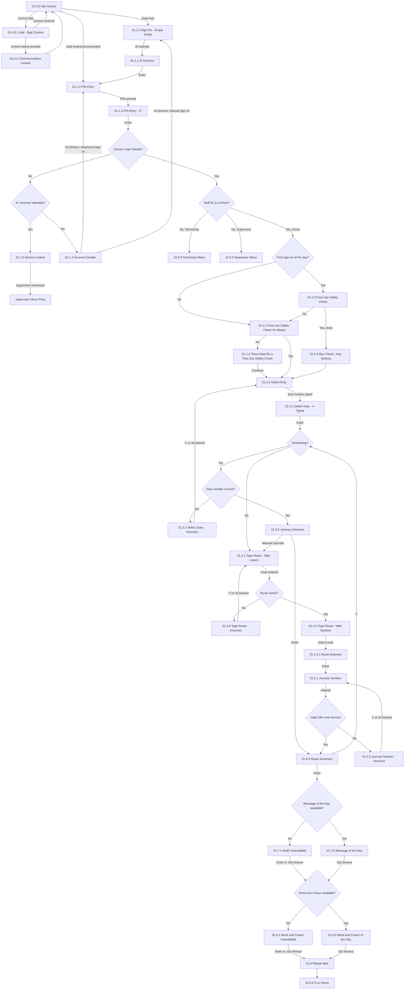

# Flow: Translink ETM — Driver Sign On

- Source: Overflow project `ETM-TFTS-V15.0.4` (https://overflow.io/s/NDLGF6NF/), board "4. Driver
  Sign On" — transcribed verbatim via the Claude Chrome extension, 2026-08-04. Raw source:
  `knowledge/flows/translink-etm-full-transcription-v15.0.4.md`.
- Project: translink   Device: ETM   Feature: auth / sign-on / duty-journey selection
- Transcription confidence: **high** — verbatim screen names, decisions, and connections captured
  directly from Overflow; not a summary. Branch wiring below is read straight off the connection
  list, not inferred.

## Global rules (apply throughout this flow unless a screen says otherwise)
- **30-second idle timeout** anywhere in this flow → returns to Idle Screen; signs the driver out if
  already signed in.
- **'C' key** → back one screen (clearing one input character at a time first, where applicable).
- **'P' key** → jumps to the Sign Off prompt from anywhere in the flow.
- Signing off after Duty Selection has happened → a Waybill prints.

## Diagram — the primary spine (sub-flows detailed in Paths, not crammed in here)

## Paths (each = one candidate scenario)
| # | Path | Feature | Tags | Covered by |
|---|---|---|---|---|
| 1 | Idle → Enter → manual ID+PIN, correct → Driver, first sign-on → Safety Check (on board) → Duty → Scheduled journey accepted → Route Summary → MotD → Word&Colour → FLU Home | auth | — | 4100510 |
| 2 | Idle → valid smartcard presented → PIN entry only (ID skipped) → … → FLU Home | auth | — | 4100511 |
| 3 | Incorrect ID/PIN, < 3 attempts → "Incorrect Details" → retry (manual: back to Empty Fields; smartcard: back to PIN entry) | auth | @destructive | 4100514 |
| 4 | Incorrect ID/PIN × 3 → Device Locked → Supervisor smartcard unlocks → Supervisor Menu Flow | auth | @destructive | 4100514,4100528 |
| 5 | Comms fails at Idle → Bad Comms → persists → Communications Locked → (comms restored) → Idle | auth | @destructive | 4100515,4100647 |
| 6 | Staff ID is a Technician → Technician Menu (not the Driver flow) | auth | — | 4100530,4100531 |
| 7 | Staff ID is a Supervisor → Supervisor Menu (not the Driver flow) | auth | — | 4100525,4100526 |
| 8 | First sign-on of the day → full First Use Safety Check → "Yes" (done) → Bus Check - Any Defects (Yes or No) → Duty | auth | — | 4100510,4100512,4104434 |
| 9 | First sign-on of the day → Safety Check "No" → "There Must Be a First Use Safety Check" blocking notice → Continue → Duty | auth | — | 4105049 |
| 10 | Not first sign-on of the day → "Safety Check On Board" (already satisfied) → Duty | auth | — | 4100513 |
| 11 | Select Duty → Duty Number correct, no scheduling → manual route entry (Type Route - With Letters) | auth | — | 4100510 |
| 12 | Select Duty → Duty Number incorrect → "Select Duty - Incorrect" → retry (C key or 3s timeout) | auth | @destructive | 4100510 |
| 13 | Scheduling on → Journey Selection → Enter accepts the suggested journey → Route Summary | auth | — | 4105050 |
| 14 | Journey Selection → Manual Override → Type Route - With Letters (bypass scheduling) | auth | — | 4105050 |
| 15 | Type Route (letters) → route doesn't exist → "Type Route - Incorrect" → retry | auth | @destructive | 4105051 |
| 16 | Type Route - With Number → toggle Inbound-only (R6) → toggle Outbound-only (R6 again) → toggle both again | auth | — | 4100510 |
| 17 | Journey Number entered → doesn't match valid 24hr format → "Journey Number - Incorrect" → retry | auth | @destructive | 4100510 |
| 18 | Route Summary → C key → back to Scheduling decision (re-choose journey/route) | auth | — | 4105052 |
| 19 | Route Summary confirmed, MotD available → shown → Word & Colour available → shown → FLU Home | auth | — | 4100510 |
| 20 | Route Summary confirmed, MotD unavailable → "MotD Unavailable" shown instead → continue | auth | — | 4100510 |
| 21 | Word & Colour unavailable → "Word and Colour Unavailable" shown instead → continue | auth | — | 4100510,4102172 |
| 22 | MotD/Word&Colour screens each auto-advance on a 10-second timeout if no key is pressed | auth | — | 4105053 |
| 23 | Sign Off ('P' key) before Duty Selection → no waybill printed | auth | @destructive | 4100521 |
| 24 | Sign Off after Duty Selection → waybill printed | auth | @destructive | 4100521 |
| 25 | Any screen → 30s idle timeout → Idle Screen, signs out if already signed in | auth | @destructive | 4100522 |

> `Covered by` has been filled in against the live TestRail `cases.json` — see Notes/unknowns below
> for missing paths and gaps.

## Screen states (Given/Then anchors — wording quoted from the transcription)
- **01.0.0 Idle Screen** — the resting state; Enter key or smartcard present both lead into sign-on.
- **01.0.0.1 Idle - Bad Comms** / **01.0.1 Communications Locked** — "Communications are locked on
  the device if it has not communicated with CloudFare after x amount of hours" (exact threshold not
  in this transcription — **GAP**, confirm the configured value live).
- **01.1.0–01.1.3** — Empty Fields → ID Entered → PIN Entry → PIN Entry (4 digits masked, "4*").
- **01.1.4 Incorrect Details** — the single branch point for both retry and eventual lockout.
- **01.1.5 Device Locked** — cleared only by a Supervisor presenting their smartcard.
- **01.2.0 First Use Safety Check** / **01.2.1 On Board** / **01.2.2 There Must Be a First Use Safety
  Check** / **01.2.3 Bus Check - Any Defects** — the pre-duty vehicle safety check sub-flow, gated on
  whether this is the driver's first sign-on of the day.
- **01.3.0–01.3.2** — Select Duty → 4 digits typed → Incorrect.
- **01.4.0–01.4.6** — Route entry: letters (hidden/shown) → number, with Inbound/Outbound toggle
  (R6) → selected → Incorrect.
- **01.5.0–01.5.3** — Journey Selection (scheduled suggestion) → Journey Number → 4 typed →
  Incorrect (invalid 24hr format).
- **01.6.0 Route Summary** — confirms route/journey before MotD/Word&Colour.
- **01.7.0/01.7.1, 01.8.0/01.8.1** — Message of the Day / Word & Colour of the Day, each with a
  5-second retrieval timeout (per annotation) and a 10-second on-screen timeout once shown.
- **01.9 Please Wait...** → **02.0.0 FLU Home** — sign-on complete.

## Notes / unknowns
- `/audit-flows` pass 2026-08-05 — missing paths (no case): 9 (FUSC=No blocking notice), 13/14
  (scheduled Journey Selection + Manual Override), 15 (route-not-found retry), 18 (C-key back from
  Route Summary), 22 (10s on-screen MotD/Word&Colour auto-advance). Highest risk: 9, 13/14. Also:
  path 5's Communications-Locked threshold hours is a GAP (see proposals/coherence-audit/gap-register.md) — the exact hour
  count isn't in the source transcription.
- **GAP**: the exact "x amount of hours" for the Communications Locked threshold isn't in this
  transcription — confirm the configured value live rather than guessing a number.
- The retrieval-timeout annotation says "5 seconds ... to see if the Message of the Day can be
  retrieved" — this is a *fetch* timeout distinct from the 10-second *on-screen display* timeout
  once MotD/Word&Colour are already showing; both are real per the transcription, don't conflate them.
- Cross-reference: this resolves a previously-**assumed** fact (ETM lockout is 3 failed attempts) —
  the transcription's decision point is explicit: "Incorrect details entered more than 3 times?".
  Update any case/knowledge that previously stated this as an assumption to cite this transcription
  instead.
