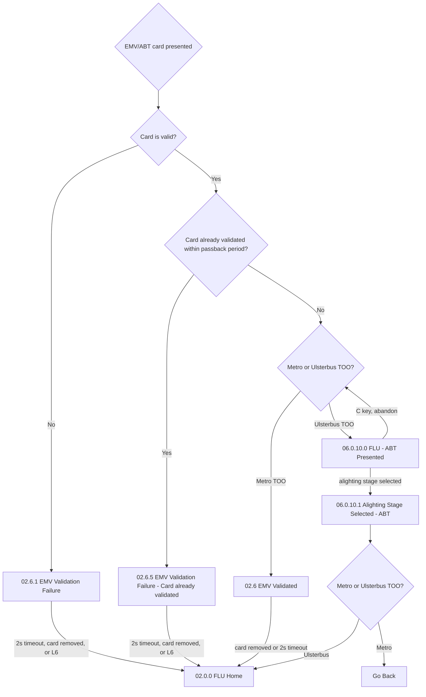

# Flow: Translink ETM — FLU ABT / EMV Contactless Tap

- Source: Overflow project `ETM-TFTS-V15.0.4` (https://overflow.io/s/NDLGF6NF/), board "5. FLU" —
  the ABT/EMV contactless-tap portion only. Transcribed verbatim via the Claude Chrome extension,
  2026-08-04. Raw source: `knowledge/flows/translink-etm-full-transcription-v15.0.4.md`.
- Project: translink   Device: ETM   Feature: ABT / cEMV tap
- Split note: part of the raw "FLU" board — see `translink-etm-flu-ticket-issue.md` for the
  generic ticket-issue portion of the same board.
- Transcription confidence: **high** — verbatim, not summarized.
- **Mode note — this is the one genuinely mode-sensitive part of FLU.** The "Metro or Ulsterbus
  TOO?" decision explicitly branches the tap outcome by mode. Everything else in FLU is generic.

## Diagram

## Paths (each = one candidate scenario)
| # | Path | Feature | Tags | Covered by |
|---|---|---|---|---|
| 1 | Valid EMV/ABT card, not in passback, **Metro** mode → straight to "EMV Validated" → auto-return to FLU Home | ABT | — | 4100586,4100783,4100940 |
| 2 | Valid EMV/ABT card, not in passback, **Ulsterbus** mode → "ABT Presented" → driver selects alighting stage → tap completes → back to FLU Home | ABT | — | 4100587 |
| 3 | Invalid card presented → "EMV Validation Failure" → clears on 2s timeout / card removal / L6 | ABT | @destructive | 4100583 |
| 4 | Card already validated within the passback period → "Card already validated" failure screen (regardless of mode — passback check happens before the mode branch) | ABT | @destructive | 4100582,4104522,4104523,4104524,4104525,4100788 |
| 5 | Ulsterbus ABT presented, driver abandons with 'C' before selecting alighting stage → returns to the mode decision, no ticket/tap recorded | ABT | @destructive | 4105055 |

> Path 4 is worth double-checking against the suite's existing passback-tap
> cases — this transcription confirms the passback check happens **before** the Metro/Ulsterbus
> branch, i.e. passback behaviour itself doesn't differ by mode, only what happens on a genuinely
> new tap does.

## Screen states (Given/Then anchors)
- **02.6 EMV Validated** (Metro) — the Metro-mode successful-tap outcome; no alighting-stage
  interaction shown (Metro TOO is presumably zone/flat-fare, consistent with existing knowledge that
  Metro ABT is zone-based, not boarding/alighting-stage-based).
- **06.0.10.0 FLU - ABT Presented** / **06.0.10.1 Alighting Stage Selected - ABT** (Ulsterbus) — the
  Ulsterbus-mode tap requires an explicit alighting-stage selection, consistent with Ulsterbus ABT
  being boarding-stage/driver-initiated per existing knowledge.
- **02.6.1 EMV Validation Failure** — generic decline screen, mode-agnostic.
- **02.6.5 EMV Validation Failure - Card already validated** — the passback-specific decline,
  mode-agnostic, checked before the Metro/Ulsterbus split.

## Notes / unknowns
- The annotation elsewhere in the raw board lists when ABT taps are **not** available: Basket
  screens/mode, Driver Break, Smartcard top-up/mini-statement screens, Annul Previous Ticket, the
  Start New Journey flow (Select Route/Journey Number/Route Summary), and Travel Mode above 5kph.
  Worth confirming the suite has a case for at least one of these "tap ignored during X" scenarios
  rather than only the happy-path tap.
- This directly resolves George's question about Rail/Metro FLU: **there is no Rail branch at all**
  (ETM has no Rail mode); the only real mode split inside FLU is this ABT/EMV sub-flow's Metro vs
  Ulsterbus TOO decision. Ticket issue, promo menu, numeric entry, DayLink, and the smartcard menu
  are all mode-generic.
- `/audit-flows` pass 2026-08-05 — path 5 missing (no case for driver abandoning an Ulsterbus
  ABT-presented tap with 'C' before selecting alighting stage). Path 4's mode-agnostic passback
  claim (Metro vs Ulsterbus, same screen) is untested — worth confirming.
