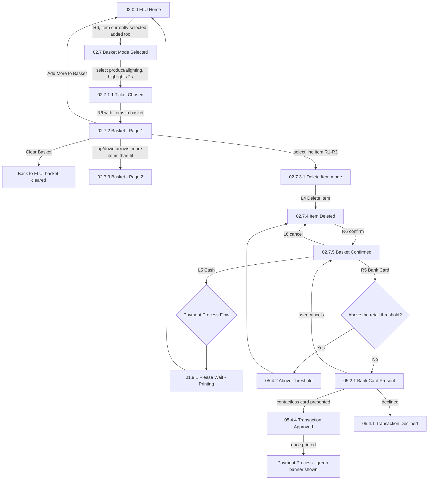

# Flow: Translink ETM — FLU Basket Mode

- Source: Overflow project `ETM-TFTS-V15.0.4` (https://overflow.io/s/NDLGF6NF/), board "7. FLU -
  Basket Mode". Transcribed verbatim via the Claude Chrome extension, 2026-08-04. Raw source:
  `knowledge/flows/translink-etm-full-transcription-v15.0.4.md`.
- Project: translink   Device: ETM   Feature: multi-item basket / card payment
- Transcription confidence: **high** — verbatim, not summarized.
- **Mode note**: no Metro/Ulsterbus/Rail branching found in this sub-flow.

## Diagram

## Paths (each = one candidate scenario)
| # | Path | Feature | Tags | Covered by |
|---|---|---|---|---|
| 1 | R6 into basket mode with a product/alighting stage already selected → that item is added automatically | basket | — | 4100562 |
| 2 | Add multiple items → basket confirmed → cash payment → printing → back to FLU Home | basket | — | 4100562 |
| 3 | Add multiple items → basket confirmed → bank card, transaction **below** retail threshold → contactless present → approved → green banner | basket | — | 4100677,4100680 |
| 4 | Bank card, transaction **above** retail threshold → "Above Threshold" screen → back to Item Deleted (implies Chip & PIN or a different flow, not shown in this board) | basket | — | GAP — see proposals/coherence-audit/gap-register.md |
| 5 | Contactless card presented, transaction declined → "Transaction Declined" | basket | @destructive | 4100678 |
| 6 | Bank Card Present screen → user cancels → returns to Basket Confirmed | basket | @destructive | 4105056 |
| 7 | Basket full (9 items) → attempt to add a 10th from FLU → "Basket Full" error | basket | @destructive | 4100563,4100798 |
| 8 | Basket full → attempt to add from the Basket screen itself → unable to add, different error path than from FLU | basket | @destructive | 4100799 |
| 9 | Remove an item from a full basket → can now add a new item | basket | — | 4100563 |
| 10 | Select a basket line item → increase/decrease quantity with +/- → quantity change rejected → error shown for 2 seconds | basket | @destructive | GAP — see proposals/coherence-audit/gap-register.md |
| 11 | Contactless card present screen, no card presented within 30 seconds → auto-cancelled by FEIG (same as pressing Cancel/L6), **not configurable, not ETM-driven** | basket | @destructive | 4105056 |
| 12 | "Clear Basket" from the basket view → product returns to default, basket disabled, but Favourites/All selection stays unchanged | basket | — | 4100565 |

> Path 4 (above-threshold flow) is worth double-checking — this board only
> shows it looping back to "Item Deleted," which reads incomplete (see unknowns below); paths 7-8
> (basket-full from two different entry points) and 11 (FEIG-driven 30s timeout) are easy to miss.

## Screen states (Given/Then anchors)
- **Basket cap: 9 items.** Matches the POS suite's own basket cap — same limit across at least two
  devices, worth confirming it's a shared platform constant rather than coincidence.
- **05.2.1 Bank Card Present** — 30-second timeout is **FEIG-driven, not ETM-driven, and not
  configurable** — a PCI-compliance requirement. If a case asserts a configurable timeout here,
  that's wrong; ground it as a fixed FEIG behaviour instead.
- **Receipt printing in basket mode** — there is **no manual "print receipt" option**; a receipt
  prints automatically if/when it's mandatory. Don't write a case assuming a user-facing print choice
  exists in this flow the way it might elsewhere.

## Notes / unknowns
- **GAP**: the raw annotation literally says "Need to add possible different errors" for the
  quantity-change-rejected screen — the design doc itself flags this as incomplete. Don't invent
  the missing error variants; mark as `**UNCONFIRMED**` if a case needs them.
- **GAP**: the "Above Threshold" screen's connection loops back to "Item Deleted" with only the
  annotation "Type something" — this reads like a truncated/unclear part of the original board (an
  above-threshold transaction likely needs a PIN-entry step per PCI norms, similar to Chip & PIN
  flows elsewhere in the suite), but that step isn't actually shown here. Confirm the real
  above-threshold flow live rather than assuming it's identical to the below-threshold path.
- `/audit-flows` pass 2026-08-05 — path 4 (Above Threshold) and path 10 (quantity-change-rejected)
  are themselves flagged GAP in the source transcription (incomplete/truncated board content) —
  escalated to proposals/coherence-audit/gap-register.md rather than classified against cases. Missing: path 6 (Bank Card
  Present cancel → Basket Confirmed), path 11 (FEIG 30s timeout auto-cancel — no case even mentions
  this).
