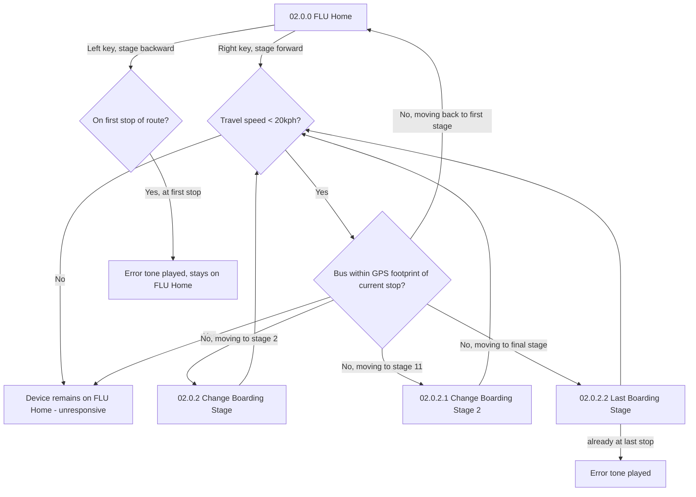
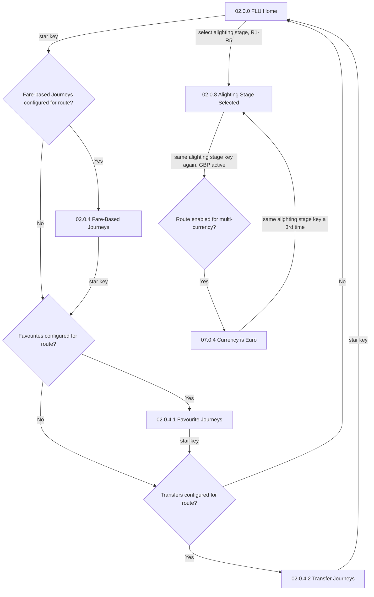

# Flow: Translink ETM — FLU 2.0 Navigation (boarding/alighting paging, journey-type toggle, multi-currency)

- Source: Overflow project `ETM-TFTS-V15.0.4` (https://overflow.io/s/NDLGF6NF/), board "6. FLU 2.0
  Navigation". Transcribed verbatim via the Claude Chrome extension, 2026-08-04. Raw source:
  `knowledge/flows/translink-etm-full-transcription-v15.0.4.md`.
- Project: translink   Device: ETM   Feature: FLU navigation mechanics (boarding/alighting, journey
  type, currency)
- Relationship to other ETM flow-maps: this board largely re-covers ticket-issue/toggle-group
  screens already detailed in `translink-etm-flu-ticket-issue.md`, but adds the **GPS/speed-gated
  manual boarding-stage change** and **multi-currency toggle** mechanics that weren't in that file.
  This file's diagram focuses on what's genuinely new; see the ticket-issue file for the base
  toggle-group/product-selection mechanics.
- Transcription confidence: **high** — verbatim, not summarized.
- **Mode note**: no Metro/Ulsterbus/Rail branching found in this sub-flow.

## Diagram — manual boarding-stage change (GPS + speed gated)

## Diagram — journey-type toggle and multi-currency

## Paths (each = one candidate scenario)
| # | Path | Feature | Tags | Covered by |
|---|---|---|---|---|
| 1 | Manual boarding-stage change: outside GPS footprint AND under 20kph → stage change succeeds | navigation | — | 4100535 |
| 2 | Manual boarding-stage change attempted while travelling ≥20kph → ETM unresponsive, stays on FLU Home | navigation | @destructive | 4100535 |
| 3 | Manual boarding-stage change attempted while inside the current stop's GPS footprint → ETM unresponsive, stays on FLU Home | navigation | @destructive | 4100535 |
| 4 | Attempt to move backward past the first stop of the route → error tone, stays on FLU Home | navigation | @destructive | 4105057 |
| 5 | Attempt to move forward past the last stop of the route → error tone (already at Last Boarding Stage) | navigation | @destructive | 4105057 |
| 6 | Star key cycles Fare-Based Journeys → Favourites → Transfers → back to FLU Home, skipping any tier not configured for the current route | navigation | — | 4100533 |
| 7 | Route not configured for Fare-Based/Favourites/Transfers at all → star key does nothing, stays on FLU Home | navigation | — | 4105057 |
| 8 | Select an alighting stage, then press the same alighting-stage key again while GBP is active, route enabled for multi-currency → switches to Euro display | navigation | — | 4100545 |
| 9 | Same alighting-stage key a third time while in Euro → switches back to GBP | navigation | — | 4100545 |
| 10 | Attempt the currency toggle on a route **not** enabled for multi-currency → no currency change (implied; not explicitly screened) | navigation | — | GAP — see proposals/coherence-audit/gap-register.md |

> Paths 2-5 (the GPS/speed-gated manual stage-change edge cases) and path 10
> (multi-currency-disabled route) are the likeliest to be missing — they're easy to overlook without
> having seen this exact decision tree.

## Screen states (Given/Then anchors)
- Manual boarding-stage change is gated on **both** conditions simultaneously: outside the current
  stop's GPS footprint AND travelling under 20kph. Either condition failing makes the device
  unresponsive to the Left/Right keys (not an error screen — just no response).
- **Alighting-stage paging** shows up to 5 stages per page; the 5th row is always the route's final
  stage (unless it's already shown in the first 4, in which case that row is blank). No timeout on
  browsing alighting-stage pages (contrast with the 60s timeout on toggle-group/product selections).
- **Journey-type toggle** (star key) is a **conditional cycle** — it skips any of Fare-Based/
  Favourites/Transfers not configured for the current route, rather than always cycling all three.
- **Multi-currency toggle** — same alighting-stage key, pressed on an already-selected stage, 3
  times to cycle GBP → EUR → GBP. Basket mode requires switching currency **first**, then entering
  basket mode (order matters; entering basket mode first is not shown as a valid path here).

## Notes / unknowns
- The event-trigger decisions listed on this board (Barcode / GPS Event / Smartcard / EMV-ABT Tap /
  Printer Event / Auto End of Shift timeout / Remote Command) are entry points into flows already
  covered elsewhere (smartcard → `translink-etm-flu-smartcard.md`, EMV/ABT →
  `translink-etm-flu-abt-emv.md`, printer → `translink-etm-flu-printer-travel-mode.md`) — not
  detailed again here to avoid duplication.
- **GAP**: what happens if a currency-toggle is attempted on a route **not** enabled for
  multi-currency isn't explicitly screened in this board (the decision only shows a "Yes" branch to
  Euro) — confirm live whether it's silently ignored or something else happens.
- `/audit-flows` pass 2026-08-05 — path 10 is itself an unresolved source GAP (currency-toggle
  behaviour on a non-multi-currency route isn't specified) — escalated to proposals/coherence-audit/gap-register.md. Missing:
  path 4/5 (paging past first/last boarding stage — no error-tone case), path 7 (star-key with no
  journey-type tiers configured). Register defect 301934/301566 (boarding-stage products, FOLD)
  targets case 4100535 — the register's adjacent NEEDS GEORGE row 301937 can't be confirmed
  unrelated; flag for George.
