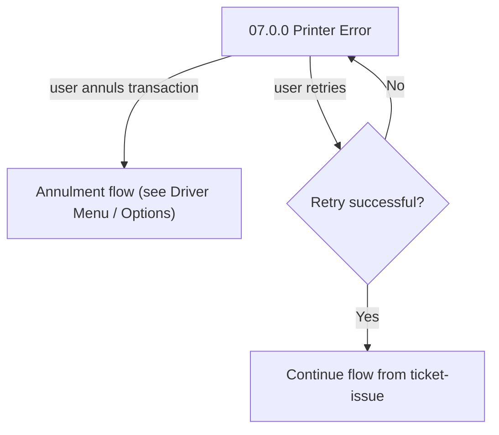

# Flow: Translink ETM — FLU Printer Errors & Travel Mode

- Source: Overflow project `ETM-TFTS-V15.0.4` (https://overflow.io/s/NDLGF6NF/), board "5. FLU" —
  the printer-error and travel-mode portions only. Transcribed verbatim via the Claude Chrome
  extension, 2026-08-04. Raw source: `knowledge/flows/translink-etm-full-transcription-v15.0.4.md`.
- Project: translink   Device: ETM   Feature: printer hardware / driving-mode display
- Split note: last of the "FLU" board's sub-flows — see `translink-etm-flu-ticket-issue.md`,
  `translink-etm-flu-abt-emv.md`, `translink-etm-flu-smartcard.md`, `translink-etm-flu-promo-numeric.md`
  for the others. **This closes out ETM's FLU board.**
- Transcription confidence: **medium** — the screens and their behaviour annotations are verbatim
  and complete, but the full connection wiring for some of these (Out of Service, the multi-currency
  toggle) either wasn't captured in this board's own connection list or actually belongs to the
  next board ("6. FLU 2.0 Navigation" — the Currency-Euro screen's real wiring is there, not here).
  Flagged explicitly below rather than guessed.
- **Mode note**: no Metro/Ulsterbus/Rail branching found in this sub-flow.

## Diagram — Printer error / retry (the wiring that IS confirmed in this board)

## Paths (each = one candidate scenario)
| # | Path | Feature | Tags | Covered by |
|---|---|---|---|---|
| 1 | Printer error during ticket issue → retry → succeeds → ticket issue continues from where it left off | printer | @destructive | 4100557 |
| 2 | Printer error during ticket issue → retry → fails again → stays on Printer Error | printer | @destructive | 4105058 |
| 3 | Printer error during ticket issue → driver annuls instead of retrying | printer | @destructive | 4100557 |
| 4 | Paper Low warning appears after a ticket prints (only when paper is below threshold; never appears unless a ticket was actually printed) → auto-clears after 5s → FLU Home | printer | — | 4100640 |
| 5 | Paper Jam variant of Printer Error → "Reverse Paper Feed" option available (does not change the screen itself) | printer | @destructive | 4100640 |
| 6 | Printing something other than a ticket (e.g. Technician Menu version printout) fails → the recovery option is labelled "Cancel", not "Annul Transaction" | printer | @destructive | 4105058 |
| 7 | Driving above 5kph, 1 minute idle on FLU → Travel Mode: time/date shown, brightness dimmed, Schedule Adherence box shown (green = on time, orange = within tolerance, red = outside tolerance) | travel-mode | — | 4100546,4100819,4100820,4100821 |
| 8 | Travel Mode active → any button press, or bus stops and Enter is pressed / smartcard presented → brightness restored, returns to FLU | travel-mode | — | 4100546 |
| 9 | Out of Service Error condition (trigger not detailed in this board — see unknowns) | printer | @destructive | GAP — see proposals/coherence-audit/gap-register.md |

> Path 6 (the Annul→Cancel label swap for non-ticket printouts) is an easy
> detail to miss — worth checking the suite asserts the correct button label, not just "an error
> recovery option exists."

## Screen states (Given/Then anchors)
- **07.0.0 Printer Error** — the generic printer-failure screen; recoverable via retry or annulment.
  Label reads "Annul Transaction" when a ticket print failed, **"Cancel"** when something else
  failed to print (e.g. Technician Menu software-version printout).
- **07.0.1 Printer Error - Paper Jam** — a Printer Error variant with a "Reverse Paper Feed" option
  that does not itself change/dismiss the screen.
- **07.0.2 Paper Low** — appears **only** immediately after a successful ticket print, when paper
  is below a configured threshold; auto-clears to FLU Home after 5 seconds.
- **07.0.3 Out of Service Error** — screen exists and is named, but its trigger condition isn't
  detailed in this board's annotations (see unknowns).
- **07.0.6/07.0.6.1/07.0.6.2 Travel Mode** — triggered by 1 minute of FLU idle while driving;
  Schedule Adherence sub-states show green/orange/red per the configured on-time tolerance.

## Notes / unknowns
- **GAP**: the exact trigger for "07.0.3 Out of Service Error" isn't in this board's annotations —
  don't assume it's printer-related just because it's numbered alongside the printer screens;
  confirm the real trigger before writing a case for it (it may be covered better in a
  Non-Functional/hardware-fault board elsewhere).
- **07.0.4 Currency is Euro**'s actual connection wiring (the multi-currency toggle behaviour) lives
  in board "6. FLU 2.0 Navigation," not this one, even though the screen itself is listed under FLU
  — will be covered when that board is transcribed.
- Schedule Adherence's exact tolerance window (what counts as "within a set parameter") is
  configurable per the annotation — don't hard-code a number, follow the existing "tester knows the
  currently configured value" convention.
- `/audit-flows` pass 2026-08-05 — path 9 (Out of Service Error) trigger condition is itself
  unconfirmed in the source (may not be printer-related) — escalated to proposals/coherence-audit/gap-register.md; case
  4100641 exists but is built on the same unconfirmed assumption. Missing: path 2 (repeated retry
  failure staying on Printer Error screen), path 6 (Cancel-label swap for non-ticket printouts, e.g.
  Technician version printout) — flagged as an easy-to-miss, worth-authoring gap.
