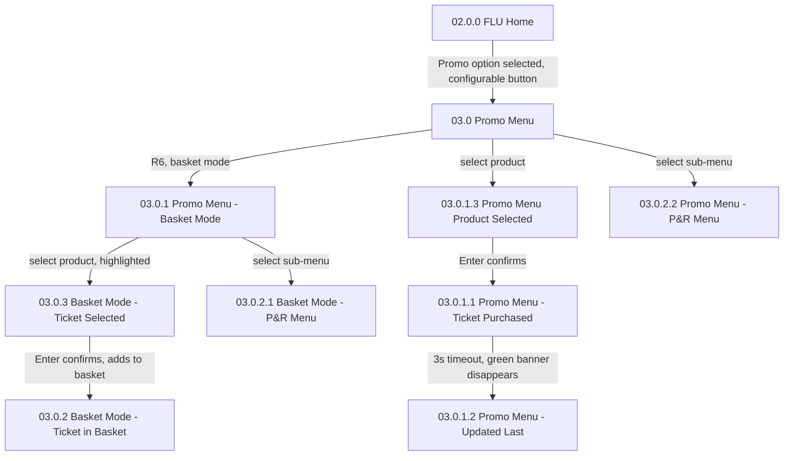
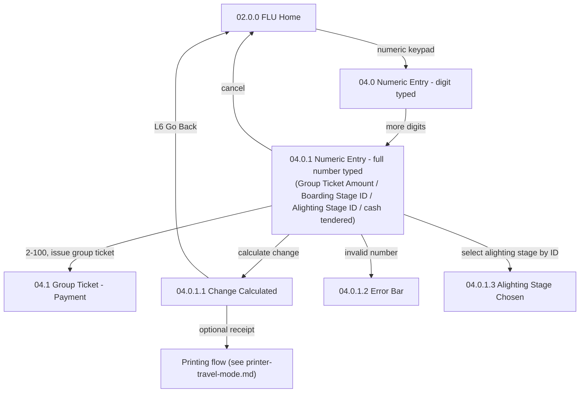

# Flow: Translink ETM — FLU Promo Menu & Numeric Entry (change/group-ticket)

- Source: Overflow project `ETM-TFTS-V15.0.4` (https://overflow.io/s/NDLGF6NF/), board "5. FLU" —
  the Promo Menu and Numeric Entry portions only. Transcribed verbatim via the Claude Chrome
  extension, 2026-08-04. Raw source: `knowledge/flows/translink-etm-full-transcription-v15.0.4.md`.
- Project: translink   Device: ETM   Feature: promo products / numeric entry (change, group tickets)
- Split note: part of the raw "FLU" board — see `translink-etm-flu-ticket-issue.md`,
  `translink-etm-flu-abt-emv.md`, `translink-etm-flu-smartcard.md` for the other splits.
- Transcription confidence: **high** — verbatim, not summarized.
- **Mode note**: no Metro/Ulsterbus/Rail branching in either sub-flow — both generic.

## Diagram — Promo Menu

## Diagram — Numeric Entry

## Paths (each = one candidate scenario)
| # | Path | Feature | Tags | Covered by |
|---|---|---|---|---|
| 1 | FLU Home → Promo Menu → select product directly → Enter confirms → "Ticket Purchased" green banner → 3s timeout, banner clears | promo-menu | — | 4100558,4104466,4104468,4104470,4104472,4104474,4104476 |
| 2 | FLU Home → Promo Menu → R6 basket mode → select product → highlighted → Enter → added to basket | promo-menu | — | 4100562,4100565,4100823 |
| 3 | Promo Menu → sub-menu (P&R) navigation, both in direct-issue and basket-mode contexts | promo-menu | — | 4100565,4104474 |
| 4 | FLU Home → numeric keypad → enter a number 2-100 → issue a group ticket for that many passengers | numeric-entry | — | 4100540 |
| 5 | FLU Home → numeric keypad → enter cash tendered → change calculated → optional receipt printed | numeric-entry | — | 4100539 |
| 6a | Numeric entry, invalid alighting stage ID → Error Bar: **"Unable to set Alighting Stage"** | numeric-entry | @destructive | 4105059 |
| 6b | Numeric entry, invalid boarding stage ID → Error Bar: **"Unable to set Boarding Stage"** | numeric-entry | @destructive | 4105059 |
| 6c | Numeric entry, cash tendered less than the fare due → Error Bar: **"Unable to Calculate Change"** | numeric-entry | @destructive | 4100539,4100808 |
| 7 | Numeric entry → number entered → used to jump directly to an alighting stage by its ID | numeric-entry | — | 4105059 |
| 8 | Numeric entry → cancel → back to FLU Home with no change | numeric-entry | — | 4105059 |

> `Covered by` stays `?`. Paths 6a-6c (three distinct error messages) are the likeliest to be thin —
> a suite often has one generic "invalid entry" case where three purpose-specific ones are needed.

## Screen states (Given/Then anchors)
- **03.0 Promo Menu** — reachable via a configurable right-side button from FLU Home; not always
  present depending on device configuration.
- **04.0/04.0.1 Numeric Entry** — a single numeric-entry mechanism serves **four different
  purposes** depending on context: Group Ticket Amount, Boarding Stage ID, Alighting Stage ID, or
  cash-tendered-for-change. The same screen, different downstream meaning — worth testing each
  purpose as its own scenario rather than assuming one covers all four.
- **04.0.1.2 Error Bar** — the exact message depends on which of the four purposes failed: **"Unable
  to set Alighting Stage"**, **"Unable to set Boarding Stage"**, or **"Unable to Calculate Change"**
  (verbatim, from the raw board's annotations). Pressing 'C' clears one character; the error screen
  itself auto-clears the input. Not a single generic error bar — each purpose is its own scenario
  with its own exact wording, and should be tested (and asserted) as such.

## Notes / unknowns
- The basket tracker in Promo Menu sub-menus "remains and functions in the same way as in the promo
  menu and main screen" per the raw annotations — worth confirming the suite tests basket
  persistence across a promo sub-menu navigation, not just within one screen.
- `/audit-flows` pass 2026-08-05 — missing: invalid alighting-stage-ID entry, invalid boarding-stage-ID
  entry, setting alighting stage by numeric ID, and cancelling numeric entry back to FLU Home with no
  change — none have a case. Register defect 301245 (Promo sub-menu, FOLD) overlaps path 3, already
  resolved by case 4100565.
