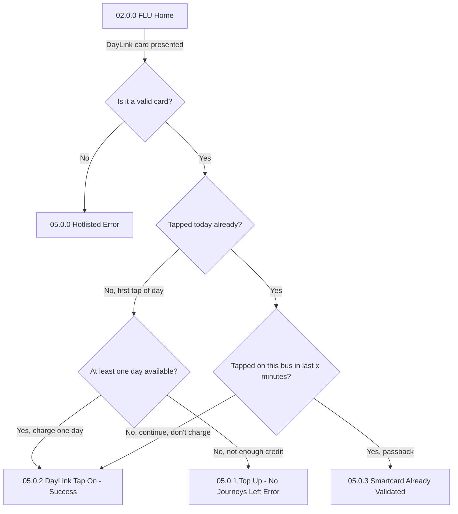
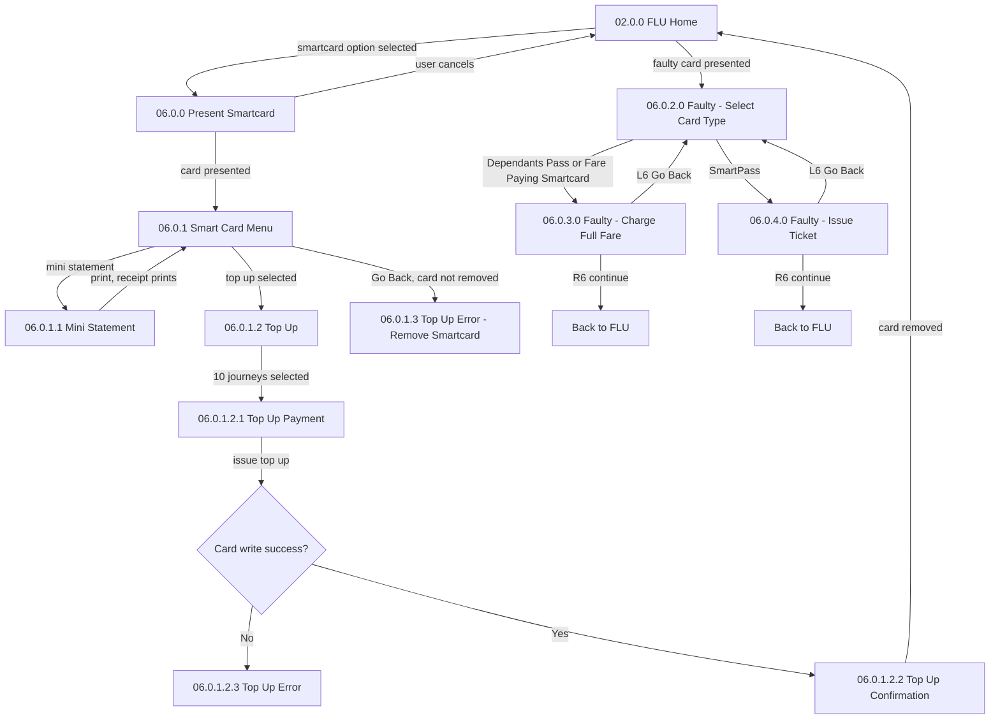
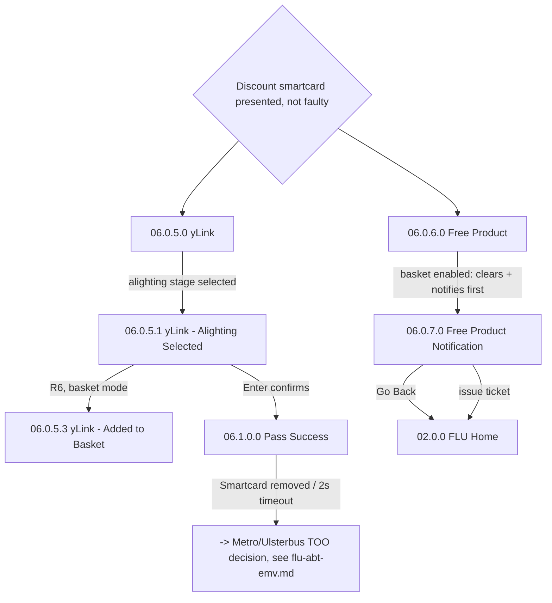

# Flow: Translink ETM — FLU Smartcard (DayLink tap, general menu, top-up, faulty card, discount passes)

- Source: Overflow project `ETM-TFTS-V15.0.4` (https://overflow.io/s/NDLGF6NF/), board "5. FLU" —
  the smartcard-related portions only. Transcribed verbatim via the Claude Chrome extension,
  2026-08-04. Raw source: `knowledge/flows/translink-etm-full-transcription-v15.0.4.md`.
- Project: translink   Device: ETM   Feature: smartcard validation / top-up / faulty-card handling
- Split note: part of the raw "FLU" board — see `translink-etm-flu-ticket-issue.md` (generic ticket
  issue) and `translink-etm-flu-abt-emv.md` (contactless tap, including the Metro/Ulsterbus TOO
  branch this file's discount-pass path also feeds into).
- Transcription confidence: **high** — verbatim, not summarized.
- **Mode note**: no Metro/Ulsterbus/Rail branching in the DayLink, top-up, or faulty-card sections.
  The discount-pass path (yLink/Free Product) converges into "Pass Success," which **does** then
  feed the Metro/Ulsterbus TOO decision — see `translink-etm-flu-abt-emv.md` for that branch.

## Diagram — DayLink tap-on

## Diagram — general smartcard menu (top-up, mini statement, faulty card)

## Diagram — discount smartcard (yLink / Free Product)

## Paths (each = one candidate scenario)
| # | Path | Feature | Tags | Covered by |
|---|---|---|---|---|
| 1 | Valid DayLink, first tap of the day, has credit → charged one day, tap succeeds | smartcard | — | 4102551 |
| 2 | Valid DayLink, already tapped today, not on this bus recently → tap succeeds, **not** charged again | smartcard | — | 4105060 |
| 3 | Valid DayLink, already tapped today, tapped on this bus within x minutes → "Already Validated" (passback) | smartcard | @destructive | 4100676 |
| 4 | Valid DayLink, no credit/days left → "No Journeys Left Error" | smartcard | @destructive | 4100674 |
| 5 | Invalid/hotlisted DayLink presented → "Hotlisted Error" | smartcard | @destructive | 4104485,4100581 |
| 6 | Present smartcard → mini statement → receipt prints → back to menu | smartcard | — | 4100577 |
| 7 | Present smartcard → top up (10 journeys) → card write succeeds → confirmation → card removed → FLU Home | smartcard | — | 4100572 |
| 8 | Present smartcard → top up → **card write fails** → Top Up Error | smartcard | @destructive | 4100884 |
| 9 | Smartcard menu → Go Back without removing the card → "Remove Smartcard" error | smartcard | @destructive | 4100573,4100885 |
| 10 | Faulty Dependants Pass / Fare Paying Smartcard → charged full fare (continue or go back to reselect type) | smartcard | @destructive | 4102568,4102570,4100571 |
| 11 | Faulty SmartPass → ticket issued directly (continue or go back to reselect type) | smartcard | @destructive | 4102569,4100571 |
| 12 | Discount smartcard (yLink), not faulty → alighting stage selected → ticket issued (Pass Success) → feeds Metro/Ulsterbus TOO decision | smartcard | — | 4102555 |
| 13 | Discount smartcard (yLink) → alighting selected → R6 adds to basket instead of immediate issue | smartcard | — | 4105060 |
| 14 | Free Product (e.g. senior pass) with an item already in basket → basket cleared + notification shown before issue | smartcard | @destructive | 4105060 |

> `Covered by` stays `?`. Paths 3, 4, 8, 9 (all failure/edge-case paths) are the ones most likely to
> be thin in the current suite — DayLink passback and top-up-write-failure specifically.

## Screen states (Given/Then anchors)
- **05.0.2 DayLink Tap On - Success** / **05.0.3 Already Validated** — same underlying passback
  concept as ABT (§ same-location/time window), but modelled as a DayLink-specific screen pair here
  rather than the generic ABT decline screen.
- **06.0.1.2.x Top Up** — "For DayLink, the top up flow is identical except 'Days' are shown in
  place of 'Journeys'... For iLink and Metro Travelcard, the flow is the same except the top-up
  options are periods of time (1 day/week/month)." — i.e. this diagram is the **template** for all
  three product families' top-up UI, not DayLink-exclusive.
- **06.0.2.0–06.0.4.0 Faulty card handling** — card type determines the fallback: Dependants Pass and
  Fare Paying Smartcard both charge full fare; SmartPass issues a ticket directly (no charge).

## Notes / unknowns
- Top-up is auto-validated after a successful top-up ("the same day/journey just loaded is
  immediately validated") for DayLink, iLink, and Ulsterbus Town Service cards per the annotation —
  worth confirming the suite has a case asserting this auto-validation specifically, not just the
  top-up itself.
- This flow converges with `translink-etm-flu-abt-emv.md` at "06.1.0.0 Pass Success" → the
  Metro/Ulsterbus TOO decision — a discount-pass tap is handled by the same mode branch as an
  ABT/EMV contactless tap once past this point.
- `/audit-flows` pass 2026-08-05 — missing: path 2 (already-tapped-today-not-recent-bus succeeds
  without recharge), path 13 (yLink R6 add-to-basket-instead-of-issue branch), path 14 (free-product
  basket-clear-then-notify-then-issue behaviour, only screen-validation exists). Paths 3/4/8/9 are
  backed only by screen-validation cases, not functional logic — thin coverage, worth strengthening.
