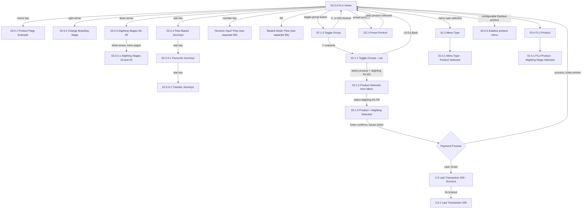

# Flow: Translink ETM — FLU Ticket Issue (paper/cash ticket sale)

- Source: Overflow project `ETM-TFTS-V15.0.4` (https://overflow.io/s/NDLGF6NF/), board "5. FLU" —
  the ticket-issue/product-selection portion only. Transcribed verbatim via the Claude Chrome
  extension, 2026-08-04. Raw source: `knowledge/flows/translink-etm-full-transcription-v15.0.4.md`.
- Project: translink   Device: ETM   Feature: fare-look-up / ticket-issue
- Split note: the raw "FLU" board bundles ~6 distinct flows (ticket issue, promo menu, numeric
  entry, DayLink tap, general smartcard menu, ABT/EMV tap). This file covers **ticket issue only**
  — see `translink-etm-flu-abt-emv.md`, `translink-etm-flu-smartcard.md` for the others (promo menu
  and numeric entry not yet split out).
- Transcription confidence: **high** — verbatim, not summarized.
- **Mode note**: this sub-flow is mode-generic (Metro + Ulsterbus) — no Metro/Ulsterbus branching
  appears anywhere in these connections, unlike the ABT/EMV sub-flow. ETM has no Rail mode at all.

## Diagram

## Paths (each = one candidate scenario)
| # | Path | Feature | Tags | Covered by |
|---|---|---|---|---|
| 1 | FLU Home → select product + alighting stage → Enter → payment succeeds → ticket prints → back to FLU Home | ticket-issue | — | 4100550,4100533,4100535,4100938 |
| 2 | FLU Home → cash payment, Enter → "Last Transaction 200 - Success" → 3s timeout → "Last Transaction 200" persists in corner | ticket-issue | — | 4100539,4100802,4100803 |
| 3 | FLU Home → toggle-group product cycling (repeated presses selects next product in group) | ticket-issue | — | 4100533,4100767,4100768,4100769,4100771 |
| 4 | Toggle group → '+' expand → list view → select product + alighting from R1-R5 | ticket-issue | — | 4100533,4100772,4100773,4100774,4100775 |
| 5 | Toggle group list → C key or 60s timeout → reverts to first product in group | ticket-issue | @destructive | 4100533 |
| 6 | FLU Home → preset product button → pass product issued directly (no alighting-stage step shown) | ticket-issue | — | 4100533,4100776,4100777,4100778 |
| 7 | FLU Home → right/down arrows to browse boarding/alighting stages beyond the first page | ticket-issue | — | 4100535,4100756,4100757,4100758,4100759,4100760,4100761 |
| 8 | FLU Home → star key cycles Fare-Based Journeys → Favourite Journeys → Transfer Journeys | ticket-issue | — | 4100533,4100762,4100763,4100764 |
| 9 | FLU Home → Easibus product menu (configurable, appears immediately on ticket selection) | ticket-issue | — | FRAGMENTED — see consolidation-audit.md |

> `Covered by` stays `?` — fill in against live `cases.json`. Paths 5 (toggle-group timeout revert)
> and the basket/numeric-entry cross-references are the likeliest to be thin in the current suite.

## Screen states (Given/Then anchors)
- **02.0.0 FLU Home** — the default fare-look-up screen; product pages are CloudFare-configurable,
  button order and fixed options can be set per device.
- **02.0.1 Product Page Example** — cycling through configured product pages via the minus key.
- **02.0.2/02.0.3/02.0.3.1** — boarding/alighting stage browsing (arrow keys); "the last stage on the
  farelist is always displayed to the driver."
- **02.0.4/02.0.4.1/02.0.4.2** — Fare-Based Journeys / Favourite Journeys / Transfer Journeys, cycled
  via the star key.
- **02.1.0–02.1.3** — Toggle Group mechanics: a toggle group shows up to 4 products as dots, more
  than 4 collapse behind an expandable '+' menu.
- **2.5/2.5.1 Last Transaction** — post-sale confirmation, 3-second auto-timeout, then persists as a
  small "last transaction" indicator (see the Numeric Input flow for change calculation off this).

## Notes / unknowns
- **GAP**: the exact behaviour of "Basket Mode" (R6 from FLU Home) and "Numeric Input" (number key
  from FLU Home) are referenced here but not detailed — they're their own boards/flows in the raw
  transcription and need their own flow-map files.
- Confirms mode-genericity: no Metro/Ulsterbus/Rail branching found anywhere in this sub-flow's
  connections — consistent with this area's existing `MODE-ALL` tagging in the live suite.
- `/audit-flows` pass 2026-08-05 — path 9 (Easibus product menu, 8 stage-colour variants) is
  FRAGMENTED: 8 near-identical cases (4100555,4104452,4104454,4104456,4104458,4104460,4104462,
  4104463,4100765), none reading as the whole path — logged to consolidation-audit.md for a future
  fold pass, not authored over. Path 5 (C-key/timeout abort from expanded toggle-group list) has no
  case isolating that specific branch.
