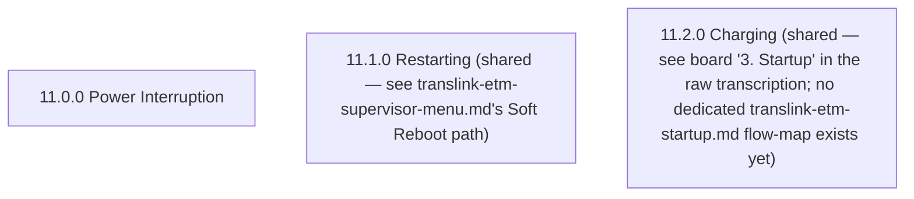

# Flow: Translink ETM — Power Interruption

- Source: Overflow project `ETM-TFTS-V15.0.4` (https://overflow.io/s/NDLGF6NF/), board "13. Power
  Interruption". Transcribed verbatim via the Claude Chrome extension, 2026-08-05. Raw source:
  `knowledge/flows/translink-etm-full-transcription-v15.0.4.md`.
- Project: translink   Device: ETM   Feature: power interruption / backup battery / shutdown-and-charge state
- Transcription confidence: **high** — verbatim, not summarized. Note: the raw board's own
  "Connections / Flow" section lists **0** entries — this board has no screen-to-screen connections
  recorded in Overflow itself, only screens + annotations. No connections have been invented here.

## Diagram

> No edges are drawn: the raw Overflow board records 0 connections for this board. The behaviour
> described in the annotations below (temporary vs. longer interruption) is prose only — it is not
> backed by a Connections/Flow entry, so it is not rendered as a confirmed transition. See Notes.

## Paths (each path = one candidate scenario)
| # | Path | Feature | Tags | Covered by |
|---|------|---------|------|------------|
| 1 | Power interrupted **temporarily** → 11.0.0 Power Interruption → device returns to the screen it was originally on (per annotation, no confirmed graph edge) | power-interruption | @destructive | 4100635 |
| 2 | Power interrupted for a **longer period** → 11.0.0 Power Interruption → system shuts down (per annotation, no confirmed graph edge) | power-interruption | @destructive | 4100635 |
| 3 | Boot with insufficient charge → 11.2.0 Charging shown (per annotation; also appears in board "3. Startup"'s own connections as reachable from the "Software starts in less than 2 minutes?" decision) | power-interruption | — | 4100637 |

## Screen states (Given/Then anchors)
- **11.0.0 Power Interruption** — shown when the device loses power. Per annotation: "Power
  Interruption occurs when the device loses power. It does have backup, but only for a very small
  period of time. Care has been taken t[o] ensure that any timeouts before shutting down will be
  enough to save the system state safely." A second annotation: "This screen appears when power is
  interrupted. If the power is interrupted temporarily, the device will take the user back to the
  screen they were originally on." A third: "If the power is interrupted for a longer time, this
  screen wil[l] display. The system is shutting down once this state is reached."
- **11.1.0 Restarting** — no annotation on this board. This screen is shared with other boards: it
  is the destination screen used by the Supervisor Menu's Soft Reboot path and the Driver Menu's Soft
  Reboot path — see `knowledge/flows/translink-etm-supervisor-menu.md` (Soft Reboot lands on Idle
  Screen) and `knowledge/flows/translink-etm-driver-menu-options.md` (Soft Reboot lands on On Break).
  This board does not describe a separate power-interruption route into/out of 11.1.0.
- **11.2.0 Charging** — per annotation: "This screen appears on boot to ensure the device has enough
  charge to successfully allow the state to be saved in the event of a power interruption." Also
  appears in the raw transcription's board "3. Startup" (screens list + its own Connections/Flow),
  reached from the "Software starts in less than 2 minutes?" decision and feeding into the "Device is
  commissioned?" decision — that is Startup board territory, not this board's own connections.

## Notes / unknowns
- Key behaviour (per curated annotations in `knowledge/flows/etm-flow-annotations.md`, "Power
  Interruption" section): the ETM has only a **short battery backup** after losing power, and timeout
  tuning has deliberately been set so the system can save state safely before it shuts down.
- TODO: confirm the actual screen-to-screen transitions for this board — Overflow's own
  "Connections / Flow" count for board 13 is 0, so the temporary-vs-longer-interruption behaviour
  above is known only from annotation prose, not from a graph edge. Do not assume a specific source
  screen → 11.0.0 → destination screen edge without confirming on the live system or in Overflow.
- Shared screens: "11.1.0 Restarting" is already used by `translink-etm-supervisor-menu.md`'s Soft
  Reboot path (and referenced from the Driver Menu's own Soft Reboot in
  `translink-etm-driver-menu-options.md`). "11.2.0 Charging" already appears in board "3. Startup" of
  the raw transcription (`translink-etm-full-transcription-v15.0.4.md`), but **no dedicated
  `translink-etm-startup.md` flow-map exists yet** in this folder — TODO: confirm whether the Startup
  board should get its own flow-map file, and cross-reference it here once it does.
- TODO: confirm whether 11.0.0 Power Interruption can be reached from every screen in the app, or
  only specific ones — not stated on this board.
- `/audit-flows` pass 2026-08-05 — fully covered, no gaps. Note: case 4100636 covers similar
  territory with different framing (recovery-period/signed-in-state language vs this flow-map's
  temporary-vs-longer language) — flagged as a possible near-duplicate worth a consolidation look,
  not actioned here since 4100635 already covers this flow-map's paths end-to-end.
