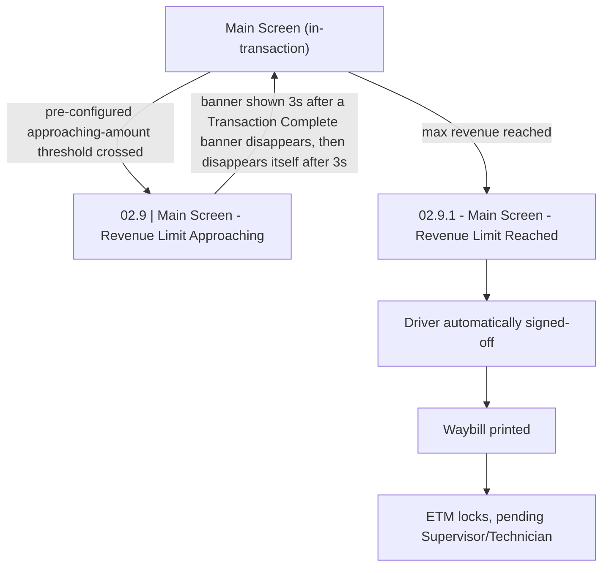

# Flow: Translink ETM — Revenue Limit

- Source: Overflow project `ETM-TFTS-V15.0.4` (https://overflow.io/s/NDLGF6NF/), board "14. Revenue
  Limit". Transcribed verbatim via the Claude Chrome extension, 2026-08-05. Raw source:
  `knowledge/flows/translink-etm-full-transcription-v15.0.4.md`.
- Project: translink   Device: ETM   Feature: revenue limit (main-screen notification + lockout)
- Transcription confidence: **medium** — verbatim, not summarized, but the raw transcription lists
  **0 Connections/Flow** for this board (2 screens, 0 decision points, 3 annotation notes). No
  explicit screen-to-screen connection or trigger action was captured in the Overflow export itself;
  the sequence below is inferred only from the two screen names and the annotation text, not from a
  drawn connection. See Notes/unknowns.

## Diagram

## Paths (each path = one candidate scenario)
| # | Path | Feature | Tags | Covered by |
|---|------|---------|------|------------|
| 1 | Main Screen → pre-configured approaching threshold reached → "Revenue Limit Approaching" header banner shown | revenue-limit | — | 4100633 |
| 2 | "Revenue Limit Approaching" banner → auto-dismiss after 3 seconds → back to Main Screen | revenue-limit | — | 4100633 |
| 3 | Main Screen → max revenue reached → "Revenue Limit Reached" → Driver auto signed-off → waybill prints → ETM locks | revenue-limit | @destructive | 4100634 |
| 4 | ETM locked (revenue limit reached) → Supervisor/Technician intervention required to clear | revenue-limit | @destructive | 4100634 (mechanism unconfirmed — see proposals/coherence-audit/gap-register.md) |

## Screen states (Given/Then anchors)
- **02.9 | Main Screen - Revenue Limit Approaching** — header banner notification shown when a
  pre-configured revenue amount is approaching. Timing rule (verbatim): "The baner will appear after
  a 'Transaction Complete' banner disapears, then disapear after 3 seconds." [sic, as transcribed].
- **02.9.1 - Main Screen - Revenue Limit Reached** — reached when max revenue is hit. Per the
  annotation notes: the Driver is automatically signed-off, a waybill is printed, and the ETM locks.
  A Supervisor or Technician must be notified. The ETM re-establishes its back-office connection in
  the background as part of this.

## Notes / unknowns
- TODO: confirm the exact trigger/connection between "Revenue Limit Approaching" and "Revenue Limit
  Reached" (e.g. whether Reached fires immediately on the next transaction that would exceed the
  limit, or on a separate threshold) — the Overflow export recorded 0 explicit connections for this
  board, so this diagram's arrows are inferred from the annotation text and screen names only, not
  from a drawn flow line.
- TODO: confirm what "pre-configured amount" for the Approaching threshold actually is (value/config
  source) — not stated in this board's annotations.
- TODO: confirm how a Supervisor or Technician actually clears the locked state once Revenue Limit
  Reached fires — this board's notes only say a Supervisor/Technician "will need to be notified,"
  not the clearing procedure itself. See the Technician flow-map
  (`knowledge/flows/translink-etm-technician.md`) if/when it exists, and cross-reference
  `knowledge/flows/translink-etm-supervisor-menu.md` (which as transcribed does not show a specific
  "clear revenue lock" action in the Supervisor Menu board) — do not assume a mechanism.
- TODO: confirm whether the auto sign-off here behaves like other sign-off paths (e.g. lands the
  device the same way as a manual Sign Off) or is a distinct state — not specified in this board.
- `/audit-flows` pass 2026-08-05 — path 4: case 4100634 asserts the ETM *requires* Supervisor/
  Technician intervention but no case (or confirmed spec) exercises the actual clearing mechanism —
  same open TODO already in this file's Notes, now cross-linked to proposals/coherence-audit/gap-register.md.
