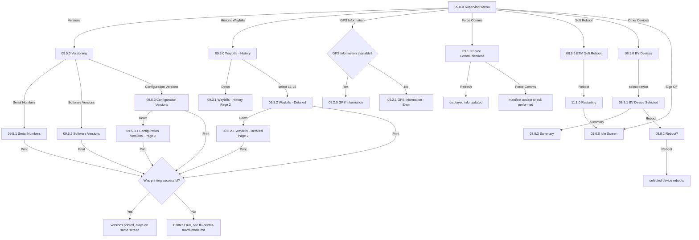

# Flow: Translink ETM — Supervisor Menu

- Source: Overflow project `ETM-TFTS-V15.0.4` (https://overflow.io/s/NDLGF6NF/), board "9.
  Supervisor". Transcribed verbatim via the Claude Chrome extension, 2026-08-04. Raw source:
  `knowledge/flows/translink-etm-full-transcription-v15.0.4.md`.
- Project: translink   Device: ETM   Feature: supervisor menu (versions, waybills, GPS, comms, reboot)
- Transcription confidence: **high** — verbatim, not summarized.
- **Mode note**: no Metro/Ulsterbus/Rail branching found in this board.

## Diagram

## Paths (each = one candidate scenario)
| # | Path | Feature | Tags | Covered by |
|---|---|---|---|---|
| 1 | Supervisor Menu → Versions → Serial Numbers → Print → success, stays on screen | supervisor | — | 4102177,4100907 |
| 2 | Supervisor Menu → Versions → any version screen → Print → **printer error** → routes to the shared FLU printer-error flow | supervisor | @destructive | 4105061 |
| 3 | Supervisor Menu → Configuration Versions → page 2 (Down/Up paging) | supervisor | — | 4102177,4100909,4100910 |
| 4 | Supervisor Menu → Historic Waybills → page through history → select one → Detailed view → page 2 | supervisor | — | 4100610,4100902,4100903,4100904,4100905 |
| 5 | Waybill Detailed view → Print → success/failure (same shared printer flow) | supervisor | @destructive | 4105061 |
| 6 | GPS Information available → shown | supervisor | — | 4102178,4100900 |
| 7 | GPS Information **not** available → "GPS Information - Error" | supervisor | @destructive | 4102178,4100901 |
| 8 | Force Communications → Refresh → displayed info updates | supervisor | — | 4100611,4100899 |
| 9 | Force Communications → Force Comms button → manifest update check performed | supervisor | — | 4100611 |
| 10 | Supervisor → Soft Reboot ETM → confirms → restarts → lands on **Idle Screen** (not "On Break" — different landing screen than the Driver Menu's own Soft Reboot) | supervisor | @destructive | 4100613 |
| 11 | Supervisor → Other Devices → select a paired device → view summary or reboot it | supervisor | @destructive | (screen validation only, no functional case — see note) |
| 12 | Supervisor → Sign Off → back to Idle Screen | supervisor | @destructive | 4100529 |

> `Covered by` stays `?`. Path 10 is worth double-checking specifically — it's a genuine difference
> from the Driver Menu's Soft Reboot (which lands on "On Break," keeping the driver logged in); the
> Supervisor path here lands on the bare Idle Screen instead.

## Screen states (Given/Then anchors)
- **Print behaviour is shared** across Serial Numbers / Software Versions / Configuration Versions /
  Waybill Detailed — all four route through the same "Was printing successful?" decision and the
  same shared FLU Printer Error screen on failure.
- **GPS Information availability is conditional** — mirrors the same "available/unavailable" pattern
  seen in Message of the Day and Word & Colour elsewhere in the suite, but for GPS data specifically.
- **Supervisor's Soft Reboot lands on Idle Screen**, distinct from the Driver Menu's Soft Reboot
  landing on "On Break." Both reference the same "08.9.6 ETM Soft Reboot" screen and "11.1.0
  Restarting" screen, but the destination after restart differs by which menu triggered it.

## Notes / unknowns
- "Other Devices" (BV) here is the same paired-peripheral-device management screen referenced from
  the Driver Menu — see the note in `translink-etm-driver-menu-options.md` about not conflating this
  with the standalone Bus Validator device.
- `/audit-flows` pass 2026-08-05 — highest-risk gap: path 10 (Supervisor Soft Reboot landing screen —
  Idle vs the Driver Menu's Soft Reboot landing on "On Break" — is NOT asserted anywhere, despite this
  being the exact difference this flow-map's own notes flagged as worth checking). Missing: path 2
  (Versions Print-error routing to shared FLU printer-error flow), path 5 (Print from Waybill Detailed
  view, either outcome). Path 11 (Other Devices/BV reboot from Supervisor) only has screen-validation
  coverage filed under Driver Menu, not a functional case reachable from Supervisor's own entry point.
