# Flow: Translink ETM — Technician Menu

- Source: Overflow project `ETM-TFTS-V15.0.4` (https://overflow.io/s/NDLGF6NF/), board "10.
  Technician". Transcribed verbatim via the Claude Chrome extension, 2026-08-05. Raw source:
  `knowledge/flows/translink-etm-full-transcription-v15.0.4.md` (lines 1474-1769).
- Project: translink   Device: ETM   Feature: technician menu (device settings, display settings,
  force comms, soft reboot, decommissioning, network settings/routing, versions, device status)
- Transcription confidence: **high** — verbatim, not summarized.
- **Mode note**: no Metro/Ulsterbus/Rail branching found in this board.

## Diagram

```mermaid
flowchart TD
  MENU[10.0.0 Technician Menu]
  MENU -->|Device Settings| DEVSET[10.1.0 Technician - Device Settings]
  MENU -->|Display Settings| DISPSET[10.2.0 Technician - Display Settings]
  MENU -->|Force Comms| PLSWAIT1[01.9 Please Wait...]
  MENU -->|Decommissioning| DECOM[10.8.0 Technician Menu - Decommissioning]
  MENU -->|Network Settings| NETSET[10.4.0 Technician - Network Settings]
  MENU -->|Network Routing| NETROUTE[10.6.0 Technician - Network Routing Table]
  MENU -->|Versions| VERSIONS[10.7.0 Technician Menu - Versions]
  MENU -->|Device Status| DEVSTAT[10.3.0 Technician - Device Status]
  MENU -->|Soft Reboot| ETMREBOOT[08.9.6 ETM Soft Reboot]
  MENU -->|Go Back| IDLE["01.0.0 Idle Screen"]

  %% Device Settings
  DEVSET -->|R2 Home Locations| HOMEQ{Home Locations available?}
  HOMEQ -->|Yes| EDITHOME[10.1.2 Technician - Device Settings - Edit Home Location]
  HOMEQ -->|No| HOMEERR[10.1.3 Technician - Device Settings - Home location not available]
  DEVSET -->|R4 Tray ID| EDITFIELD[10.1.1 Technician - Device Settings - Edit Input Field]
  DEVSET -->|Go Back| MENU
  HOMEERR -->|Go Back| DEVSET
  EDITHOME -->|Go Back| DEVSET
  EDITHOME -->|select L1-L5/R1-R6 location| CHANGEDQ{Has a change been made?}
  EDITFIELD -->|Enter| CHANGEDQ
  EDITFIELD -->|Go Back| MENU
  CHANGEDQ -->|Yes| CONFIRMINPUT[10.1.1.2 Technician - Device Settings - Confirm Input]
  CHANGEDQ --> DEVSET
  CONFIRMINPUT -->|Cancel| MENU
  CONFIRMINPUT -->|Confirm| PLSWAIT2[01.9 Please Wait...]
  PLSWAIT2 --> APPLIED["Changes are applied, returns to Technician Menu"]
  APPLIED --> MENU

  %% Display Settings
  DISPSET -->|Restore Defaults| DEFAULTS["Default settings are restored"]
  DISPSET -->|Go Back| MENU

  %% Force Communications
  PLSWAIT1 --> FORCECOMMS[10.5.0 Technician - Force Communications]
  FORCECOMMS -->|Go Back| MENU
  FORCECOMMS -->|Refresh| DISPUPDATED["Displayed information is updated"]
  DISPUPDATED --> PLSWAIT3[01.9 Please Wait...]
  FORCECOMMS -->|Force Comms| MANIFEST["A manifest update check will be performed"]
  MANIFEST --> PLSWAIT4[01.9 Please Wait...]

  %% Soft Reboot
  ETMREBOOT -->|Go Back| MENU
  ETMREBOOT -->|Reboot| RESTARTING[11.1.0 Restarting]
  RESTARTING --> IDLE

  %% Decommissioning
  DECOM -->|Decommission Device| DECOMWARN[10.8.1 Technician Menu - Decommissioning Warning]
  DECOM -->|Go Back| MENU
  DECOMWARN -->|Cancel| MENU
  DECOMWARN -->|Yes| IDLE

  %% Network Settings
  NETSET -->|R2 Cellular| CELLMODEM[10.4.2 Technician - Cellular Modem]
  NETSET -->|R3 FEC1| FEC1[10.4.1 Technician - FEC1]
  NETSET -->|Refresh| NETREFRESHED["Displayed information is refreshed"]
  NETSET -->|Go Back| MENU
  CELLMODEM -->|Go Back| NETSET
  CELLMODEM -->|Refresh| CELLREFRESHED["Displayed information is refreshed"]
  FEC1 -->|Go Back| NETSET
  FEC1 -->|Refresh| FECUPDATED["Displayed information is updated"]
  FEC1 -->|Change| EDITIP[10.4.1.1 Technician - Edit IP Addresses]
  EDITIP -->|Cancel| FEC1
  EDITIP -->|Confirm| IPCHANGED[10.4.1.2 Technician - IP Address changed]
  IPCHANGED -->|Cancel| FEC1
  IPCHANGED -->|Confirm| NETSET

  %% Network Routing
  NETROUTE -->|Go Back| MENU
  NETROUTE -->|Refresh| NETROUTEREFRESHED["Displayed information is refreshed"]

  %% Versions
  VERSIONS -->|Serial Numbers| SERIALS[10.7.1 Technician - Serial Numbers]
  VERSIONS -->|Software Versions| SWVER[10.7.2 Technician Menu - Software Versions]
  VERSIONS -->|Configuration Versions| CFGVER[10.7.3 Technician Menu - Configuration Versions]
  VERSIONS -->|Go Back| MENU
  CFGVER -->|Down| CFGVER2[10.7.3.1 Technician Menu - Configuration Versions - Page 2]
  CFGVER2 -->|Up| CFGVER
  SERIALS -->|Go Back| VERSIONS
  SWVER -->|Go Back| VERSIONS
  CFGVER -->|Go Back| VERSIONS
  SERIALS -->|Print| PRINTQ{Was printing successful?}
  SWVER -->|Print| PRINTQ
  CFGVER -->|Print| PRINTQ
  CFGVER2 -->|Print| PRINTQ
  PRINTQ -->|Yes| PRINTED["Versions printed, ETM remains on same screen"]
  PRINTQ -->|No| PRINTERR["Printer Error, see FLU section"]

  %% Device Status
  DEVSTAT -->|Printer/Paper| PAPERSTAT[10.3.4 Technician - Paper Status]
  DEVSTAT -->|Card Reader| CARDREADER[10.3.3 Technician - Card Reader]
  DEVSTAT -->|GPS| GPSINFO[10.3.2 Technician - GPS Information]
  DEVSTAT -->|Other Devices| OTHERDEV[10.3.1 Technician - Other Devices]
  DEVSTAT -->|Go Back| MENU

  PAPERSTAT -->|Reverse Paper Feed| PAPERREVERSED["Paper feed reversed, remains on Paper Status"]
  PAPERSTAT -->|Print Test Ticket| PRINTQ
  PAPERSTAT -->|Go Back| DEVSTAT

  CARDREADER -->|Go Back| DEVSTAT
  CARDREADER -->|Reboot| PLSWAIT5[01.9 Please Wait...]
  PLSWAIT5 --> DEVSTAT
  CARDREADER -->|present smartcard| SMARTQ{Smartcard Valid?}
  SMARTQ -->|Yes| SMARTDETAILS[10.3.3.1 Technician - Card Reader - Smartcard Details]
  SMARTQ -->|No| SMARTERR[06.0.1.3 FLU - Smartcard Top Up - Error - Remove Smartcard]
  SMARTDETAILS -->|Reboot| SMARTERR
  SMARTDETAILS -->|remove smartcard| DEVSTAT
  SMARTERR -->|remove smartcard| DEVSTAT

  GPSINFO -->|Go Back| DEVSTAT

  OTHERDEV -->|select device| BVSEL[08.9.1 BV Device Selected]
  OTHERDEV -->|R2-4| BVSEL
  OTHERDEV --> DEVSTAT
  BVSEL -->|Go Back| OTHERDEV
  BVSEL -->|Summary| BVSUM[08.9.3 BV Device Selected - Summary]
  BVSEL -->|Reboot| BVREBOOTQ[08.9.2 BV Device Selected - Reboot?]
  BVSUM -->|Cancel| BVSEL
  BVREBOOTQ -->|Cancel| BVSEL
  BVREBOOTQ -->|Reboot| BVREBOOTED["Selected device will reboot"]
```

## Paths (each = one candidate scenario)
| # | Path | Feature | Tags | Covered by |
|---|---|---|---|---|
| 1 | Technician Menu → Device Settings → R2 Home Locations → available → Edit Home Location → select location → change made → Confirm Input → Confirm → Please Wait → changes applied → Technician Menu | technician | — | 4100614,4100915,4100914 |
| 2 | Technician Menu → Device Settings → R2 Home Locations → **not available** → Home location not available → Go Back → Device Settings | technician | @destructive | 4100614,4100916 |
| 3 | Device Settings → R4 Tray ID → Edit Input Field → Enter → change made → Confirm Input → Cancel → **back to Technician Menu** (not Device Settings) | technician | — | 4100614 |
| 4 | Device Settings → R4 Tray ID → Edit Input Field → Go Back → **Technician Menu directly** (skips Device Settings, unlike Edit Home Location's Go Back) | technician | — | 4105036 |
| 5 | Edit Home Location / Edit Input Field → no change made → returns to Device Settings without confirmation | technician | — | 4105036 |
| 6 | Technician Menu → Display Settings → Restore Defaults → defaults restored, stays on screen | technician | — | 4100615 |
| 7 | Display Settings → Go Back → Technician Menu | technician | — | 4105037 |
| 8 | Technician Menu → Force Comms → Please Wait → Force Communications screen → Refresh → displayed info updated → Please Wait | technician | — | 4100619 |
| 9 | Force Communications → Force Comms key → manifest update check performed → Please Wait | technician | — | 4100619 |
| 10 | Force Communications → Go Back → Technician Menu | technician | — | 4105037 |
| 11 | Technician Menu → Soft Reboot → confirm Reboot → Restarting → lands on **Idle Screen** | technician | @destructive | 4100620,4100751 |
| 12 | ETM Soft Reboot → Go Back → Technician Menu | technician | — | 4105037 |
| 13 | Technician Menu → Decommissioning → Decommission Device → Decommissioning Warning → Yes → device reboots → **Idle Screen** (no Restarting screen shown, unlike Soft Reboot) | technician | @destructive | GAP — see proposals/coherence-audit/gap-register.md |
| 14 | Decommissioning → Go Back → Technician Menu; Decommissioning Warning → Cancel → Technician Menu | technician | — | MISSING — deliberately not authored alongside path 13, since the whole Decommissioning menu item is GAP/pending-design; author once that's resolved |
| 15 | Technician Menu → Network Settings → R2 Cellular → Cellular Modem → Refresh → info refreshed; Go Back → Network Settings | technician | — | 4100616 |
| 16 | Network Settings → R3 FEC1 → FEC1 → Change → Edit IP Addresses → Confirm → IP Address changed → Confirm → **Network Settings** | technician | — | 4100616 (TODO: confirm the additional screen ids reported for this path — verify against cases.json rather than trusting an ambiguous secondary reference) |
| 17 | Edit IP Addresses → Cancel → FEC1; IP Address changed → Cancel → FEC1 | technician | — | 4105038 |
| 18 | FEC1 → Refresh → info updated; Go Back → Network Settings | technician | — | 4100616 |
| 19 | Network Settings → Refresh → info refreshed; Go Back → Technician Menu | technician | — | 4105038 |
| 20 | Technician Menu → Network Routing Table → Refresh → info refreshed; Go Back → Technician Menu | technician | — | 4100616 |
| 21 | Technician Menu → Versions → Serial Numbers / Software Versions / Configuration Versions → Print → success, stays on screen | technician | — | 4102180 |
| 22 | Versions → any version screen → Print → **printer error** → routes to shared FLU printer-error flow | technician | @destructive | 4105039 |
| 23 | Configuration Versions → Down → Page 2 → Up → Configuration Versions | technician | — | 4105039 |
| 24 | Versions → Serial Numbers/Software Versions/Configuration Versions → Go Back → Versions; Versions → Go Back → Technician Menu | technician | — | 4105039 |
| 25 | Technician Menu → Device Status → Printer/Paper → Paper Status → Reverse Paper Feed → paper reversed, remains on Paper Status | technician | — | 4105040 |
| 26 | Paper Status → Print Test Ticket → success/failure (same shared "Was printing successful?" decision as Versions) | technician | @destructive | 4105040 |
| 27 | Paper Status → Go Back → Device Status; Device Status → Go Back → Technician Menu | technician | — | 4105040 |
| 28 | Device Status → Card Reader → present smartcard → **valid** → Smartcard Details → remove smartcard → Device Status | technician | — | 4102179 |
| 29 | Card Reader → present smartcard → **invalid** → Smartcard Top Up - Error - Remove Smartcard → remove smartcard → Device Status | technician | @destructive | 4105041 |
| 30 | Card Reader → Smartcard Details → Reboot → Smartcard Top Up - Error - Remove Smartcard → remove smartcard → Device Status | technician | @destructive | 4105041 |
| 31 | Card Reader → Reboot → Please Wait → Device Status | technician | @destructive | 4102179 |
| 32 | Device Status → GPS → GPS Information → Go Back → Device Status | technician | — | 4102179 |
| 33 | Device Status → Other Devices → select device / R2-4 → BV Device Selected → Summary → Cancel → BV Device Selected | technician | — | 4105042 |
| 34 | BV Device Selected → Reboot? → Reboot → selected device reboots | technician | @destructive | 4105042 |
| 35 | BV Device Selected → Go Back → Other Devices → Device Status | technician | — | 4105042 |
| 36 | Technician Menu → Go Back → Idle Screen | technician | @destructive | 4105043 |

> `Covered by` stays `?`. Paths 3/4 are worth double-checking — the raw transcription shows Edit
> Input Field's "Go Back" returning straight to the Technician Menu, while Edit Home Location's
> "Go Back" returns to Device Settings; this asymmetry is transcribed verbatim, not normalised.

## Screen states (Given/Then anchors)
- **"Has a change been made?" is a single shared decision** reached from both Edit Home Location
  and Edit Input Field — Yes routes to Confirm Input (then Please Wait → changes applied →
  Technician Menu); the no-change path returns straight to Device Settings.
- **Print behaviour is shared** across Serial Numbers / Software Versions / Configuration Versions
  (+ Page 2) and Paper Status's "Print Test Ticket" — all route through the same "Was printing
  successful?" decision and the same shared FLU Printer Error screen on failure (same pattern as
  `translink-etm-supervisor-menu.md`'s Versions print flow).
- **Card Reader smartcard flow** — presenting a smartcard triggers "Smartcard Valid?"; valid shows
  Smartcard Details (Mini Statement), invalid goes straight to the shared FLU "Smartcard Top Up -
  Error - Remove Smartcard" screen. Pressing Reboot from Smartcard Details also routes to that same
  error/removal screen rather than a distinct reboot confirmation.
- **Other Devices (BV) reuses the same paired-peripheral screens** ("08.9.1 BV Device Selected",
  "08.9.2 Reboot?", "08.9.3 Summary") referenced from the Supervisor Menu and Driver Menu boards —
  see the note in `translink-etm-driver-menu-options.md` about not conflating this with the
  standalone Bus Validator device.
- **Soft Reboot vs Decommissioning land differently after reboot**: Soft Reboot shows an explicit
  "11.1.0 Restarting" screen before landing on Idle Screen; Decommissioning Warning's "Yes" goes
  straight to "device will reboot and return to Idle Screen" with no Restarting screen shown in the
  source.

## Notes / unknowns
- **Decommissioning is flagged pending design** in the raw transcription's annotations
  (`===This function is pending design===`) — TODO: confirm with the requirements owner whether
  this function is implemented/testable on the live ETM before treating paths 13-14 as executable,
  or whether they should be marked GAP/UNCONFIRMED per this repo's no-gap-filling rule.
- TODO: confirm the exact condition label for "Has a change been made?" → "Go back to Device
  Settings" — the source lists this connection with no bracketed action/condition text (unlike the
  "[Yes]" label on the Confirm Input branch), so it's transcribed here as the implicit no-change/
  default path rather than an invented "No" label.
- TODO: confirm the two connections from "10.3.1 - Technician - Other Devices" to "08.9.1 - BV
  Device Selected" (one unlabelled, one labelled "R2-4") — the source lists both separately; it's
  unclear whether these represent two distinct trigger keys/device slots or a transcription
  duplicate. Diagram keeps both as separate edges per the raw source.
- Per `etm-flow-annotations.md` ("## Technician"): "Pressing R2-4 in this example would take the
  user to the screens seen in the Driver Menu - Driver Options flow covering BV Devices" — confirms
  the Other Devices/BV screens here are shared with the Driver Menu, not a separate implementation.
- This board is one cohesive whole (Technician Menu plus its direct sub-screens for device
  settings, display, comms, reboot, decommissioning, network, versions, and device status) — kept
  as a single file rather than split, consistent with how the other 11 completed boards (e.g.
  Supervisor Menu) were not split, since Technician's sub-areas all hang directly off one root menu
  rather than forming genuinely separate feature flows.
- `/audit-flows` pass 2026-08-05 — dominant pattern: the happy-path entry into each Technician
  sub-area is generally covered by one functional case, but almost every Go Back/Cancel navigation
  edge and error/edge fork (home-location-unavailable destination, invalid-smartcard routing,
  print-failure routing, BV reboot via Technician, page-2 paging) is a missing gap (19 of 36 paths).
  Path 13 (Decommissioning) is itself flagged GAP in the source — annotated "pending design" —
  escalated to proposals/coherence-audit/gap-register.md; treat the case-13 "covered" classification as provisional on that
  being resolved. Path 16's second/third case-id references reported by the classifying agent looked
  truncated/ambiguous ("6017, 6029") — flagged for manual verification against cases.json rather than
  written in as fact.
