# Flow: Translink GV — Gate Validator Flows

- Source: `knowledge/flows/translink-validators-gv-pv-bv-full-transcription-v3.1.7.md`, board
  "2. Gate Validator Flows" (Board Index item 2 of the Translink Validators v3.1.7 Overflow
  project). Transcribed verbatim via the Claude Chrome extension. Structured 2026-08-05.
- Project: translink   Device: GV   Feature: gate validator — mode operation, card/barcode
  validation, gate mode changes
- Transcription confidence: **medium** — screens/decisions/connections are verbatim from source,
  but the source lists 131 decision points and 236 connections with heavy duplication (repeated
  identical "No Response" and "Card or Barcode is valid?" nodes reused across different mode
  contexts, per the source's own naming). Grouped here by operating mode to stay readable; every
  screen/decision/connection used below is present in the source. See Notes/unknowns for items the
  source itself leaves ambiguous.

## Diagram

```mermaid
flowchart TD
  %% --- Boot / commissioning ---
  POWERQ{Device is powered on} --> LOADING[0.0 Loading]
  LOADING --> COMMQ{Is device commissioned and fully operational?}
  COMMQ -->|Yes| PRESENT[1.0.1 Present SmartCard or Barcode]
  COMMQ -->|No| PLINTHQ{Is Validator/Plinth Commissioned?}
  PLINTHQ -->|No| NOTCOMM[1.2.10 Machine Not Commissioned - Gate]
  PLINTHQ -->|Yes| NOTINSERVICE[1.2.8 Machine Not in Service - Gate]

  %% --- Fault handling ---
  PRESENT --> FAULTQ{A device fault has occurred}
  FAULTQ -->|Barcode Reader unavailable| PRESENTNOTICKETS[1.1.0 Present SmartCard no Tickets]
  FAULTQ -->|Smartcard Reader unavailable| PRESENTNOCARD[1.1.1 Present Ticket no SmartCard]
  FAULTQ -->|Both readers unavailable, or other non-powerloss fault| NOTINSERVICE
  PRESENTNOCARD --> REBOOTQ{Device reboots in an attempt to recover the reader}
  NOTINSERVICE --> REBOOTQ
  REBOOTQ --> LOADING
  PRESENTNOCARD --> FAULTFIXQ{Fault is corrected}
  PRESENTNOTICKETS --> FAULTFIXQ
  NOTINSERVICE --> FAULTFIXQ
  FAULTFIXQ --> PRESENT

  %% --- Card / barcode presentation entry point ---
  PRESENT --> PRESENTEDQ{Smartcard or Barcode is presented to reader}
  PRESENTEDQ --> READABLEQ{Is presented card readable?}
  PRESENTEDQ --> BCREADQ{Barcode: is barcode readable?}
  READABLEQ -->|No| READERR[1.6.3 ABT Error reading card]
  READABLEQ -->|Yes| CARDTYPEQ{Is presented smartcard a Legacy miFare or ABT EMV?}
  CARDTYPEQ -->|ABT| ABTAIDQ{ABT: Valid AID?}
  CARDTYPEQ -->|Smartcard| SCOPQ{Smartcard: Is smartcard an operator card?}

  %% --- ABT EMV validation chain ---
  ABTAIDQ -->|Yes - Visa/Mastercard| ABTEXPQ{ABT: Card is Expired?}
  ABTAIDQ -->|No - Amex etc| DENYLIST[1.6.2 ABT deny list/negative list]
  ABTEXPQ -->|Yes| DENYLIST
  ABTEXPQ -->|No| ABTODAQ{ABT: ODA Valid?}
  ABTODAQ -->|No| DENYLIST
  ABTODAQ -->|Valid| ABTBINQ{ABT: Is PAN on BIN list?}
  ABTBINQ -->|Yes| DENYLIST
  ABTBINQ -->|No| ABTDENYQ{ABT: PAN on Deny List?}
  ABTDENYQ -->|Yes| DENYLIST
  ABTDENYQ -->|No| ABTPASSBACKQ{ABT: Has PAN been used within Passback Period?}
  ABTPASSBACKQ -->|No| ABTTAG[1.6.1.1 ABT Tag successful]
  ABTPASSBACKQ -->|Yes| PASSBACKNOENTRY[1.4.9 Passback - No Entry]

  %% --- Smartcard operator / technician branch ---
  SCOPQ -->|Yes| TECHMATCHQ{Does Operator ID match a Technician ID in Stafflist?}
  TECHMATCHQ -->|Yes| TECHBOARDREF["See Technician Menu - Gate board for Technician Sign-on"]
  TECHMATCHQ -->|No| NORESPOND["Device will not respond"]
  SCOPQ -->|No| SCBLOCKQ{Smartcard: Is card blocked?}

  %% --- Smartcard passenger validation chain ---
  SCBLOCKQ -->|Yes| HOTLISTED[1.6.4 ABT Hot listed card]
  SCBLOCKQ -->|No| ACTIONLISTQ{Smartcard: Is card on the Actionlist?}
  ACTIONLISTQ -->|Yes| HOTLISTED
  ACTIONLISTQ -->|No| LOCVALIDQ{Smartcard: Is smartcard product valid for current location?}
  LOCVALIDQ -->|No| NOTVALIDLOC[1.3.7 Not Valid At This Location]
  LOCVALIDQ -->|Yes| TIMEVALIDQ{Smartcard: Is smartcard valid at current time/date?}
  TIMEVALIDQ -->|No| INVALIDTIME[1.3.8 Invalid Time Of Day]
  TIMEVALIDQ -->|Yes| EXPIREDQ{Smartcard: Is smartcard expired?}
  EXPIREDQ -->|Yes| PRODEXPIRED[1.3.9 Product Expired]
  EXPIREDQ -->|No| SCPASSBACKQ{Smartcard: Is smartcard within Passback period?}
  SCPASSBACKQ -->|Yes| PASSBACKNOENTRY
  SCPASSBACKQ -->|No| TRANSFERQ{Smartcard: Is smartcard within transfer period?}
  TRANSFERQ -->|Yes| TAGSUCCESS[1.5.0 Tag successful]
  TRANSFERQ -->|No| RECUPDATEQ{Smartcard: Was Smartcard validation record successfully updated?}
  RECUPDATEQ -->|Yes| TAGSUCCESS
  RECUPDATEQ -->|No| REPRESENT[1.3.1 Represent Card]

  %% --- Barcode validation chain ---
  BCREADQ -->|No| UNABLEVALIDATE[1.3.16 Unable to Validate]
  BCREADQ -->|Yes| BCROUTEQ{Barcode: Is barcode valid on current route/service?}
  BCROUTEQ -->|No| BCFAILSERVICE[1.7.99.2 Barcode Validation Fail - Service]
  BCROUTEQ -->|Yes| BCTIMEQ{Barcode: Is barcode valid at current date/time?}
  BCTIMEQ -->|No| BCFAILTIME[1.7.99.3 Barcode Validation Fail - Time]
  BCTIMEQ -->|Yes| BCLOCQ{Barcode: Is barcode valid at current location?}
  BCLOCQ -->|No| BCFAILLOC[1.7.99.4 Barcode Validation Fail - Location]
  BCLOCQ -->|Yes| BCEXPQ{Barcode: Is barcode expired?}
  BCEXPQ -->|Yes| BCFAILEXP[1.7.99.5 Barcode Validation Fail - Expired]
  BCEXPQ -->|No| BCPASSBACKQ{Barcode: Has Barcode been used within Passback Period?}
  BCPASSBACKQ -->|Yes| BCFAILPASSBACK[1.7.99.1 Barcode Validation Fail - Passback]
  BCPASSBACKQ -->|No| BCSUCCESS[1.7.1.1 Barcode Validation Successful - Adult]

  %% --- Gate mode-change flow (remote Fully Free / Emergency / Entry / Exit / Locked) ---
  PRESENT --> REMOTEFREEQ{Gate has been remotely changed to Fully Free mode?}
  REMOTEFREEQ -->|Yes| PLEASEPROCEED[1.2.5 Please Proceed]
  REMOTEFREEQ -->|No| EMERGCHANGEQ{Gate has changed to Emergency mode}
  EMERGCHANGEQ -->|No| ENTRYCHANGEQ{Gate has changed to Entry Mode}
  ENTRYCHANGEQ -->|No| EXITCHANGEQ{Gate has changed to Exit Mode}
  EXITCHANGEQ -->|No| LOCKEDCHANGEQ{Gate has changed to Locked Mode}
  EMERGCHANGEQ -->|Yes| PRIMARYQ1{Device is Primary? Unsecured side}
  ENTRYCHANGEQ -->|Yes| PRIMARYQ2{Device is Primary? Unsecured side}
  EXITCHANGEQ -->|Yes| PRIMARYQ3{Device is Primary? Unsecured side}
  PRIMARYQ1 -->|No - Secured Side| EMERGEXIT[1.2.4 Emergency Exit]
  PRIMARYQ1 -->|Yes - Secured Side| NOENTRY[1.2.6 No Entry]
  PRIMARYQ2 -->|Yes| NOENTRY
  PRIMARYQ2 -->|No| COMMQ
  PRIMARYQ3 -->|Yes| NOENTRY
  PRIMARYQ3 -->|No| COMMQ
  LOCKEDCHANGEQ -->|Yes| NOENTRY
  LOCKEDCHANGEQ -->|No| PASSACTIVITYQ{Gate has opened due to passenger activity?}
  PASSACTIVITYQ -->|Yes| BIDIRQ{Is Gate Bi-Directional?}
  PASSACTIVITYQ -->|No| OUTOFSERVICEQ{Has device been put out of service?}
  BIDIRQ -->|Yes| DIRECTIONQ{Which direction is Gate opening?}
  BIDIRQ -->|No| NOENTRY
  DIRECTIONQ -->|Towards the validator| BIDIRSCREEN[1.2.9 Bi-directional screen]
  DIRECTIONQ -->|Away from Validator| PLEASEPROCEED
  OUTOFSERVICEQ --> COMMQ
  OUTOFSERVICEQ --> NOTINSERVICE

  %% --- Entry Mode operation ---
  ENTRYINSERVICE[EntryMode/InService] --> ENTRYPRIMARYQ{Travel Card or Barcode presented to Primary Reader}
  ENTRYPRIMARYQ --> ENTRYVALIDQ{Card or Barcode is valid?}
  ENTRYVALIDQ -->|Yes| ENTRYSUCCESS[EntryMode/Validation/Success]
  ENTRYVALIDQ -->|No| ENTRYFAIL[EntryMode/Validation/Fail]
  ENTRYSUCCESS --> ENTRYINSERVICE
  ENTRYFAIL --> ENTRYINSERVICE
  ENTRYINSERVICE --> ENTRYREADERQ{Reader becomes unavailable?}
  ENTRYREADERQ -->|Barcode Reader unavailable| ENTRYCARDONLY[EntryMode/InService/CardOnly]
  ENTRYREADERQ -->|Card Reader unavailable| ENTRYCODEONLY[EntryMode/InService/Code Only]

  %% --- Exit Mode operation ---
  EXITINSERVICE[ExitMode/InService] --> EXITSECONDARYQ{Travel Card or Barcode presented to Secondary Reader}
  EXITSECONDARYQ --> EXITVALIDQ{Card or Barcode is valid?}
  EXITVALIDQ -->|Yes| EXITSUCCESS[ExitMode/Validation/Success]
  EXITVALIDQ -->|No| EXITFAIL[ExitMode/Validation/Fail]
  EXITSUCCESS --> EXITINSERVICE
  EXITFAIL --> EXITINSERVICE
  EXITINSERVICE --> EXITREADERQ{Reader becomes unavailable?}
  EXITREADERQ -->|Barcode Reader unavailable| EXITCARDONLY[ExitMode/InService/CardOnly]
  EXITREADERQ -->|Card Reader unavailable| EXITCODEONLY[ExitMode/InService/Code Only]

  %% --- Bi-Directional Mode operation ---
  BIDIINSERVICE[BiDirectionalMode/InService] --> BIDIPRIMARYQ{Travel Card or Barcode presented to Primary Reader}
  BIDIPRIMARYQ --> BIDIVALIDQ{Card or Barcode is valid?}
  BIDIVALIDQ -->|Yes| BIDIENTRY[BiDirectionalMode/Validation/Entry]
  BIDIVALIDQ -->|No| BIDIERRENTRY[BiDirectionalMode/Error/Entry]
  BIDIINSERVICE --> BIDISECONDARYQ{Travel Card or Barcode presented to Secondary Reader}
  BIDISECONDARYQ --> BIDIVALIDQ2{Card or Barcode is valid?}
  BIDIVALIDQ2 -->|Yes| BIDIEXIT[BiDirectionalMode/Validation/Exit]
  BIDIVALIDQ2 -->|No| BIDIERREXIT[BiDirectionalMode/Error/Exit]
  BIDIENTRY --> BIDIINSERVICE
  BIDIERRENTRY --> BIDIINSERVICE
  BIDIEXIT --> BIDIINSERVICE
  BIDIERREXIT --> BIDIINSERVICE
  BIDIINSERVICE --> BIDIREADERQ{Reader becomes unavailable?}
  BIDIREADERQ -->|Barcode Reader unavailable| BIDICARDONLY[BiDirectionalMode/InService/Card Only]
  BIDIREADERQ -->|Card Reader unavailable| BIDICODEONLY[BiDirectionalMode/InService/Code Only]

  %% --- Emergency Mode ---
  EMERGMODE[EmergencyMode] --> EMERGPRESENTQ{Travel Card or Barcode presented to Either Reader}
  EMERGMODE --> EMERGINGRESSQ{Passenger ingress is detected on either Side A or Side B}

  %% --- Free Entry Mode / FullyFree ---
  FREEIDLE[FullyFree/Idle] --> FREEPRESENTQ{Travel Card or Barcode presented to Either Reader}
  FREEIDLE --> FREEINGRESSQ{Passenger ingress is detected on either Side A or Side B}
  FREEINGRESSQ -->|Gate opens in the opposing direction to which the passenger entered by| FREETRAVERSE[FullyFree/Traverse]
  FREETRAVERSE --> DEGRESSQ{Passenger has been detected to have degressed}
  DEGRESSQ --> FREEIDLE

  %% --- Closed Mode ---
  CLOSEDMODE[ClosedMode/NotInService] --> CLOSEDPRESENTQ{Travel Card or Barcode presented to Either Reader}
  CLOSEDMODE --> CLOSEDINGRESSAQ{Unexpected passenger ingress is detected on Side A}
  CLOSEDMODE --> CLOSEDINGRESSBQ{Unexpected passenger ingress is detected on Side B}

  %% --- Technician Mode entry ---
  TECHPRIMARYQ{Valid Technician Card is Presented to Primary Validator} --> TECHPRIMARY[TechMode/Primary]
  TECHSECONDARYQ{Valid Technician Card is Presented to Secondary Validator} --> TECHSECONDARY[TechMode/Secondary]
  TECHBOTHQ{Valid Technician Card is Presented to both validators} --> TECHBOTH[TechMode/Both]
  TECHPRIMARY --> TECHBOARDREF
  TECHSECONDARY --> TECHBOARDREF
  TECHBOTH --> TECHBOARDREF
```

## Paths (each = one candidate scenario)
| # | Path | Feature | Tags | Covered by |
|---|---|---|---|---|
| 1 | Power on → Loading → commissioned & operational → Present SmartCard or Barcode | boot | — | 4104102 |
| 2 | Power on → Loading → not commissioned/operational → Plinth not commissioned → Machine Not Commissioned (Gate) | boot | @destructive | 4105407 |
| 3 | Power on → Loading → not operational but plinth commissioned → Machine Not in Service (Gate) | boot | @destructive | 4104077 |
| 4 | Present screen → Barcode Reader unavailable → Present SmartCard no Tickets → fault corrected → Present screen | fault-handling | @destructive | GAP — needs-spec, see structure.md |
| 5 | Present screen → Smartcard Reader unavailable → Present Ticket no SmartCard → device reboots → Loading | fault-handling | @destructive | GAP — needs-spec, see structure.md |
| 6 | Present screen → both readers unavailable / other fault → Machine Not in Service (Gate) → reboot attempt → Loading | fault-handling | @destructive | GAP — needs-spec, see structure.md |
| 7 | Card presented → unreadable → ABT Error reading card | card-validation | @destructive | 4104023 |
| 8 | Card presented → readable → ABT EMV → Valid AID (Visa/Mastercard) → not expired → ODA valid → not on BIN list → not on deny list → not within passback → ABT Tag successful | abt-validation | — | C4104011, C4104012, C4104013, C4104418, C4104419, C4104420 |
| 9 | ABT card → invalid AID (Amex etc) → ABT deny list/negative list | abt-validation | @destructive | GAP — see gap-register.md, unresolved whether this is real GV behaviour or a transcription artefact |
| 10 | ABT card → valid AID → card expired → ABT deny list/negative list | abt-validation | @destructive | 4104014 |
| 11 | ABT card → not expired → ODA not valid → ABT deny list/negative list | abt-validation | @destructive | 4104015 |
| 12 | ABT card → ODA valid → PAN on BIN list → ABT deny list/negative list | abt-validation | @destructive | 4104016 |
| 13 | ABT card → not on BIN list → PAN on Deny List → ABT deny list/negative list | abt-validation | @destructive | 4104017 |
| 14 | ABT card → passes deny/BIN checks → used within Passback Period → Passback - No Entry | abt-validation | @destructive | 4104018, 4104050 |
| 15 | Card presented → Legacy Smartcard, operator card → Operator ID matches Technician in Stafflist → routed to Technician Menu - Gate board (sign-on) | technician-mode | — | 4104064 |
| 16 | Card presented → Legacy Smartcard, operator card → Operator ID does NOT match Technician in Stafflist → Device will not respond | technician-mode | @destructive | GAP — needs-spec, see structure.md |
| 17 | Legacy Smartcard, not operator card → card blocked → ABT Hot listed card | smartcard-validation | @destructive | GAP — needs-spec quarantine, see proposals/gv-suite-restructure/structure.md |
| 18 | Legacy Smartcard → not blocked → on Actionlist → ABT Hot listed card | smartcard-validation | @destructive | GAP — needs-spec quarantine, see proposals/gv-suite-restructure/structure.md |
| 19 | Legacy Smartcard → not on Actionlist → product not valid for current location → Not Valid At This Location | smartcard-validation | @destructive | GAP — needs-spec quarantine, see proposals/gv-suite-restructure/structure.md |
| 20 | Legacy Smartcard → product valid for location → not valid at current time/date → Invalid Time Of Day | smartcard-validation | @destructive | GAP — needs-spec quarantine, see proposals/gv-suite-restructure/structure.md |
| 21 | Legacy Smartcard → valid at time/date → expired → Product Expired | smartcard-validation | @destructive | GAP — needs-spec quarantine, see proposals/gv-suite-restructure/structure.md |
| 22 | Legacy Smartcard → not expired → within Passback period → Passback - No Entry | smartcard-validation | @destructive | GAP — needs-spec quarantine, see proposals/gv-suite-restructure/structure.md |
| 23 | Legacy Smartcard → not within passback → within transfer period → Tag successful | smartcard-validation | — | GAP — needs-spec quarantine, see proposals/gv-suite-restructure/structure.md |
| 24 | Legacy Smartcard → not within transfer period → validation record successfully updated → Tag successful | smartcard-validation | — | GAP — needs-spec quarantine, see proposals/gv-suite-restructure/structure.md |
| 25 | Legacy Smartcard → not within transfer period → validation record update fails → Represent Card | smartcard-validation | @destructive | GAP — needs-spec quarantine, see proposals/gv-suite-restructure/structure.md |
| 26 | Barcode presented → unreadable → Unable to Validate | barcode-validation | @destructive | GAP — needs-spec quarantine, see proposals/gv-suite-restructure/structure.md |
| 27 | Barcode readable → not valid on current route/service → Barcode Validation Fail - Service | barcode-validation | @destructive | GAP — needs-spec quarantine, see proposals/gv-suite-restructure/structure.md |
| 28 | Barcode valid on route → not valid at current date/time → Barcode Validation Fail - Time | barcode-validation | @destructive | GAP — needs-spec quarantine, see proposals/gv-suite-restructure/structure.md |
| 29 | Barcode valid at time → not valid at current location → Barcode Validation Fail - Location | barcode-validation | @destructive | GAP — needs-spec quarantine, see proposals/gv-suite-restructure/structure.md |
| 30 | Barcode valid at location → expired → Barcode Validation Fail - Expired | barcode-validation | @destructive | GAP — needs-spec quarantine, see proposals/gv-suite-restructure/structure.md |
| 31 | Barcode not expired → used within Passback Period → Barcode Validation Fail - Passback | barcode-validation | @destructive | GAP — needs-spec quarantine, see proposals/gv-suite-restructure/structure.md |
| 32 | Barcode not expired → not within passback → Barcode Validation Successful - Adult | barcode-validation | — | GAP — needs-spec quarantine, see proposals/gv-suite-restructure/structure.md |
| 33 | Present screen → gate remotely changed to Fully Free mode → Please Proceed | gate-mode-change | — | GAP — needs-spec quarantine, see proposals/gv-suite-restructure/structure.md |
| 34 | Present screen → not remotely Fully Free → gate changes to Emergency mode → device is Secured Side (not Primary) → Emergency Exit | gate-mode-change | @destructive | GAP — needs-spec quarantine, see proposals/gv-suite-restructure/structure.md |
| 35 | Gate changes to Emergency mode → device is Secured Side/Primary=Yes → No Entry | gate-mode-change | @destructive | GAP — needs-spec quarantine, see proposals/gv-suite-restructure/structure.md |
| 36 | Gate changes to Entry Mode → Device is Primary → No Entry | gate-mode-change | @destructive | GAP — needs-spec quarantine, see proposals/gv-suite-restructure/structure.md |
| 37 | Gate changes to Entry Mode → Device is not Primary → routes back to commissioning/operational check | gate-mode-change | — | GAP — needs-spec quarantine, see proposals/gv-suite-restructure/structure.md |
| 38 | Gate changes to Exit Mode → Device is Primary → No Entry | gate-mode-change | @destructive | GAP — needs-spec quarantine, see proposals/gv-suite-restructure/structure.md |
| 39 | Gate changes to Exit Mode → Device is not Primary → routes back to commissioning/operational check | gate-mode-change | — | GAP — needs-spec quarantine, see proposals/gv-suite-restructure/structure.md |
| 40 | Gate changes to Locked Mode → Yes → No Entry | gate-mode-change | @destructive | GAP — needs-spec quarantine, see proposals/gv-suite-restructure/structure.md |
| 41 | Gate changes to Locked Mode → No → gate opened due to passenger activity → Bi-Directional gate → direction "Towards the validator" → Bi-directional screen | gate-mode-change | — | GAP — needs-spec quarantine, see proposals/gv-suite-restructure/structure.md |
| 42 | Gate opened due to passenger activity → Bi-Directional → direction "Away from Validator" → Please Proceed | gate-mode-change | — | GAP — needs-spec quarantine, see proposals/gv-suite-restructure/structure.md |
| 43 | Gate opened due to passenger activity → not Bi-Directional → No Entry | gate-mode-change | @destructive | GAP — needs-spec quarantine, see proposals/gv-suite-restructure/structure.md |
| 44 | Gate NOT opened due to passenger activity → device put out of service → Machine Not in Service (Gate) | gate-mode-change | @destructive | GAP — needs-spec quarantine, see proposals/gv-suite-restructure/structure.md |
| 45 | Gate NOT opened due to passenger activity → device NOT put out of service → routes back to commissioning/operational check | gate-mode-change | — | GAP — needs-spec quarantine, see proposals/gv-suite-restructure/structure.md |
| 46 | Entry Mode in-service → present to Primary Reader → valid → Validation/Success → back to in-service | entry-mode | — | GAP — needs-spec quarantine, see proposals/gv-suite-restructure/structure.md |
| 47 | Entry Mode in-service → present to Primary Reader → invalid → Validation/Fail → back to in-service | entry-mode | @destructive | GAP — needs-spec quarantine, see proposals/gv-suite-restructure/structure.md |
| 48 | Entry Mode in-service → Barcode Reader unavailable → InService/CardOnly | entry-mode | @destructive | GAP — needs-spec quarantine, see proposals/gv-suite-restructure/structure.md |
| 49 | Entry Mode in-service → Card Reader unavailable → InService/Code Only | entry-mode | @destructive | GAP — needs-spec quarantine, see proposals/gv-suite-restructure/structure.md |
| 50 | Exit Mode in-service → present to Secondary Reader → valid → Validation/Success → back to in-service | exit-mode | — | GAP — needs-spec quarantine, see proposals/gv-suite-restructure/structure.md |
| 51 | Exit Mode in-service → present to Secondary Reader → invalid → Validation/Fail → back to in-service | exit-mode | @destructive | GAP — needs-spec quarantine, see proposals/gv-suite-restructure/structure.md |
| 52 | Exit Mode in-service → Barcode Reader unavailable → InService/CardOnly | exit-mode | @destructive | GAP — needs-spec quarantine, see proposals/gv-suite-restructure/structure.md |
| 53 | Exit Mode in-service → Card Reader unavailable → InService/Code Only | exit-mode | @destructive | GAP — needs-spec quarantine, see proposals/gv-suite-restructure/structure.md |
| 54 | Bi-Directional in-service → present to Primary Reader → valid → Validation/Entry → back to in-service | bidirectional-mode | — | GAP — needs-spec quarantine, see proposals/gv-suite-restructure/structure.md |
| 55 | Bi-Directional in-service → present to Primary Reader → invalid → Error/Entry → back to in-service | bidirectional-mode | @destructive | GAP — needs-spec quarantine, see proposals/gv-suite-restructure/structure.md |
| 56 | Bi-Directional in-service → present to Secondary Reader → valid → Validation/Exit → back to in-service | bidirectional-mode | — | GAP — needs-spec quarantine, see proposals/gv-suite-restructure/structure.md |
| 57 | Bi-Directional in-service → present to Secondary Reader → invalid → Error/Exit → back to in-service | bidirectional-mode | @destructive | GAP — needs-spec quarantine, see proposals/gv-suite-restructure/structure.md |
| 58 | Bi-Directional in-service → Barcode Reader unavailable → InService/Card Only | bidirectional-mode | @destructive | GAP — needs-spec quarantine, see proposals/gv-suite-restructure/structure.md |
| 59 | Bi-Directional in-service → Card Reader unavailable → InService/Code Only | bidirectional-mode | @destructive | GAP — needs-spec quarantine, see proposals/gv-suite-restructure/structure.md |
| 60 | Fully Free/Idle → passenger ingress detected → gate opens in opposing direction → Traverse → passenger degresses → back to Idle | free-entry-mode | — | GAP — needs-spec quarantine, see proposals/gv-suite-restructure/structure.md |
| 61 | Fully Free/Idle → card/barcode presented to either reader (behaviour beyond this point not detailed in source) | free-entry-mode | — | GAP — needs-spec quarantine, see proposals/gv-suite-restructure/structure.md |
| 62 | Closed Mode → unexpected passenger ingress on Side A | closed-mode | @destructive | GAP — needs-spec quarantine, see proposals/gv-suite-restructure/structure.md |
| 63 | Closed Mode → unexpected passenger ingress on Side B | closed-mode | @destructive | GAP — needs-spec quarantine, see proposals/gv-suite-restructure/structure.md |
| 64 | Closed Mode → card/barcode presented to either reader (behaviour beyond this point not detailed in source) | closed-mode | — | GAP — needs-spec quarantine, see proposals/gv-suite-restructure/structure.md |
| 65 | Emergency Mode → card/barcode presented to either reader (behaviour beyond this point not detailed in source) | emergency-mode | — | GAP — needs-spec quarantine, see proposals/gv-suite-restructure/structure.md |
| 66 | Emergency Mode → passenger ingress detected on either side (behaviour beyond this point not detailed in source) | emergency-mode | — | GAP — needs-spec quarantine, see proposals/gv-suite-restructure/structure.md |
| 67 | Valid Technician Card presented to Primary Validator → TechMode/Primary → see Technician Menu - Gate board | technician-mode | — | GAP — needs-spec quarantine, see proposals/gv-suite-restructure/structure.md |
| 68 | Valid Technician Card presented to Secondary Validator → TechMode/Secondary → see Technician Menu - Gate board | technician-mode | — | GAP — needs-spec quarantine, see proposals/gv-suite-restructure/structure.md |
| 69 | Valid Technician Card presented to both validators → TechMode/Both → see Technician Menu - Gate board | technician-mode | — | GAP — needs-spec quarantine, see proposals/gv-suite-restructure/structure.md |

> `Covered by` stays `?` — a later `/audit-flows` pass fills this in against live TestRail data.

## Screen states (Given/Then anchors)
- **Template - Validator Prompt** (used for in-service/awaiting-validation screens) shows: Company
  Logo, PlinthID/DeviceID/Sublocation ID, Location ID, Zone Name, Date, Time (24 hour clock), a
  prompt to present media type ("can be either/or both Card/Barcode depending on reader
  availability"), a Degraded Message, and an icon indicating where the card/barcode readers are.
- **Template - Validator Response** (used for all status updates — mode changes, validation
  results, faults) shows: Status Bar (as above), Status Icon, a background colour representing the
  response ("Green: Success / Red: Failure / Amber: Warning"), a Main update message (e.g.
  "Validation Success/Failure"), and an optional sub-message of up to two lines giving directions or
  further information.
- **Axio4-PMV LED** — positioned above the main display; colour reflects device activity (source
  notes "these are as follows:" with no list captured — see Notes/unknowns).
- **Card-Reader LEDs (FEIG)** — general rule per source: all-green = reader available for
  validation; any Amber = device "Not Ready"; any Red = a fault has occurred.
- **Validator - Validation Audio Tones** — `Success.wav` on successful Card or Barcode validation;
  `Error.wav` on a validation failure; `timeout.wav` on Technician mode timeouts. The gate itself
  plays separate tones for obstruction alerts / gates closing.
- **Validator - Audio Messages** — `Please_Proceed.wav` on validation success/passback (card or
  barcode); `Please_try_again_or_seek_assistance.wav` on a "Please Try Again" screen;
  `Please_Seek_assistance.wav` on a validation failure (e.g. Hotlisted/Faulty/Product Expired).
- **Uncommissioned device status bar** — an uncommissioned device typically has an unprogrammed
  Plinth-ID, so Gate ID/Device ID/Sub Location/Location fields on the Status Bar may show no
  programmed value until comms + a Technician sign-in program the Location details.
- **Barcode midnight-expiry rule** — for barcodes with an expiry time between 00:00 and 04:00, the
  validator displays the previous day as the expiry date on the barcode-validation-success screen
  (this note is written against "MUB"/PV in the source but appears under the Gate Validator board's
  own annotations — see Notes/unknowns).
- **1.2.8 Machine Not in Service (Gate)** and **1.2.10 Machine Not Commissioned (Gate)** are
  reached both from the initial commissioning check and from later out-of-service/fault paths — same
  screen, multiple entry routes.
- **"No Entry" (1.2.6)** is the shared destination for several distinct gate-mode-change branches
  (Emergency/Entry/Exit/Locked mode Primary-side checks, and the non-bi-directional passenger-open
  case) — one screen, several triggering conditions.

## Notes / unknowns
- **CORRECTED 2026-08-06**: path 8's "Valid AID" bucket originally listed Visa/Mastercard/Maestro,
  copied from the raw Overflow board transcription. A correctness pass found this wrong for GV
  specifically — `FBD-100690` states Maestro acceptance is **PV-only**, confirmed by live case
  C4104024 ("a Maestro card is not accepted at the GV"). Corrected to Visa/Mastercard. Path 9
  (Amex-class → deny list) may be the same transcription conflation rather than real GV behaviour —
  left as an open GAP, not corrected, pending confirmation.
- TODO: confirm what the source's repeated, connection-less **"No Response"** decision points
  resolve to. They appear after most validation/status screens (Entry/Exit/BiDirectional
  Success/Fail, Emergency, Free Entry, Closed Mode) with no captured onward connection — likely a
  timeout/no-op loop back to the same screen, but the raw transcription does not state the target.
- TODO: confirm the exact scope of **Emergency Mode**, **FullyFree/Idle** (card/barcode branch) and
  **ClosedMode/NotInService** (card/barcode branch) beyond "Travel Card or Barcode presented to
  Either Reader" — the source captures the decision point but no onward connection from it in these
  three modes (unlike Entry/Exit/BiDirectional, which do show a Valid?/Success/Fail chain).
- TODO: confirm whether the three separately-listed **"Device is Primary? (Unsecured side)"**
  decision points (from Emergency-mode change, Entry-mode change, Exit-mode change) are truly
  identical logic reused, or subtly different per triggering mode — the source lists them as
  separate decision-point entries with slightly different Yes/No target sets (Emergency's "No"
  branch reaches "Emergency Exit"; Entry's and Exit's "No" branches both loop back to the
  commissioning check instead).
- TODO: confirm the two blank `...` / `...` entries under Annotations / Spec Notes (between "Validator
  Response Template" and "Audio Tones") — likely truncated/placeholder rows in the source export,
  content not captured.
- Source lists screen **"1.2.5 Please Proceed"** twice in the Screens (57) list — appears to be a
  duplicate entry in the raw transcription, not two distinct screens; treated as one screen here.
- The **ABT deny list/negative list (1.6.2)** screen is a shared failure destination for five
  distinct ABT decision failures (invalid AID, card expired, ODA invalid, PAN on BIN list, PAN on
  deny list) — one screen, five triggering conditions, per source.
- The **"1.6.4 ABT Hot listed card"** screen name is reused as the shared destination for both the
  Legacy-smartcard "card blocked" and "card on Actionlist" failures, despite the screen's own name
  referencing "ABT" — this is exactly as captured in the source connections, not an inferred link.
- "Technician Menu - Gate" board (referenced from TechMode/Primary, /Secondary, /Both, and from the
  operator-card sign-on path) is out of scope for this flow-map — see the separate Technician
  Menu - Gate transcription/flow-map for that board's content.
