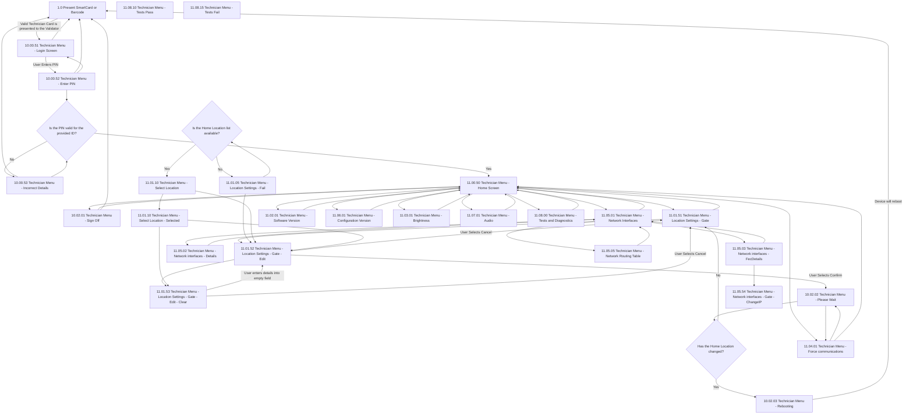

# Flow: Translink GV — Technician Menu

- Source: `knowledge/flows/translink-validators-gv-pv-bv-full-transcription-v3.1.7.md`, board
  "3. Technician Menu - Gate" (Board Index item 3 of 5: Welcome Page / Gate Validator Flows /
  Technician Menu - Gate / Platform Validator-Barcode / Technician Menu - Platform Validator).
  Transcription/structuring date: 2026-08-05.
- Project: translink   Device: GV   Feature: technician menu (sign-on, location settings, network,
  versions, brightness/audio, force comms, tests & diagnostics)
- Transcription confidence: **medium** — the raw transcription's "Decision Points" list repeats the
  literal string `11.00.00 Technician Menu - Home Screen` seven times where a real decision label
  would be expected, and several "back to Home" connections target that `11.00.00` id rather than
  the actual Home Screen node `11.00.50 Technician Menu - Home Screen`. Treated as the same node
  (Home Screen) below — see Notes/unknowns.

## Diagram

## Paths (each path = one candidate scenario)
| # | Path | Feature | Tags | Covered by |
|---|------|---------|------|------------|
| 1 | Present SmartCard/Barcode → valid Technician Card → Login Screen | technician-signon | — | 4104064, 4104106 |
| 2 | Login Screen → Enter PIN → valid PIN → Home Screen | technician-signon | — | 4104064, 4104106 |
| 3 | Login Screen → Enter PIN → invalid PIN → Incorrect Details → retry → valid PIN → Home Screen | technician-signon | @destructive | 4104065 |
| 4 | Login Screen → cancel/back → Present SmartCard/Barcode | technician-signon | — | 4104066 |
| 5 | Enter PIN → back → Login Screen | technician-signon | — | 4105395 |
| 6 | Home Screen → Sign Off → Home Screen | technician-signon | @destructive | 4105396 |
| 7 | Sign Off → Present SmartCard/Barcode | technician-signon | @destructive | GAP — see proposals/coherence-audit/gap-register.md |
| 8 | Home Screen → Location Settings - Gate → Edit → Confirm → Please Wait → Home Location unchanged → back to Location Settings - Gate | location-settings | — | 4104069 |
| 9 | Home Screen → Location Settings - Gate → Edit → Confirm → Please Wait → Home Location changed → Rebooting → device reboots → Present SmartCard/Barcode | location-settings | @destructive | GAP — see proposals/coherence-audit/gap-register.md |
| 10 | Location Settings - Gate - Edit → Select Location list available → Select Location → select → Select Location - Selected → back to Edit | location-settings | — | 4105397 |
| 11 | Location Settings - Gate - Edit → Select Location list **not** available → Location Settings - Fail → retry availability check | location-settings | @destructive | 4105398 |
| 12 | Location Settings - Gate - Edit → Cancel → Location Settings - Gate | location-settings | — | 4105399 |
| 13 | Location Settings - Gate - Edit → Edit - Clear → enter details into empty field → back to Edit | location-settings | — | 4105400 |
| 14 | Location Settings - Gate - Edit - Clear → Cancel → Location Settings - Gate | location-settings | — | 4105401 |
| 15 | Home Screen → Network Interfaces → Details → back to Network Interfaces | network-settings | — | 4105402 |
| 16 | Home Screen → Network Interfaces → FecDetails → ChangeIP → back to Network Interfaces | network-settings | — | 4105403 |
| 17 | Home Screen → Network Interfaces → Network Routing Table → back to Network Interfaces | network-settings | — | 4105404 |
| 18 | Home Screen → Network Interfaces → back to Home Screen | network-settings | — | 4105405 |
| 19 | Home Screen → Software Version → back to Home Screen | versioning | — | 4104071 |
| 20 | Home Screen → Configuration Version → back to Home Screen | versioning | — | 4104072 |
| 21 | Home Screen → Brightness → back to Home Screen | display-settings | — | 4104073 |
| 22 | Home Screen → Audio → back to Home Screen | display-settings | — | 4104074 |
| 23 | Home Screen → Force Communications → Please Wait → Force Communications (Call Now/Refresh) → back to Home Screen | force-comms | — | 4104075 |
| 24 | Home Screen → Tests and Diagnostics → back to Home Screen | tests-diagnostics | — | 4105406 |

## Screen states (Given/Then anchors)
- **Present SmartCard or Barcode** — presenting a Technician card redirects the user to the Login
  Screen with the ID automatically entered and the PIN field active.
- **Login Screen / Enter PIN** — PIN validity is checked against the entered ID; the error message
  on Incorrect Details disappears as soon as a new PIN is entered.
- **Home Screen (11.00.50)** — the technician menu root; branches to Location Settings, Network
  Interfaces, Software Version, Configuration Version, Brightness, Audio, Force Communications,
  Tests and Diagnostics, and Sign Off.
- **Location Settings - Gate / Edit** — in Edit mode the 'Stop Location', 'Install Point ID',
  'Mount ID' and 'Zone' fields are configured via the on-screen pin-pad after pressing 'Change'; the
  Home Location itself is changed via 'Select' from a list of available Home Locations supplied by
  the BackOffice on request. Selecting a new Home Location requires a reboot to apply.
- **Location Settings - Fail** — reached when the Home Location list is not available on request.
- **Rebooting** — reached only when the Home Location has changed; the device reboots and returns
  to Present SmartCard or Barcode.
- **Brightness** — lets the technician adjust PV screen brightness; the displayed 'Mode' indicates
  manual vs automatic (light-sensor-driven) brightness configuration.
- **Force Communications** — summarises: (1) pending Audit Records count, (2) last successful Audit
  Record send date/time, (3) last manifest download attempt date/time, (4) last successful manifest
  download date/time, (5) count of pending software/configuration update files to download.
  'Call Now' triggers a BackOffice manifest check and attempts to send pending audit records;
  'Refresh' updates the displayed values with the most recent information.
- **Tests and Diagnostics** — annotated in the source as "WIP"; screens "Tests Pass" and
  "Tests Fail" exist but no connection into or out of them is captured in this board (see
  Notes/unknowns).
- Annotation "Section reserved for Gate Validators" appears against the Location Settings area,
  marking these Location Settings screens as the **Gate**-specific variant (a Platform Validator
  variant exists separately on board "5. Technician Menu - Platform Validator").

## Notes / unknowns
- TODO: confirm whether Sign Off's two outgoing connections (→ Home Screen, → Present
  SmartCard/Barcode) correspond to distinct triggers (e.g. Cancel vs Confirm) — the raw
  transcription lists both connections with no action label.
- TODO: confirm the real target/meaning of the seven "Decision: 11.00.00 Technician Menu - Home
  Screen" entries in the raw transcription's Decision Points list. No screen numbered `11.00.00`
  appears in the Screens list (only `11.00.50 Technician Menu - Home Screen`); this file treats
  every `11.00.00` reference as the same Home Screen node, but it may instead denote an unlabelled
  generic "return" decision distinct from Home Screen itself.
- TODO: confirm how "Tests and Diagnostics" (11.08.00) actually reaches "Tests Pass" (11.08.10) and
  "Tests Fail" (11.08.15) — both screens are listed in the board's Screens (28) but no Connection
  entry links them to Tests and Diagnostics or to each other. Likely a run-tests action and a
  pass/fail branch, but not captured in the source; do not assume a trigger.
- TODO: confirm the exact Select Location flow — "Select Location" and "Select Location - Selected"
  share the identical id `11.01.10` in the raw transcription (only the trailing "- Selected" suffix
  differs), which may be a numbering error in the source rather than two genuinely distinct screens.
- The raw transcription's Screens (28) list has 28 bullets but only 26 distinct screen names
  (`10.02.02 Technician Menu - Please Wait` and `11.00.00`-style Home Screen references repeat) —
  treated as duplicates, not separate screens, above.
