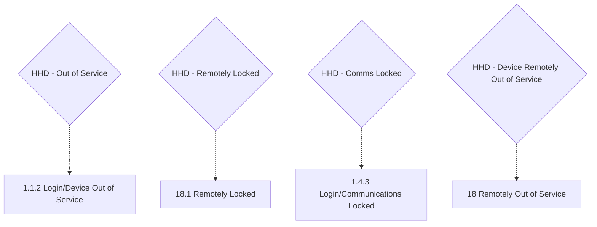

# Flow: Translink HHD — Additional Features: Lockout States

- Source: `knowledge/flows/translink-hhd-full-transcription-v17.3.7.md`, board "8. Additional
  Features" (Overflow project "TFTS HHD V17.3.7", https://overflow.io/s/XP0NLVZZ/). Transcribed
  verbatim via the Claude Chrome extension. Structured into this flow-map 2026-08-05.
- Project: translink   Device: HHD   Feature: additional features — device lockout/unusable states
  (out of service, remotely locked, communications locked, remotely out of service)
- Transcription confidence: **low-medium** — the raw board captured 0 screen-to-screen connections
  for this entire board (10 screens, 9 decision points, 7 annotations, 0 connections). Every node
  below is represented as an isolated state; no arrow is invented. See Notes/unknowns.

## Diagram

> Dotted edges are this map's best-effort pairing of each decision point to its like-named screen by
> name only — the source recorded **no drawn connection** for any of them (see Notes/unknowns). Do
> not read the dotted lines as confirmed triggers/transitions.

## Paths (each path = one candidate scenario)
| # | Path | Feature | Tags | Covered by |
|---|------|---------|------|------------|
| 1 | HHD hits a critical issue (start-up or in-use) → "1.1.2 Login/Device Out of Service" → device unusable until a technician (or other stated action) fixes it | additional-features | @destructive | 4105159 |
| 2 | HHD is remotely locked → "18.1 Remotely Locked" | additional-features | @destructive | 4105160 |
| 3 | HHD has not communicated with CloudFare for x hours → "1.4.3 Login/Communications Locked" | additional-features | @destructive | C4103904 |
| 4 | HHD is remotely marked out of service → "18 Remotely Out of Service" | additional-features | @destructive | 4105161 |

## Screen states (Given/Then anchors)
- **1.1.2 Login/Device Out of Service** — per annotation: "If the HHD runs into a critical issue,
  either on start-up or during use, it will default to this screen and become unusable until a
  technician or some other stated action has fixed the issue."
- **18.1 Remotely Locked** — screen name only; no annotation captured for this specific screen in
  this board.
- **1.4.3 Login/Communications Locked** — per annotation: "Communications are locked after x amount
  of hours of HHD not communicating with CloudFare." The exact "x" threshold is not stated.
- **18 Remotely Out of Service** — screen name only; no annotation captured for this specific screen
  in this board.

## Notes / unknowns
- TODO: confirm every trigger/transition into and out of these four states — the source board
  recorded **0 explicit screen-to-screen connections** for the whole "8. Additional Features" board,
  so none of the below is confirmed: what specifically distinguishes "Out of Service" (1.1.2) from
  "Remotely Out of Service" (18) from "Remotely Locked" (18.1); whether these are reachable from any
  normal-use screen or only from Login; and how each state is cleared (e.g. whether Out of Service
  needs a technician on-site vs Remotely Locked/Remotely Out of Service being cleared by a back-office
  action).
- TODO: confirm the numeric "x hours" threshold for Communications Locked — not given in this board's
  annotations.
- TODO: confirm whether "1.4.3 Login/Communications Locked" here is the same mechanism as the ETM's
  analogous comms-lock state (see `knowledge/flows/translink-etm-*` if an equivalent exists) or a
  distinct HHD-specific implementation — do not assume parity across devices.
- This file covers 4 of the 10 screens / 4 of the 9 decision points on board "8. Additional
  Features". The remaining screens/decisions are split across
  `translink-hhd-additional-features-updates-and-limits.md` (payment device update, device docked,
  fares updating, revenue limit approaching/reached) — see that file's Notes for the 9th decision
  point ("HHD - Dual Inspection/Validation support"), which has no associated screen on this board.
