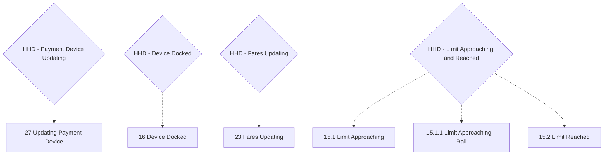

# Flow: Translink HHD — Additional Features: Updates, Docking, and Revenue Limit

- Source: `knowledge/flows/translink-hhd-full-transcription-v17.3.7.md`, board "8. Additional
  Features" (Overflow project "TFTS HHD V17.3.7", https://overflow.io/s/XP0NLVZZ/). Transcribed
  verbatim via the Claude Chrome extension. Structured into this flow-map 2026-08-05.
- Project: translink   Device: HHD   Feature: additional features — payment device updating, device
  docked, fares updating, revenue limit approaching/reached
- Transcription confidence: **low-medium** — the raw board captured 0 screen-to-screen connections
  for this entire board (10 screens, 9 decision points, 7 annotations, 0 connections). Every node
  below is represented as an isolated state; no arrow is invented. See Notes/unknowns.

## Diagram

> Dotted edges are this map's best-effort pairing of each decision point to its like-named screen(s)
> by name only — the source recorded **no drawn connection** for any of them (see Notes/unknowns). Do
> not read the dotted lines as confirmed triggers/transitions.

## Paths (each path = one candidate scenario)
| # | Path | Feature | Tags | Covered by |
|---|------|---------|------|------------|
| 1 | Payment device update starts (can occur at any time) → "27 Updating Payment Device" fullscreen shown → operator can still perform HHD actions, but cannot use the payment device until the update completes | additional-features | — | 4105162 |
| 2 | HHD docked while an immediate download & update is scheduled → "16 Device Docked" with update icon shown | additional-features | — | 4105163 |
| 3 | HHD docked, no update pending → "16 Device Docked" shows plain "Device Docked" message | additional-features | — | 4105164 |
| 4 | Software update scheduled for the future (device does not need to be docked during the update) → "16 Device Docked" behaviour per the future-update case → screen disappears once updated → Idle (Log in) screen shown | additional-features | — | 4105165 |
| 5 | Device on LogOn screen, transition from current to future fares required → "23 Fares Updating" shown | additional-features | — | 4105166 |
| 6 | Pre-configured revenue amount approaching → "15.1 Limit Approaching" (or "15.1.1 Limit Approaching - Rail") notification shown; amount remaining until the limit is presented on the left | additional-features | — | 4105167 |
| 7 | Revenue limit reached → "15.2 Limit Reached" → operator signed off → waybill printed → device locked until docked **and** a Back Office connection is established over ethernet | additional-features | @destructive | 4105168 |

## Screen states (Given/Then anchors)
- **27 Updating Payment Device** — per annotation: "The payment device can update at any time, so
  while this occurs there will be a fullscreen update. The operator will be able to perform actions
  on the HHD device, however will not be able to use the payment device until the update is
  completed."
- **16 Device Docked** — per annotation, this screen displays in 2 cases: (1) an immediate
  download & update is scheduled and the device is on the docking station — the update icon is shown;
  (2) the software update was scheduled for the future — in this case the device does **not** have to
  be docked during the update. In both cases the screen disappears once the update completes and the
  Idle (Log in) screen is shown. Cross-cutting note: per the Revenue Limit annotation below, this same
  "Device Docked" screen/state is also part of how a Limit Reached lockout is cleared (docking +
  ethernet Back Office connection).
- **23 Fares Updating** — per annotation: "This screen is required for transition from current to
  future fares. This will only happen if device on LogOn screen."
- **15.1 Limit Approaching** / **15.1.1 Limit Approaching - Rail** — per annotation: "Notification at
  the bottom is presented when a pre-configured amount is reached. The amount remaining until the
  revenue limit is reached is presented on the left." Two screen variants captured (general and
  Rail); the source does not state what distinguishes when each variant is shown beyond the naming.
- **15.2 Limit Reached** — per annotation: "Once the revenue limit is reached, the operator will be
  signed off and a waybill will be printed. To unlock the device, the device will have to be docked
  and Back Office connection using ethernet will have to be established."

## Notes / unknowns
- TODO: confirm every trigger/transition into and out of these states — the source board recorded
  **0 explicit screen-to-screen connections** for the whole "8. Additional Features" board, so the
  Paths above are grounded only in the annotation text and screen names, not a drawn flow line.
- TODO: confirm the pre-configured revenue "amount" value(s) for Limit Approaching/Limit Reached —
  not stated in this board's annotations (config source, not a fixed value).
- TODO: confirm what distinguishes "15.1 Limit Approaching" from "15.1.1 Limit Approaching - Rail" —
  only the screen names/IDs are captured; no annotation calls out the difference explicitly beyond
  the "Rail" suffix.
- TODO: confirm the Limit Reached unlock mechanism in practice (docking + ethernet Back Office
  connection) — cross-reference against `translink-hhd-additional-features-lockout-states.md` and any
  Supervisor/Technician flow-map for whether a Supervisor/Technician action is also involved, as with
  the analogous ETM revenue-limit lockout (`knowledge/flows/translink-etm-revenue-limit.md`, which has
  its own unresolved TODO on the clearing procedure) — do not assume parity across devices.
- TODO: the 9th decision point on board "8. Additional Features" — **"HHD - Dual Inspection/Validation
  support"** — has no associated screen anywhere in this board's Screens list (10) and no annotation
  referencing it. Not represented in either this file's or
  `translink-hhd-additional-features-lockout-states.md`'s diagram pending confirmation of what it
  actually governs; likely relates to board "9. Inspection & Validation V2" but this is not confirmed
  by anything in board 8's own content — do not assume the link.
- This file covers 6 of the 10 screens / 4 of the 9 decision points on board "8. Additional
  Features". The remaining screens/decisions (device lockout/unusable states) are split out to
  `translink-hhd-additional-features-lockout-states.md` — genuinely distinct feature area (device
  becomes unusable due to a fault/lock vs. these background update/limit states, most of which leave
  the device at least partly usable).
