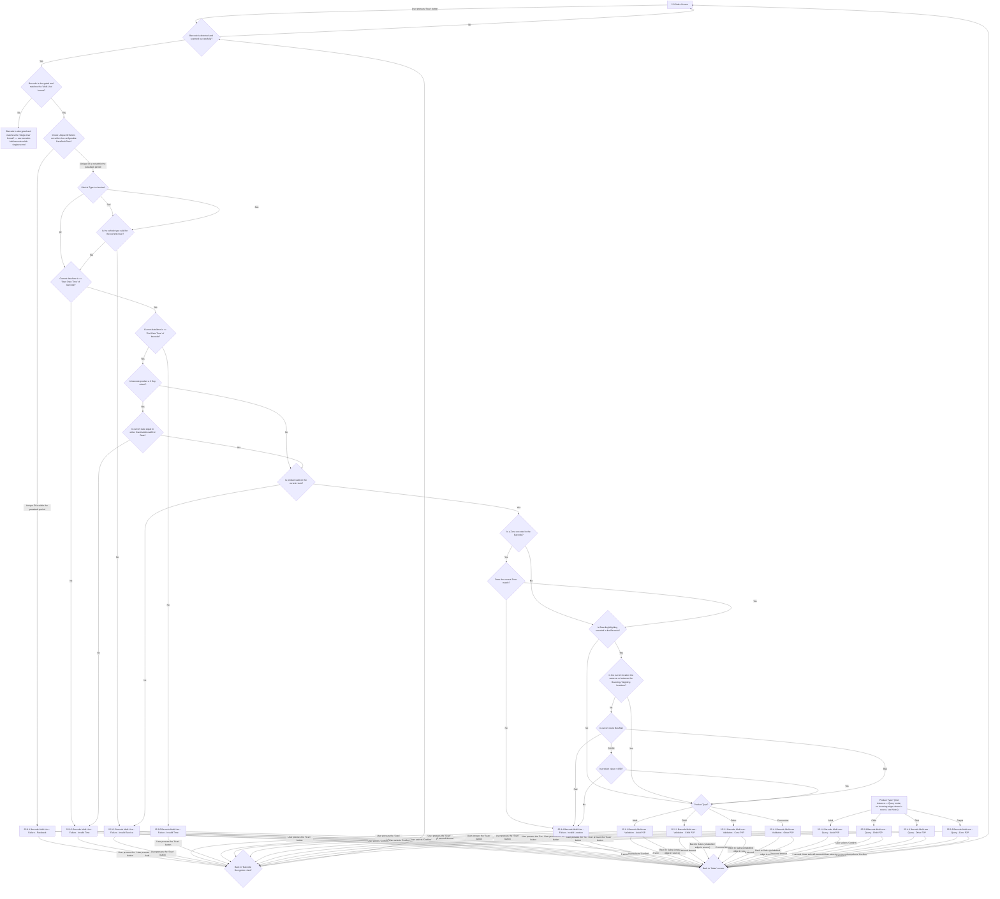
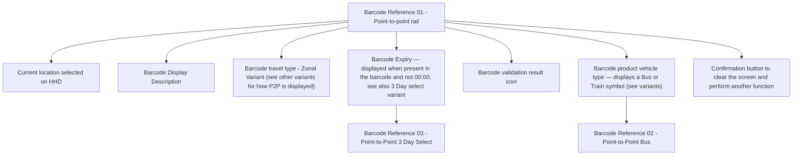

# Flow: Translink HHD — Barcode Multi-Use Validation & Query

- Source: `knowledge/flows/translink-hhd-full-transcription-v17.3.7.md`, board "7. 7. Barcode and
  mLink Scan" (Overflow project "TFTS HHD V17.3.7", https://overflow.io/s/XP0NLVZZ/). This board
  bundles two genuinely distinct feature areas — split per the ETM FLU/Driver-Menu precedent. This
  file covers the **Multi-Use barcode** branch (screens numbered `25.x`). The **Single-Use barcode
  scan / manual reference entry / redemption / print** branch (screens numbered `24.x`) is in the
  sibling file `translink-hhd-barcode-mlink-singleuse.md`.
- Transcription/structuring date: 2026-08-05.
- Project: translink   Device: HHD   Feature: barcode multi-use validation & query
- Transcription confidence: **medium** — the decision logic and terminal screens are transcribed
  verbatim from the source connections list, but several structural ambiguities exist in the raw
  source itself (see Notes/unknowns) — these are flagged, not resolved by guessing.

## Diagram

### Reference/legend screens (no incoming connection found in this board)

## Paths (each path = one candidate scenario)
| # | Path | Feature | Tags | Covered by |
|---|------|---------|------|------------|
| 1 | Sales Screen → Scan → Multi-Use format → PassBack check fails → 25.9.1 Failure - Passback | barcode-multiuse | — | C4103965 |
| 2 | → PassBack passes → Vehicle Type check invalid for route (Rail/Bus) → 25.9.2 Failure - Invalid Service | barcode-multiuse | — | 4105169 |
| 3 | → Vehicle Type valid → Start Date/Time check fails → 25.9.3 Failure - Invalid Time | barcode-multiuse | — | 4105170 |
| 4 | → Start Date passes → End Date/Time check fails → 25.9.5 Failure - Invalid Time | barcode-multiuse | — | 4105171 |
| 5 | → End Date passes, not a 3 Day Select → product not valid on current route → 25.9.2 Failure - Invalid Service | barcode-multiuse | — | 4105172 |
| 6 | → is a 3 Day Select → current date does not equal Start/Additional/End Date → 25.9.3 Failure - Invalid Time | barcode-multiuse | — | 4105173 |
| 7 | → product valid on route → Zone encoded, current Zone does not match → 25.9.4 Failure - Invalid Location | barcode-multiuse | — | C4103963 |
| 8 | → Zone matches (or no Zone) → Boarding/Alighting not encoded → Product Type → Validation screen (Adult/Child/Conc/Other) | barcode-multiuse | — | FRAGMENTED — see consolidation-audit.md |
| 9 | → Boarding/Alighting encoded, current location not between B/A → Bus/Rail check = Rail → 25.9.4 Failure - Invalid Location | barcode-multiuse | @destructive | 4105174 |
| 10 | → Bus/Rail check = CR105 → product value >=£90 check = No → 25.9.4 Failure - Invalid Location | barcode-multiuse | @destructive | 4105175 |
| 11 | → location between B/A, or Bus/Rail=Bus, or value>=£90=Yes → Product Type → Validation screen (Adult/Child/Conc/Other) | barcode-multiuse | — | C4103962, C4103966 |
| 12 | Product Type (2nd/Query-mode instance, entry point unclear) → Query screen (Adult/Child/Pink/Purple) | barcode-multiuse | — | 4105176 |
| 13 | Any Validation/Query/Failure screen → user presses 'Scan' → Back to Barcode Decryption check → re-enters scan decision | barcode-multiuse | — | 4105177 |
| 14 | Any Validation/Query/Failure screen → timeout or 'Confirm' → Back to Sales screen | barcode-multiuse | — | C4103963 |
| 15 | Sales Screen → Scan → format is **not** Multi-Use → bridges to Single-Use flow (see `translink-hhd-barcode-mlink-singleuse.md`) | barcode-multiuse | — | 4105178 |

## Screen states (Given/Then anchors)
- **2.0 Sales Screen** — entry/exit point for the whole barcode scan flow; reached via 'Scan' button
  press and returned to via timeout/Confirm on any terminal screen.
- **25.9.1 / 25.9.2 / 25.9.3 / 25.9.4 / 25.9.5 — Barcode Multi-Use Failure screens** — each is a
  distinct failure reason (Passback, Invalid Service, Invalid Time ×2, Invalid Location); each offers
  both a re-scan path ('Scan' button → Back to Barcode Decryption check) and a timeout/Confirm path
  back to Sales.
- **25.1.1 / 25.2.1 / 25.3.1 / 25.4.1 — Barcode Multi-use Validation screens** — successful validation
  outcome per product type (Adult/Child/Conc/Other); 2-second timeout back to Sales, plus an
  additional unlabelled "back to Sales" edge in the source (see Notes).
- **25.1.9 / 25.2.9 / 25.4.9 / 25.3.9 — Barcode Multi-use Query screens** — a query-mode result per
  product type (labelled Adult/Child/Pink/Purple in the source, not consistently matching the
  Validation screens' Adult/Child/Conc/Other labelling); 3-second timeout or Confirm back to Sales.

## Notes / unknowns
- **TODO: confirm "mLink" meaning.** The board title is "7. Barcode and mLink Scan" but no screen or
  decision in the raw transcription is explicitly named "mLink". The Single-Use file's manual
  reference-entry flow (`24 / 24.1 / 24.1.1 - Barcode Reference Entry`) is a plausible candidate for
  what "mLink" refers to, but this is not stated anywhere in the source — do not assert it.
- **TODO: confirm duplicate "Product Type?" decision.** The Decision Points list contains two
  identically-named "Product Type?" nodes (44 decision points total). One feeds the four Validation
  screens (labels Adult/Child/Other/Concession); a second feeds the four Query screens (labels
  Adult/Child/Pink/Purple). The raw transcription's connections list shows no incoming edge into the
  second (Query-mode) instance — how the flow reaches it is not captured in this source.
- **TODO: confirm Product Type → screen mapping.** For the Validation-mode decision, the source maps
  label "Other" → screen 25.3.1 ("Conc P2P") and label "Concession" → screen 25.4.1 ("Other P2P") —
  i.e. the label and the screen's own name appear swapped. Transcribed literally; not corrected.
- **TODO: confirm "Barcode Reference 01/02/03" screens' role.** These three screens (a
  point-to-point rail/bus/3-day-select display legend, annotated with callouts for vehicle-type icon,
  zonal variant, expiry, validation icon, and a confirmation button) have no incoming connection
  anywhere in this board — they may be a static design-reference/legend diagram rather than a
  reachable runtime screen. Not asserted as part of the live flow.
- The "Go to 'Barcode Travel Ticket Print' Flow." decision (used by the sibling Single-Use file, not
  reached from this Multi-Use branch per the source) is a shared cross-board sub-flow documented
  elsewhere in the full transcription (annotation "Barcode Travel Ticket Print Flow" appears under
  the Sales Mode board) — not transcribed into either barcode-mlink file.
