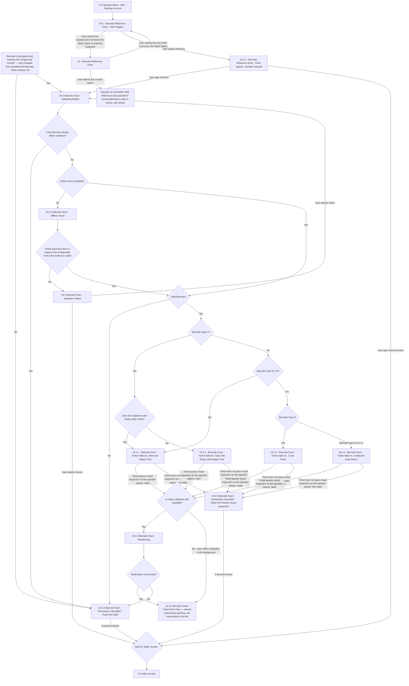

# Flow: Translink HHD — Barcode Single-Use Scan, Manual Reference Entry & Redemption

- Source: `knowledge/flows/translink-hhd-full-transcription-v17.3.7.md`, board "7. 7. Barcode and
  mLink Scan" (Overflow project "TFTS HHD V17.3.7", https://overflow.io/s/XP0NLVZZ/). This board
  bundles two genuinely distinct feature areas — split per the ETM FLU/Driver-Menu precedent. This
  file covers the **Single-Use barcode scan / manual reference entry / redemption** branch (screens
  numbered `24.x`). The **Multi-Use barcode validation & query** branch (screens numbered `25.x`) is
  in the sibling file `translink-hhd-barcode-mlink-multiuse.md`.
- Transcription/structuring date: 2026-08-05.
- Project: translink   Device: HHD   Feature: barcode single-use scan, manual entry & redemption
- Transcription confidence: **medium** — decision logic and terminal screens are transcribed
  verbatim from the source connections list; several structural ambiguities exist in the raw source
  itself (see Notes/unknowns) — these are flagged, not resolved by guessing.

## Diagram

## Paths (each path = one candidate scenario)
| # | Path | Feature | Tags | Covered by |
|---|------|---------|------|------------|
| 1 | (bridge from Multi-Use file) format is Single-Use → No → 24.2.2 Ticket Not Valid → timeout → Sales | barcode-singleuse | — | 4105179 |
| 2 | format is Single-Use → Yes → 24.3 Validating Details → already offline validated → 24.2.2 Ticket Not Valid | barcode-singleuse | — | C4103957 |
| 3 | Operator Menu (5.3 Rail - Nothing to Annul) → Reference Entry Field Tapped → Number Entered → Confirm → 24.3 Validating Details | barcode-singleuse | — | C4103956 |
| 4 | Barcode Reference Entry → Field Tapped → Cancel option → unnamed/orphan decision node (see Notes) | barcode-singleuse | — | 4105180 |
| 5 | Reference Entry Number Entered → Cancel button → Back to Sales | barcode-singleuse | @destructive | 4105181 |
| 6 | Validating Details → not offline validated → online check unavailable → 24.3.2 Offline Check → value/product over configurable limit → 24.2 Validation Failed → Retry → Validating Details | barcode-singleuse | @destructive | C4103960 |
| 7 | Validation Failed → user selects Cancel → Back to Sales | barcode-singleuse | @destructive | 4105182 |
| 8 | Offline Check passes limit → Valid Barcode? = No → 24.2.2 Ticket Not Valid | barcode-singleuse | @destructive | 4105183 |
| 9 | Online check available → Valid Barcode? = Yes → Barcode Type U → Departure/Expiry mismatch → 24.4.2 Ticket Valid inc. Date with Expiry and Depart Time | barcode-singleuse | — | 4105184 |
| 10 | → Type U, dates match → 24.4.1 Ticket Valid inc. Date and Depart Time | barcode-singleuse | — | 4105185 |
| 11 | → not Type U, Type B or E → 24.4.1 Ticket Valid inc. Date and Depart Time | barcode-singleuse | — | 4105186 |
| 12 | → not Type U/B/E, Type D → 24.4.4 Ticket Valid inc. 3 Use Times | barcode-singleuse | — | 4105187 |
| 13 | → Type D = No (Type H or S) → 24.4.3 Ticket Valid inc. Outbound ands Return | barcode-singleuse | — | 4105188 |
| 14 | Any Ticket-Valid screen → operator selects 'Not Valid' (fails visual inspection) → 24.2.6 Ticket Not Passed Visual Inspection → timeout → Sales | barcode-singleuse | @destructive | 4105189 |
| 15 | Any Ticket-Valid screen → operator selects 'Valid' → Is online validation still available? = Yes → 24.3.3 Redeeming → Redemption Successful → Go to Barcode Travel Ticket Print Flow | barcode-singleuse | — | C4103958 |
| 16 | Redeeming → Redemption Successful = No → 24.2.2 Ticket Not Valid | barcode-singleuse | @destructive | 4105190 |
| 17 | Is online validation still available? = No → stores offline validation in background → Go to Barcode Travel Ticket Print Flow | barcode-singleuse | — | C4103959 |

## Screen states (Given/Then anchors)
- **24 - Barcode Reference Entry / 24.1 Field Tapped / 24.1.1 Number Entered** — manual barcode
  reference entry keypad flow; toggles between base entry screen and "field tapped" (keyboard open)
  state; Confirm after entering a number proceeds to Validating Details, Cancel returns to Sales.
- **24.3 Barcode Scan - Validating Details** — shared landing screen for both the camera-scan path
  (Single-Use format confirmed) and the manual-entry path (Confirm after Number Entered); routes into
  the offline-validated check.
- **24.3.2 Barcode Scan - Offline Check** — reached only when online check is unavailable; gates on a
  configurable value/product limit before proceeding to the Valid Barcode? decision.
- **24.2 Barcode Scan - Validation Failed** — offers Retry (loops back to Validating Details) or
  Cancel (back to Sales).
- **24.4.1 / 24.4.2 / 24.4.3 / 24.4.4 — Ticket Valid screens** — each represents a different barcode
  type/date combination (plain date+depart, date+expiry+depart, outbound+return, 3-use-times); all
  four share the same two operator outcomes (Valid → online-validation check; Not Valid → visual
  inspection failure).
- **24.2.2 Ticket Not Valid** / **24.2.6 Ticket Not Passed Visual Inspection** — both are 3-second
  timeout terminal screens back to Sales.
- **24.3.3 Barcode Scan - Redeeming** — only reachable when online validation is still available at
  the point the operator confirms 'Valid'; resolves to Redemption Successful? which either continues
  to the print flow or fails back to Ticket Not Valid.

## Notes / unknowns
- **TODO: confirm "mLink" meaning.** As in the sibling Multi-Use file — the board title references
  "mLink" but no screen/decision here is named that; this file's manual reference-entry flow
  (`24 / 24.1 / 24.1.1`) is a plausible but unconfirmed candidate.
- **TODO: confirm Operator Menu → Reference Entry edge.** The source connects
  "5.3 Operator Menu - Rail - Nothing to Annul" directly to "24.1 - Barcode Reference Entry - Field
  Tapped", skipping the base "24 - Barcode Reference Entry" screen. This may be a genuine shortcut or
  a gap in the original Overflow board (missing Operator Menu → 24 edge) — transcribed literally,
  not corrected.
- **TODO: confirm unnamed decision node.** "24 - Barcode Reference Entry" → Cancel option connects to
  a decision literally labelled with an Overflow internal id
  (`e2b1abf5-7303-406f-bca1-e3312a518647`) rather than a readable name in the raw transcription. This
  looks like an orphaned/deleted node reference in the source Overflow board, not a real screen name —
  do not invent a label for it.
- **"Go to 'Barcode Travel Ticket Print' Flow."** is a shared cross-board sub-flow (the annotation
  "Barcode Travel Ticket Print Flow" and screen "27 Barcode Ticket - Printed?" appear elsewhere in
  the full transcription, under the Sales Mode board) — out of scope for this file; not transcribed
  here, same treatment as the ETM flow-maps' cross-references to the shared FLU printer-error flow.
- Two edges into `NOTVALID` are captured with slightly different labels in the source ("3 second
  timeout" vs "3 Second Timeout" vs "Timeout 3 seconds") — treated as the same behaviour, not three
  distinct paths.
