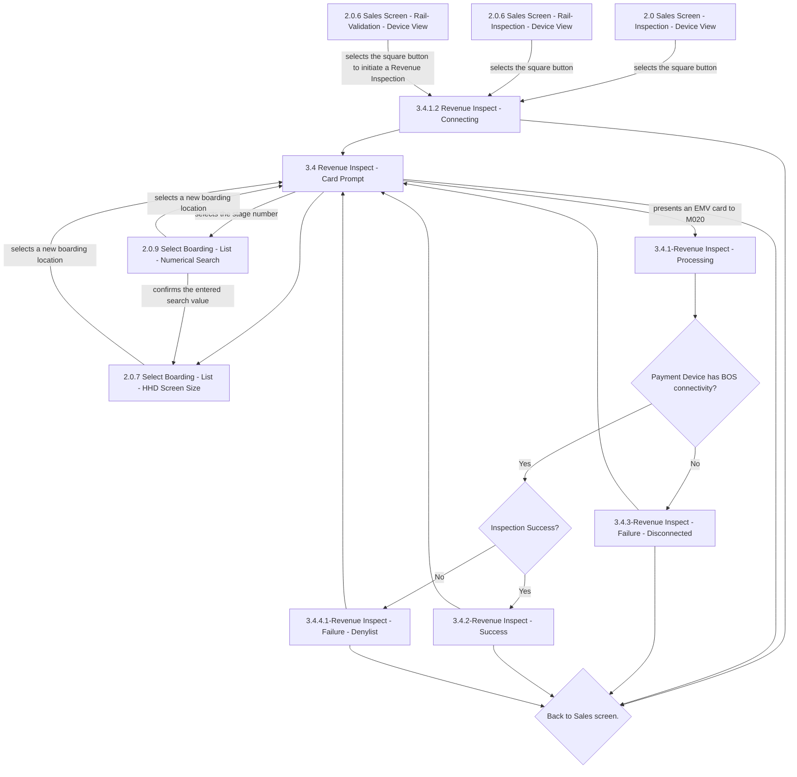

# Flow: Translink HHD — Inspection & Validation V2 (Revenue Inspection)

- Source: `knowledge/flows/translink-hhd-full-transcription-v17.3.7.md`, board "9. Inspection &
  Validation V2" (Screens/Decision Points/Annotations/Connections lists under that heading).
  Transcribed/structured 2026-08-05.
- Project: translink   Device: HHD   Feature: Revenue Inspection (square-button EMV/payment-device
  inspection flow, boarding-location change while inspecting)
- Transcription confidence: **high** — this sub-area's screens/connections form a self-contained
  loop with only three entry edges from the Sales/Rail screens.
- The **smartcard**-based Inspection/Validation feature of the same board is a separate area — see
  `translink-hhd-inspection-validation-smartcard.md`.

## Diagram

## Paths (each = one candidate scenario)
| # | Path | Feature | Tags | Covered by |
|---|------|---------|------|------------|
| 1 | Sales Screen (Inspection/Rail-Inspection/Rail-Validation, Device View) → square button → Revenue Inspect - Connecting → Card Prompt | revenue-inspection | — | C4103978, C4103979 |
| 2 | Revenue Inspect - Connecting → (60s timeout) → Back to Sales screen | revenue-inspection | @destructive | 4105191 |
| 3 | Card Prompt → Back to Sales screen (no card presented) | revenue-inspection | — | C4103986 |
| 4 | Card Prompt → presents EMV card to M020 → Processing → BOS connectivity Yes → Inspection Success Yes → Revenue Inspect - Success | revenue-inspection | — | C4103980, C4104785, C4104786, C4104787, C4104788 |
| 5 | Card Prompt → presents EMV card to M020 → Processing → BOS connectivity Yes → Inspection Success No → Revenue Inspect - Failure - Denylist | revenue-inspection | @destructive | C4103981 |
| 6 | Card Prompt → presents EMV card to M020 → Processing → BOS connectivity No → Revenue Inspect - Failure - Disconnected → back to Card Prompt or Back to Sales screen | revenue-inspection | @destructive | C4103985 |
| 7 | Revenue Inspect - Success → next card prompt (sequential inspection) | revenue-inspection | — | 4105192 |
| 8 | Revenue Inspect - Failure - Denylist → next card prompt (sequential inspection) | revenue-inspection | @destructive | 4105193 |
| 9 | Card Prompt → selects stage number → Select Boarding - Numerical Search → confirms search value → Select Boarding - HHD Screen Size → selects new boarding location → back to Card Prompt | revenue-inspection | — | 4105194 |
| 10 | Card Prompt → Select Boarding - HHD Screen Size directly → selects new boarding location → back to Card Prompt | revenue-inspection | — | 4105195 |

## Screen states (Given/Then anchors)
- **3.4.1.2 Revenue Inspect - Connecting** — shown whenever the HHD needs to connect to the card
  reading (payment) device; per annotation, times out after **60s** back to the Sales screen.
- **3.4 Revenue Inspect - Card Prompt** — the resting/waiting screen for Revenue Inspection; from
  here the inspector can present an EMV card, change boarding location, or return to Sales.
- **2.0.9 Select Boarding - List - Numerical Search / 2.0.7 Select Boarding - List - HHD Screen
  Size** — let the inspector change boarding location without leaving Revenue Inspection mode; per
  annotation this screen (boarding-location change) **times out after 30s** back to Sales, and
  while changing location the HHD stays functionally in Revenue Inspection mode at the currently
  selected location (barcode/smartcard remain disabled).
- **3.4.1-Revenue Inspect - Processing** — shown while an EMV card is being checked; per annotation,
  the payment device must be woken and kept awake for as long as the inspection prompt/result
  screens are displayed, to allow sequential inspections.
- **3.4.2-Revenue Inspect - Success / 3.4.4.1-Revenue Inspect - Failure - Denylist** — per
  annotation, both **time out after 3s** back to the card prompt screen; if the failure reason is
  not Denylist, "the same layout will be used with an appropriate message displayed (see generic
  example)".
- **3.4.3-Revenue Inspect - Failure - Disconnected** — reached when the payment device has no BOS
  connectivity.

## Notes / unknowns
- Revenue Inspection is available **only from the Sales Mode screen** (per annotation); the square
  button is unresponsive on any other screen. This board does not show a connection from any
  screen other than the three Sales/Rail "Device View" screens, consistent with that note.
- Per annotation, while Revenue Inspection mode is active, **barcode scanning and smartcard
  validation are disabled** until returning to Sales Mode — this is a cross-feature interaction
  with `translink-hhd-inspection-validation-smartcard.md` and the barcode/mLink board, not itself a
  connection in this board.
- **3.4.4.2-Revenue Inspect - Failure - Declined** is listed in this board's Screens (47) but **no
  connection edge to or from it appears anywhere in this board's transcribed Connections list**.
  TODO: confirm with Overflow directly what triggers this screen and where it routes — by naming
  pattern it is presumably a third `Inspection Success?` outcome (declined vs. denylisted) that the
  transcription missed, but this must not be assumed without confirming against the source.
- The two edges from Revenue Inspect - Success and Revenue Inspect - Failure - Denylist to
  "Card Prompt" vs. "Back to Sales screen." are both present with no distinguishing condition text
  in the source (i.e. both destinations are listed as always reachable from the same screen) — read
  as the 3s auto-timeout advancing to Card Prompt for the next sequential inspection, with a
  manual "Back to Sales" action also available before the timeout fires. TODO: confirm this
  reading against Overflow (no explicit user action was transcribed for either edge).
