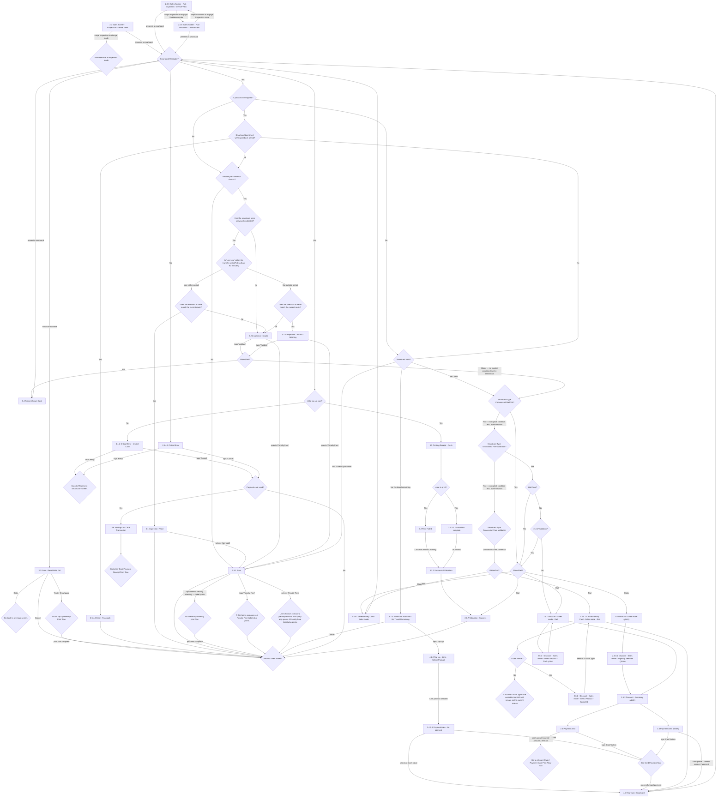

# Flow: Translink HHD — Inspection & Validation V2 (Smartcard)

- Source: `knowledge/flows/translink-hhd-full-transcription-v17.3.7.md`, board "9. Inspection &
  Validation V2" (Screens/Decision Points/Annotations/Connections lists under that heading).
  Transcribed/structured 2026-08-05.
- Project: translink   Device: HHD   Feature: smartcard inspection & validation (mode switch, card
  read, passback, pre-validation, previously-validated/transfer-period checks, penalty
  fare/warning, and the discount/concession re-sell path an Invalid card can route into)
- Transcription confidence: **medium** — the raw board reuses identical decision labels
  (`Glider/Rail?`, `Does the direction of travel match the current route?`, `Back to Sales
  screen.` / `Back to 'Sales' screen.`) from multiple different entry points with different
  outgoing edges each time. This file preserves that structure by giving each reused instance its
  own diagram node (suffixed `2`/`3`) rather than merging them into one node with all edges —
  see Notes/unknowns.
- **Revenue Inspection** (the square-button EMV/BOS function) is a genuinely separate feature area
  of the same board — see `translink-hhd-inspection-validation-revenue.md`.

## Diagram

## Paths (each = one candidate scenario)
| # | Path | Feature | Tags | Covered by |
|---|------|---------|------|------------|
| 1 | Sales Screen (Inspection) → swipe → HHD remains in inspection mode | inspection-validation | — | 4105196 |
| 2 | Sales Screen Rail (Inspection) → swipe → Rail (Validation) → swipe back → Rail (Inspection) | inspection-validation | — | 4105197 |
| 3 | Present smartcard → not readable → Error Read/Write Fail → Retry → previous screen | inspection-validation | @destructive | C4103825 |
| 4 | Present smartcard → not readable → Error Read/Write Fail → 'Faulty Smartpass' → Top Up Receipt Print flow → Sales screen | inspection-validation | @destructive | 4105198 |
| 5 | Present smartcard → readable → passback configured → last used within passback period → Error - Passback → Sales screen | inspection-validation | @destructive | C4103827 |
| 6 | Present smartcard → readable → (no passback / passback OK) → pre-validation fails → 3.3.1 Error | inspection-validation | @destructive | 4105199 |
| 7 | Pre-validation passes → not previously validated → Inspection - Invalid | inspection-validation | — | 4105200 |
| 8 | Pre-validation passes → previously validated → within 90-min transfer period → direction matches → Inspection - Valid → Back to Sales | inspection-validation | — | C4103971 |
| 9 | Pre-validation passes → previously validated → within 90-min transfer period → direction does NOT match → Inspection - Invalid | inspection-validation | @destructive | 4105201 |
| 10 | Pre-validation passes → previously validated → outside 90-min transfer period → direction matches → Inspection - Invalid - Warning | inspection-validation | @destructive | FRAGMENTED — see consolidation-audit.md |
| 11 | Pre-validation passes → previously validated → outside 90-min transfer period → direction does NOT match → Inspection - Invalid | inspection-validation | @destructive | 4105202 |
| 12 | Inspection - Valid → selects 'Not Valid' → 3.3.1 Error | inspection-validation | @destructive | 4105203 |
| 13 | Inspection - Invalid / Invalid - Warning → taps 'Validate' → Glider/Rail? → Present Smart Card (Rail) or fare-type routing (Glider) | inspection-validation | — | 4105204 |
| 14 | 3.3.1 Error → 'Penalty Warning' → ticket prints → Penalty Warning print flow → Back to Sales | inspection-validation | @destructive | C4103894 |
| 15 | 3.3.1 Error → 'Penalty Fare' → third-party app opens → Penalty Fare ticket prints → Back to Sales | inspection-validation | @destructive | C4103896 |
| 16 | Smartcard Valid (Validation flow) → No, travel prohibited → 3.3.1 Error | inspection-validation | @destructive | 4105205 |
| 17 | Smartcard Valid (Validation flow) → No, no travel remaining → Not Valid - No Travel Remaining → 'Top-Up' → iLink product → No Warrant Payment Area → Cash/Card → Represent Smartcard | inspection-validation | — | FRAGMENTED — see consolidation-audit.md |
| 18 | Valid top-up card? → No → Critical Error - Invalid Card → Retry / Cancel | inspection-validation | @destructive | 4105206 |
| 19 | Valid top-up card? → Yes → Printing Receipt - Cash → Able to print? Yes → Transaction complete → Successful Validation → Validation - Success | inspection-validation | — | C4103800(-analog Top-Up cases) |
| 20 | Able to print? → No → Print Failed → Continue Without Printing → Successful Validation | inspection-validation | @destructive | FRAGMENTED — see consolidation-audit.md |
| 21 | Smartcard Valid (Validation flow) → Yes → fare-type chain (Commercial/Staff/EA → Discounted Fare → Half-Fare → yLink) → Glider/Rail? → Discount - Sales mode - Rail or (yLink) | inspection-validation | — | 4105207 |
| 22 | Fare-type chain → Concession Fare Validation → Glider/Rail? → Concessionary Card - Sales mode (Glider) or - Rail | inspection-validation | — | 4105208 |
| 23 | Concessionary Card - Sales mode - Rail → Cross Border? Yes → Select Product - SeniorXB → select Ticket Type → back to Concessionary Card - Sales mode - Rail → Represent Smartcard | inspection-validation | — | 4105209 |
| 24 | Concessionary Card - Sales mode - Rail → Cross Border? No → "no other Ticket Types available, remains on current screen" | inspection-validation | @destructive | 4105210 |
| 25 | Discount - Sales mode (yLink) → Alighting Selected → Discount - Summary → Payment Area (Glider) or Payment Area | inspection-validation | — | 4105211 |
| 26 | Payment Area / Payment Area (Glider) → 'Card' button → See Card Payment flow → successful payment → Represent Smartcard | inspection-validation | — | 4105212 |
| 27 | Payment Area / Payment Area (Glider) → cash preset/Warrant → Cash/Payment Card Print flow, or Represent Smartcard (Glider) | inspection-validation | — | 4105213 |
| 28 | Critical Error (2.5.4.1) → Cancel → Payment card used? → Yes → Voiding Last Card Transaction → Card Payment Receipt Print flow | inspection-validation | @destructive | 4105214 |

## Screen states (Given/Then anchors)
- **2.0 Sales Screen - Inspection - Device View / 2.0.6 Sales Screen - Rail- Inspection - Device
  View / 2.0.6 Sales Screen - Rail- Validation - Device View** — the "V2"/"Device View" screens;
  swiping toggles Inspection↔Validation mode; presenting a smartcard from any of them starts the
  `Smartcard Readable?` decision.
- **3.1 Inspection - Valid** — reached only when previously-validated AND direction-of-travel
  matches; offers 'Not Valid' override → 3.3.1 Error.
- **3.2 Inspection - Invalid** — reached from: not-previously-validated, OR direction mismatch (in
  either the within- or outside-transfer-period branch). Offers 'Validate' (→ Glider/Rail? fare
  routing) and 'Penalty Fare' (→ 3.3.1 Error).
- **3.2.1 Inspection - Invalid - Warning** — reached only from the outside-transfer-period branch
  when direction matches. Same two actions as 3.2 Invalid.
- **3.2.3 Smartcard Not Valid - No Travel Remaining** — offers 'Top-Up' (routes into the iLink top-up
  purchase flow) or Cancel.
- **3.3.1 Error** — the shared error/penalty screen: 'Penalty Warning' (ticket prints, then routes
  back to Sales), 'Penalty Fare' (opens third-party app + prints ticket), or Back to Sales. Error
  message text per annotation: "Product Expired / Pass Expired / No Journeys Left / No Balance
  Left / Hotlisted Card / Visual Rejection".
- **3.3 Error - Read/Write Fail** — 'Retry' (back to previous screen) or 'Faulty Smartpass' (routes
  to Top Up Receipt Print flow) or Cancel (Back to Sales).
- **2.5.4.2 Error - Passback** — reached only when passback is configured AND the card's last use
  is within the passback period.
- **2.5.4.1 Critical Error / 4.1.2 Critical Error - Invalid Card** — both offer Cancel (→ Payment
  card used?) and Retry (→ Back to Represent Smartcard screen).
- **2.6.7 Validation - Success** — end state after a successful validation printing sequence
  (Transaction complete → 3.2.2 Successful Validation → 2.6.7); routes Back to Sales.
- Per annotation: **on validation, a Transaction Record is sent to the back office** (BOS audit
  event — no further detail on payload/fields given in this board).

## Notes / unknowns
- The decision "Glider/Rail?" is transcribed at four distinct points in the source graph (post
  Invalid/Warning 'Validate', post Smartcard-Type-Commercial/Staff/EA, post Half-Fare/yLink, and
  post Smartcard-Type-Concession-Fare-Validation), each with a different outgoing edge set. This
  file gives each instance its own diagram node (`D_GLIDERRAIL`/`2`/`3`) rather than merging them
  into one node with all edges superimposed, to avoid implying reachability that isn't in the
  source. TODO: confirm with the design/Overflow source whether these are genuinely four separate
  decision instances or one reused sub-routine — the raw transcription does not distinguish them.
- Likewise "Does the direction of travel match the current route?" appears twice (post within-90-min
  transfer-period, and post outside-90-min transfer-period) with different destination screens for
  the same Yes/No answer (Valid/Invalid vs Invalid-Warning/Invalid) — kept as two nodes
  (`D_DIRECTION_A`/`B`) for the same reason.
- "Back to Sales screen." and "Back to 'Sales' screen." appear as two textual variants in the raw
  source (with/without single quotes and with a capital S) — treated here as the same terminal
  decision (`D_BACKSALES`); TODO: confirm they are not meant to be distinguishable screens (e.g.
  Glider vs Rail sales screen).
- Two "Glider/Rail?" outgoing edges have no bracketed condition text in the source (`Glider/Rail? →
  Smartcard Type Commercial/Staff/EA?` and the two "Smartcard Type …?" chain edges into the next
  check) — the [Glider]/[No] labels shown in the diagram are inferred **by elimination** against the
  sibling edge that *does* carry a `[Rail]`/`[Yes]` label. TODO: confirm this inference against
  Overflow directly.
- Annotation "Previous screens may be: 2.0 Sales Screen - Inspection / 2.0.6 Sales Screen - Rail -
  Inspection / 2.6.5 Concessionary Card - Sales mode" is present in the source but its anchor
  screen (which screen this annotates) is not stated. TODO: confirm which screen this note attaches
  to (likely 4.4 Represent Smartcard or a Critical Error screen).
- Annotation: "'Penalty Fare' option may be disabled if the Penalty Fare App is not available, the
  printer is disconnected or the Smartcard product is valid for free travel" — a precondition on
  3.3.1 Error's 'Penalty Fare' button, not itself a screen/connection.
- Annotation: "Warrant is used for paper tickets only, not top-ups. They will appear on Waybills and
  are available on Rail only" — governs the 2.4.0.1 Payment Area - No Warrant screen's Warrant
  option; not shown as its own diagram branch since no connection for it was transcribed beyond the
  Cash/Card options already mapped.
- Annotation on card-payment receipt printing ("N.B. '£Price change' header will only show if cash
  was the payment method… this will be 1 of 2 for print due to additional receipts for card
  payment. Print will still go through same checks seen in Print flows.") and "For a card payment,
  there will be a check to see if you also want to print the customer receipt as seen in the
  'Payment Card Print' flow" both describe the Card Payment Receipt Print sub-flow referenced from
  `D_CARDPAYPRINT`/`D_CASHPAYPRINT`, which is itself out of scope for this board (not expanded here
  — TODO: confirm against the dedicated Payment Card Print flow board/file if one exists).
- Annotation: "Other cards will display the tick and then [PRODUCT NAME] Validated below the tick.
  See 'Validation Successful' screen on the Rail flow for reference" — describes 2.6.7
  Validation - Success screen content; the referenced "Rail flow" reference screen is not itself in
  this board.
- Annotation on product options for Dependants Pass/Senior/Blind/War Pensioner/60+/ROI Senior
  (single only for local travel ≤ station 61; XB single/day return/1-month return for cross-border
  travel > station 61) governs the Cross Border?/SeniorXB Select Product screens.
- "Top-up is iLink only. Validation includes iLink, Staff, Spouse, Retired, External and aLink" is a
  stated scope note on the smartcard-type chain (Commercial/Staff/EA → Discounted → Concession) —
  no separate "Spouse"/"Retired"/"External"/"aLink" decision node was transcribed for this board,
  so those types are presumably folded into the existing type-decision screens. TODO: confirm
  whether Spouse/Retired/External/aLink route through the existing Commercial/Staff/EA or
  Discounted-Fare decisions, or are missing from this board's transcription.
