# Flow: Translink HHD — Login

- Source: `knowledge/flows/translink-hhd-full-transcription-v17.3.7.md`, board "2. 2. Login"
  (Overflow project "TFTS HHD V17.3.7", https://overflow.io/s/XP0NLVZZ/). Transcribed verbatim via
  the Claude Chrome extension. Structured into this flow-map 2026-08-05.
- Project: translink   Device: HHD   Feature: login (ID/card entry, sign-on failure/lockout, duty
  number, Message/Word of the Day, printer test, Glider route selection vs Rail)
- Transcription confidence: **medium** — the raw board reuses the decision label "Correct Login
  Details entered?" for what appear to be two distinct decision points (initial login vs the
  supervisor-unlock retry after Device Locked); see Notes/unknowns for how this map resolves that.

## Diagram

```mermaid
flowchart TD
  STARTNIR[1.1 Login/Start - NIR]
  STARTGLIDER[1.1.1 Login/Start - Glider]
  IDSEL[1.2 Login/ID Selected]
  PW[1.3 Login/Password]
  PWENTERED[1.3.1 Login/Password Entered]
  PWCLOSED[1.3.1 Login/Password Entered - Keypad Closed]
  CARDERR[1.4.2 Login/Card Error]
  SIGNONFAIL[1.4 Login/Sign on Failed]
  DEVLOCKED[1.4.1 Login/Device Locked]
  DUTY[1.5 Login/Duty Number]
  DUTYENTERED[1.5.1 Login/Duty Number Entered]
  MOTDLOAD[1.6 Login/Message of the Day - Loading]
  MOTD[1.6.1 Login/Message of the Day]
  MOTDERR[1.6.2 Login/Message of the Day/Error]
  WOTDLOAD[1.6.3 Login/Word of the Day - Loading]
  WOTD[1.6.4 Login/Word of the Day]
  WOTDERR[1.6.5 Login/Word of the Day/Error]
  TESTPRINT[1.10 Test Printer]
  TESTPRINTOK[1.10.1 Test Printer/Success]
  TESTPRINTFAIL[1.10.2 Test Printer/Failed]
  SELECTROUTE[1.7 Select Route]
  SELECTROUTEMENU[1.7.1 Select Route - Menu]
  SALESINSPECT[2.0 Sales Screen - Inspection]
  SALESRAIL[2.0.6 Sales Screen - Rail Login]
  SUPMENU["1.8 - Supervisor Menu"]
  TECHMODE[1.9 Technician Mode]

  LOGINCHECK{Correct Login Details entered? &#40;initial login&#41;}
  ATTEMPTS3{Incorrect details entered more than 3 times?}
  USERTYPE{User Type?}
  MOTDQ{Message of the Day available?}
  WOTDQ{Word and Colour of the Day available?}
  PRINTQ{Print Success?}
  GLIDERQ{On a Glider login?}
  UNLOCKCHECK{Correct Login Details entered? &#40;supervisor unlock retry&#41;}
  RETURNSTART[Back to start of Login flow]
  RETURNLOCKED["Back to '1.4.1 Login/Device Locked' screen"]
  RETURNPRINTER["Back to 'Test Printer' screen"]
  SALESFLOW[Go to the Sales flow]

  STARTGLIDER -->|taps ID field| IDSEL
  STARTGLIDER -->|presents valid operator smartcard| PW
  STARTGLIDER -->|presents hotlisted/invalid card| CARDERR
  IDSEL -->|inputs ID+tick, or taps Password field, or presents smartcard| PW
  PW -->|inputs password| PWENTERED
  PWENTERED -->|taps off keypad| PWCLOSED
  PWENTERED -->|presses tick on keypad| LOGINCHECK
  PWCLOSED -->|presses 'Login' button| LOGINCHECK

  LOGINCHECK -->|Yes| USERTYPE
  LOGINCHECK -->|No| ATTEMPTS3
  ATTEMPTS3 -->|No| SIGNONFAIL
  ATTEMPTS3 -->|Yes, HHD now locked| DEVLOCKED
  SIGNONFAIL -->|timeout 1s| RETURNSTART
  RETURNSTART -.-> STARTGLIDER

  CARDERR -->|Invalid Card: 2s timeout; Hotlisted Card: 5s timeout| RETURNSTART

  DEVLOCKED -->|presents valid supervisor smartcard| PW
  DEVLOCKED -->|presents hotlisted/invalid card| CARDERR2[1.4.2 Login/Card Error]
  CARDERR2 -->|Invalid Card: 2s timeout; Hotlisted Card: 5s timeout| RETURNLOCKED
  RETURNLOCKED -.-> DEVLOCKED
  PWCLOSED -->|presses Log in button &#40;unlock retry&#41;| UNLOCKCHECK
  UNLOCKCHECK -->|Yes| SUPMENU
  UNLOCKCHECK -->|No| RETURNLOCKED

  USERTYPE -->|Operator| DUTY
  USERTYPE -->|Supervisor| SUPMENU
  USERTYPE -->|Technician| TECHMODE

  DUTY -->|enters a Duty Number| DUTYENTERED
  DUTYENTERED -->|presses tick on keypad| MOTDLOAD
  MOTDLOAD --> MOTDQ
  MOTDQ -->|Yes| MOTD
  MOTDQ -->|No| MOTDERR
  MOTD -->|taps 'Okay'| WOTDLOAD
  MOTDERR -->|timeout 3s or taps 'Okay'| WOTDLOAD
  WOTDLOAD --> WOTDQ
  WOTDQ -->|Yes| WOTD
  WOTDQ -->|No| WOTDERR
  WOTD -->|taps 'Okay'| TESTPRINT
  WOTDERR -->|timeout 3s or taps 'Okay'| TESTPRINT

  TESTPRINT --> PRINTQ
  PRINTQ -->|Yes| TESTPRINTOK
  PRINTQ -->|No| TESTPRINTFAIL
  TESTPRINTOK -->|taps tick or timeout 3s| GLIDERQ
  TESTPRINTFAIL -->|taps 'Retry'| RETURNPRINTER
  RETURNPRINTER -.-> TESTPRINT
  TESTPRINTFAIL -->|taps 'Continue Without Printing'| GLIDERQ

  GLIDERQ -->|Yes| SELECTROUTE
  GLIDERQ -->|No - Rail| SALESRAIL
  SELECTROUTE -->|taps Menu icon| SELECTROUTEMENU
  SELECTROUTE -->|chooses a route from the list| SALESINSPECT
  SALESINSPECT --> SALESFLOW

  SUPMENU -->|Supervisor taps 'Sign Off'| RETURNSTART
```

## Paths (each path = one candidate scenario)
| # | Path | Feature | Tags | Covered by |
|---|------|---------|------|------------|
| 1 | Start (Glider) → present valid operator smartcard → Password → tick → Correct → User Type=Operator → Duty Number → Message of Day (available) → Word of Day (available) → Test Printer success → not Glider → Sales Screen - Rail Login | login | — | FRAGMENTED — see consolidation-audit.md |
| 2 | Start (Glider) → present valid operator smartcard → Password → tick → Correct → User Type=Operator → Duty Number → ... → Test Printer success → Glider login → Select Route → choose a route → Sales Screen - Inspection → Sales flow | login | — | FRAGMENTED — see consolidation-audit.md |
| 3 | Start (Glider) → taps ID field → ID Selected → inputs ID+tick / taps Password field / presents smartcard → Password → inputs password → Password Entered → taps off keypad → Keypad Closed → presses 'Login' button → Correct → User Type? | login | — | C4103901, C4103923, C4103932 |
| 4 | Password Entered/Keypad Closed → Login button → **incorrect** details (not yet 3rd attempt) → Sign On Failed → timeout 1s → back to start of Login flow | login | @destructive | C4103902 |
| 5 | Incorrect details entered more than 3 times → Device Locked (HHD now locked) | login | @destructive | C4103903 |
| 6 | Device Locked → presents valid supervisor smartcard → Password → password entered → Login button → **correct** → Supervisor Menu (device unlocked) | login | @destructive | C4103926 |
| 7 | Device Locked → presents valid supervisor smartcard → Password → ... → Login button → **incorrect** → back to Device Locked screen | login | @destructive | C4104127 |
| 8 | Device Locked → presents hotlisted/invalid supervisor card → Card Error ('Card Hotlisted' or 'Invalid Card') → timeout (2s invalid / 5s hotlisted) → back to Device Locked screen | login | @destructive | 4105215 |
| 9 | Start (Glider) → presents hotlisted/invalid card → Card Error → timeout (2s invalid / 5s hotlisted) → back to start of Login flow | login | @destructive | 4105216 |
| 10 | Correct login details → User Type=Supervisor → Supervisor Menu (direct, not via unlock) | login | — | C4103923 |
| 11 | Correct login details → User Type=Technician → Technician Mode (handoff — see Supervisor/Technician Area board) | login | — | C4103932 |
| 12 | Message of the Day **not** available → Message of the Day/Error → timeout 3s or 'Okay' → continues to Word of the Day - Loading | login | @destructive | C4103906 |
| 13 | Word and Colour of the Day **not** available → Word of Day/Error → timeout 3s or 'Okay' → continues to Test Printer | login | @destructive | C4103906 |
| 14 | Test Printer → print fails → Test Printer/Failed → taps 'Retry' → back to Test Printer screen | login | @destructive | 4105217 |
| 15 | Test Printer → print fails → Test Printer/Failed → taps 'Continue Without Printing' → On a Glider login? decision | login | @destructive | 4105218 |
| 16 | Supervisor Menu → Supervisor taps 'Sign Off' → back to start of Login flow | login | @destructive | C4103931 |
| 17 | Select Route → taps Menu icon → Select Route - Menu | login | — | 4105219 |

## Screen states (Given/Then anchors)
- **1.1.1 Login/Start - Glider** — entry screen; from here the operator can tap the ID field, or
  present a smartcard directly (valid → Password; hotlisted/invalid → Card Error).
- **1.2 Login/ID Selected** — reached by tapping the ID field; from here the user inputs ID and
  presses the keypad tick, taps the Password field, or presents a smartcard, landing on Password.
- **1.3 Login/Password** — password entry; also the screen a supervisor lands on after presenting
  a valid supervisor smartcard from the Device Locked screen (unlock retry).
- **1.3.1 Login/Password Entered** / **1.3.1 Login/Password Entered - Keypad Closed** — password
  submitted; "Login"/"Log in" button or keypad tick triggers the login-details check.
- **1.4 Login/Sign on Failed** — shown on an incorrect attempt that is not yet the 3rd; auto-returns
  to the start of the Login flow after a 1 second timeout.
- **1.4.1 Login/Device Locked** — reached after 3+ incorrect attempts ("HHD is now locked"). Per
  annotation, **only a Supervisor can unlock** the HHD from here, by logging in.
- **1.4.2 Login/Card Error** — shown when a presented card is hotlisted or unreadable/invalid;
  message reads "Card Hotlisted" or "Invalid Card"; timeout is 2s (Invalid) or 5s (Hotlisted). Same
  screen is reached both from the initial Glider start (operator card) and from Device Locked
  (supervisor card during unlock), returning to different destinations depending on context.
- **1.5 Login/Duty Number** / **1.5.1 Login/Duty Number Entered** — Operator-only step after a
  correct login; entering a Duty Number and pressing the keypad tick proceeds to Message of the Day.
- **1.6 Login/Message of the Day - Loading** → **1.6.1 Message of the Day** (available) or
  **1.6.2 Message of the Day/Error** (not available) — both proceed to Word of the Day - Loading.
- **1.6.3 Login/Word of the Day - Loading** → **1.6.4 Word of the Day** (available) or
  **1.6.5 Word of Day/Error** (not available) — both proceed to Test Printer.
- **1.10 Test Printer** → **1.10.1 Success** or **1.10.2 Failed**. On Failed, 'Retry' loops back to
  Test Printer; 'Continue Without Printing' proceeds regardless. Success proceeds on a tick tap or
  3s timeout.
- **On a Glider login?** decision — Yes routes to **1.7 Select Route** (which itself offers a Menu
  icon to **1.7.1 Select Route - Menu**, or choosing a route proceeds to **2.0 Sales Screen -
  Inspection**); No (Rail) routes directly to **2.0.6 Sales Screen - Rail Login**.
- **1.8 - Supervisor Menu** — reached either directly from a correct login where User Type =
  Supervisor, or from a successful supervisor-unlock retry from Device Locked. 'Sign Off' returns to
  the start of the Login flow.
- **1.9 Technician Mode** — reached from a correct login where User Type = Technician; no further
  connections shown on this board (see board 6, Supervisor/Technician Functionality).

## Notes / unknowns
- TODO: confirm **1.1 Login/Start - NIR** — listed in the board's Screens but has **no** incoming or
  outgoing connections in the source transcription (only "1.1.1 Login/Start - Glider" appears in the
  Connections/Flow list). Left out of the diagram's edges; unclear whether NIR is an alternate entry
  screen with identical behaviour to Glider, or a separate context not otherwise documented here.
- TODO: confirm the diagram's decision label **"Correct Login Details entered?"** is reused for two
  distinct decision instances. This map splits them as `LOGINCHECK` (initial login, No → "Incorrect
  details entered more than 3 times?") and `UNLOCKCHECK` (supervisor-unlock retry from Device Locked,
  No → back to Device Locked screen), based on the only self-consistent reading of the source
  connections list — but the raw board does not visually distinguish them, so this split is our
  interpretation, not a verbatim board label.
- TODO: confirm the exact destination of **"Back to start of Login flow"** — source doesn't specify
  whether this returns to "1.1 Login/Start - NIR" or "1.1.1 Login/Start - Glider" specifically (or
  both, depending on device mode). Diagram routes it to the Glider start screen since that's the only
  one with documented outgoing edges.
- TODO: confirm **"Back to 'Test Printer' screen"** target — assumed to be "1.10 Test Printer" itself
  (re-attempt print), not explicitly stated as a distinct screen in the source.
- The decision point item **"HHD - Login"** (first item under Decision Points in the source) reads
  like a board/section title rather than an actual decision node — not modelled as a decision in this
  diagram.
- Paths 6/7/8 (supervisor-unlock retry) are the mechanism referenced by the annotation "Only a
  Supervisor can unlock the HHD if it is locked. To unlock the device they must log in." — worth
  checking this is exercised as its own test, not just inferred from the general login-retry cases.
