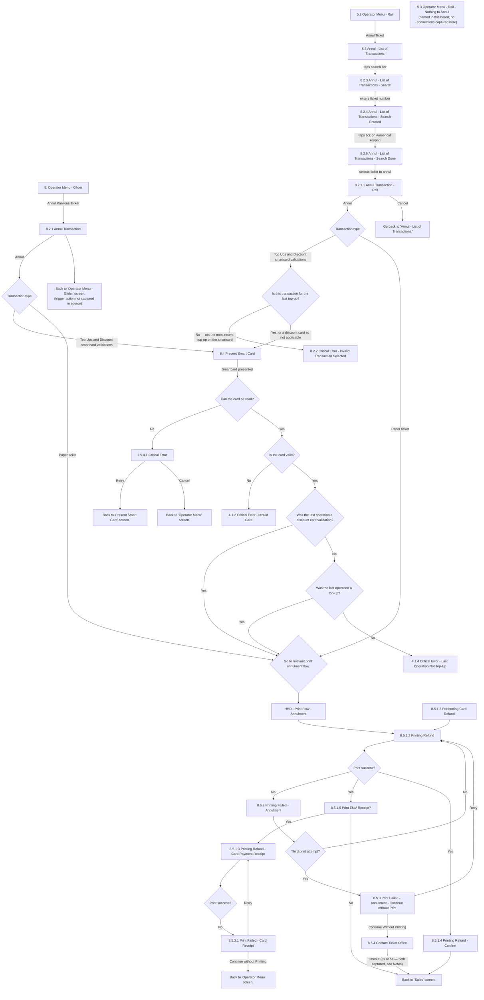

# Flow: Translink HHD — Operator Menu: Annulment

- Source: `knowledge/flows/translink-hhd-full-transcription-v17.3.7.md`, board "5. Operator Menu
  Functionality" — the Annulment portion only. Transcribed/structured 2026-08-05. Raw transcription
  itself was via the Claude Chrome extension, from Overflow (TFTS HHD v17.3.7).
- Project: translink   Device: HHD   Feature: annulment / transaction reversal
- Split note: highest financial-risk sub-flow of the "5. Operator Menu Functionality" board — split
  out from the rest (sign off, break mode, totals, mini statement, message/word of the day, penalty
  fare, device pointers), which is covered in `translink-hhd-operator-menu-options.md`. Same split
  precedent as ETM's Driver Menu board and POS's Operator Menu board (see that file's Split note).
- Transcription confidence: **high** for the screens/decisions/connections present in the source;
  **medium** on several points where the flattened connection list conflates what may be
  contextually-different instances of the same-named decision (e.g. "Print success?", "Transaction
  type") — flagged individually below rather than resolved by guesswork.

## Diagram

## Paths (each = one candidate scenario)
| # | Path | Feature | Tags | Covered by |
|---|---|---|---|---|
| 1 | Operator Menu (Glider) → Annul Previous Ticket → Annul Transaction → Annul → Transaction type = Top Ups/Discount smartcard → Present Smart Card | annulment | @destructive | C4103838, C4103839, C4104008 |
| 2 | Annul Transaction (Glider) → back to Operator Menu - Glider (return trigger not captured) | annulment | — | 4105220 |
| 3 | Operator Menu (Rail) → Annul Ticket → List of Transactions → search bar → enter ticket number → tick → Search Done → select ticket → Annul Transaction - Rail | annulment | @destructive | 4105221 |
| 4 | Annul Transaction - Rail → Cancel → back to Annul - List of Transactions | annulment | — | 4105222 |
| 5 | Annul Transaction - Rail → Annul → Transaction type = Top Ups/Discount → Is this transaction for the last top-up? → **No** → Critical Error - Invalid Transaction Selected | annulment | @destructive | 4105223 |
| 6 | Is this transaction for the last top-up? → **Yes, or discount card (N/A)** → Present Smart Card | annulment | @destructive | C4103838, C4103839 |
| 7 | Transaction type = Paper ticket (either Glider or Rail entry) → straight to relevant print annulment flow, no card presentment | annulment | @destructive | C4103836, C4103837 |
| 8 | Present Smart Card (annulment) → smartcard presented → card **cannot be read** → Critical Error → Retry → back to Present Smart Card | annulment | @destructive | 4105224 |
| 9 | Critical Error (card unreadable) → Cancel → back to Operator Menu | annulment | @destructive | 4105225 |
| 10 | Card read OK → card **invalid** → Critical Error - Invalid Card | annulment | @destructive | 4105226 |
| 11 | Card valid → was last operation a discount card validation? → **Yes** → relevant print annulment flow | annulment | @destructive | 4105227 |
| 12 | → **No** → was last operation a top-up? → **Yes** → relevant print annulment flow | annulment | @destructive | 4105228 |
| 13 | → **No** → Critical Error - Last Operation Not Top-Up | annulment | @destructive | 4105229 |
| 14 | Print annulment flow → Printing Refund → print success → **Yes** → Print EMV Receipt? → **Yes** → Printing Refund - Card Payment Receipt → print success → **No** → Print Failed - Card Receipt → Continue without Printing → back to Operator Menu | annulment | @destructive | 4105230 |
| 15 | Print Failed - Card Receipt → Retry → back to Printing Refund - Card Payment Receipt | annulment | @destructive | 4105231 |
| 16 | Print EMV Receipt? → **No** → back to Sales screen | annulment | @destructive | 4105232 |
| 17 | Printing Refund → print success → **Yes** → Printing Refund - Confirm → back to Sales screen | annulment | @destructive | 4105233 |
| 18 | Printing Refund → print success → **No** → Printing Failed - Annulment → Third print attempt? → **No** → retry Printing Refund | annulment | @destructive | 4105234 |
| 19 | Printing Failed - Annulment → Third print attempt? → **Yes** → Print Failed - Annulment - Continue without Print → Continue Without Printing → Contact Ticket Office → timeout → back to Sales screen | annulment | @destructive | 4105235 |
| 20 | Print Failed - Annulment - Continue without Print → Retry → back to Printing Refund | annulment | @destructive | 4105236 |
| 21 | Performing Card Refund → Printing Refund (card-refund entry point into the shared print flow) | annulment | @destructive | 4105237 |

## Screen states (Given/Then anchors)
- **Annulment eligibility rules** (verbatim annotations, grouped under "Annulment Rules"):
  - Glider — Top up: "Any top up ticket can be annulled, provided it is done before validation of the
    card and within 60 minutes."
  - Glider — Paper Tickets: "Can annul only last ticket within 60 secs."
  - Rail — Top up: "Any ticket can be annulled within the last 60 minutes."
  - Rail — Paper Tickets: "Any ticket can be annulled, provided it is done before validation of the
    card and within the last 60 minutes."
  - Concessionary cards / discount cards: "Can annul only last ticket within 60 secs." Note: "Once a
    card is validated you cannot annul any ticket on that card."
  - (The source groups these under "Product" headings "Glider" and "Rail" crossed with "Top up" /
    "Paper Tickets" / "Concessionary cards, discount cards" — transcribed verbatim above; do not
    infer additional rules not stated.)
- **Smartcard must be presented for every smartcard write**, per annotation: "The smartcard needs to
  be presented for every transaction done with the smartcard i.e. every write to a smartcard needs
  the smartcard to be presented whether be it annulling a transaction or topping up. The same applies
  for concession cards."
- **Rail annulment is looked up by ticket number via search**, not "last transaction only" like
  Glider's quick-annul — and additionally gates top-ups on "is this the most recent top-up?" per
  annotation: "This screen will show if the transaction selected is a top-up, but not the most recent
  top-up; only the most recent top-up on a smartcard can be annulled, not one before, in case the
  smartcard has been used since an earlier top-up."
- **Empty search results**: annotation states "If the user types a number that doesn't exist, the
  results will be empty" — no distinct "no results" screen name is given in this board; presumed to
  be an empty-state of "8.2.5 Annul - List of Transactions - Search Done" but not confirmed (see
  Notes).
- **Unsuccessful annulment prints route to a dedicated continue-without-print screen** (verbatim,
  stated twice): "Unsuccessful prints will now take user to 'Print Failed - Annulment - Continue
  without Print'."

## Notes / unknowns
- TODO: confirm "5.3 Operator Menu - Rail - Nothing to Annul" — named in this board's Screens list
  but has **no connections captured within this board**. A connection into a different screen
  ("24.1 - Barcode Reference Entry - Field Tapped") exists from this same screen name but is recorded
  under board "7. Barcode and mLink Scan", not here — do not assume that cross-board edge is part of
  the Operator Menu's own annulment flow without confirming.
- TODO: confirm the exact trigger for "8.2.1 Annul Transaction" → "Back to 'Operator Menu - Glider'
  screen." — the source records this edge with no bracketed action text (unlike almost every other
  edge in this board), so the user action that fires it (Cancel? Back button?) is not captured.
- TODO: confirm whether the two "Print success?" decisions that follow "8.5.1.2 Printing Refund" are
  genuinely **one shared decision with two valid Yes-outcomes** (→ "8.5.1.5 Print EMV Receipt?" *and*
  → "8.5.1.4 Printing Refund - Confirm") or **two distinct decisions** (e.g. one for a card-refund
  context, one for a cash-refund context) that the flattened transcription export conflated into the
  same label — same class of ambiguity flagged in `translink-pos-operator-annulment.md` for its
  "Annulment successful?"/Error screen reuse. Do not assume which predecessor pairs with which
  outcome.
- TODO: confirm the discrepancy on "8.5.4 Contact Ticket Office" → back to Sales screen — the source
  records this timeout as **3 seconds** in one place and **5 seconds** in another for what appears to
  be the same edge. Flag to the engineer as a possible spec/transcription inconsistency rather than
  picking one value.
- TODO: confirm the duplicate use of node label "8.5.1.3" for two different screens in this board —
  "8.5.1.3 Performing Card Refund" and "8.5.1.3 Printing Refund - Card Payment Receipt" — verbatim
  from the source; likely a numbering slip in Overflow, not something to silently correct.
- The annotations "Cash Print Flow - Annulment" and "Card Print Flow - Annulment" exist in this
  board's Annotations list, implying two named sub-flows through the shared print/refund screens, but
  no explicit connection lines separate them — the diagram above shows the flattened, single set of
  print-flow screens/decisions as captured, not a resolved cash/card split.
- "2.5.4.1 Critical Error", "4.1.2 Critical Error - Invalid Card", and "4.1.4 Critical Error - Last
  Operation Not Top-Up" are shared critical-error screens also referenced (by number, `4.1.x`) from
  the Mini Statement sub-flow in `translink-hhd-operator-menu-options.md` — this file only shows their
  role within the card-based annulment path (via "8.4 Present Smart Card"); whether they are literally
  the same shared screen instances or visually-identical duplicates is not disambiguated by the
  source.
