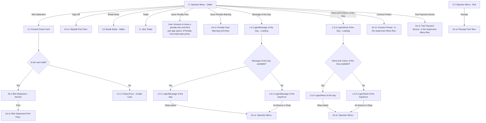

# Flow: Translink HHD — Operator Menu: Options (everything except Annulment)

- Source: `knowledge/flows/translink-hhd-full-transcription-v17.3.7.md`, board "5. Operator Menu
  Functionality" — everything except Annulment. Transcribed/structured 2026-08-05. Raw transcription
  itself was via the Claude Chrome extension, from Overflow (TFTS HHD v17.3.7).
- Project: translink   Device: HHD   Feature: operator menu (sign off, break mode, totals, mini
  statement, message/word & colour of the day, penalty fare, connect printer/pair payment device
  pointers)
- Split note: see `translink-hhd-operator-menu-annulment.md` for the annulment sub-flow (Annul
  Previous Ticket via Glider, Annul Ticket / List of Transactions via Rail, the shared print/refund
  flow, Contact Ticket Office) — split out from this file the same way ETM's Driver Menu board
  (`translink-etm-driver-menu-options.md` / `-annulment.md`) and POS's Operator Menu board
  (`translink-pos-operator-menu.md` / `translink-pos-operator-annulment.md`) were each split.
- Transcription confidence: **high** for screens/connections present in the source; **medium** where
  a screen is named in this board's Screens list but has no connections captured within it (see
  Notes) — those are flagged, not guessed at.

## Diagram

## Paths (each = one candidate scenario)
| # | Path | Feature | Tags | Covered by |
|---|---|---|---|---|
| 1 | Operator Menu (Glider) → Mini Statement → Present Smart Card → card **valid** → Mini Statement - Shorter → Print → Mini Statement Print Flow | operator-menu | — | 4103917 |
| 2 | Present Smart Card (Mini Statement) → card **invalid** → Critical Error - Invalid Card | operator-menu | @destructive | 4105238 |
| 3 | Operator Menu (Glider) → Sign Off → Waybill Print Flow | operator-menu | @destructive | FRAGMENTED — see consolidation-audit.md |
| 4 | Operator Menu (Glider) → Break Mode → Break Mode - Glider | operator-menu | @destructive | 4103919, 4104747, 4104748 |
| 5 | Operator Menu (Glider) → Totals → View Totals | operator-menu | — | 4103916 |
| 6 | Operator Menu (Glider) → Issue Penalty Fare → third-party app opens, Penalty Fare ticket prints | operator-menu | — | 4103895 |
| 7 | Operator Menu (Glider) → Issue Penalty Warning → Penalty Fare Warning print flow | operator-menu | — | 4103893, 4103921 |
| 8 | Operator Menu (Glider) → Message of the Day → **available** → shown → Okay → Operator Menu | operator-menu | — | 4103906 |
| 9 | Message of the Day → **unavailable** → Error → 3s timeout or Okay → Operator Menu | operator-menu | @destructive | 4103906 |
| 10 | Operator Menu (Glider) → Word and Colours of the Day → **available** → shown → Okay → Operator Menu | operator-menu | — | 4103906 |
| 11 | Word and Colour of the Day → **unavailable** → Error → 3s timeout or Okay → Operator Menu | operator-menu | @destructive | 4103906 |
| 12 | Operator Menu (Glider) → Connect Printer → Supervisor Menu flow | operator-menu | — | STALE — 4103922 |
| 13 | Operator Menu (Glider) → Pair Payment Device → Supervisor Menu flow | operator-menu | — | 4103929 |
| 14 | Operator Menu (Rail) → Receipt → Receipt Print flow | operator-menu | — | 4008 |

## Screen states (Given/Then anchors)
- **Operator Menu has two mode-specific entry screens** captured in this board: "5. Operator Menu -
  Glider" (most options wired here) and "5.2 Operator Menu - Rail" (only the "Receipt" action is
  wired to it within this board; the Rail menu's Annul action is covered in
  `translink-hhd-operator-menu-annulment.md`).
- **Mini Statement re-uses the "Is the card valid?" decision pattern** seen elsewhere in the suite
  (e.g. ETM Supervisor's print-success pattern) — smartcard must be presented and read as valid
  before the shorter mini-statement view is shown.
- **Word and Colour of the Day is currently gated** (verbatim annotation): "Word and Colour of the
  Day from the Operator Menu will not be available until after R1.1 Go Live." — treat any live test
  of this path as subject to that release gate.
- **Message of the Day / Word of the Day availability-check pattern is identical** to the equivalent
  flow on other Translink devices (POS's Operator Information sub-menu) — a Loading screen, an
  "available?" decision, and matching success/error screens that both return to the Operator Menu
  either on user action ("Okay") or a 3-second timeout.

## Notes / unknowns
- TODO: confirm "6. Break Mode" and "6.1 Break Mode - NIR" — both are named in this board's Screens
  list, but the only connection captured **within this board** is "5. Operator Menu - Glider" →
  "6.2 Break Mode - Glider" [Break Mode]. "6.1 Break Mode - NIR" is instead wired from the separate
  "10. Panic Mode Function" board — its relationship to the Operator Menu's own Break Mode option (a
  Glider vs. NIR/rail-mode variant?) is not stated here; do not assume equivalence.
- TODO: confirm "26. Mini Statement" (the non-"Shorter" screen) — named in this board's Screens list,
  but only "26.1 Mini Statement - Shorter" has a captured connection (reached via card-valid from
  "4.1 Present Smart Card"). Unclear whether/when the full "26. Mini Statement" screen is reached from
  this board, or whether it belongs to a different entry point not captured here.
- GAP: no annotation or decision in this board states what "Mini Statement Print Flow" actually
  prints or where the operator lands afterwards.
- "Connect Printer" and "Pair Payment Device" both point into the Supervisor Menu flow, and "Sign
  Off" points into the Waybill Print Flow, and "Issue Penalty Fare" / "Issue Penalty Warning" point
  into a third-party app / Penalty Fare Warning print flow — none of these are detailed within board
  5 itself; they are cross-references only, not to be treated as fully specified here.
