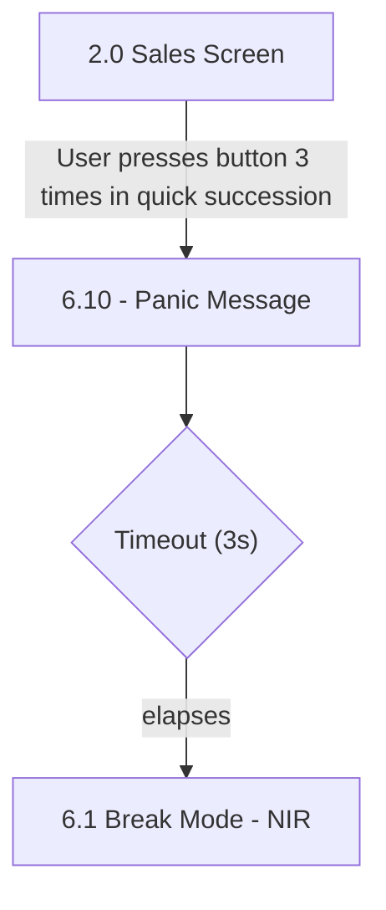

# Flow: Translink HHD — Panic Mode Function

- Source: knowledge/flows/translink-hhd-full-transcription-v17.3.7.md (Overflow project
  "TFTS HHD V17.3.7", https://overflow.io/s/XP0NLVZZ/), board "10. 10. Panic Mode Function".
  Transcribed via the Claude Chrome extension. Structured 2026-08-05.
- Project: translink   Device: HHD   Feature: panic mode (covert alert to backoffice)
- Transcription confidence: **high** — verbatim, not summarized. Board is small (3 screens, 1
  decision, 1 annotation, 3 connections).

## Diagram

## Paths (each path = one candidate scenario)
| # | Path | Feature | Tags | Covered by |
|---|------|---------|------|------------|
| 1 | Sales Screen → press button 3x in quick succession → Panic Message shown, operator functions disabled, alert sent to backoffice (Event Code 1127) → 3s timeout → transitions to Break Mode - NIR | panic-mode | @destructive | 4104001 |

## Screen states (Given/Then anchors)
- **2.0 Sales Screen** — entry point; no panic-mode-specific detail transcribed beyond it being the
  screen the trigger is pressed from.
- **6.10 - Panic Message** — reached only via the 3x-quick-press trigger. Device disables operator
  software functions temporarily while displaying a status message indicating an alert is being
  sent to the backoffice (Event Code 1127).
- **6.1 Break Mode - NIR** — landing screen after the panic message's 3-second timeout elapses.

## Notes / unknowns
- TODO: confirm what "the button" is (a specific physical/hardware key, not named in this board) —
  the trigger annotation only says "User presses button 3 times in quick succession."
- TODO: confirm whether Panic Mode can be triggered from screens other than "2.0 Sales Screen" — this
  board only shows the one entry connection.
- TODO: confirm there is no operator-visible cancel/dismiss path out of "6.10 - Panic Message" other
  than the 3s timeout — none is transcribed in this board's connections.
- TODO: confirm Event Code 1127's exact backoffice/BOS audit-event payload/name — the annotation
  states the code but not the event schema.
- No branching found on the "Timeout (3s)" decision point — only one outgoing connection (to Break
  Mode - NIR) is transcribed, so there is no alternate/false path to report.
