# Flow: Translink HHD — Sales Mode: Navigation, Product Selection & Basket

- Source: Overflow project "TFTS HHD V17.3.7" (https://overflow.io/s/XP0NLVZZ/), board "4. Sales
  Mode". Transcribed verbatim via the Claude Chrome extension, 2026-08-05. Raw source:
  `knowledge/flows/translink-hhd-full-transcription-v17.3.7.md`.
- Project: translink   Device: HHD   Feature: sales mode — boarding/alighting stage selection,
  ticket/product selection, basket management, advanced/three-day ticket booking, paper ticket
  inspect.
- Transcription confidence: **medium** — verbatim, but the "4. Sales Mode" board is very large (152
  screens / 121 decisions / 242 connections) and was split by sub-area; some edges into/out of this
  sub-area reference screens covered by the sibling files below. See "Notes / unknowns".
- **Split note**: board "4. Sales Mode" bundles several genuinely distinct feature areas (mirroring
  how ETM's "FLU" board was split). Split into:
  - `translink-hhd-sales-mode-navigation.md` (this file) — stage selection, product/basket, advanced
    ticket, three-day travel.
  - `translink-hhd-sales-mode-payment.md` — cash/card payment area, card reader connect/reconnect,
    Chip & PIN/contactless, decline/void, currency switch.
  - `translink-hhd-sales-mode-printing.md` — all printing sub-flows (ticket/receipt/waybill/mini
    statement/barcode) and their shared print-failed/retry/annul behaviour.
  - `translink-hhd-sales-mode-smartcard-rail.md` — Rail Discount/Concessionary smartcard sales.
  - `translink-hhd-sales-mode-smartcard-topup.md` — Glider & Rail smartcard top-up.

## Diagram

```mermaid
flowchart TD
  SALES[2.0 Sales Screen]

  SALES -->|tap Boarding Stage| BOARD[2.0.7 Select Boarding - List - HHD Screen Size]
  SALES -->|tap Alighting Stage| ALIGHT[2.0.2 Select Alighting - List - HHD Screen Size]
  SALES -->|tap Boarding Number| BOARDNUM[2.0.9 Select Boarding - List - Numerical Search]

  ALIGHT -->|tap Search bar| ALIGHTSEARCH[2.0.3 Select Alighting - List - Search Tapped]
  ALIGHTSEARCH -->|enter stage name incorrectly + tick| ALIGHTNOMATCH[2.0.8 Select Alighting - List - Search Tapped - Search Entered - No Matches]
  ALIGHTNOMATCH -->|clear search, type new search, tick| ALIGHTFOUND[2.0.4 Select Alighting - List - Search Tapped - Search Entered]
  ALIGHTFOUND --> BACKSALES1(("Once stage is selected, back to 'Sales' screen."))

  BOARDNUM -->|enter number| BOARDNUMENT[2.0.9.1 Select Boarding - List - Number Entered]
  BOARDNUMENT -->|tick pressed| BOARDNUMTICK[2.0.9.2 Select Boarding - List - Number Entered - Tick Pressed]
  BOARDNUMTICK --> BACKSALES1

  SALES -->|tap 'Add to Basket' icon| ADDBASKET[2.2 Add To Basket]
  ADDBASKET -->|tap 'Add to Basket' icon to add another| ADDANOTHER[2.2.1 Add Another to Basket]
  ADDANOTHER -->|tap basket icon| BASKET[2.3 Items in Basket]

  BASKET -->|swipe right on basket item| EDITDUP[2.3.1 Basket Functionality - EditDuplicate]
  EDITDUP -->|tap 'Duplicate'| DUPLICATED[2.3.1.2 Item in Basket Duplicated]
  EDITDUP -->|tap 'Edit'| BASKETEDIT[2.3.1.1 Basket - Edit]
  BASKETEDIT -->|tap 'Single'| SELECTPROD[22 - Sales - Select Product]
  SELECTPROD -->|tap 'Adult Return'| LINEEDITED[2.3.1.1.1 Basket - Line Edited]
  LINEEDITED -->|tap 'Confirm Edit'| BASKET

  BASKET -->|swipe left on basket item| BASKETDELETE[2.3.2 Basket Functionality - Delete]
  BASKETDELETE -->|tap 'Delete'| ISSUETICKET[2.1 Issue Ticket]

  BASKET -->|tap 'Pay'| PAYAREA["2.4 Payment Area (see sales-mode-payment.md)"]

  SALES -->|tap '1 Adult'| EDITPAXRAIL[2.8.1 Tabbed Navigation - Tickets - Edit Passengers - Rail]
  EDITPAXRAIL -->|tap 'Family'| FAMFRIEND[22.5 - Sales - Family & Friends Selected]
  FAMFRIEND -->|tap 'Family & Friends'| SELECTPRODRAIL[22.6 - Sales - Select Product - Rail]

  SALES -->|tap '1 Adult'| EDITPAXGLIDER[2.8.2 Tabbed Navigation - Tickets - Edit Passengers Glider]
  EDITPAXGLIDER -->|tap '-' Adult / '+' Child| EDITPAXGLIDER1[2.8.2.2 Tabbed Navigation - Tickets - Edit Passengers - 1 Selected Glider]
  EDITPAXGLIDER1 -->|tap 'Confirm'| CHILDSEL[22.5 - Sales - Child Selected Glider]

  SALES -->|tap 'Single'| SELECTPRODGLIDER[22 - Sales - Select Product - Glider]
  SELECTPRODGLIDER -->|tap 'Adult Return'| DIFFTICKET[2.0.10 Sales Screen - Different Ticket Type Selected]

  SALES -->|swipe from right inwards on action bar| PAPERINSPECT[2.0.12 Sales Screen - Paper Ticket Inspect]
  PAPERINSPECT -->|Back Office notified| PAPERINSPECTCONF[2.0.13 Sales Screen - Paper Ticket Inspect - Confirmed]
  PAPERINSPECTCONF -->|banner fades| BACKSALES2(("back to 'Sales' screen"))

  BOARDALIGHT_ERR[2.0.14 Error - No Valid Tickets Available] -->|3s timeout| BOARDALIGHT_ERR2[2.0.14.1 Error - No Valid Tickets - Sales]

  BASKETFULL[2.5 Basket Full]

  DEC3DAY{"From Sales screen user selects 'Three-Day Travel' in the Ticket Type list..."} --> THREEDAY1[22.1 - Sales - 3 Day Travel Chosen]
  THREEDAY1 -->|tap Saturday 31st| THREEDAY2[22.2 - Sales - 3 Day Travel Chosen - First Date Chosen]
  THREEDAY2 -->|tap Wednesday 4th| THREEDAY3[22.3 - Sales - 3 Day Travel Chosen - First & Second Dates Chosen]
  THREEDAY3 -->|tap Friday 6th| THREEDAY4[22.4 - Sales - 3 Day Travel Chosen - Third Date Chosen]
  THREEDAY4 -->|tap 'Cancel'| BACKSALES3(("Back to 'Sales' screen."))
  THREEDAY4 -->|tap 'Continue'| BACKSALESPROD(("Back to 'Sales' with Three-Day Product selected and price displayed."))
  BACKSALESPROD -->|item added to basket| THREEDATES[2.3.0.1 Items in Basket - 3 Dates]

  ISSUEADVTICKET[2.1.1 Issue Ticket - Advanced Ticket] -->|swipe on calendar| CAL2[2.1.1.1 Issue Ticket - Advanced Ticket - Calendar 2]
  CAL2 -->|choose date, swipe up/down| CAL3[2.1.1.2 Issue Ticket - Advanced Ticket - Calendar 3]
  CAL3 -->|tap 'Confirm'| ISSUEADVTICKET2[2.1.3 Issue Advanced Ticket]
  ISSUEADVTICKET2 -->|tap 'Add More to Basket'| ARYS1[2.1.4 Issue Advanced Ticket - Are you sure?]
  ISSUEADVTICKET2 -->|attempts to duplicate a product| ARYS2[2.1.5 Issue Advanced Ticket - Are you sure?]
  ISSUEADVTICKET2 -->|attempts to edit a product| ARYS3[2.1.6 Issue Advanced Ticket - Are you sure?]

  CURRSWITCH[2.0.5 Sales Screen - Currency Switch Available] --> TABCURR["2.7 Tabbed Navigation - Tickets - Currency Switch (see sales-mode-payment.md)"]
```

## Paths (each path = one candidate scenario)
| # | Path | Feature | Tags | Covered by |
|---|------|---------|------|------------|
| 1 | Sales Screen → tap Boarding Stage → HHD Screen Size list → stage selected → back to Sales | navigation | — | C4103851, C4104701 |
| 2 | Sales Screen → tap Alighting Stage → Search tapped → enter incorrect name → No Matches → clear + retype → found → back to Sales | navigation | — | 4105239 |
| 3 | Sales Screen → tap Boarding Number → Numerical Search → number entered → tick pressed → back to Sales | navigation | — | FRAGMENTED — see consolidation-audit.md |
| 4 | Add to Basket → Add Another to Basket → Items in Basket | basket | — | C4103862 |
| 5 | Items in Basket → swipe right → EditDuplicate → Duplicate → Item Duplicated | basket | — | 4105246 |
| 6 | Items in Basket → swipe right → EditDuplicate → Edit → Select Product → Line Edited → Confirm Edit → back to basket | basket | — | C4103864 |
| 7 | Items in Basket → swipe left → Basket Functionality - Delete → Delete → Issue Ticket | basket | @destructive | C4103865 |
| 8 | Items in Basket → Pay → Payment Area (continues in sales-mode-payment.md) | basket | — | C4103867 |
| 9 | Sales Screen → tap '1 Adult' (Rail) → Edit Passengers - Rail → Family → Family & Friends Selected → Select Product - Rail | ticket-type | — | 4105240 |
| 10 | Sales Screen → tap '1 Adult' (Glider) → Edit Passengers Glider → -Adult/+Child → 1 Selected Glider → Confirm → Child Selected Glider | ticket-type | — | 4105241 |
| 11 | Sales Screen → tap 'Single' (Glider) → Select Product - Glider → Adult Return → Different Ticket Type Selected | ticket-type | — | 4105242 |
| 12 | Sales Screen → swipe action bar right-to-in → Paper Ticket Inspect → confirmed → banner fades → back to Sales | inspection | — | STALE — C4103870 |
| 13 | Boarding/Alighting combination has no valid ticket → No Valid Tickets Available → 3s timeout → No Valid Tickets - Sales (Boarding/Alighting retained, Ticket/Passenger Type disabled) | error-handling | @destructive | 4105243 |
| 14 | Basket full (9 lines) + operator adds a favourite → Basket Full screen → 3s timeout or 'Back to Basket' | basket | @destructive | 4105247 |
| 15 | Sales → select 'Three-Day Travel' → 3 Day Travel Chosen → pick 1st/2nd/3rd date in sequence → Continue → back to Sales with product selected → add to basket → Items in Basket - 3 Dates | advanced-ticket | — | C4103858, C4104708 |
| 16 | Three-Day Travel date flow → Cancel at any point → back to Sales screen | advanced-ticket | @destructive | 4105244 |
| 17 | Issue Ticket - Advanced Ticket → swipe calendar → Calendar 2 → choose date → Calendar 3 → Confirm → Issue Advanced Ticket | advanced-ticket | — | C4103855, C4104702 |
| 18 | Issue Advanced Ticket → attempt to add more / duplicate / edit a product → "Are you sure?" | advanced-ticket | @destructive | 4105245 |

## Screen states (Given/Then anchors)
- **2.0 Sales Screen** — entry point for all product selection, basket, smartcard, and inspect
  actions. Supports swipe gestures to cycle Boarding & Alighting Stages, Passenger Type and Ticket
  Type (e.g. swipe '1 Adult' → '1 Child'). On Glider, Passenger Type cannot be swiped; on Rail,
  Ticket Type cannot be swiped.
- **2.0.14 Error - No Valid Tickets Available** — shown if the chosen Boarding+Alighting combination
  has no valid ticket; 3s timeout to `2.0.14.1`, with the invalid stage pair retained and Ticket
  Type/Passenger Type controls disabled.
- **2.5 Basket Full** — only shown when the operator adds a *favourite* to a full basket (9 ticket
  lines). Adding via the normal Sales screen instead greys out the Add-to-Basket button. 3s timeout
  or 'Back to Basket' dismisses it.
- **22.1–22.4 3 Day Travel Chosen** — user picks a day within 4 days of today, then the remaining two
  days within 7 days of the first date chosen. Editing the first date after picking any date resets
  the flow back to `22.1`. Tap to select a date, tap again to deselect.
- **2.1.1 Issue Ticket - Advanced Ticket** — only available if enabled via CloudFare-set parameters;
  only one product may be chosen, and only one advanced ticket can be in the basket at a time.
- **2.0.10 Sales Screen - Different Ticket Type Selected** — reached after choosing a different
  product from `22 - Sales - Select Product - Glider`.

## Notes / unknowns
- **Cross-border (XB) station filtering**: when XB stations are set, only XB ticket types are
  selectable (not local), and vice versa for local stations — this constrains the Select Product
  screens above but no distinct screen/decision node was captured for it in the transcription.
- **Cash-button shortcut annotation** (captured under Sales Mode but belongs conceptually to
  payment): "The operator can press cash without entering amount given; if amount given is entered,
  HHD calculates change; £5/£10/£20 buttons work for sub-£20 transactions without pressing Cash." —
  see `translink-hhd-sales-mode-payment.md` for the payment screens themselves.
- TODO: confirm the connection into/out of screen **"2.0.1 Select Alighting - List"** — it appears in
  the board's screen list but no explicit connection referencing it was captured in the transcription
  text (only `2.0.2`–`2.0.4`/`2.0.8` variants have explicit edges).
- TODO: confirm the edge from `2.3.1.1 Basket - Edit` into product selection — the transcription gives
  `2.3.1.1 Basket - Edit --[tap 'Single']--> 22 - Sales - Select Product`, but does not explicitly
  state whether this is the same `22 - Sales - Select Product` node reached from the plain Sales
  screen product flow, or a distinct basket-edit-scoped instance.
- TODO: confirm which decision routes an operator from the currency-switch action bar swipe
  (`2.0.5`/`2.7`) back into product selection vs straight to the Payment Area — only the entry edge
  into `2.7 Tabbed Navigation - Tickets - Currency Switch` was captured.
- Reprint/annulment behaviour and all "Print Success?" outcomes for tickets originating from this
  file's screens are documented once in `translink-hhd-sales-mode-printing.md` rather than repeated
  here — see that file for the shared print-failed/retry/annul chain.
