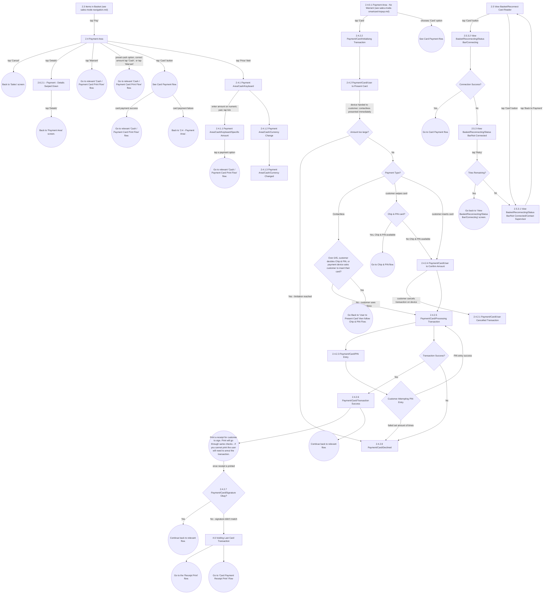

# Flow: Translink HHD — Sales Mode: Payment Area (Cash & Card)

- Source: Overflow project "TFTS HHD V17.3.7" (https://overflow.io/s/XP0NLVZZ/), board "4. Sales
  Mode". Transcribed verbatim via the Claude Chrome extension, 2026-08-05. Raw source:
  `knowledge/flows/translink-hhd-full-transcription-v17.3.7.md`.
- Project: translink   Device: HHD   Feature: sales mode — payment area (cash + card), card reader
  connect/reconnect, Chip & PIN/contactless, decline/void, currency change.
- Transcription confidence: **medium** — verbatim, but this is one of five sub-area files split out
  of the single, very large "4. Sales Mode" board. See `translink-hhd-sales-mode-navigation.md` for
  the split rationale and sibling file list.

## Diagram

## Paths (each path = one candidate scenario)
| # | Path | Feature | Tags | Covered by |
|---|------|---------|------|------------|
| 1 | Payment Area → tap 'Cancel' → back to Sales screen | payment | @destructive | 4105248 |
| 2 | Payment Area → tap 'Warrant' → relevant Cash/Card Print Flow | payment | — | C4103853, C4104710, C4104712 |
| 3 | Payment Area → tap 'Price' → Cash/Keyboard → enter amount → Specific Amount → tap payment option → print flow | payment-cash | — | C4103852 |
| 4 | Payment Area → Card → Initialising Transaction → User to Present Card → Amount too large → Declined | payment-card | @destructive | C4103808 |
| 5 | User to Present Card → Amount OK → contactless, ≤£45 → Processing Transaction → Transaction Success → Transaction Success screen | payment-card | — | C4103806, C4104668, C4103807 |
| 6 | User to Present Card → contactless, over £45 → Chip & PIN flow (redirect to User to Present Card) | payment-card | — | 4105249 |
| 7 | Payment Type: swipe card → Chip & PIN card? Yes → Chip & PIN flow | payment-card | — | 4105250 |
| 8 | Payment Type: swipe card → Chip & PIN card? No → User to Confirm Amount → Processing | payment-card | — | 4105251 |
| 9 | User to Confirm Amount → customer cancels on device → User Cancelled Transaction | payment-card | @destructive | 4105252 |
| 10 | Processing Transaction → PIN Entry → PIN entry fails set number of times → Declined | payment-card | @destructive | 4105253 |
| 11 | Processing Transaction → Transaction Success → sign receipt → Signature Okay? Yes → continue back to relevant flow | payment-card | — | C4103804, C4103805, C4104663, C4104665, C4104667 |
| 12 | Transaction Success → sign receipt → Signature Okay? No → Voiding Last Card Transaction → Receipt Print / Card Payment Receipt Print flow | payment-card | @destructive | 4105254 |
| 13 | View Basket/Reconnect Card Reader → tap 'Card' → Connecting → Connection Success? Yes → Card Payment flow | card-reader | — | 4105255 |
| 14 | Connecting → Connection Success? No → Not Connected → Retry → Tries Remaining? Yes → back to Connecting | card-reader | @destructive | 4105256 |
| 15 | Not Connected → Retry → Tries Remaining? No → Contact Supervisor → Back to Payment → View Basket/Reconnect Card Reader | card-reader | @destructive | 4105257 |
| 16 | Payment Area/Cash/Keyboard → Currency Change → Currency Changed | payment-cash | — | C4103873, C4104709, C4104710, C4104711, C4104712 |

## Screen states (Given/Then anchors)
- **2.4 Payment Area** — reached from Basket 'Pay', or from the smartcard top-up "No Warrant" screen.
  Warrant is paper-ticket-only (not top-ups), appears on Waybills, and is Rail-only.
- **2.4.1.1 Payment Area/Cash/Keyboard/Specific Amount** — operator can press 'Cash' without entering
  an amount to just issue the ticket; entering an amount makes HHD calculate change due; £5/£10/£20
  quick buttons work for sub-£20 transactions without pressing 'Cash' (HHD still calculates change).
- **Amount too large?** — sub-message "Amount too large"; 3s timeout back to Payment Area. This check
  only occurs on test transactions, not for commercial use.
- **2.4.2.5 Payment/Card/Processing Transaction** — the payment device must be woken from sleep mode
  before use.
- **2.5.3 View Basket/Reconnecting/Status Bar/Not Connected** — a reconnect attempt can be tried 3
  times before the operator is advised to contact a Supervisor or Technician.
- **Currency change** — only available on cross-border rail journeys: boarding stage 1–61 & alighting
  62–96 → currency change available, default Sterling; boarding stage 62–96 → currency change
  available, default Euro. Accessible via swipe-right on the action bar before adding to basket, or
  by tapping 'To Pay' in the Payment Area.

## Notes / unknowns
- TODO: confirm whether `2.4.1.3 Payment Area/Cash/Currency Changed` is the same screen number as
  `2.4.1.3 Payment Area/No Card Available` — both IDs appear in the raw board's screen list under the
  same "2.4.1.3" number with different titles; the transcription does not disambiguate which is
  correct or whether this is a numbering error in the source Overflow board.
- TODO: confirm the exact trigger/target for `2.4.2.2 Payment/Card/Initialising Transaction` — the
  transcription shows it reached both from `2.4.0.1 Payment Area - No Warrant` [tap 'Card'] and
  flowing on to `2.4.2 Payment/Card/User to Present Card`, but no distinct decision differentiates
  these two entries.
- "Payment card used?" decision (branches to Void / back to Sales) originates from smartcard-topup
  critical-error screens, not from this payment flow directly — see
  `translink-hhd-sales-mode-smartcard-topup.md`.
- Printing outcomes after a successful/failed cash or card payment (ticket, receipt, waybill) are
  documented once in `translink-hhd-sales-mode-printing.md`, not repeated here.
