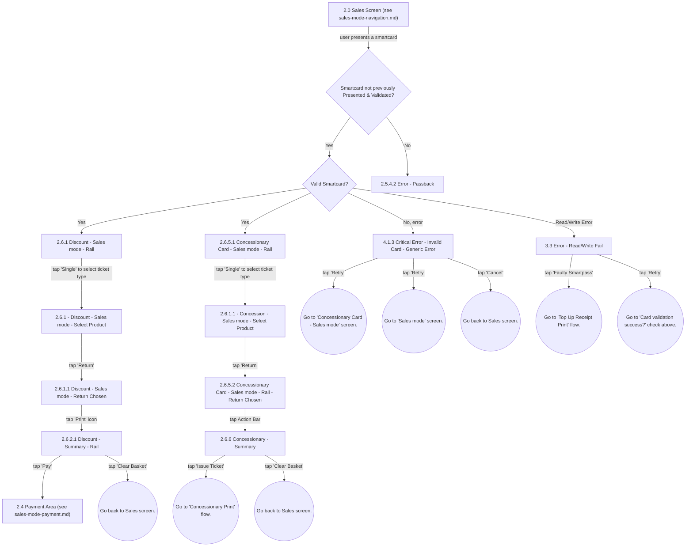

# Flow: Translink HHD — Sales Mode: Rail Discount & Concessionary Smartcard Sales

- Source: Overflow project "TFTS HHD V17.3.7" (https://overflow.io/s/XP0NLVZZ/), board "4. Sales
  Mode". Transcribed verbatim via the Claude Chrome extension, 2026-08-05. Raw source:
  `knowledge/flows/translink-hhd-full-transcription-v17.3.7.md`.
- Project: translink   Device: HHD   Feature: sales mode — Rail smartcard presentation, Discount card
  and Concessionary card sales ("HHD Rail - Smartcard Sales Mode").
- Transcription confidence: **medium** — verbatim, but several node/decision pairings here are
  ambiguous in the raw source (see Notes). One of five sub-area files split out of the "4. Sales
  Mode" board — see `translink-hhd-sales-mode-navigation.md` for the split rationale.

## Diagram

## Paths (each path = one candidate scenario)
| # | Path | Feature | Tags | Covered by |
|---|------|---------|------|------------|
| 1 | Present smartcard → not previously Presented/Validated → Valid Smartcard? Yes → Discount - Sales mode - Rail | smartcard-rail | — | 4105271 |
| 2 | Present smartcard → not previously Presented/Validated → Valid Smartcard? Yes → Concessionary Card - Sales mode - Rail | smartcard-rail | — | 4105272 |
| 3 | Discount - Sales mode - Rail → Single → Select Product → Return → Return Chosen → Print → Discount Summary → Pay | smartcard-rail | — | FRAGMENTED — see consolidation-audit.md |
| 4 | Discount Summary → Clear Basket → back to Sales | smartcard-rail | @destructive | 4105273 |
| 5 | Concessionary Card - Sales mode - Rail → Single → Select Product → Return → Return Chosen → Action Bar → Concessionary Summary → Issue Ticket → Concessionary Print flow | smartcard-rail | — | FRAGMENTED — see consolidation-audit.md |
| 6 | Concessionary Summary → Clear Basket → back to Sales | smartcard-rail | @destructive | 4105274 |
| 7 | Smartcard presented → not previously Presented/Validated → No → Error - Passback | smartcard-rail | @destructive | 4105275 |
| 8 | Smartcard presented → Valid Smartcard? No, error → Critical Error - Invalid Card - Generic Error → Retry → Concessionary Card - Sales mode / Sales mode screen | smartcard-rail | @destructive | 4105276 |
| 9 | Critical Error - Invalid Card - Generic Error → Cancel → back to Sales | smartcard-rail | @destructive | 4105277 |
| 10 | Valid Smartcard? → Read/Write Error → Error - Read/Write Fail → 'Faulty Smartpass' → Top Up Receipt Print flow | smartcard-rail | @destructive | FRAGMENTED — see consolidation-audit.md |
| 11 | Error - Read/Write Fail → Retry → back to card validation check | smartcard-rail | @destructive | 4105278 |

## Screen states (Given/Then anchors)
- **Smartcard not previously Presented & Validated?** — gate before entering the Discount/
  Concessionary flow at all; if the card was already presented+validated this session, a different
  path is taken (not captured in this board — see error/passback annotation below).
- **2.5.4.2 Error - Passback** — reached when the "not previously Presented & Validated?" check
  answers No; no further detail on this screen's own behaviour was captured on this board.
- This flow is specific to: yLink Smartcards, 24+ Smartcards, Half Fare Smartcards (5 different
  types).
- **Half Fare Smartpass naming** — all Half Fare Smartpass products display "Half Fare Smartpass",
  not the sub-product name (PIPS, Disability Living Allowance, Partially Sighted, No Driving Licence,
  Learning Disability).
- **Error messages** on invalid concessionary/discount cards can read "Not valid at this Location" or
  "Card Expired".
- **Product-eligibility rules**:
  - Dependants Pass, Senior, Blind, War Pensioner, 60+ and ROI Senior: Single is the only local-travel
    option (boarding & alighting stage both ≤61).
  - Senior, Blind, War Pensioner and ROI Senior: XB Single, XB Day Return, XB 1 Month Return for
    cross-border travel (boarding or alighting stage >61).
  - yLink and 24+ cards: Single, Return, Weekly, Monthly for local stations only (no valid XB
    products).
  - Half Fare Smartpasses: Single and Return for local stations only (no valid XB products). If
    presented above stage 61, HHD shows "Not Valid at This Location".
- **Free Concessionary audit rules (Rail)** — the alighting station chosen is recorded in the audit
  data; the fare foregone (what an Adult Single would have cost) is captured for the free
  transaction; the operator must be able to change boarding/alighting stage after presenting the
  Smartpass, as well as before. Free concession cards display £0.00 in the price field.

## Notes / unknowns
- **GAP**: `Valid Smartcard?` shows two different "Yes" targets (`2.6.1 Discount - Sales mode - Rail`
  and `2.6.5.1 Concessionary Card - Sales mode - Rail`) with no captured branch label distinguishing
  them. The annotations "Discount Card Presented" and "Concessionary Card Presented" strongly suggest
  the branch is by card type, not a generic Yes, but this was not explicitly stated as a decision
  condition in the transcription. TODO: confirm with the Overflow board directly (or with the
  engineer) which card type routes to which screen before writing a Gherkin scenario that asserts it.
- TODO: confirm the screen id collision — `2.6.1.1` is used for both "Discount - Sales mode - Return
  Chosen" and "Concession - Sales mode - Select Product" in the raw screens list. These are clearly
  two different screens; flag as a possible numbering inconsistency in the source Overflow board
  rather than assume which is authoritative.
- TODO: confirm what "Go to 'Card validation success?' check above." refers to — no decision node
  named exactly "Card validation success?" was captured among this board's Decision Points; it most
  likely refers to the `Valid Smartcard?` decision under a different label used only in this one
  connection annotation, but that is an inference, not a transcribed fact.
- The `INVALIDCARDERR` retry targets ("Concessionary Card - Sales mode" screen vs "Sales mode"
  screen) are both captured, but the raw source does not state which condition selects which retry
  target — TODO: confirm.
