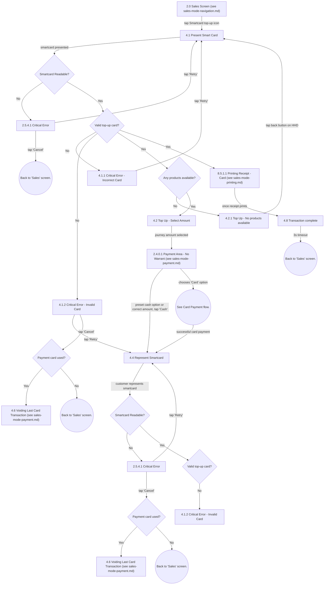

# Flow: Translink HHD — Sales Mode: Smartcard Top-Up (Glider & Rail)

- Source: Overflow project "TFTS HHD V17.3.7" (https://overflow.io/s/XP0NLVZZ/), board "4. Sales
  Mode". Transcribed verbatim via the Claude Chrome extension, 2026-08-05. Raw source:
  `knowledge/flows/translink-hhd-full-transcription-v17.3.7.md`.
- Project: translink   Device: HHD   Feature: sales mode — smartcard top-up ("HHD Glider & Rail -
  Smartcard Top Up"): present card, select amount, represent card, payment, critical errors.
- Transcription confidence: **medium** — verbatim; one of five sub-area files split out of the "4.
  Sales Mode" board — see `translink-hhd-sales-mode-navigation.md` for the split rationale.

## Diagram

## Paths (each path = one candidate scenario)
| # | Path | Feature | Tags | Covered by |
|---|------|---------|------|------------|
| 1 | Sales → Smartcard top-up icon → Present Smart Card → smartcard presented → Readable? Yes → Valid top-up card? Yes → products available? Yes → Top Up - Select Amount | topup | — | C4103879, C4103880, C4104726, C4104727, C4104728, C4104729, C4104730, C4104732, C4104733 |
| 2 | Present Smart Card → Readable? No → Critical Error → Retry → back to Present Smart Card | topup | @destructive | 4105279 |
| 3 | Present Smart Card → Readable? No → Critical Error → Cancel → back to Sales | topup | @destructive | 4105280 |
| 4 | Valid top-up card? No → Critical Error - Incorrect Card → Retry → back to Present Smart Card | topup | @destructive | C4103888 |
| 5 | Valid top-up card? No → Critical Error - Invalid Card → Retry → Represent Smartcard | topup | @destructive | 4105281 |
| 6 | Critical Error - Invalid Card → Cancel → Payment card used? Yes → Voiding Last Card Transaction | topup | @destructive | 4105282 |
| 7 | Critical Error - Invalid Card → Cancel → Payment card used? No → back to Sales | topup | @destructive | 4105283 |
| 8 | Products available? No → Top Up - No products available → back button → back to Present Smart Card | topup | @destructive | 4105284 |
| 9 | Top Up - Select Amount → journey amount selected → Payment Area - No Warrant → Cash → Represent Smartcard | topup | — | C4103879, C4103884, C4103885 |
| 10 | Payment Area - No Warrant → Card → Card Payment flow → success → Represent Smartcard | topup | — | C4104731 |
| 11 | Represent Smartcard → Readable? No → Critical Error → Retry → back to Represent Smartcard | topup | @destructive | 4105285 |
| 12 | Represent Smartcard → Readable? No → Critical Error → Cancel → Payment card used? branch | topup | @destructive | 4105286 |
| 13 | Represent Smartcard → Readable? Yes → Valid top-up card? No → Critical Error - Invalid Card | topup | @destructive | C4103887 |
| 14 | Represent Smartcard → Valid top-up card? Yes → Printing Receipt - Card → receipt prints → Transaction complete → 3s timeout → back to Sales | topup | — | C4103879, C4103892 |

## Screen states (Given/Then anchors)
- **4.2.1 Top Up - No products available** — reached when the smartcard is valid for top-up but has
  no eligible products; the HHD back button returns the operator to `4.1 Present Smart Card`.
- **4.2 Top Up - Select Amount** — if the smartcard has an expiry date set, `4.2.2 Top Up - iLink -
  Expiry Date Set` is displayed (and `4.2.2.2` for an expiry of 1 day from first use). If the
  smartcard already has a product added, only the same period type can be added. DayLink cards
  display remaining days; period cards display remaining periods. If the smartcard already has too
  many journeys, no more can be added — the minimum number of journeys a user can add is 5.
- **4.8 Transaction complete** — displays 'days left' for DayLink cards, 'journeys left' for Multi
  Journey cards; Period Passes show the new expiry date. The header reads "Card Payment Receipt" only
  if card was the payment method, otherwise "£Price Change" if applicable (this also applies to the
  underlying Transaction Complete screen used elsewhere). Printing still goes through the same checks
  as the general print flows.
- **Payment card used?** — this decision gates whether a card transaction must be voided
  (`4.6 Voiding Last Card Transaction`) when a top-up is cancelled/errors out after a card payment was
  already taken.

## Notes / unknowns
- TODO: confirm the direct edge `Valid top-up card? --[Yes]--> 8.5.1.1 Printing Receipt - Card`
  captured in the raw transcription — this appears to skip the `4.2 Top Up - Select Amount` /
  `2.4.0.1 Payment Area - No Warrant` / payment steps entirely, which is inconsistent with the rest of
  the flow (payment normally happens before a receipt prints). This may be a genuinely different,
  shorter top-up path (e.g. re-topping up a card with a stored/no-cost product) or a transcription
  artefact from the source board. Flag as `TODO: confirm` — do not assume either explanation.
- Screens `4.2.2 Top Up - iLink - Expiry Date Set` and `4.2.2.2 Top Up - iLink - Expiry 1 Day from
  first use` are present in the board's screen list and annotations but no explicit connection edges
  into/out of them were captured in the transcription text — TODO: confirm their trigger and next
  screen.
- `4.6 Voiding Last Card Transaction` and the `Payment card used?` decision are shared with the
  Payment Area's Signature-declined path (`translink-hhd-sales-mode-payment.md`) — same void screen,
  reached from two different contexts (signature mismatch vs top-up card error after card payment).
- Card payment itself (Chip & PIN / contactless / decline) during a top-up follows the same "Card
  Payment flow" documented in `translink-hhd-sales-mode-payment.md` — not repeated here.
