# Flow: Translink HHD — Supervisor / Technician Menus (entry points)

- Source: `knowledge/flows/translink-hhd-full-transcription-v17.3.7.md`, board "6. Supervisor /
  Technician Functionality" (lines 1481-1727). Transcribed 2026-08-05.
- Project: translink   Device: HHD   Feature: supervisor menu + technician menu root navigation
  (waybills, versioning entry, message/word of the day, duty toggle, sign off)
- Transcription confidence: **high** — verbatim, not summarized.
- **Split note**: board "6. Supervisor / Technician Functionality" bundles two distinct root menus
  (Supervisor Menu, Technician Mode) plus several deep sub-flows. Split into three files:
  this file (root menus + directly-owned small flows), `translink-hhd-supervisor-technician-
  peripherals.md` (Connect Printer / Pair with Payment Device — reused by both menus via "Same as
  'Supervisor Menu' flow"), and `translink-hhd-supervisor-technician-technician-setup.md`
  (Technician-exclusive: Payment Terminal, Printer Firmware, Home Location, Penalty Fare App).

## Diagram

```mermaid
flowchart TD
  SUPMENU["1.8 - Supervisor Menu"]
  TECHMENU["1.9 Technician Mode"]

  SUPMENU -->|View Waybills| WB1["11.1 View All Waybills"]
  WB1 -->|select a Waybill| WB2["11.2 View Waybill"]
  WB2 -->|Print| WBPRINT["Go to 'Waybill Print' flow (external)"]

  SUPMENU -->|Versioning| VER["12.1 View/Print Versions"]
  VER -->|print button| VERPRINT["Go to 'Versioning Print' flow (external)"]

  SUPMENU -->|Message of the Day| MOD1["1.6 Login/Message of the Day - Loading"]
  MOD1 --> MODQ{"Message of the Day available?"}
  MODQ -->|Yes| MOD2["1.6.1 Login/Message of the Day"]
  MODQ -->|No| MOD3["1.6.2 Login/Message of the Day/Error"]
  MOD2 -->|Okay| OPMENU["Go to 'Operator Menu' (external)"]
  MOD3 -->|timeout 3s or Okay| OPMENU

  SUPMENU -->|Word and Colours of the Day| WOD1["1.6.3 Login/Word of the Day - Loading"]
  WOD1 --> WODQ{"Word and Colour of the Day available?"}
  WODQ -->|Yes| WOD2["1.6.4 Login/Word of the Day"]
  WODQ -->|No| WOD3["1.6.5 Login/Word of the Day/Error"]
  WOD2 -->|Okay| OPMENU
  WOD3 -->|timeout 3s or Okay| OPMENU

  SUPMENU -->|"Start Duty (go through Duty Selection flow seen in Login flow, then Sales Screen; menu includes extra options)"| DUTY["19.1 Supervisor Menu - Signed in On Duty - Glider"]
  DUTY -->|"Break Mode / Annul Previous Ticket / Issue Penalty Fare / Issue Penalty Warning / Mini Statement / Totals"| OPMENUFUNC["See 'Operator Menu Functionality' flow (external)"]
  DUTY -->|End Duty| WBPRINT2["Go to 'Waybill Print' flow (external)"]

  SUPMENU -->|Connect Printer| PERIPH1["10 Enter MAC Address — see peripherals flow-map"]
  SUPMENU -->|Pair with Payment Device| PERIPH2["10.5 Connecting to card_reader - Connect via Bluetooth — see peripherals flow-map"]

  SUPMENU -->|Sign Off| LOGIN["Go to 'Login' flow (external)"]

  TECHMENU -->|Versioning| SAMEASSUP1["Same as 'Supervisor Menu' flow"]
  TECHMENU -->|Connect Printer| SAMEASSUP2["Same as 'Supervisor Menu' flow"]
  TECHMENU -->|"Pair with Payment Device"| SAMEASSUP3["Same as 'Supervisor Menu' flow"]
  TECHMENU -->|Payment Terminal| TS1["13.1 Payment Terminal - Blank — see technician-setup flow-map"]
  TECHMENU -->|Apply Printer Firmware| TS2["14 Printer Firmware - Applying — see technician-setup flow-map"]
  TECHMENU -->|Home Location| TS3["15 Transferring Data to Back Office — see technician-setup flow-map"]
  TECHMENU -->|Configure Penalty Fare Application| TS4["Opens third party app — see technician-setup flow-map"]
  TECHMENU -->|Sign Off| LOGIN
```

## Paths (each = one candidate scenario)
| # | Path | Feature | Tags | Covered by |
|---|---|---|---|---|
| 1 | Supervisor Menu → View Waybills → View All Waybills → select a Waybill → View Waybill → Print → Waybill Print flow | supervisor-menu | — | 4103927 |
| 2 | Supervisor Menu → Versioning → View/Print Versions → print button → Versioning Print flow | supervisor-menu | — | 4103928 |
| 3 | Supervisor Menu → Message of the Day → **available** → Message of the Day → Okay → Operator Menu | supervisor-menu | — | 4103906 |
| 4 | Supervisor Menu → Message of the Day → **not available** → Message of the Day/Error → timeout(3s)/Okay → Operator Menu | supervisor-menu | @destructive | 4103906 |
| 5 | Supervisor Menu → Word and Colours of the Day → **available** → Word of the Day → Okay → Operator Menu | supervisor-menu | — | 4103906 |
| 6 | Supervisor Menu → Word and Colours of the Day → **not available** → Word of the Day/Error → timeout(3s)/Okay → Operator Menu | supervisor-menu | @destructive | 4103906 |
| 7 | Supervisor Menu → Start Duty → Supervisor Menu - Signed in On Duty - Glider → (Break Mode / Annul Previous Ticket / Issue Penalty Fare / Issue Penalty Warning / Mini Statement / Totals) → Operator Menu Functionality flow | supervisor-menu | — | 4105287 |
| 8 | Supervisor Menu - Signed in On Duty - Glider → End Duty → Waybill Print flow | supervisor-menu | — | 4105288 |
| 9 | Supervisor Menu → Connect Printer → *(continues in peripherals flow-map)* | supervisor-menu | — | 4103936 |
| 10 | Supervisor Menu → Pair with Payment Device → *(continues in peripherals flow-map)* | supervisor-menu | — | 4103929 |
| 11 | Supervisor Menu → Sign Off → Login flow | supervisor-menu | @destructive | 4103931 |
| 12 | Technician Mode → Versioning / Connect Printer / Pair with Payment Device → delegates to "Same as 'Supervisor Menu' flow" (paths 2/9/10 above) | technician-menu | — | 4103935, 4103936 |
| 13 | Technician Mode → Payment Terminal → *(continues in technician-setup flow-map)* | technician-menu | — | 4103934 |
| 14 | Technician Mode → Apply Printer Firmware → *(continues in technician-setup flow-map)* | technician-menu | — | 4105289 |
| 15 | Technician Mode → Home Location → *(continues in technician-setup flow-map)* | technician-menu | — | 4103933 |
| 16 | Technician Mode → Configure Penalty Fare Application → *(continues in technician-setup flow-map)* | technician-menu | — | 4105290 |
| 17 | Technician Mode → Sign Off → Login flow | technician-menu | @destructive | 4103938 |

## Screen states (Given/Then anchors)
- **Supervisor Menu (1.8)** — root menu offering View Waybills, Versioning, Connect Printer, Pair
  with Payment Device, Message of the Day, Word and Colours of the Day, Start Duty, Sign Off.
- **Technician Mode (1.9)** — root menu offering Versioning, Connect Printer, Pair with Payment
  Device (all explicitly labelled in the source as "Same as 'Supervisor Menu' flow"), Payment
  Terminal, Apply Printer Firmware, Home Location, Configure Penalty Fare Application, Sign Off.
- **Message of the Day / Word of the Day availability is conditional** — each has its own
  "available?" decision; the error variant still routes to Operator Menu via the same
  timeout(3s)-or-Okay pattern as the success variant.
- **Start Duty (Glider) leads into the Operator Menu Functionality flow** (external, not detailed
  in this board) for Break Mode/Annul Previous Ticket/Issue Penalty Fare/Issue Penalty
  Warning/Mini Statement/Totals; End Duty instead routes to the Waybill Print flow.

## Notes / unknowns
- **Rail-mode screens with no captured connections**: the Screens list for this board also
  includes "19 Supervisor Menu - Signed in On Duty", "19.2 Supervisor Menu - Signed in On Duty -
  Rail", "19.3 Supervisor Menu - Signed in On Duty - Rail - Full", "11.1.1 View All Waybills -
  Rail", and "11.3 View Waybill - Rail" — but the raw transcription's Connections/Flow list for
  this board contains **no edges** to/from any of them. The Annotations section notes "Supervisor
  Menu - On Duty - Rail", "Supervisor - Rail - Waybills", and "The menu for rail will show the
  option of 'Annul Ticket' because any ticket issued on this duty can be annulled" — confirming a
  Rail-mode variant of Start Duty and Waybills exists with an extra Annul Ticket option, but the
  trigger condition (Rail vs Glider duty) and exact screen-to-screen transitions are not present in
  this board's connections. TODO: confirm the Rail-mode Start Duty / Waybills transitions and the
  Annul Ticket entry point directly in Overflow before adding paths for it.
- **"19.3 ... - Full" / "12.1 ... - Full" menu variants**: the annotation "The menu is full but
  will scroll. The screen above shows all items available." describes a full/scrolling variant of
  a menu screen but doesn't disambiguate which of the "- Full" screens it's attached to in the raw
  export. TODO: confirm which screen(s) this annotation anchors to.
- **Two orphan decision nodes**: the Decision Points list for this board includes "HHD -
  Supervisor Menu Functions" and "HHD - Technician Menu Functions" but neither appears in any
  transcribed connection (no incoming/outgoing edge). Likely artefacts of the Overflow export
  (e.g. a menu-level grouping node) rather than a real decision in the flow — not drawn in the
  diagram above since no edge exists to ground them. TODO: confirm in Overflow whether these
  represent an undrawn connection or can be disregarded.
- Peripheral connect (Connect Printer, Pair with Payment Device) and Technician-exclusive setup
  (Payment Terminal, Printer Firmware, Home Location, Penalty Fare App) are split into their own
  flow-maps — see `translink-hhd-supervisor-technician-peripherals.md` and
  `translink-hhd-supervisor-technician-technician-setup.md`.
