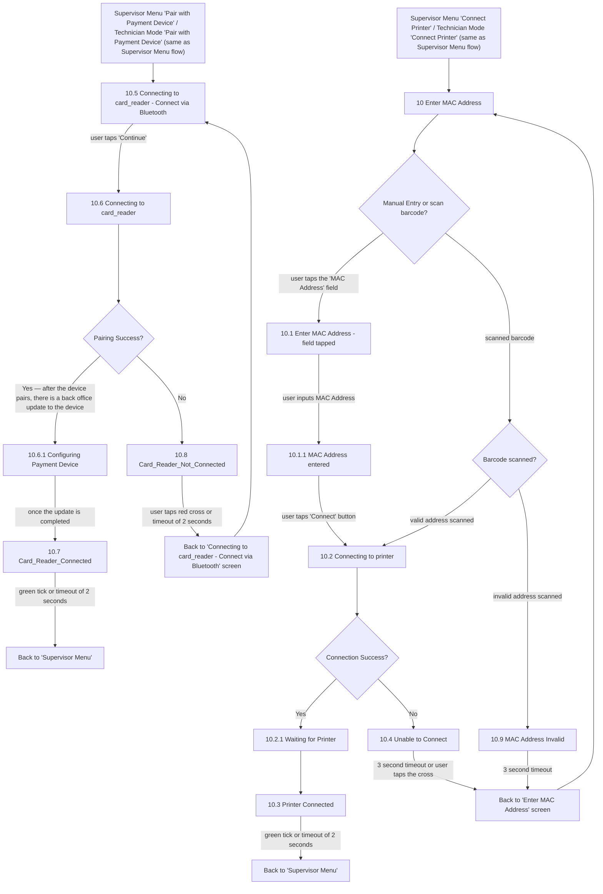

# Flow: Translink HHD — Supervisor/Technician: Peripheral Connect (Printer + Payment Device)

- Source: `knowledge/flows/translink-hhd-full-transcription-v17.3.7.md`, board "6. Supervisor /
  Technician Functionality" (lines 1481-1727). Transcribed 2026-08-05.
- Project: translink   Device: HHD   Feature: peripheral pairing (Connect Printer via MAC
  address/barcode; Pair with Payment Device via Bluetooth)
- Transcription confidence: **high** — verbatim, not summarized.
- **Split note**: part of board "6. Supervisor / Technician Functionality", split out because both
  sub-flows here are reached identically from Supervisor Menu ("Connect Printer" / "Pair with
  Payment Device") and from Technician Mode, where the source labels the same items "Same as
  'Supervisor Menu' flow" — one shared implementation, not two. See
  `translink-hhd-supervisor-technician-menus.md` for the menu entry points.

## Diagram

## Paths (each = one candidate scenario)
| # | Path | Feature | Tags | Covered by |
|---|---|---|---|---|
| 1 | Connect Printer → Enter MAC Address → Manual Entry → field tapped → MAC entered → Connect → Connecting to printer → Connection Success **Yes** → Waiting for Printer → Printer Connected → back to Supervisor Menu | peripherals | — | 4103936 |
| 2 | Connect Printer → Enter MAC Address → scan barcode → **valid address scanned** → Connecting to printer → Connection Success Yes → Waiting for Printer → Printer Connected → back to Supervisor Menu | peripherals | — | 4103936 |
| 3 | Connect Printer → Enter MAC Address → scan barcode → **invalid address scanned** → MAC Address Invalid → 3s timeout → back to Enter MAC Address | peripherals | @destructive | 4105291 |
| 4 | Connect Printer → Connecting to printer → Connection Success **No** → Unable to Connect → 3s timeout / user taps cross → back to Enter MAC Address | peripherals | @destructive | 4105292 |
| 5 | Pair with Payment Device → Connecting to card_reader - Connect via Bluetooth → Continue → Connecting to card_reader → Pairing Success **Yes** → Configuring Payment Device → update completed → Card_Reader_Connected → back to Supervisor Menu | peripherals | — | 4103800, 4103935, 4103929 |
| 6 | Pair with Payment Device → Connecting to card_reader → Pairing Success **No** → Card_Reader_Not_Connected → red cross / 2s timeout → back to Connecting to card_reader - Connect via Bluetooth | peripherals | @destructive | 4105293 |

## Screen states (Given/Then anchors)
- **Connect Printer entry is identical whether reached from Supervisor Menu or Technician Mode** —
  the source labels the Technician Mode branch "Same as 'Supervisor Menu' flow", so this is one
  implementation shared by both menus, not two.
- **Enter MAC Address (10) branches on Manual Entry vs scan barcode** — manual entry routes through
  field-tap → MAC-entered → Connect; barcode scan routes through a separate "Barcode scanned?"
  decision with its own valid/invalid outcome.
- **Pairing Success has a distinct "post-pairing back office update" step** — per the annotation:
  "Once the user taps 'Continue' and the pairing begins, the device will display a code, which
  should be the same as the Payment Device. This is a built in Android feature. The user should
  press 'Pair'. Once they press 'Pair' the 'Pairing with payment device' screen will display." A
  successful pairing then proceeds to "Configuring Payment Device" (back office update) before
  reaching "Card_Reader_Connected".
- Both flows terminate back at **Supervisor Menu** regardless of which menu (Supervisor or
  Technician) the flow was entered from — the source's Connections/Flow list only shows "Back to
  'Supervisor Menu'" as the landing decision, never an equivalent "Back to 'Technician Menu'" for
  these two peripheral flows.

## Notes / unknowns
- TODO: confirm whether the Connect Printer / Pair with Payment Device flows genuinely always
  return to the Supervisor Menu even when entered from Technician Mode (as the raw transcription's
  connections literally state), or whether this is a transcription gap and Technician Mode should
  land back on the Technician Menu instead. Not changed here — transcribed verbatim per the
  no-invention rule.
- The pairing-code annotation quoted above (Android BLE pairing confirmation code) is not
  represented as its own screen/decision node in the source — folded into the Screen states note
  above rather than inventing an intermediate screen.
