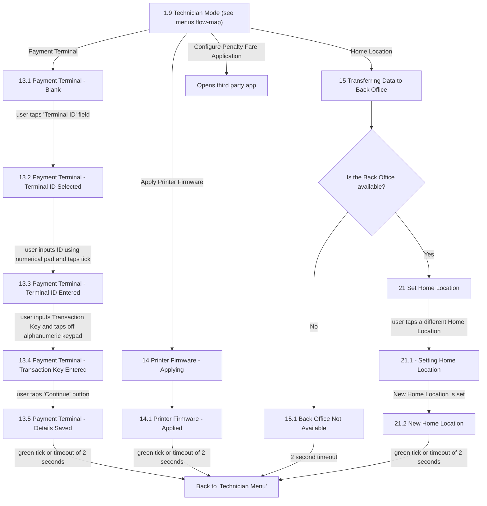

# Flow: Translink HHD — Technician-Exclusive Setup (Payment Terminal, Printer Firmware, Home Location, Penalty Fare App)

- Source: `knowledge/flows/translink-hhd-full-transcription-v17.3.7.md`, board "6. Supervisor /
  Technician Functionality" (lines 1481-1727). Transcribed 2026-08-05.
- Project: translink   Device: HHD   Feature: technician-only device setup (Payment Terminal
  configuration, Printer Firmware, Home Location / Back Office transfer, Configure Penalty Fare
  Application)
- Transcription confidence: **high** — verbatim, not summarized.
- **Split note**: part of board "6. Supervisor / Technician Functionality"; these four items are
  reached only from Technician Mode (1.9), never from Supervisor Menu — unlike Versioning/Connect
  Printer/Pair with Payment Device, which the source explicitly delegates to the Supervisor Menu
  flow. See `translink-hhd-supervisor-technician-menus.md` for the Technician Mode entry point.

## Diagram

## Paths (each = one candidate scenario)
| # | Path | Feature | Tags | Covered by |
|---|---|---|---|---|
| 1 | Technician Mode → Payment Terminal → Blank → Terminal ID field → Terminal ID Selected → input ID+tick → Terminal ID Entered → input Transaction Key → Transaction Key Entered → Continue → Details Saved → back to Technician Menu | technician-setup | — | C4103934 |
| 2 | Technician Mode → Apply Printer Firmware → Printer Firmware - Applying → Printer Firmware - Applied → back to Technician Menu | technician-setup | — | 4105294 |
| 3 | Technician Mode → Home Location → Transferring Data to Back Office → Back Office **available** → Set Home Location → select a different Home Location → Setting Home Location → new location set → New Home Location → back to Technician Menu | technician-setup | — | C4103933 |
| 4 | Technician Mode → Home Location → Transferring Data to Back Office → Back Office **not available** → Back Office Not Available → 2s timeout → back to Technician Menu | technician-setup | @destructive | 4105295 |
| 5 | Technician Mode → Configure Penalty Fare Application → opens third-party app (no further HHD screens captured) | technician-setup | — | 4105296 |

## Screen states (Given/Then anchors)
- **Payment Terminal setup is a fixed 5-step sequence** (Blank → Terminal ID Selected → Terminal ID
  Entered → Transaction Key Entered → Details Saved) with no branching captured in the source; the
  final "Details Saved" screen returns to the Technician Menu on green tick or a 2-second timeout.
- **Printer Firmware apply is a 2-step sequence** (Applying → Applied) with no failure/error branch
  captured in the source.
- **Home Location depends on Back Office availability** — "Is the Back Office available?" gates
  whether the flow proceeds to "Set Home Location" (Yes) or dead-ends at "Back Office Not
  Available" with a 2-second timeout back to the Technician Menu (No).
- **Configure Penalty Fare Application leaves the HHD app** — the only captured behaviour is the
  decision "Opens third party app"; no in-app screens follow it in this board.

## Notes / unknowns
- No error/failure branch is captured for Payment Terminal or Printer Firmware in the raw
  transcription (only the happy path through to "Back to 'Technician Menu'") — TODO: confirm with
  the requirements owner or in Overflow directly whether a failure path exists for either flow
  before treating "success only" as complete coverage.
- "Configure Penalty Fare Application" has no in-app screens beyond the decision "Opens third
  party app" in this board — TODO: confirm whether the third-party app's own screens are
  out-of-scope for this flow-map (likely, since it's a separate application) or whether there is a
  return-to-HHD screen not captured here.
