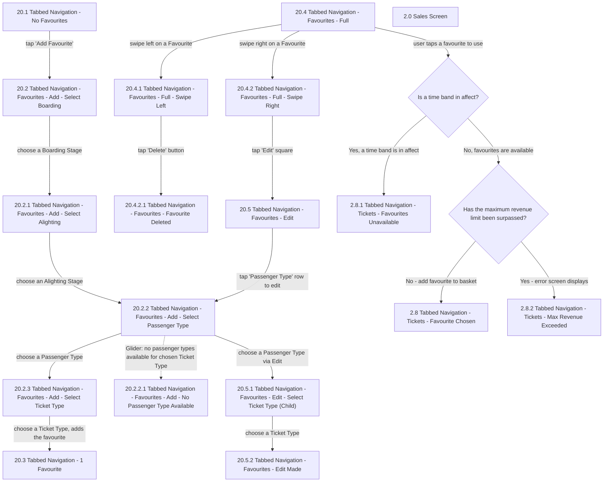

# Flow: Translink HHD — Tabbed Navigation: Favourites

- Source: `knowledge/flows/translink-hhd-full-transcription-v17.3.7.md`, board "3. Tabbed
  Navigation" (favourites add/edit/delete/purchase cluster). Transcribed/structured 2026-08-05.
- Project: translink   Device: HHD   Feature: tabbed navigation — favourites (add, edit, delete,
  purchase from favourite)
- Transcription confidence: **high** — this cluster's screens are fully connected by explicit
  edges in the raw transcription.

## Diagram

## Paths (each path = one candidate scenario)
| # | Path | Feature | Tags | Covered by |
|---|------|---------|------|------------|
| 1 | No Favourites → Add Favourite → Select Boarding → Select Alighting → Select Passenger Type → Select Ticket Type → favourite added → 1 Favourite | favourites | — | 4103918 |
| 2 | Favourites - Full → swipe right → Edit square → Favourites - Edit → tap 'Passenger Type' row → Select Passenger Type → Select Ticket Type (Child) → choose Ticket Type → Edit Made → back to Favourites | favourites | — | 4103918 |
| 3 | Favourites - Full → swipe left → tap 'Delete' → Favourite Deleted | favourites | @destructive | 4103918 |
| 4 | Favourites - Full → tap a favourite to use → time band in effect? Yes → Favourites Unavailable | favourites | @destructive | 4105297 |
| 5 | Favourites - Full → tap a favourite to use → time band in effect? No → max revenue limit surpassed? No → Favourite Chosen (added to basket) | favourites | — | 4105298 |
| 6 | Favourites - Full → tap a favourite to use → time band in effect? No → max revenue limit surpassed? Yes → Max Revenue Exceeded (error screen) | favourites | @destructive | 4105299 |
| 7 | Glider only: Select Passenger Type screen has no passenger types available for the chosen Ticket Type → No Passenger Type Available → user presses 'Back' and selects a different Ticket Type | favourites | @destructive | 4105300 |

## Screen states (Given/Then anchors)
- **20.1 Tabbed Navigation - No Favourites** — entry state with zero favourites saved.
- **20.2 Tabbed Navigation - Favourites - Add - Select Boarding** — first step of the add-favourite
  flow.
- **20.2.1 Tabbed Navigation - Favourites - Add - Select Alighting** — second step.
- **20.2.2 Tabbed Navigation - Favourites - Add - Select Passenger Type** — reused by both the Add
  flow and the Edit flow (Edit → tap 'Passenger Type' row routes back here). If the user chooses to
  edit the Passenger Type, they must also choose a Ticket Type, in case the previously selected
  Ticket Type is not available for the newly selected Passenger Type.
- **20.2.2.1 Tabbed Navigation - Favourites - Add - No Passenger Type Available** — Glider-specific.
  "Glider Favourites Flow": for Glider, the Add Favourite flow is Select Boarding → Select
  Alighting → Select Ticket Type → Select Passenger Type. If there are no passenger types available
  on Glider, this screen displays; the user must press 'Back' and select a different Ticket Type.
- **20.2.3 Tabbed Navigation - Favourites - Add - Select Ticket Type** — final add-favourite step;
  choosing a Ticket Type adds the favourite.
- **20.3 Tabbed Navigation - 1 Favourite** — state after the first favourite is added.
- **20.4 Tabbed Navigation - Favourites - Full** — favourites list state with entries present;
  supports swipe left (delete) and swipe right (edit), and tapping a favourite to purchase.
- **20.4.1 Tabbed Navigation - Favourites - Full - Swipe Left** — reveals the Delete action.
- **20.4.2 Tabbed Navigation - Favourites - Full - Swipe Right** — reveals the Edit action.
- **20.4.2.1 Tabbed Navigation - Favourites - Favourite Deleted** — confirmation after delete. There
  is a timeout of 3 seconds on this screen, after which the user is taken back to the Favourites
  screen.
- **20.5 Tabbed Navigation - Favourites - Edit** — user can Save Changes or Cancel; either button
  press returns the user to the Favourites (20.4) screen.
- **20.5.1 Tabbed Navigation - Favourites - Edit - Select Ticket Type (Child)** — Ticket Type
  selection step within the Edit flow.
- **20.5.2 Tabbed Navigation - Favourites - Edit Made** — confirmation the edit was applied.
- **2.8 Tabbed Navigation - Tickets - Favourite Chosen** — favourite added to the basket.
- **2.8.1 Tabbed Navigation - Tickets - Favourites Unavailable** — shown when a time band is in
  effect for the chosen favourite's product.
- **2.8.2 Tabbed Navigation - Tickets - Max Revenue Exceeded** — shown when the maximum revenue
  limit has been surpassed.
- **2.0 Sales Screen** — listed among this cluster's screens; no explicit connection into/out of it
  was captured within this board section (see Notes).

## Notes / unknowns
- TODO: confirm the role of "2.0 Sales Screen" in this cluster — it appears in the board's Screens
  list but the raw transcription captured no connection edge to/from it within board "3. Tabbed
  Navigation" itself (it is heavily connected elsewhere, in board "4. Sales Mode"). Shown as an
  unconnected node above rather than guessing its trigger here.
- TODO: confirm Decision Point "HHD - Tabbed Navigation" — listed among this board's Decision
  Points in the raw transcription but with no connection edges captured anywhere in the board
  section (neither this favourites cluster nor the status cluster in
  `translink-hhd-tabbed-navigation-status.md`). Not represented in either diagram pending
  confirmation.
- The raw screens list contains a duplicate entry for "20.2.2 Tabbed Navigation - Favourites - Add -
  Select Passenger Type" (listed twice) — treated as a single shared screen node here, consistent
  with it being reused by both the Add and Edit flows per the captured connections.
- This file covers only the favourites cluster of board "3. Tabbed Navigation". The status/battery/
  payment-device cluster of the same board is split out to
  `translink-hhd-tabbed-navigation-status.md` (distinct feature area, per the ETM FLU/Driver Menu
  splitting precedent).
