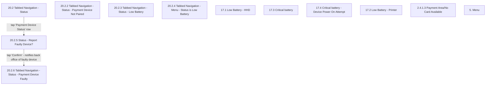

# Flow: Translink HHD — Tabbed Navigation: Status / Payment Device / Battery

- Source: `knowledge/flows/translink-hhd-full-transcription-v17.3.7.md`, board "3. Tabbed
  Navigation" (status/battery/payment-device cluster). Transcribed/structured 2026-08-05.
- Project: translink   Device: HHD   Feature: tabbed navigation — status area, battery levels,
  payment device pairing/fault
- Transcription confidence: **medium** — most screens in this cluster carry an annotation
  describing when they show, but the raw board captured only 2 explicit screen-to-screen
  connections for this cluster; the rest are standalone/isolated screen states (see Notes).

## Diagram

## Paths (each path = one candidate scenario)
| # | Path | Feature | Tags | Covered by |
|---|------|---------|------|------------|
| 1 | Tabbed Navigation - Status → tap 'Payment Device Status' row → Report Faulty Device? → Confirm → Payment Device Faulty (back office notified) | status | — | 4105301 |
| 2 | Device battery reaches Low Level → Status area updates accordingly (annotation-grounded; exact target screen among 20.2.3/20.2.4/17.1/17.2 not disambiguated by a connection) | status | — | C4103993 |
| 3 | HHD turned on while battery is critical → 17.4 Critical battery - Device Power On Attempt shown (annotation-grounded) | status | @destructive | 4105302 |
| 4 | Payment Device is faulty → card payment button removed from Payment Area (2.4.1.3) (annotation-grounded) | status | — | 4105301 |

## Screen states (Given/Then anchors)
- **20.2 Tabbed Navigation - Status** — "Additional Status Area screen"; the option to tap the
  Payment Device row is always available if the Payment Device is paired.
- **20.2.2 Tabbed Navigation - Status - Payment Device Not Paired** — status variant shown when no
  payment device is paired.
- **20.2.3 Tabbed Navigation - Status - Low Battery** — "If a device battery level reaches Low
  Level, the Status will update accordingly."
- **20.2.4 Tabbed Navigation - Menu - Status is Low Battery** — Menu-side low-battery status
  indicator; for the Menu flows themselves, see boards "5. Driver Menu Functionality" or "6.
  Supervisor/Technician Menu Functionality".
- **17.1 Low Battery - HHD** — shown on "safe screens" only — i.e. not screens where passenger
  input is required (cash, present smartcard). HHD-only screen.
- **17.2 Low Battery - Printer** — shown on "safe screens" only, same rule as above, but for the
  printer.
- **17.3 Critical battery** — cannot be shown at any point during the flow between the user
  pressing the cash button and the end of the transaction. HHD-only screen.
- **17.4 Critical battery - Device Power On Attempt** — shown if the HHD is turned on while battery
  is critical.
- **20.2.5 Status - Report Faulty Device?** — confirmation prompt before reporting the payment
  device as faulty.
- **20.2.6 Tabbed Navigation - Status - Payment Device Faulty** — reached after Confirm; notifies
  the back office about the faulty device. If the Payment Device is faulty, the card payment button
  is removed from the Payment Area (2.4.1.3).
- **2.4.1.3 Payment Area/No Card Available** — Payment Area variant with the card option removed
  due to a faulty Payment Device.
- **5. Menu** — pointer node only; actual menu flows live in the Driver Menu / Supervisor-Technician
  boards, not this one.

## Notes / unknowns
- TODO: confirm where Decision Point "HHD - Tabbed Navigation" fits — it is listed among this
  board's Decision Points in the raw transcription but has **no** connection edges captured
  anywhere in this board section (status cluster or favourites cluster). May be a top-level/root
  decision node for the whole tabbed-nav board that Overflow didn't render an outgoing edge for, or
  an artefact of the export. Not represented in either diagram pending confirmation.
- Screens 20.2.2 (Not Paired), 20.2.3 (Low Battery), 20.2.4 (Menu Status Low Battery), 17.1, 17.2,
  17.3, 17.4, 2.4.1.3, and "5. Menu" each have an annotation describing when they appear, but the
  raw board captured no explicit screen-to-screen connection into or out of them for this section.
  They are represented as isolated nodes above rather than invented connections — do not infer a
  specific trigger screen beyond what each annotation states.
- This file only covers the status/battery/payment-device cluster of board "3. Tabbed Navigation".
  The favourites-management/purchase cluster of the same board is split out to
  `translink-hhd-tabbed-navigation-favourites.md` (distinct feature area, per the ETM FLU/Driver
  Menu splitting precedent).
