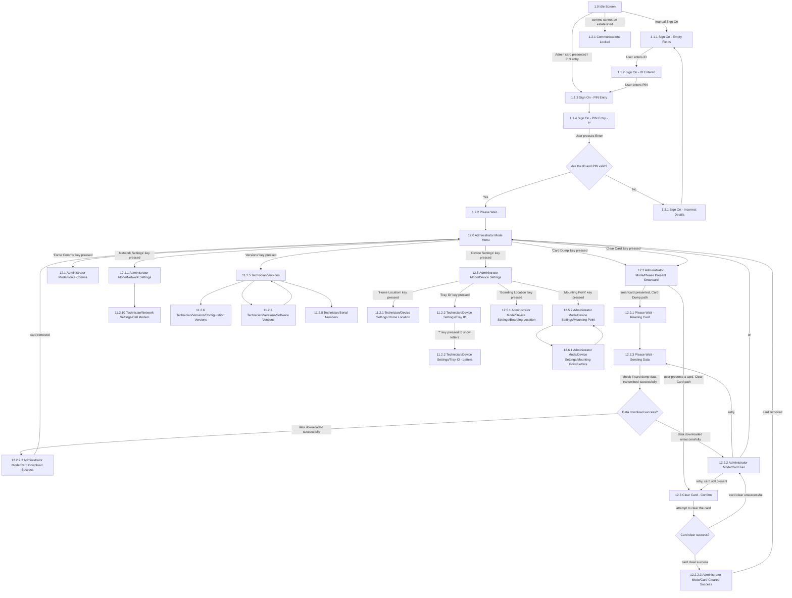

# Flow: Translink POS — Administrator

- Source: `knowledge/flows/translink-pos-full-transcription-v4.0.3.md`, board "13. 12.0
  Administrator" (Board Index item "12.0 Administrator"). Transcribed 2026-08-05.
- Project: translink   Device: POS   Feature: administrator mode (admin sign-on, card dump, clear
  card, force comms, network settings, versions, device settings)
- Transcription confidence: **high** — verbatim from the Chrome-extension transcription, not
  summarized.

## Diagram

## Paths (each path = one candidate scenario)
| # | Path | Feature | Tags | Covered by |
|---|------|---------|------|------------|
| 1 | Idle → Administrator smartcard presented → Sign On (ID auto-entered, PIN field active) → valid ID+PIN → Please Wait → Administrator Mode Menu | admin-signon | — | 4099913 |
| 2 | Idle → manual Sign On (Empty Fields → ID Entered → PIN Entry → PIN Entry 4*) → valid ID+PIN → Please Wait → Administrator Mode Menu | admin-signon | — | 4099912, 4099913 |
| 3 | Sign On → invalid ID+PIN → Sign On - Incorrect Details → (auto after 3s or Enter) → Sign On - Empty Fields | admin-signon | @destructive | 4099921 |
| 4 | Idle → comms cannot be established → Communications Locked (error + "Please Notify a Supervisor or Technician") | admin-signon | @destructive | 4099924 |
| 5 | Admin Menu → Card Dump → Please Present Smartcard → smartcard presented → Please Wait - Reading Card → Please Wait - Sending Data → data download success → Card Download Success → card removed → Admin Menu | admin-card-dump | — | 4099964, 4100093, 4100094, 4100096, 4100098 |
| 6 | Admin Menu → Card Dump → …→ data download unsuccessful → Card Fail → retry → Please Wait - Sending Data (or return to Admin Menu) | admin-card-dump | @destructive | 4099964, 4100095 |
| 7 | Admin Menu → Clear Card → Please Present Smartcard → user presents card → Clear Card - Confirm → attempt to clear → card clear success → Card Cleared Success → card removed → Admin Menu | admin-clear-card | — | 4099963, 4100099, 4100097 |
| 8 | Admin Menu → Clear Card → …→ card clear unsuccessful → Card Fail → retry (card still present) → Clear Card - Confirm (or return to Admin Menu) | admin-clear-card | @destructive | 4099963, 4100095 |
| 9 | Admin Menu → Force Comms → Administrator Mode/Force Comms | admin-comms | — | 4099968 |
| 10 | Admin Menu → Network Settings → Administrator Mode/Network Settings → Technician/Network Settings/Cell Modem | admin-comms | — | 4099967, 4100077 |
| 11 | Admin Menu → Versions → Technician/Versions → Configuration Versions | admin-versions | — | 4099969, 4100066 |
| 12 | Admin Menu → Versions → Technician/Versions → Software Versions → back to Technician/Versions | admin-versions | — | 4099969, 4100067 |
| 13 | Admin Menu → Versions → Technician/Versions → Serial Numbers | admin-versions | — | 4099969, 4100082 |
| 14 | Admin Menu → Device Settings → Home Location | admin-device-settings | — | 4099966, 4100076 |
| 15 | Admin Menu → Device Settings → Tray ID → '*' → Tray ID - Letters | admin-device-settings | — | 4099966, 4100088, 4100089 |
| 16 | Admin Menu → Device Settings → Boarding Location (prepopulated if a boarding location is already configured) | admin-device-settings | — | 4099966, 4100084 |
| 17 | Admin Menu → Device Settings → Mounting Point → Mounting Point/Letters → back to Mounting Point | admin-device-settings | — | 4099966, 4100100, 4100101, 4100102 |

## Screen states (Given/Then anchors)
- **Idle Screen** — entry point; presenting an Administrator smartcard here redirects straight to
  Sign On with the ID field automatically populated and the PIN field active (per annotation:
  "Presenting an Administrator card will redirect user to Sign on page with the ID automatically
  entered and PIN field active").
- **Sign On - PIN Entry / PIN Entry - 4\*** — pressing any key requires both ID and PIN to Sign On.
- **Please Wait...** — shown while the POS is performing sign-on activities; leads to the
  Administrator Mode Menu once the ID/PIN check passes.
- **Sign On - Incorrect Details** — on invalid ID/PIN, redirects back to the field that was being
  used (ID field if manual entry, PIN field if card-presented) after 3 seconds or on pressing Enter.
- **Communications Locked** — shown if the device cannot establish a correct Communication; displays
  an Error Message plus "Please Notify a Supervisor or Technician". Other diagnostic information may
  also appear depending on what the interface makes available.
- **Administrator Mode Menu (12.0)** — hub screen; branches to Card Dump, Clear Card, Force Comms,
  Network Settings, Versions, Device Settings.
- **Please Present Smartcard (12.2)** — shared entry screen for both the Card Dump and Clear Card
  flows; the transcription does not label which of its two outgoing connections belongs to which
  entry path (see Notes/unknowns).
- **Clear Card - Confirm (12.3)** — attempting to clear the card leads to the "Card clear success?"
  decision.
- **Card Dump / Clear Card outcomes** — success screens (Card Download Success, Card Cleared
  Success) require the smartcard to be removed before returning to the Admin Menu; failure (shared
  "Card Fail" screen) offers retry (Sending Data screen for Card Dump; Clear Card - Confirm screen
  for Clear Card, only while the card has not been removed) or return to Admin Menu.
- **Versions / Device Settings (Home Location, Tray ID)** — per annotation, "'Versions' screens and
  flow will match Technician menu, hence the screen names being 'Technician'" — i.e. these are the
  same shared screens reached from Technician mode.
- **Boarding Location (12.5.1)** — Administrator-specific Device Settings screen; if a boarding
  location has already been configured, the page prepopulates it on load.
- **Mounting Point (12.5.2) / Mounting Point - Letters (12.6.1)** — per annotation, it will be
  possible to distinguish between locations sharing a name but a different mode; "the mechanism to
  achieve this will be explained at a later date."
- **Print** — user will be able to print the details presented on "the specific screen" (annotation
  does not enumerate which screens carry a Print action in this board).

## Notes / unknowns
- TODO: confirm which of the two "Please Present Smartcard → …" connections (one to "Please Wait -
  Reading Card" via "Smartcard presented", one to "Clear Card - Confirm" via "User presents a card")
  belongs to the Card Dump entry vs. the Clear Card entry — the source transcription reuses the same
  "12.2 Please Present Smartcard" screen for both Admin Menu actions and does not disambiguate the
  two outgoing edges by originating action.
- TODO: confirm the exact retry destination on Card Dump failure — annotation says retry "will take
  the user to the 'Please Wait - Downloading' screen above", but the screen list/connections in this
  board only show "12.2.3 Please Wait - Sending Data" (no separately named "Please Wait -
  Downloading" screen) — assumed to be the same screen, name inconsistency in the source.
- The "Decision Points (4)" list in the raw transcription includes a fourth entry that is not
  actually a decision: "The maintenance app will be capable of adjusting these settings and will be
  accessible from the technician mode. This will be provided at a later date." Carried here verbatim
  as a GAP/roadmap note, not modelled as a diagram decision node — TODO: confirm which Device
  Settings screen(s) this refers to, and whether "at a later date" has since landed.
- CR034 note (context, not a flow node): per annotation, "Translink no longer require the feature to
  commission a smartcard on the POS. As per email 'POS CR Exchange' dated 20.07.20 12:36, this
  functionality has been exchanged, together with POS card reader reboot requirement removal, for
  CR034, the use of up and down arrows on the POS bus route selection screen and the addition of
  version screens in administrator mode." TODO: confirm this historical exchange is still accurate
  for the current build (v4.0.3) and doesn't leave a stale "commission smartcard" screen/case
  anywhere in the suite.
- Back/Cancel/Enter key routing (from annotations, not drawn as separate diagram edges since the
  raw transcription doesn't name a specific target screen consistently for each): "Back" from
  Force Comms / Network Settings goes to "Establish Comms" screen (not itself listed in this board's
  screen list — likely lives on a different board); "Back" from several Device Settings sub-screens
  returns to the Admin Menu; "Enter" from Home Location / Tray ID returns to Device Settings; "Cancel"
  from Clear Card - Confirm returns to Admin Menu. TODO: confirm "Establish Comms" screen identity —
  not present in this board's screen list.
- Card data (Card Dump) "is sent directly to the back office" — annotation only, no BOS event name
  given; TODO: confirm which BOS audit event this corresponds to.
