# Flow: Translink POS — Basket & Payment

- Source: `knowledge/flows/translink-pos-full-transcription-v4.0.3.md`, board "5. 4.0 Basket &
  Payment" (Overflow project "v4.0.3 Translink POS", https://overflow.io/s/RCZ9UPQF/). Transcribed
  verbatim via the Claude Chrome extension, 2026-08-04. Structured into this flow-map 2026-08-05.
- Project: translink   Device: POS   Feature: basket & payment (Bus FLU multi-item basket, Rail
  FLU basket/popular/3-day/advance-ticket payment)
- Transcription confidence: **medium** — the source board's own screen/decision/connection lists
  contain internal duplication and several unlabeled decision nodes (opaque UUIDs, no visible
  question text) and at least one screen-numbering clash (see Notes/unknowns). Transcribed as
  literally as possible; nothing invented to smooth over the gaps.
- **Not split**: this single board covers both the Bus multi-item basket and the Rail
  basket/payment sub-flows, but the raw connections list literally cross-links Bus-numbered and
  Rail-numbered screens (e.g. `3.3 Main Screen-Advance Ticket Selected` → `4.1.7 ... Bus Advance
  Ticket`, and `3.0 Main Screen-Rail-v4` → the same "add more than 9 tickets" decision used by the
  Bus basket). Splitting into separate Bus/Rail files would require inventing a boundary the source
  itself doesn't draw, so this stays one file per the README's "otherwise keep it as one file" rule.

## Diagram

```mermaid
flowchart TD
  subgraph BUS["Bus FLU — multi-item basket"]
    BUSULSTER["2.5.2 Main Screen-Ulsterbus selected"]
    BUSALIGHT["2.6.2 Main Screen - FLU - Alighting Selected"]
    BUSADDED["2.6.3 Main Screen - Added to Basket"]
    BASKPG1["4.1.2 Main Screen - FLU - Multiple Items - Basket - Page 1"]
    BASK1ITEM["4.1.1 Main Screen - FLU - Multiple Items - Basket - 1Item"]
    BASKSEL["4.1.3 Main Screen - FLU - Multiple Items - Basket - Selected"]
    BASKREM["4.1.4 Main Screen - FLU - Multiple Items - Basket - Item removed"]
    BASKSELADD["4.1.6 Main Screen - FLU - Multiple Items - Basket - Selected Added"]
    BASKSEL2["4.1.6 Main Screen - FLU - Multiple Items - Basket - Selected (TODO: id clash, see Notes)"]
    BASKFULL["4.1.5 Main Screen - FLU - Multiple Items - Basket is Full"]
    BUSADV["4.1.7 Main Screen - FLU - Multiple Items - Basket - 1Item - Bus Advance Ticket"]
    ADVTKT["4.2.1 Main Screen - FLU - Advance Ticket"]
    ADVTKTCOMP["4.2.2 Main Screen - FLU - Advance Ticket-complete"]
    BASKPAY["4.2.3 Main Screen - FLU - Multiple Items - Payment"]
    PAYCARDUNAV["4.2.4 Main Screen - FLU - Multiple Items - Payment - Bank Card Unavailable"]
    CARDFULL["4.3.1 FLU/Bank Card/Basket Full"]
    CLEARBASK["4.3.3 FLU - Clear Basket"]
    INVALDATE["4.5.1 FLU/Invalid Date"]
    LASTTXN["2.7.3 Main Screen - Last Transaction 200 - Confirm"]
  end

  subgraph RAIL["Rail FLU — basket, popular, 3-day, advance ticket"]
    RAIL0["3.0 Main Screen-Rail-v4"]
    RAIL4["3.4 Main Screen-Rail-Added in Basket"]
    RAILCONF["3.5 Main Screen-Rail-Confirmed Ticket"]
    RAILADV["3.3 Main Screen-Advance Ticket Selected"]
    RAIL3DAY["3.2 Main Screen-Rail-3DayTicket"]
    RAILFAV["2.2.5 Main Screen-Rail-FavTicketIssued"]
    RAILSEL["2.2 Main Screen-Rail selected"]
    PAY3DAY["4.8.1 Payment-3day ticket"]
    PAY3DAYERR["4.8.1 Payment-3day ticket-card unavailable"]
    PAYPOP["4.6.1 Main Screen - FLU - Payment - Popular"]
    PAYPOPERR["4.6.1 Main Screen - FLU - Payment - Popular - Card Unavailable"]
    PAYADV["4.4.1 Main Screen - FLU - Payment - Advance Ticket"]
    PAYADVERR["4.4.2 Main Screen - FLU - Payment - Advance Ticket - Card Unavailable"]
  end

  MAX9{"User tries to add more than 9 tickets to basket"}
  PCD{"Is PCD attached to the POS?"}
  DATEVALID{"Is the date valid?"}
  R6{"Pressing R6 again adds another ticket to the basket"}
  CANCELDEC{"Cancel pressed → return to FLU, discard advance ticket option"}
  PAYMETHOD1{"Payment method? (decision text not captured — UUID node only)"}
  PAYMETHOD2{"Payment method? (decision text not captured — UUID node only)"}
  PAYMETHOD3{"Payment method? (decision text not captured — UUID node only)"}
  PAYMETHODNOTGT1{"Payment method? — no target edge captured in source"}
  PAYMETHODNOTGT2{"Payment method? — no target edge captured in source"}
  PAYMETHODNOTGT3{"Payment method? — no target edge captured in source"}

  %% Bus basket flow
  BUSULSTER -->|choose boarding/alighting stage| BUSALIGHT
  BUSALIGHT -->|R6 = add to basket| MAX9
  MAX9 -->|No| BUSADDED
  MAX9 -->|No| BASKPG1
  MAX9 -->|Yes, 9 already added| CARDFULL
  BUSADDED -->|Enter, basket not empty| BASK1ITEM
  BUSADDED --> R6
  BASK1ITEM --> BUSADDED
  BASK1ITEM -->|select item| CLEARBASK
  CLEARBASK -->|confirm clear| BASK1ITEM
  CLEARBASK -->|confirm clear| BUSULSTER
  BASK1ITEM --> RAIL4
  BASK1ITEM --> PCD
  BASK1ITEM -->|select Advance Ticket option| ADVTKT
  BASKPG1 --> BASKFULL
  BASKPG1 --> BASKSEL
  BASKPG1 --> BASKSEL2
  BASKSEL -->|Delete item| BASKREM
  BASKSEL -->|select item| BASKSELADD
  BASKSEL2 -->|Delete item| BASKREM
  BASKSEL2 --> BASKSELADD
  BASKSELADD --> BASKSEL
  BASKSELADD --> BASKSEL2
  BASKSELADD --> BASKREM
  BASKFULL --> PCD
  CARDFULL -->|Add More| BUSALIGHT
  CARDFULL --> RAIL0
  PCD -->|Yes| BASKPAY
  PCD -->|No| PAYCARDUNAV
  BASKPAY -->|Add More| BASK1ITEM
  BASKPAY --> RAILCONF
  BASKPAY --> LASTTXN
  BASKPAY --> PAYMETHOD1
  BASKPAY --> PAYMETHOD2
  BASKPAY --> PAYMETHODNOTGT1
  BASKPAY --> PAYMETHODNOTGT2
  BASKPAY --> PAYMETHODNOTGT3
  PAYMETHOD1 --> RAILCONF
  PAYMETHOD2 --> LASTTXN
  LASTTXN --> BUSULSTER
  ADVTKT --> ADVTKTCOMP
  ADVTKT --> CANCELDEC
  ADVTKTCOMP --> DATEVALID
  ADVTKTCOMP --> ADVTKT
  ADVTKTCOMP --> BUSADV
  DATEVALID -->|No| INVALDATE
  DATEVALID -->|Yes| BUSADV
  BUSADV --> ADVTKTCOMP
  BUSADV --> PCD
  PAYADV -->|Back, keeps advance date selection| BUSADV
  RAILADV --> BUSADV
  RAIL4 --> R6

  %% Rail basket / payment flow
  RAIL0 --> MAX9
  RAILSEL --> PCD
  RAILADV --> PCD
  RAIL3DAY --> PCD
  PCD -->|Yes| PAYPOP
  PCD -->|No| PAYPOPERR
  PCD -->|Yes| PAYADV
  PCD -->|No| PAYADVERR
  PCD -->|Yes| PAY3DAY
  PCD -->|No| PAY3DAYERR
  PAYPOP --> RAILFAV
  PAYPOP --> PAYMETHOD3
  PAYMETHOD3 --> RAILFAV
  PAYPOPERR --> RAILSEL
  RAILFAV --> RAILSEL
  PAYADV --> RAILCONF
  PAY3DAY --> RAILCONF
  PAY3DAY --> PAYMETHODNOTGT1
  PAY3DAYERR --> RAIL3DAY
  RAILCONF --> RAIL0
  RAILCONF --> RAIL3DAY
```

## Paths (each path = one candidate scenario)
| # | Path | Feature | Tags | Covered by |
|---|------|---------|------|------------|
| 1 | Bus: Ulsterbus selected → choose boarding/alighting → R6 add to basket → Added to Basket → basket has 1 item | basket-bus | — | 4099989 |
| 2 | Bus: basket 1 item → Add More → back to Alighting Selected → repeat until 9th item added → 10th add attempt → **Basket Full / Bank Card Basket Full error** | basket-bus | @destructive | 4100432, 4100162 |
| 3 | Bus: basket 1 item → select item → Clear Basket → confirm → back to basket 1 item / Ulsterbus selected | basket-bus | — | 4099990 |
| 4 | Bus: basket (multiple items, page 1) → select item → Selected → increase/decrease passenger count (+/-, max 100/line) → Selected Added | basket-bus | — | 4105075 |
| 5 | Bus: basket 1 item → Advance Ticket option → enter date → **date invalid** → Invalid Date error | basket-bus | @destructive | 4099979 |
| 6 | Bus: basket 1 item → Advance Ticket option → enter date → date valid → Bus Advance Ticket in basket → Payment | basket-bus | — | 4105076 |
| 7 | Bus: basket/payment screen → Is PCD attached? → **Yes** → Payment screen shows Bank Card option | basket-bus | — | 4099994 |
| 8 | Bus: basket/payment screen → Is PCD attached? → **No** → Bank Card option unavailable (Payment - Bank Card Unavailable) | basket-bus | @destructive | 4105077 |
| 9 | Bus: Payment screen → payment method chosen → ticket issued → returns to FLU screen (Adult Single default, alighting deselected) with confirmation banner (2s configurable timeout) | basket-bus | — | 4099994, 4099992 |
| 10 | Rail: Rail selected → Is PCD attached? → Yes → Payment - Popular → ticket issued → FavTicketIssued → back to Rail selected | basket-rail | — | 4099977, 4100174, 4100210 |
| 11 | Rail: Rail selected → Is PCD attached? → No → Payment - Popular - Card Unavailable → back to Rail selected | basket-rail | @destructive | 4105078 |
| 12 | Rail: 3-Day Ticket screen → Is PCD attached? → Yes → Payment - 3day ticket → Confirmed Ticket → back to 3-Day Ticket screen | basket-rail | — | 4099980, 4100399, 4104632, 4104633, 4104634, 4100212 |
| 13 | Rail: 3-Day Ticket screen → Is PCD attached? → No → Payment - 3day ticket - card unavailable → back to 3-Day Ticket screen | basket-rail | @destructive | 4105079 |
| 14 | Rail: Advance Ticket Selected → Is PCD attached? → Yes → Payment - Advance Ticket → Confirmed Ticket | basket-rail | — | 4105080 |
| 15 | Rail: Advance Ticket Selected → Is PCD attached? → No → Payment - Advance Ticket - Card Unavailable | basket-rail | @destructive | 4105081 |
| 16 | Rail: Advance Ticket Selected → routes into the **Bus** Advance Ticket basket screen (4.1.7) — cross-flow link present in source, see Notes | basket-rail | — | 4105082 |
| 17 | Confirmed Ticket (Rail) → Main Screen-Rail-v4 (default landing after payment) | basket-rail | — | 4105083 |
| 18 | Confirmed Ticket (Rail) → 3-Day Ticket screen (alternate landing seen in source connections) | basket-rail | — | 4105084 |

## Screen states (Given/Then anchors)
- **Basket max size is 9 tickets** — "Add More" becomes unavailable at 9; deleting one re-enables
  it (Bus and Rail basket both reference the same "add more than 9" decision in the source).
- **Senior Single and other smartcard pass types** (War Pensioner, Blind, yLink, 24+, Half-Fare
  etc.) cannot be added to a basket — they require per-transaction Smartcard validation.
- **Passenger count per line** — +/- keys, max 100 passengers per line; each line prints one ticket.
- **Clear Basket** shows a confirmation screen; confirming empties the basket and returns to the
  Main Screen.
- **Bank Card availability is gated on PCD** ("Is PCD attached to the POS?") — every payment screen
  in this board (Bus multi-item, Rail Popular, Rail 3-Day, Rail Advance Ticket) has a paired
  "...Card Unavailable" variant reached when no PCD is attached.
- **Card-unavailable / basket-full errors have a 3-second timeout**, overridable by pressing any key.
- **Post-payment landing (Bus)** — prints ticket(s), returns to FLU screen defaulting to Adult
  Single with alighting deselected, confirmation banner with a 2-second configurable timeout.
- **Post-payment landing (Rail, Popular/3-Day/Advance)** — confirmation banner (alighting station +
  price) shown in the top bar; screen then returns to the relevant Rail default screen.
- **Popular/favourite rail tickets** cannot be sent to the basket or combined with other basket
  items — selecting one goes straight to its own payment screen.
- **Only one advance ticket allowed in the basket at a time.**
- **Bus basket route/stage rule**: operator cannot add tickets from two different routes to the
  same basket, but can add tickets with two different boarding stages on the same route.

## Notes / unknowns
- TODO: confirm the **"4.1.6" screen-numbering clash** — the source's Screens/Connections lists
  contain two distinct-named screens both numbered "4.1.6" (`Basket - Selected Added` and
  `Basket - Selected`), with near-identical outgoing edges to `Basket - Selected` (4.1.3) and
  `Item removed` (4.1.4). Transcribed both as separate nodes (`BASKSELADD` / `BASKSEL2`) rather than
  merging them, since the source gives no explicit statement that they're the same screen — needs
  checking against the live Overflow board.
- TODO: confirm the **unlabeled "payment method" decision nodes** — several decisions in the raw
  connections appear only as opaque UUIDs (no question text captured), e.g. `57e88179-...`,
  `9ba59e8a-...`, `66903a97-...`, `95220f0c-...`, `dfbed113-...`, `545d6a9f-...`, `7698c19e-...`,
  `4f7a3501-...`. Annotation text elsewhere on this board states "Operator will choose passengers'
  choice of payment. Choosing Cash/Warrant options will immediately issue the ticket, Bank Card
  will follow the specific flow (5.0)" — this likely explains the branching, but the transcription
  does not attach that label to a specific UUID node, so it is NOT asserted as fact here.
- TODO: confirm **three UUID payment-method decisions with no captured outgoing edge**
  (`7698c19e-...`, `545d6a9f-...`, `4f7a3501-...`, all sourced from the "4.2.3 ...Payment" screen) —
  the raw connections list has no target for these; likely "issue ticket immediately" per the
  Cash/Warrant annotation, but not confirmed.
- TODO: confirm the **Bus/Rail cross-links** — the source literally connects `3.0 Main
  Screen-Rail-v4` into the same "add more than 9 tickets" decision the Bus basket uses, and
  `3.3 Main Screen-Advance Ticket Selected` (Rail-numbered) into `4.1.7 ...Bus Advance Ticket`
  (Bus-numbered). This could mean the two FLUs genuinely share these decision/screen instances, or
  it could be a scrape artifact merging two adjacent boards. Kept as literally connected per source;
  flagging rather than silently splitting or silently ignoring.
- TODO: confirm the **"Pressing R6 again..." decision** (`R6`) and the **Cancel decision**
  (`CANCELDEC`, "If Cancel is pressed, POS will return to the FLU screen, discarding advance ticket
  option") — both appear in the Decision Points list but the source connections show them reached
  from a screen without a clearly separate captured downstream target beyond what's drawn above;
  treat the edges shown as best-effort, not confirmed exhaustive.
- The shared `PCD{Is PCD attached to the POS?}` decision node is reused across Bus and Rail payment
  screens (same question, same two-outcome pattern each time) — this mirrors the ETM flow-maps'
  convention of reusing one decision node for an identical repeated question (see
  `translink-etm-supervisor-menu.md`'s shared `PRINTQ1`), not an invented merge.
- "4.8.1 Payment-3day ticket-card unavailable" and "4.4.2 ... Advance Ticket - Card Unavailable" and
  "4.6.1 ... Popular - Card Unavailable" and "4.2.4 ... Payment - Bank Card Unavailable" are four
  separate screens (one per basket/payment context) rather than one shared error screen — kept
  distinct per the source's distinct screen names.
