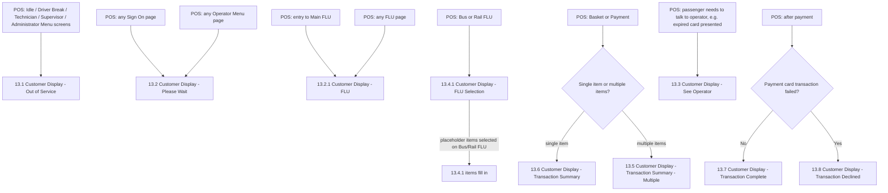

# Flow: Translink POS — Customer Displays

- Source: `knowledge/flows/translink-pos-full-transcription-v4.0.3.md`, board "13.0 Customer
  Displays" (§14, 9 screens / 9 decision points / 1 annotation / 0 connections). Transcribed
  verbatim via the Claude Chrome extension, 2026-08-04. Structured into this flow map 2026-08-05.
- Project: translink   Device: POS   Feature: customer-facing display mirroring
- Transcription confidence: **medium** — the source board recorded **zero explicit
  Connections/Flow entries** for this section; every relationship below is derived directly from
  the 9 Decision Points' text (which describe *when each Customer Display screen is shown*, not a
  navigation graph). No connection, screen, or trigger has been invented beyond what those 9
  decision-point statements say.

## Diagram

## Paths (each path = one candidate scenario)
| # | Path | Feature | Tags | Covered by |
|---|------|---------|------|------------|
| 1 | Idle / Driver Break / Technician / Supervisor / Administrator Menu screen → Customer Display shows "Out of Service" (13.1) | customer-displays | — | 4100103 |
| 2 | Sign On page → Customer Display shows "Please Wait" (13.2) | customer-displays | — | 4100104 |
| 3 | Operator Menu page → Customer Display shows "Please Wait" (13.2) | customer-displays | — | 4100104 |
| 4 | Entry to Main FLU → Customer Display shows "FLU" (13.2.1) | customer-displays | — | 4100105 |
| 5 | Bus or Rail FLU → Customer Display shows "FLU Selection" (13.4.1) → placeholder items fill in as selected | customer-displays | — | 4100107 |
| 6 | Basket/Payment with a single item purchased → Customer Display shows "Transaction Summary" (13.6) with the item name | customer-displays | — | FRAGMENTED — see consolidation-audit.md |
| 7 | Basket/Payment with multiple items purchased → Customer Display shows "Transaction Summary - Multiple" (13.5) showing "Multiple Items" | customer-displays | — | 4100108 |
| 8 | Passenger needs to talk to the operator (e.g. expired card presented) → Customer Display shows "See Operator" (13.3) | customer-displays | @destructive | 4100106 |
| 9 | After payment, transaction completes successfully → Customer Display shows "Transaction Complete" (13.7) | customer-displays | — | 4100110 |
| 10 | After payment, payment card transaction fails → Customer Display shows "Transaction Declined" (13.8) | customer-displays | @destructive | 4100111 |

## Screen states (Given/Then anchors)
- **13.1 Customer Display - Out of Service** — shown while the POS operator side is on the Idle,
  Driver Break, Technician, Supervisor, or Administrator Menu screens.
- **13.2 Customer Display - Please Wait** — shown during any Sign On page or any Operator Menu
  page.
- **13.2.1 Customer Display - FLU** — shown during entry to the Main FLU and on any FLU page.
- **13.3 Customer Display - See Operator** — shown when the passenger needs to talk to the
  operator (source example: an expired card was presented).
- **13.4.1 Customer Display - FLU Selection** — shown when on Bus or Rail FLU; placeholder items
  fill in once selected on the Bus/Rail FLU respectively.
- **13.5 Customer Display - Transaction Summary - Multiple** — shown at Basket/Payment when more
  than one item is being purchased; displays "Multiple Items".
- **13.6 Customer Display - Transaction Summary** — shown at Basket/Payment when only one item is
  being purchased; displays that item's name. Transaction type examples given: "Ticket Issue",
  "Top Up", "Card Issue", "Miscellaneous".
- **13.7 Customer Display - Transaction Complete** — shown when a transaction has completed.
- **13.8 Customer Display - Transaction Declined** — shown when a payment card transaction has
  failed.

## Notes / unknowns
- This board's Connections/Flow list was empty in the source transcription (0 entries) — unlike
  every other board transcribed so far. The diagram/paths above are reconstructed solely from the
  9 Decision Points' descriptive text, which state *trigger condition → Customer Display screen*
  rather than a click-through navigation graph. Treat this flow map as a **display-state mapping**,
  not a click path.
- Source annotation: "With the chosen Customer Display for the POS device the LED's indicated in
  these screens do not exist." — i.e. some Customer Display hardware variants show LEDs alongside
  these screens, but the LEDs are not present on Translink POS's chosen display. Not a functional
  path; noted for context only.
- TODO: confirm whether "Out of Service" (13.1) also applies to any sub-screens under
  Technician/Supervisor/Administrator menus, or only their top-level Menu screen as literally named
  in the source ("'Idle', 'Driver Break', 'Technician', 'Supervisor' and 'Administrator' Menu
  screens").
- TODO: confirm whether the "Transaction type examples" ('Ticket Issue', 'Top Up', 'Card Issue',
  'Miscellaneous') apply identically to both the single-item Transaction Summary (13.6) and the
  Multiple-Items Transaction Summary (13.5), or only one of them — the source states this against
  "Transaction Summary" generally without disambiguating.
- TODO: confirm the exact relationship/sequencing between 13.5/13.6 (Basket/Payment) and 13.7/13.8
  (after payment) — the source's combined decision-point narrative implies a sequence (FLU →
  FLU Selection → Summary → Complete/Declined) but does not give an explicit connection arrow.
