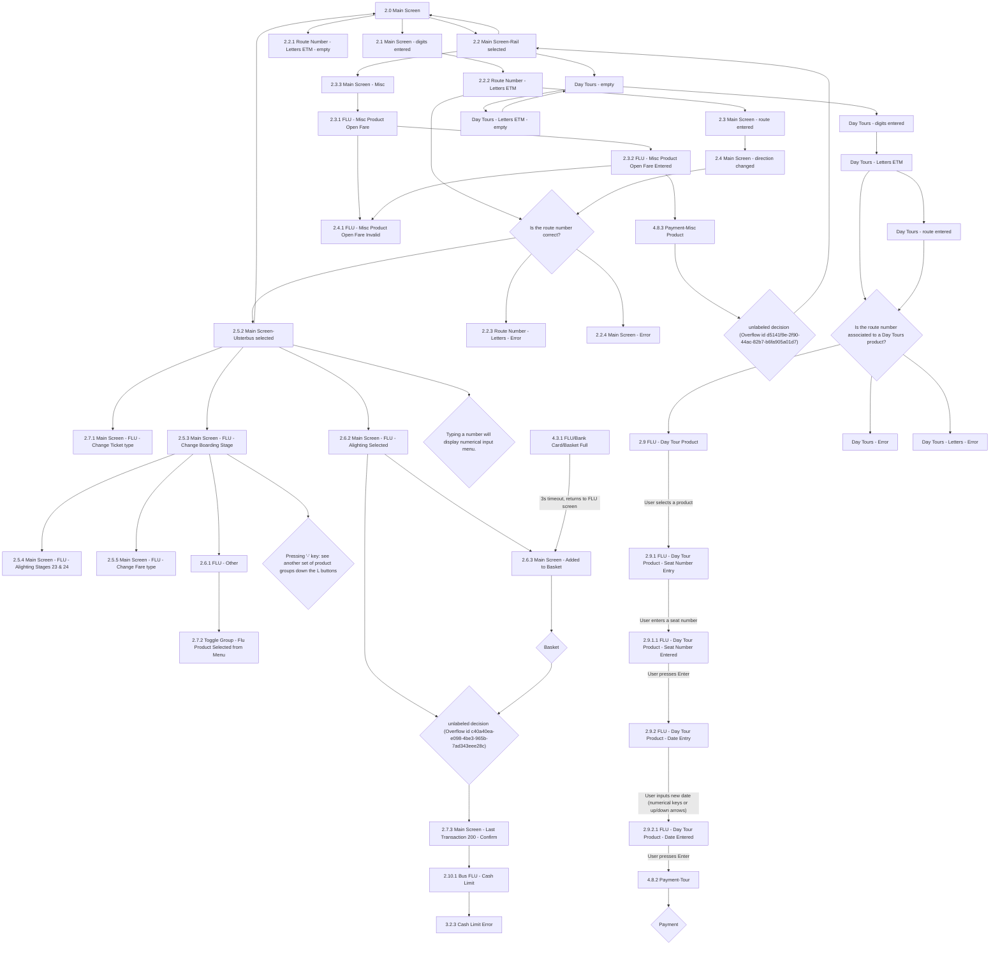

# Flow: Translink POS — FLU (Bus)

- Source: `knowledge/flows/translink-pos-full-transcription-v4.0.3.md`, board "2.0 FLU - Bus".
  Transcribed via the Claude Chrome extension, 2026-08-04 (raw source date). Structured into this
  flow-map 2026-08-05.
- Project: translink   Device: POS   Feature: FLU (Fixed Line Unit) bus ticketing — route/stage
  selection, ticket type/fare/boarding-stage changes, Day Tours product, misc open-fare product,
  basket, cash limit.
- Transcription confidence: **high** for screen names/connections (verbatim from source); **low**
  for two decision nodes whose text label was not captured (see Notes/unknowns) and for which
  branch of the "Is the route number correct?" decision is Yes vs No.

## Diagram

## Paths (each path = one candidate scenario)
| # | Path | Feature | Tags | Covered by |
|---|------|---------|------|------------|
| 1 | Main Screen → digits entered → Route Number Letters ETM → route entered → direction changed → route number correct → Ulsterbus selected | flu-bus | — | 4100374 (functional), 4100135, 4100138, 4100141, 4100145, 4100112 (screen validation) |
| 2 | Route Number Letters ETM → route number incorrect → Route Number - Letters - Error | flu-bus | @destructive | 4100139 (screen validation only) |
| 3 | Direction changed → route number incorrect → Main Screen - Error | flu-bus | @destructive | 4100140 (screen validation only) |
| 4 | Ulsterbus selected → Change Boarding Stage → Alighting Stages 23 & 24 | flu-bus | — | 4100376 (functional), 4100148 (screen validation) |
| 5 | Ulsterbus selected → Change Boarding Stage → Change Fare type | flu-bus | — | 4100376, 4100149 |
| 6 | Ulsterbus selected → Change Boarding Stage → FLU - Other → Toggle Group menu (Flu Product Selected from Menu) | flu-bus | — | 4100150, 4100154 (screen validation only) |
| 7 | Ulsterbus selected → Alighting Selected → Added to Basket → Basket decision → Last Transaction 200 - Confirm → Cash Limit → Cash Limit Error | flu-bus | @destructive | 4099988 (functional, cash limit), 4100374 (functional, basket/confirm) |
| 8 | FLU/Bank Card/Basket Full → 3s timeout → returns to Added to Basket screen | flu-bus | @destructive | 4105091 |
| 9 | Main Screen → Rail selected → Main Screen (toggle) | flu-bus | — | 4105092 |
| 10 | Rail selected → Misc → Misc Product Open Fare → Open Fare Entered → Payment-Misc Product → (unlabeled decision) → back to Rail selected | flu-bus | — | 4100377 (functional, Bus FLU Misc open fare), 4099981 (functional, Rail FLU Misc button) |
| 11 | Misc Product Open Fare (or Open Fare Entered) → invalid value → Misc Product Open Fare Invalid | flu-bus | @destructive | 4100377 |
| 12 | Rail selected → Day Tours - empty → digits entered → Letters ETM → route entered → route associated to Day Tours product → FLU Day Tour Product | flu-bus | — | 4105093 |
| 13 | Day Tours route entered/Letters ETM → route NOT associated to Day Tours product → Day Tours - Error | flu-bus | @destructive | 4105094 |
| 14 | Day Tours Letters ETM → route NOT associated to Day Tours product → Day Tours - Letters - Error | flu-bus | @destructive | 4105095 |
| 15 | Day Tours - empty → Letters ETM - empty → back to Day Tours - empty | flu-bus | — | 4105096 |
| 16 | FLU Day Tour Product → select product → Seat Number Entry → seat entered → Date Entry → Date Entered → Payment-Tour → Payment decision | flu-bus | — | 4105097 |

## Screen states (Given/Then anchors)
- **2.0 Main Screen** — default FLU bus screen; entering digits opens numerical route entry;
  route/product selection via L1-L5 and R1-R5 keys per the annotation: "POS will display the FLU
  screen for bus, containing products which can be selected using L1-L5 keys and stages which can be
  selected using R1-R5 keys."
- **2.2.2 Route Number - Letters ETM** — operator can access letters pressing `*`; pressing Enter/R6
  confirms the route entered; feeds the "Is the route number correct?" decision.
- **2.5.2 Main Screen-Ulsterbus selected** — after sign-on and route selection, POS checks the
  configured default boarding-stage text against the route's boarding-stage names and pre-selects a
  matching default stage. Typing a number displays the numerical input menu.
- **2.5.3 Main Screen - FLU - Change Boarding Stage** — operator changes boarding stage with `<`/`>`;
  `⌃`/`⌵` load next/previous 4 stages; changing boarding stage or ticket type deselects the alighting
  stage.
- **2.6.2 Main Screen - FLU - Alighting Selected** — after selecting the alighting stage, operator adds
  the product to the basket via R6. Pressing the alighting-stage button again toggles currency between
  configured currency and GBP (per annotation referencing "9.1.4 Main Screen-Euro currency" — see
  Notes, this screen's connection was not captured explicitly).
- **2.7.3 Main Screen - Last Transaction 200 - Confirm** — after payment, POS prints ticket(s) and
  returns to the FLU screen defaulting to Adult Single with alighting stage deselected, showing a
  confirmation banner with a configurable 2-second timeout.
- **2.10.1 Bus FLU - Cash Limit** — cash-limit tracking screen; per annotation, if the maximum revenue
  is reached the POS locks and a Supervisor or Technician must be notified while the device retrieves
  its back-office connection in the background.
- **2.3.1 / 2.3.2 FLU - Misc Product Open Fare** — operator types an open fare for the selected misc
  product; confirmed with R6/Enter; an invalid value (min/max thresholds "to be determined") shows an
  error banner with a 2-second timeout.
- **2.9 FLU - Day Tour Product** — lists products for the selected Day Tour; back key returns to Main
  Screen; to preserve legacy-system compatibility the operator may issue only one ticket/seat per
  transaction.
- **2.9.2 FLU - Day Tour Product - Date Entry** — defaults to today's date; up/down arrows increment;
  operator cannot go behind today's date; `C` resets to today's date; `Back` returns to Seat Number
  Entry.
- **4.3.1 FLU/Bank Card/Basket Full** — shown 3 seconds before returning automatically to the Added to
  Basket / FLU screen.

## Notes / unknowns
- Two decision nodes appear in the raw transcription only as Overflow internal ids with no text
  label captured: `c40a40ea-e098-4be3-965b-7ad343eee28c` (reached from Basket / Alighting Selected,
  leads to Last Transaction 200 - Confirm) and `d5141f9e-2f90-44ac-82b7-b6fa905a01d7` (reached from
  Payment-Misc Product, leads back to Main Screen-Rail selected). TODO: confirm the actual question
  each decision asks — not invented here.
- The "Is the route number correct?" decision has three outgoing branches (Ulsterbus selected /
  Route Number - Letters - Error / Main Screen - Error) but the source's standalone "Yes"/"No"
  annotation bullets were not explicitly tied to specific connection arrows. TODO: confirm which
  branch is Yes vs No, and what differentiates the two error outcomes (Route Number - Letters - Error
  vs Main Screen - Error).
- "Typing a number will display numerical input menu." and "Pressing the '-' key will allow the
  operator to see another set of product groups down the L buttons." are listed under the board's
  Decision Points even though they read as button-behaviour annotations rather than branching
  questions. Kept as decision nodes here to match the source faithfully. TODO: confirm intended
  decision semantics (what are the two branches?).
- Three screens from this board's Screens list have no captured connection in the raw transcription,
  so they are not placed in the diagram: **9.1.4 Main Screen-Euro currency**, **7.5.3
  Smartcard/Top Up/Remove Smartcard/Expiry**, **1.3.1 Sign On - Incorrect Details**. TODO: confirm
  where each connects in the live flow (likely Euro currency ties to the Alighting Selected screen's
  currency-toggle annotation, and Sign On - Incorrect Details / Smartcard-Top Up are cross-board
  references into "1.0 Sign On" and "7.0 Top Up & Validation" respectively — not confirmed here).
- Audio-tone annotations on this board (error/success/timeout tone playback, revenue-threshold
  notification) describe POS-wide behaviour that overlaps with the separate "16.0 Power Interruption
  & Audio Tones" board — cross-reference only, not re-diagrammed here.
- This board was kept as a single file rather than split: unlike ETM's FLU/Driver Menu boards, "2.0
  FLU - Bus" is one cohesive bus-ticketing flow (route/stage selection, Day Tours, misc open-fare
  product, basket, cash limit all hang off the same Main Screen/Ulsterbus-selected/Rail-selected
  entry points) rather than several independently-entered feature areas.
