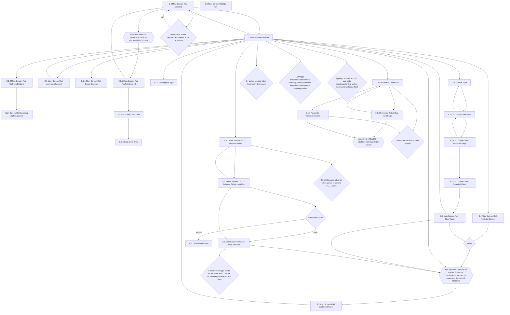

# Flow: Translink POS — FLU Rail

- Source: `knowledge/flows/translink-pos-full-transcription-v4.0.3.md`, board "3. 2.0 FLU - Bus /
  4. 3.0 FLU - Rail" section — specifically **"3.0 FLU - Rail"** (Board Index item 4). Transcribed
  verbatim via the Claude Chrome extension, 2026-08-04. Structured into this flow-map 2026-08-05.
- Project: translink   Device: POS   Feature: FLU (Fare Look-Up) — Rail
- Transcription confidence: **medium** — the raw source's Connections/Flow list uses three
  anonymous decision-node UUIDs (`06a58d4e-...`, `c650528b-...`, `e02ca855-...`) with no attached
  label text, and several decision nodes have no recorded outgoing edge at all. Where a destination
  or exact label could not be confirmed from the source, it is left as `TODO: confirm ...` rather
  than guessed — see Notes/unknowns.

## Diagram

## Paths (each path = one candidate scenario)
| # | Path | Feature | Tags | Covered by |
|---|------|---------|------|------------|
| 1 | Main Screen-Rail selected → Main Screen-Rail-v4 (enter Rail FLU) | flu-rail | — | 4105098 |
| 2 | Main Screen-Rail-v4 → Board Stations / Alighting Stations / Passenger Type / Ticket Type → Added in Basket → Basket decision → payment confirm (2s banner) → Confirmed Ticket → back to Main Screen-Rail-v4 | flu-rail | — | 4099970, 4099991, 4099992 |
| 3 | Main Screen-Rail-Alighting Stations → same station chosen for boarding and alighting → passenger/ticket type, price, advance-ticket option and basket become unavailable | flu-rail | @destructive | 4099971 |
| 4 | Main Screen-Rail-v4 → Ticket Type → 3-Day Ticket Start → Available Days → Selected Days → 3-Day Ticket screen → basket/payment confirm | flu-rail | — | 4099980 |
| 5 | 3-Day Ticket Available Days ↔ 3-Day Ticket Start (paging back) | flu-rail | — | 4105099 |
| 6 | Main Screen-Rail-v4 → Advance Ticket → Advance Ticket-complete → Is the date valid? → **valid** → Advance Ticket Selected → (revert ticket type if invalid for that date) → payment confirm | flu-rail | — | 4099979 |
| 7 | Main Screen-Rail-v4 → Advance Ticket → Advance Ticket-complete → Is the date valid? → **invalid** → FLU/Invalid Date (3s timeout, or overridden by any keypress) | flu-rail | @destructive | 4099979 |
| 8 | Main Screen - FLU - Advance Ticket → Cancel → discards advance ticket option, returns to FLU screen | flu-rail | @destructive | 4105100 |
| 9 | Main Screen-Rail selected → operator selects a favourite via R1-R5 → FavTicketIssued → back to Main Screen-Rail selected | flu-rail | — | 4099977 |
| 10 | Main Screen-Rail-FavTicketIssued → Cash Limit check → Cash Limit Error (approaching/at max revenue; POS locks and requires Supervisor/Technician if max reached) | flu-rail | @destructive | 4099988 |
| 11 | Main Screen-Rail-v4 → Favourite Tickets/List → Overwrite selected favourite → confirm | flu-rail | — | 4099978 |
| 12 | Favourite Tickets/List ↔ Favourite Tickets/List-Next Page (paging, both directions) | flu-rail | — | 4099977 |
| 13 | Favourite Tickets/List (or Overwrite) → Cancel → returns to Rail FLU screen | flu-rail | — | 4099978 |
| 14 | Main Screen-Rail-v4 → currency changed (cross-border toggle) → back to Main Screen-Rail-v4 | flu-rail | — | 4100429 |
| 15 | Main Screen-Rail selected → Down arrow → Operator Favourites 6-10 → Up → back to Main Screen-Rail selected | flu-rail | — | 4105101 |
| 16 | Main Screen-Rail-v4 → L4 button toggles ticket type when depressed | flu-rail | — | 4105102 |
| 17 | Main Screen-Rail-v4 → Left/Right increments/decrements boarding station; Up/Down increments/decrements alighting station | flu-rail | — | 4100501 |
| 18 | Main Screen-Rail-v4 → typing a number + L1/L2 auto-sets boarding/alighting station (cross-reference: numerical input flows) | flu-rail | — | 4099972 |

> `Covered by` filled in 2026-08-06 against live TestRail suite 30253.

## Screen states (Given/Then anchors)
- **Main Screen-Rail selected (2.2)** — entry screen for Rail FLU; offers favourite ticket slots
  (R1-R5, plus Favourites 6-10 via Down/Up arrow) and leads into Main Screen-Rail-v4.
- **Main Screen-Rail-No Fav (2.3)** — shown "If No Favourite Ticket was set" (per Decision Points);
  present in the board's Screens list but has **no recorded connection** to/from any other screen in
  the source — see Notes/unknowns.
- **Main Screen-Rail-v4 (3.0)** — the main Rail FLU working screen: Board/Alighting Stations,
  Passenger Type, Ticket Type, currency toggle, Add to Basket, Advance Ticket, Favourite Tickets
  list, and the increment/decrement + numeric-entry input methods for stations all hang off this
  screen.
- **Main Screen-Rail-currency changed (3.1)** — cross-border journey price shown in euro; pressing
  the price button again reverts to default currency.
- **Main Screen-Rail-Board Stations (3.1.1)** / **Alighting Stations (3.1.2)** — scrollable station
  lists; selecting one returns to the previous screen keeping the selection. Alternative entry
  method is numeric input from the previous screen.
- **Main Screen-Rail-boarding-alighting-same** — reached when boarding and alighting stations are
  the same; passenger type, ticket type, price, advance-ticket option, and basket all become
  unavailable.
- **Passengers Type (3.1.3)** — list of passenger types (ordered via Cloudflare by Translink);
  scrollable if the list overflows the page.
- **Ticket Type (3.1.4)** — all available products shown for the selected passenger type, ordered
  via Cloudflare; shows cross-border ticket types only when boarding or alighting is a cross-border
  station, local types otherwise; only shows types valid for the (possibly advance-dated) date.
- **Favourite Tickets/List (3.1.5)** — pressing `+` on the FLU screen shows this if favourites are
  set (open slots shown instead if none are set); slot numbering matches the Main Menu favourite
  order.
- **Favourite Tickets/List-Next Page (3.1.6)** — pages 6-10 of the favourites list.
- **Favourite Tickets/Overwrite (3.1.7)** — choosing an already-set favourite shows the ticket to be
  overwritten alongside the operator's current selection.
- **Main Screen-Rail-3DayTicket (3.2)** — 3-Day Ticket product screen.
- **FLU Rail-Cash Limit (3.2.2)** — notification shown when a preconfigured cash amount threshold is
  approached; appears after the ticket-confirmation banner, 3s timeout.
- **Cash Limit Error (3.2.3)** — if the maximum revenue is reached, the POS locks; a Supervisor or
  Technician must be notified, and the POS retrieves the back-office connection in the background.
- **Main Screen-Advance Ticket Selected (3.3)** — shown once an advance date is confirmed valid;
  will auto-revert to a valid ticket type if the currently-chosen type isn't available on that date.
- **FLU-3DayTicket-Start (3.3.3)** → **Available Days (3.4.1)** → **Selected Days (3.4.2)** — start
  date selection flow for the 3-Day Ticket; days already unavailable are greyed out, pressing a
  selected day again deselects it.
- **Main Screen-Rail-Added in Basket (3.4)** — basket state after adding a Rail FLU item.
- **Main Screen-Rail-Confirmed Ticket (3.5)** — post-payment confirmation banner in the top bar, 2s
  timeout, then auto-returns to Main Screen-Rail-v4. A confirmation beep also sounds.
- **Main Screen-Rail-FavTicketIssued (2.2.5)** — shown after selecting a favourite via R1-R5.
- **Main Screen - FLU - Advance Ticket (4.2.1)** / **Advance Ticket-complete (4.2.2)** — advance
  date entry; only usable when the basket holds a single product (advance ticket cannot be combined
  with multiple basket items). Pressing the advance-date button (once a date is set) returns here to
  change the date. Advance Date/Passenger Type/Ticket Type reset after 1 minute of POS inactivity.
- **FLU/Invalid Date (4.5.1)** — shown if the entered date is invalid, or valid but outside the
  ticket type's allowed advance-date range on Cloudflare; 3s timeout, overridable by any keypress.

## Notes / unknowns
- Pressing `C` from **any** FLU screen returns to the Main Screen (per annotation) — not drawn as an
  edge from every individual node above to avoid cluttering the diagram; treat it as a global
  shortcut back to Main Screen-Rail-v4/Main Screen-Rail selected.
- After sign-on, Rail FLU defaults to the last boarding/alighting stations entered before sign-off
  (per annotation) — not a screen-to-screen connection, but relevant to Given-state setup for tests.
- Pressing Enter on the FLU screen with an empty basket goes directly to the payment screen (per
  annotation) — payment/basket screens themselves are out of scope of this board (see
  `4.0 Basket & Payment`).
- TODO: confirm what screen **"2.3 Main Screen-Rail-No Fav"** connects to/from — it appears in the
  board's Screens list but has zero recorded Connections/Flow entries in the raw transcription.
- TODO: confirm the label/behaviour of decision node **`e02ca855-11da-4624-a139-7c2a5a37f125`**
  (fed by both Favourite Tickets/List-Next Page and Favourite Tickets/Overwrite) — the raw
  transcription records no attached decision text and no outgoing edge for it.
- TODO: confirm the exact destination screen for "Cancel returns to Rail FLU screen" (from
  Favourite Tickets/List and /Overwrite) and "Cancel discards advance ticket option, returns to the
  FLU screen" (from Main Screen - FLU - Advance Ticket) — the source names the destination generically
  as "the FLU screen"/"Rail FLU screen" without an edge to a specific node id, and this board has two
  candidate "Rail FLU" screens (2.2 Main Screen-Rail selected vs 3.0 Main Screen-Rail-v4).
- TODO: confirm the outgoing destination (if any) for the decision nodes "L4 button toggles ticket
  type", "Left/Right and Up/Down increment/decrement station", "typing a number + L1/L2 auto-sets
  station", and "chosen ticket type invalid on advance date → revert" — each has a recorded incoming
  edge in the raw transcription but no recorded outgoing edge, so the diagram shows them as terminal
  per the source; behaviourally they likely loop back to Main Screen-Rail-v4 with an updated field,
  but that loop-back is not explicitly drawn in the Overflow export.
- The "numeric input + L1/L2" decision explicitly cross-references "numerical input flows" — that is
  a separate board/flow-map not covered here (see the POS "6.0 Numerical Input" board).
- Decision-node UUIDs `06a58d4e-0c5f-4f50-af99-48f876170c03` and `c650528b-99ed-4e79-9e8b-33acde8aa314`
  were matched to Decision Points list text by connection context (payment-confirmation banner;
  R1-R5 favourite selection respectively) since the raw export attaches no label directly to the
  UUID node — flagged here for a human sanity-check rather than treated as certain.
- This board is **not** further split — unlike the ETM "FLU"/"Driver Menu" boards, "3.0 FLU - Rail" is
  a single coherent feature area (Rail fare selection, advance tickets, 3-day tickets, favourites,
  cash-limit) with no independently-navigable sub-area large enough to warrant its own file.
