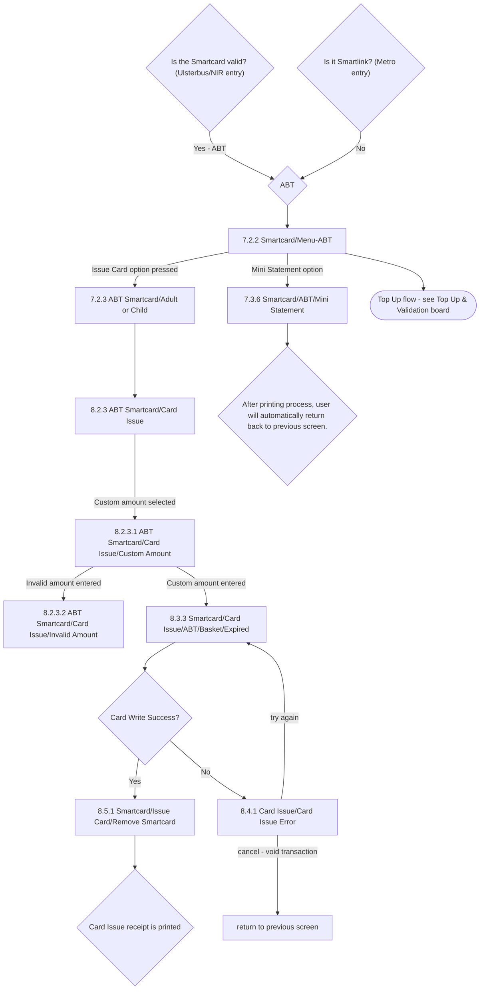

# Flow: Translink POS — Issue Card (ABT)

- Source: `knowledge/flows/translink-pos-full-transcription-v4.0.3.md`, board "9. 8.0 Issue Card"
  (ABT portion only). Raw source transcribed via the Claude Chrome extension from Overflow.io
  project "v4.0.3 Translink POS" (https://overflow.io/s/RCZ9UPQF/). Structured 2026-08-05.
- Project: translink   Device: POS   Feature: smartcard issue (ABT)
- Split note: part of the raw "8.0 Issue Card" board. ABT is reached from **both**
  `translink-pos-issue-card-ulsterbus-nir.md` (directly from "Is the Smartcard valid?" → Yes → ABT)
  and `translink-pos-issue-card-metro.md` ("Is it Smartlink?" → No → ABT) — split into its own file
  because it is a genuinely shared sub-flow, not owned by either entry context.
- Transcription confidence: **medium** — the connection from "8.2.3 ABT Smartcard/Card Issue" to
  "8.3.3 Smartcard/Card Issue/ABT/Basket/Expired" is only shown via the Custom Amount screen
  (8.2.3.1); no direct connection for a standard (non-custom) amount reaching the basket screen is
  present in the source — flagged below.

## Diagram

## Paths (each path = one candidate scenario)
| # | Path | Feature | Tags | Covered by |
|---|------|---------|------|------------|
| 1 | Ulsterbus/NIR entry: Is the Smartcard valid → Yes → ABT → Menu-ABT | issue-card-abt | — | 4100247 |
| 2 | Metro entry: Is it Smartlink → No → ABT → Menu-ABT (cross-ref `translink-pos-issue-card-metro.md`) | issue-card-abt | — | 4100247 |
| 3 | Menu-ABT → "Issue Card" option pressed → Adult or Child → ABT Card Issue | issue-card-abt | @bos | 4100024, 4100300, 4100307 |
| 4 | ABT Card Issue → Custom amount selected → Custom Amount screen → **invalid amount entered** → Invalid Amount screen | issue-card-abt | @destructive | 4100309 |
| 5 | ABT Card Issue → Custom amount selected → Custom Amount screen → **custom amount entered** → Basket/Expired → Write Success → Remove Smartcard → receipt printed | issue-card-abt | @bos | 4100024, 4100308, 4100316, 4100322 |
| 6 | Basket/Expired → Card Write Success = **No** → Card Issue Error → operator tries again → Basket/Expired | issue-card-abt | @destructive | 4105106 |
| 7 | Card Issue Error → operator **cancels** → transaction voided → returns to previous screen | issue-card-abt | @destructive | 4105107 |
| 8 | Menu-ABT → Mini Statement → prints → automatically returns to previous screen | issue-card-abt | — | 4100506, 4100254 |
| 9 | Menu-ABT → Top Up flow (cross-board pointer — see "7.0 Top Up & Validation" board, not detailed here) | issue-card-abt | — | 4100007, 4100008, 4100009, 4100017 |

## Screen states (Given/Then anchors)
- **ABT brand label** — "The text 'ABT' on screens will be replaced by the ABT brand name" (applies
  throughout this sub-flow).
- **7.2.3 ABT Smartcard/Adult or Child** — "Selection of adult or child will be done automatically by
  the POS according to the data on the card... The flow after selecting Adult or Child will remain
  the same" (i.e. Adult vs Child does not branch the subsequent screens in this sub-flow, unlike the
  Ulsterbus/NIR flow where Adult/Child gates different products).
- **8.2.3.1 ABT Smartcard/Card Issue/Custom Amount** — "*Enter button has no function on this
  screen*" (repeated annotation).
- **8.4.1 Card Issue/Card Issue Error** — same shared error screen and 4-point audit behaviour as
  documented in `translink-pos-issue-card-ulsterbus-nir.md` (card-transaction void, no totals
  update, stray smartcard write with no operational effect, diagnostic/event recorded).
- **8.5.1 Smartcard/Issue Card/Remove Smartcard** — shared success screen; "A Card Issue Successful
  screen is presented and user has to remove Smartcard to continue."

## Notes / unknowns
- TODO: confirm how a **standard (non-custom) ABT amount** on "8.2.3 ABT Smartcard/Card Issue"
  reaches the Basket/Expired screen — the only documented connection to 8.3.3 in the source is via
  the Custom Amount screen (8.2.3.1 → custom amount entered → 8.3.3). Do not assume a direct
  8.2.3 → 8.3.3 connection exists; it is not in the transcription.
- TODO: confirm what "Top Up flow" on Menu-ABT connects to in detail — this points into the "7.0 Top
  Up & Validation" board, out of scope for this Issue Card transcription; not detailed here to avoid
  inventing connections not captured in this board's extraction.
- The Basket/Expired screen name ("...Basket/Expired") suggests an ABT card can be presented already
  expired at this step — no separate "expired card" decision/branch is shown in the source beyond
  the screen name itself. TODO: confirm whether "Expired" is a display state on this screen or a
  distinct sub-path.
