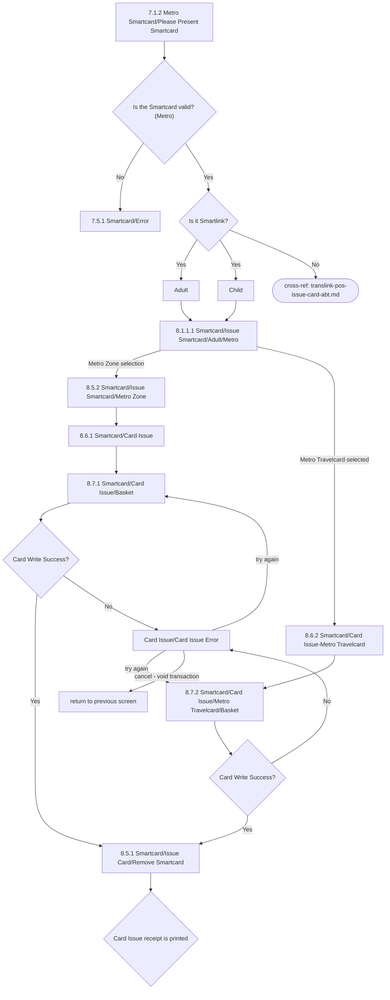

# Flow: Translink POS — Issue Card (Metro)

- Source: `knowledge/flows/translink-pos-full-transcription-v4.0.3.md`, board "9. 8.0 Issue Card"
  (Metro portion only). Raw source transcribed via the Claude Chrome extension from Overflow.io
  project "v4.0.3 Translink POS" (https://overflow.io/s/RCZ9UPQF/). Structured 2026-08-05.
- Project: translink   Device: POS   Feature: smartcard issue (Metro)
- Split note: part of the raw "8.0 Issue Card" board. Metro has its own entry screen
  ("7.1.2 Metro Smartcard/Please Present Smartcard") and its own instance of "Is the Smartcard
  valid?", distinct from the Ulsterbus/NIR entry — see `translink-pos-issue-card-ulsterbus-nir.md`.
  The ABT branch reachable from here is split out to `translink-pos-issue-card-abt.md` since it is
  shared with the Ulsterbus/NIR flow.
- Transcription confidence: **medium** — two annotations appear to conflict on Metro payment method
  ("*Only the cash option is available to Metro users*" vs "Card payment flow") without the flat
  extraction attributing each to a specific screen; flagged below.
- **Mode note**: "Metro POS Card Issue Flow" — "Any Translink Smartcard can be issued from a Metro
  POS except for Ulsterbus Multi-Journey and Ulsterbus Town Services Travelcard."

## Diagram

## Paths (each path = one candidate scenario)
| # | Path | Feature | Tags | Covered by |
|---|------|---------|------|------------|
| 1 | Present Smartcard (Metro) → **invalid** → Error screen | issue-card-metro | @destructive | 4105103 |
| 2 | Present Smartcard (Metro) → valid → Is it Smartlink = **Yes** → Adult/Child (auto) → Issue Smartcard/Adult/Metro → Metro Zone selection → Card Issue → Basket → Write Success → Remove Smartcard → receipt printed | issue-card-metro | @bos | 4100024 (generic functional 'Issue Card - issue from blank'), 4100302, 4100323, 4100324, 4100326, 4100322 (Screen Validation stubs for the individual screens on this path) |
| 3 | Same entry (2) → **Metro Travelcard** selected instead of zone card → Metro Travelcard/Basket → Write Success → Remove Smartcard → receipt printed | issue-card-metro | @bos | 4100024 (generic functional), 4100302, 4100325, 4100327, 4100322 (Screen Validation stubs) |
| 4 | Present Smartcard (Metro) → valid → Is it Smartlink = **No** → ABT flow (cross-ref `translink-pos-issue-card-abt.md`) | issue-card-metro | — | 4100300, 4100307, 4100308, 4100309, 4100316 (ABT Screen Validation stubs) |
| 5 | Basket/payment screen → Card Write Success = **No** → Card Issue Error → operator tries again → same basket screen | issue-card-metro | @destructive | 4105104 |
| 6 | Card Issue Error → operator **cancels** → transaction voided → returns to previous screen | issue-card-metro | @destructive | 4105105 |

## Screen states (Given/Then anchors)
- **7.1.2 Metro Smartcard/Please Present Smartcard** — "This is the first screen Metro operator will
  be presented after sign on process."
- **8.1.1.1 Smartcard/Issue Smartcard/Adult/Metro** — Adult/Child selection is automatic from card
  data, same pattern as the Ulsterbus/NIR flow.
- **Payment restriction (unconfirmed)** — the source carries the repeated annotation "*Only the cash
  option is available to Metro users*" against several Metro card-issue screens, but also carries
  "Card payment flow" annotations in the same section — see Notes/unknowns; do not assume Metro is
  cash-only everywhere without confirming which screen each annotation is actually attached to.
- **8.4.1 / "Card Issue/Card Issue Error"** — same shared error screen and 4-point audit behaviour
  (card-transaction void if paid by card, no totals update, stray smartcard write with no
  operational effect, diagnostic/event recorded) as the Ulsterbus/NIR and ABT flows.
- **8.5.1 Smartcard/Issue Card/Remove Smartcard** — shared success screen.

## Notes / unknowns
- TODO: confirm which specific Metro card-issue screens are cash-only vs card-payment-eligible — the
  flat extraction lists "*Only the cash option is available to Metro users*" and "Card payment flow"
  as separate annotations without a screen-ID attribution for either, appearing to apply to different
  screens in this sub-flow. Do not assume all Metro issue screens share the same payment
  restriction.
- TODO: confirm "Metro card issues - can be paid for by card or warrant but only by a UB/NIR
  operator" (a decision-point label in the raw list) — this reads as a note about payment
  eligibility (card/warrant, UB/NIR operator only) rather than a branching decision with its own
  Yes/No screens; no connections in the source show it gating a specific screen transition.
- "Is the Smartcard valid?" is transcribed with the exact same label for both the Ulsterbus/NIR entry
  and this Metro entry — treated here as two separate decision instances (different entry screens
  feed them: 7.1.1 vs 7.1.2) per the source's connections, not one shared node.
- Pressing 'C' button on the Metro zone/value entry screen "will reset value and journeys number" —
  noted in the source but no corresponding screen-to-screen connection is shown, so not diagrammed as
  an arrow; recorded here as a behaviour note only.
