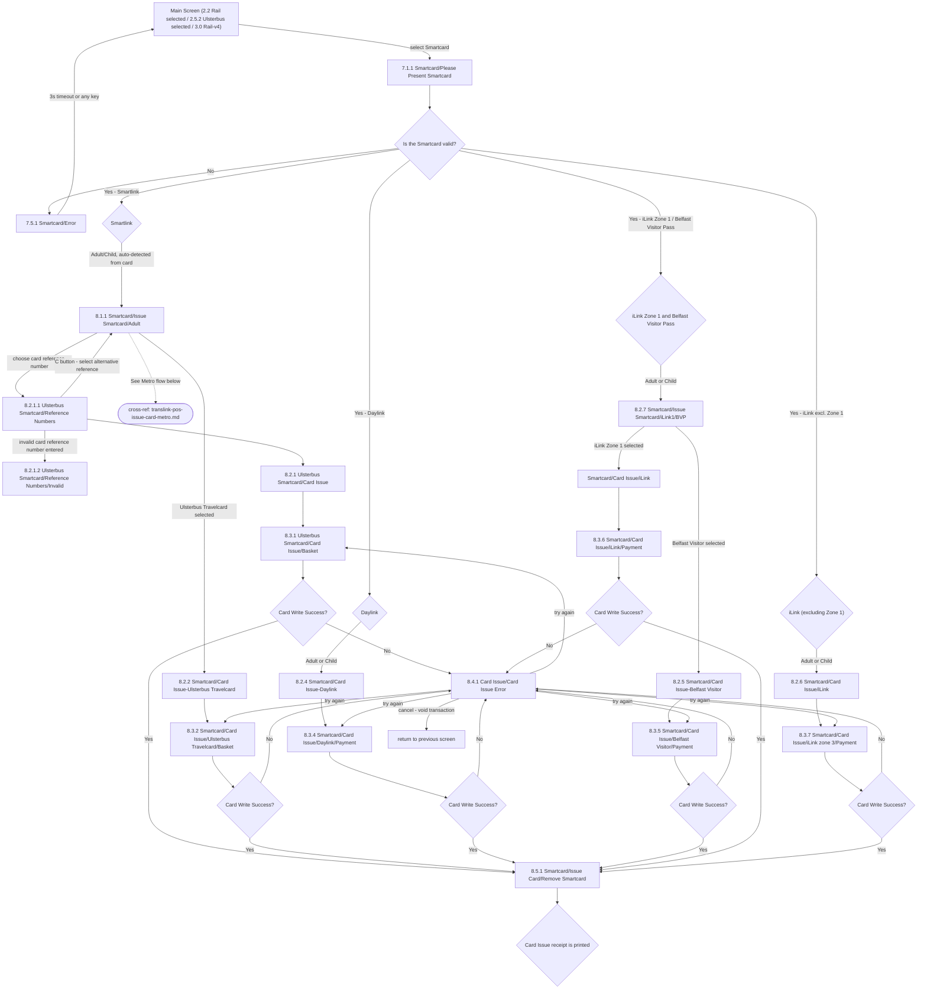

# Flow: Translink POS — Issue Card (Ulsterbus / NIR: Smartlink, Daylink, iLink, Belfast Visitor Pass)

- Source: `knowledge/flows/translink-pos-full-transcription-v4.0.3.md`, board "9. 8.0 Issue Card"
  (Ulsterbus/NIR portion only). Raw source transcribed via the Claude Chrome extension from
  Overflow.io project "v4.0.3 Translink POS" (https://overflow.io/s/RCZ9UPQF/). Structured
  2026-08-05.
- Project: translink   Device: POS   Feature: smartcard issue (Ulsterbus/NIR: Smartlink,
  Daylink, iLink, Belfast Visitor Pass)
- Split note: the raw "8.0 Issue Card" board covers three genuinely distinct entry contexts — this
  file (Ulsterbus/NIR standard smartcard issue), `translink-pos-issue-card-abt.md` (ABT smartcard
  issue — reachable from **both** this flow and the Metro flow, so split out on its own), and
  `translink-pos-issue-card-metro.md` (Metro POS card issue, separate entry screen and separate
  "Is the Smartcard valid?" instance).
- Transcription confidence: **medium** — the source repeats several generic node labels ("Adult",
  "Child", "Card Write Success?", "8.5.1 Remove Smartcard", "8.4.1 Card Issue Error", "Card Issue
  receipt is printed") across every card-type sub-branch as the *same wording*, and several
  decision nodes are auto-generated UUID labels (e.g. `754cd040-f4fe-40f9-bd58-af827e9b5b4b`) with
  no visible text, that connections show gating straight into "Card Write Success?". These are
  treated as instances of the shared "Card Write Success?" gate per card type, not distinct
  questions — see Notes/unknowns.

## Diagram

## Paths (each path = one candidate scenario)
| # | Path | Feature | Tags | Covered by |
|---|------|---------|------|------------|
| 1 | Present Smartcard → **invalid** → Error → timeout(3s)/any key → back to Main Screen | issue-card | @destructive | 4105108 |
| 2 | Present Smartcard → valid, **Smartlink** → Adult/Child (auto) → Issue Smartcard/Adult → choose Reference Number → Ulsterbus Card Issue → Basket → Write Success → Remove Smartcard → receipt printed | issue-card | @bos | 4100024 (functional, generic); screen-validation 4100301, 4100303, 4100304, 4100314, 4100322 |
| 3 | Reference Numbers screen → **invalid card reference number entered** → Reference Numbers/Invalid | issue-card | @destructive | 4105111 |
| 4 | Reference Numbers screen → **C button** → back to Issue Smartcard/Adult to pick an alternative reference | issue-card | — | 4105112 |
| 5 | Smartlink → **Ulsterbus Travelcard** selected → Basket → Write Success → Remove Smartcard → receipt printed | issue-card | @bos | 4105113 |
| 6 | Smartlink Adult flow → **"See Metro flow below"** cross-reference (see `translink-pos-issue-card-metro.md`) | issue-card | — | N/A |
| 7 | **Daylink** → Adult/Child (auto) → Card Issue-Daylink → Payment → Write Success → Remove Smartcard → receipt printed | issue-card | @bos | FRAGMENTED — see consolidation-audit.md |
| 8 | **iLink Zone 1 and Belfast Visitor Pass** → Adult/Child (auto) → Issue Smartcard/iLink1-BVP → **Belfast Visitor** selected → Card Issue-Belfast Visitor → Payment → Write Success → Remove Smartcard → receipt printed | issue-card | @bos | 4100390 (functional, TIBU-23963), 4100024 (generic tail), screen-validation 4100311, 4100313, 4100318, 4100322 |
| 9 | Same entry (8) → **iLink Zone 1** selected instead of Belfast Visitor → Card Issue/iLink → iLink/Payment → Write Success → Remove Smartcard → receipt printed | issue-card | @bos | FRAGMENTED — see consolidation-audit.md |
| 10 | **iLink (excluding Zone 1)** → Adult/Child (auto) → Card Issue/iLink → iLink zone 3/Payment → Write Success → Remove Smartcard → receipt printed | issue-card | @bos | FRAGMENTED — see consolidation-audit.md |
| 11 | Any basket/payment screen → Card Write Success = **No** → Card Issue Error → operator tries again → same basket/payment screen | issue-card | @destructive | 4105109 |
| 12 | Card Issue Error → operator **cancels** → transaction voided → returns to previous screen | issue-card | @destructive | 4105110 |

## Screen states (Given/Then anchors)
- **7.1.1 Smartcard/Please Present Smartcard** — reachable from the Main Screen (Rail or Ulsterbus
  selected) at any time; "User may choose 'Smartcard' at any given time on the Main Screen and both
  Bus or Rail FLU screens."
- **Is the Smartcard valid?** — decision; No routes to the shared "7.5.1 Smartcard/Error" screen
  (catch-all for cards not in a recognised Translink format; 3s timeout or any key returns to the
  previous screen).
- **Adult/Child selection** — not an operator choice: "Selection of adult or child will be done
  automatically by the POS according to the data on the card." Child flows mirror Adult flows with
  Child pricing pulled from Cloudflare.
- **8.2.1.1 Ulsterbus Smartcard/Reference Numbers** — "Pressing 'C' button will take the operator
  back to select an alternative card reference number."
- **iLink zone determination** — "The iLink zone is determined from the card encoding" (not an
  operator selection).
- **8.5.1 Smartcard/Issue Card/Remove Smartcard** — shared across every card type in this flow;
  "A Card Issue Successful screen is presented and user has to remove Smartcard to continue."
- **8.4.1 Card Issue/Card Issue Error** — shared error screen for a failed write. Behaviour per the
  source annotation (verbatim): "When this screen is shown: 1) If payment was by card the card
  transaction is voided 2) No transaction record will have been recorded on the POS and subsequently
  no totals information would have been updated 3) Some data may have been written to the smartcard
  but it would have been written to a section of the smartcard that is not currently being used so
  will have no effect on smartcard operation 4) A diagnostic/event is recorded to audit this error
  occurred." Operator can "try again to write information on the smartcard or to cancel the process
  which would void the transaction and return to the previous screen."
- **Card Issue receipt** — printed after successful write and card removal; content is card-type
  specific, e.g. "This will need to state <X> <Period> from first use" (recurring annotation across
  Travelcard/iLink/Daylink screens) and "Customer access code is printed on the card issue receipt"
  (noted once, card type not specified in source — see Notes).

## Notes / unknowns
- The nodes "Adult", "Child", "Card Write Success?", "8.5.1 Remove Smartcard", "8.4.1 Card Issue
  Error", and "Card Issue receipt is printed" are the same generic labels reused across every
  card-type sub-branch in the source (Smartlink/Ulsterbus Travelcard/Daylink/iLink/Belfast Visitor)
  — they are not distinct per-type screens, consistent with the shared-gate pattern already noted in
  `translink-etm-supervisor-menu.md`.
- Several decision nodes in the raw transcription have auto-generated UUID labels (e.g.
  `754cd040-f4fe-40f9-bd58-af827e9b5b4b`, `15828803-daff-476b-8a05-c2c2dfeae9ec`,
  `b8a0e36b-27d4-4520-ad8e-5bc4a815ea3d`, `79750a57-0ad9-4b6b-bb0a-2bea1882bd53`,
  `c16c2831-55b4-4488-b24e-bfaeb06a4c61`, `5881db98-ae18-42ed-8e93-b2a504101810`) instead of visible
  text, each gating straight into "Card Write Success?". TODO: confirm with Overflow directly
  whether these are unlabeled duplicates of the "Card Write Success?" decision (assumed here) or a
  distinct intermediate step whose label failed to export.
- TODO: confirm which screen "Customer access code is printed on the card issue receipt" applies to
  — the annotation appears once in the flat extraction with no screen ID attached.
- TODO: confirm the exact destination of "return to previous screen" after a cancelled Card Issue
  Error — the source names the behaviour but not a specific screen ID.
- "See Metro flow below" (from 8.1.1 Smartcard/Issue Smartcard/Adult) is a pointer in the source to
  the Metro sub-flow — see `translink-pos-issue-card-metro.md`. No further detail on the connecting
  screen is given in this section.
