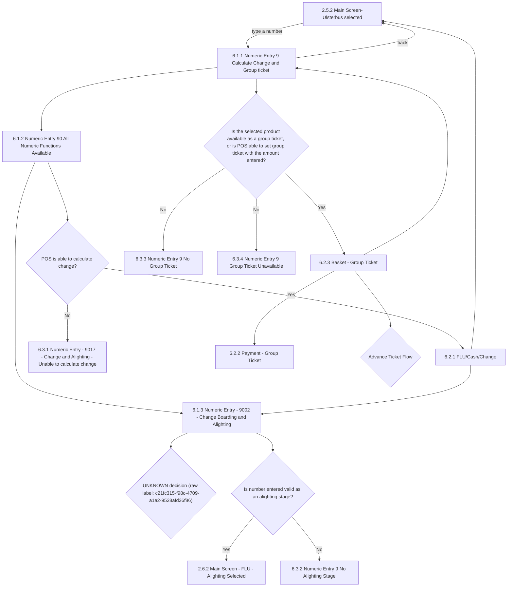

# Flow: Translink POS — Numerical Input (Bus)

- Source: `knowledge/flows/translink-pos-full-transcription-v4.0.3.md`, board "7. 6.0 Numerical
  Input" (Board Index entry "6.0 Numerical Input"). Transcribed verbatim via the Claude Chrome
  extension, 2026-08-04. Structured into this flow map 2026-08-05.
- Project: translink   Device: POS   Feature: numerical input (Bus FLU — calculate change,
  change boarding/alighting stage, group ticket)
- Transcription confidence: **medium** — the source board mixes Bus and Rail numeric-input screens
  under one "6.0 Numerical Input" heading with no connections between the two sets, so this file
  covers the Bus subset only (see `translink-pos-numerical-input-rail.md` for the Rail subset).
  One decision node in the raw source has no legible label (see Notes/unknowns).

## Diagram

## Paths (each path = one candidate scenario)
| # | Path | Feature | Tags | Covered by |
|---|------|---------|------|------------|
| 1 | Main Screen-Ulsterbus selected → type number → Numeric Entry 9 Calculate Change and Group ticket → back → Main Screen | numerical-input | — | 4100006, 4100225 |
| 2 | Numeric Entry 9 → Numeric Entry 90 All Numeric Functions Available → Numeric Entry 9002 Change Boarding and Alighting → alighting stage valid → Main Screen - FLU - Alighting Selected | numerical-input | — | 4100227, 4100151 |
| 3 | Numeric Entry 9002 → alighting stage **not** valid → Numeric Entry 9 No Alighting Stage | numerical-input | @destructive | 4100232 |
| 4 | Numeric Entry 90 → POS able to calculate change → FLU/Cash/Change → back to Numeric Entry 9002 | numerical-input | — | 4100431, 4100226, 4100228 |
| 5 | FLU/Cash/Change → back → Main Screen-Ulsterbus selected | numerical-input | — | 4105114 |
| 6 | Numeric Entry 90 → POS **unable** to calculate change → Numeric Entry 9017 Unable to calculate change | numerical-input | @destructive | 4100431, 4100231 |
| 7 | Numeric Entry 9 → selected product available as group ticket / amount supports group ticket → Basket - Group Ticket → Payment - Group Ticket | numerical-input | — | 4100430, 4100230, 4100229 |
| 8 | Numeric Entry 9 → group ticket **not available for this product** → Numeric Entry 9 Group Ticket Unavailable | numerical-input | @destructive | 4100430, 4100234 |
| 9 | Numeric Entry 9 → amount entered **cannot form a group ticket** → Numeric Entry 9 No Group Ticket | numerical-input | @destructive | 4100430, 4100233 |
| 10 | Basket - Group Ticket → back → Numeric Entry 9 Calculate Change and Group ticket | numerical-input | — | 4105115 |
| 11 | Basket - Group Ticket → Advance Ticket Flow (routes to the separate advance-ticket flow, not captured on this board) | numerical-input | — | 4105116 |
| 12 | Numeric Entry 9002 Change Boarding and Alighting → UNKNOWN decision (unlabeled node in source) | numerical-input | — | 4105117 |

## Screen states (Given/Then anchors)
- **2.5.2 Main Screen-Ulsterbus selected** — typing a number at any time opens the numerical input
  menu (Numeric Entry 9).
- **6.1.1 Numeric Entry 9 Calculate Change and Group ticket** — entry point after a number is typed;
  what functionality is available depends on the amount entered (e.g. group ticket capped at 100
  tickets).
- **6.1.2 Numeric Entry 90 All Numeric Functions Available** — all numeric functions (change
  calculation, boarding/alighting change) available for this amount.
- **6.1.3 Numeric Entry - 9002 - Change Boarding and Alighting** — setting boarding/alighting stage
  by Unique Farestage ID; a valid entry returns to the Main FLU screen with the stage changed.
- **6.2.1 FLU/Cash/Change** — change is calculated from the amount entered.
- **6.2.3 Basket - Group Ticket** — group ticket priced as boarding/alighting stages × number
  entered; issuing prints a single group-ticket receipt, and a single BOS transaction record is sent
  containing sub-elements for each passenger in the group.
- **6.2.2 Payment - Group Ticket** — payment step for the group ticket basket.
- **2.6.2 Main Screen - FLU - Alighting Selected** — reached when the entered alighting-stage ID is
  valid.
- **6.3.1 Numeric Entry - 9017 - Change & Alighting - Unable to calculate change** — error shown when
  change cannot be calculated. Per spec, calculate-change is unavailable if: (1) too many digits
  entered, (2) amount entered is less than the ticket value, or (3) the previous transaction had no
  value.
- **6.3.2 Numeric Entry 9 No Alighting Stage** — error shown when the number entered doesn't match
  any available alighting stage.
- **6.3.3 Numeric Entry 9 No Group Ticket** — error banner shown when the amount entered cannot be
  used for a group ticket.
- **6.3.4 Numeric Entry 9 Group Ticket Unavailable** — error banner shown when the selected product
  is not available as a group ticket at all.

## Notes / unknowns
- The raw transcription's Connections/Flow list includes an edge from "6.1.3 Numeric Entry - 9002 -
  Change Boarding and Alighting" to a decision node whose only captured label is the string
  `c21fc315-f98c-4709-a1a2-9528afd36f86` — this reads as an Overflow internal node id, not an actual
  decision label. TODO: confirm what this decision node actually says/does in Overflow directly (not
  re-derivable from the transcription).
- "Advance Ticket Flow" (reached from Basket - Group Ticket) is referenced only as a named decision
  with no onward screens captured on this board — annotation says "Operator will be able to set an
  advance date ticket following the specific flow," implying it routes to a separate flow/board not
  included in this transcription. TODO: confirm which board covers the advance-ticket flow.
- Timeout behaviour (3-second timeout on the "Calculate Change" flow: "Timeout will not occur, 'Back
  or Main' keys must be pressed") is stated in the annotations but not tied to an explicit
  screen-to-screen connection in the source — noted here as behaviour, not drawn as a transition.
  TODO: confirm whether this applies to this Bus flow specifically or to numerical input generally.
- Cloudflare-configurable list of which ticket types may be issued as Group Tickets is mentioned in
  the annotations (org-level config, not a screen) — included for context only, not a path.
