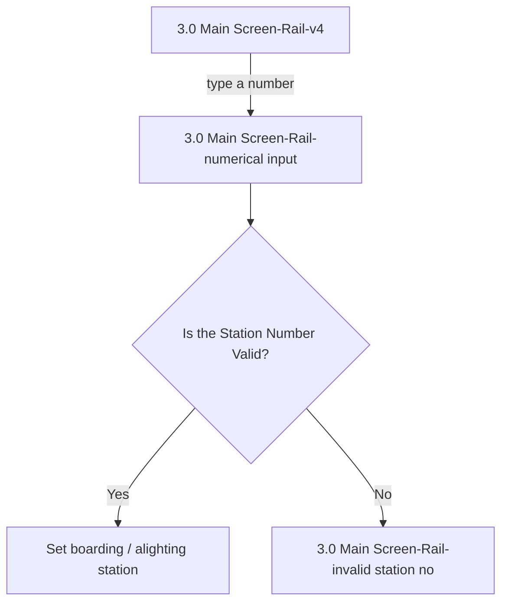

# Flow: Translink POS — Numerical Input (Rail)

- Source: `knowledge/flows/translink-pos-full-transcription-v4.0.3.md`, board "7. 6.0 Numerical
  Input" (Board Index entry "6.0 Numerical Input"). Transcribed verbatim via the Claude Chrome
  extension, 2026-08-04. Structured into this flow map 2026-08-05.
- Project: translink   Device: POS   Feature: numerical input (Rail — setting boarding/alighting
  station by number entry)
- Transcription confidence: **medium** — the source board mixes Bus and Rail numeric-input screens
  under one "6.0 Numerical Input" heading with no connections between the two sets, so this file
  covers the Rail subset only (see `translink-pos-numerical-input-bus.md` for the Bus subset). Some
  Rail behaviour notes (timeout, error timing) are stated in annotations but not tied to an explicit
  drawn connection — see Notes/unknowns.

## Diagram

## Paths (each path = one candidate scenario)
| # | Path | Feature | Tags | Covered by |
|---|------|---------|------|------------|
| 1 | Main Screen-Rail-v4 → type number → Main Screen-Rail-numerical input → Station Number Valid → Set boarding/alighting station | numerical-input | — | 4099972, 4100224 |
| 2 | Main Screen-Rail-v4 → type number → Main Screen-Rail-numerical input → Station Number **not** valid → Main Screen-Rail-invalid station no | numerical-input | @destructive | 4100223 |

## Screen states (Given/Then anchors)
- **3.0 Main Screen-Rail-v4** — typing a number followed by the L1/L2 key automatically sets the
  boarding/alighting station.
- **3.0 Main Screen-Rail-numerical input** — number-entry overlay on the Rail main screen; the
  entered digits are shown in the bottom bar of the POS screen.
- **Set boarding / alighting station** — operator enters 1, 2, or 3 digits then presses L1 to set the
  boarding station, or L2 to set the alighting station (e.g. entering "2" is interpreted as station
  "02"). Once set, the entered number disappears and the operator can enter another.
- **3.0 Main Screen-Rail-invalid station no** — shown when the entered number doesn't match any
  available station; the error is stated in the bottom bar with a 3-second timeout.

## Notes / unknowns
- Annotation: "The timeout before pressing L1 or L2 key should be 3 seconds. Also the operator has to
  wait for 3 seconds to input another number if mistaken. If more than 3 digits are entered for
  selecting a station then any extra digits will be ignored." — stated behaviour, not drawn as an
  explicit connection in the source. TODO: confirm whether this timeout returns to
  "Main Screen-Rail-v4" or stays on "Main Screen-Rail-numerical input".
- Decision "If operator chooses to change the boarding stage and the number entered doesn't match any
  of the stages available, the following error will be displayed: 'Unable to Set Boarding Stage'" is
  listed among this board's Decision Points but has no corresponding screen name or drawn connection
  in the Connections/Flow list — it may be the same error surfaced as "3.0 Main Screen-Rail-invalid
  station no," or a distinct dialog. TODO: confirm whether "Unable to Set Boarding Stage" is the same
  screen as "Main Screen-Rail-invalid station no" or a separate one.
- These three Rail screens ("3.0 Main Screen-Rail-v4", "-numerical input", "-invalid station no") are
  also referenced from the separate "3.0 FLU - Rail" board (source lines ~485-486) covering the
  broader Rail FLU flow — this file captures only the numerical-input-specific edges drawn on the
  "6.0 Numerical Input" board itself; see `translink-pos-flu-rail*.md` (if/when structured) for the
  wider Rail FLU context.
