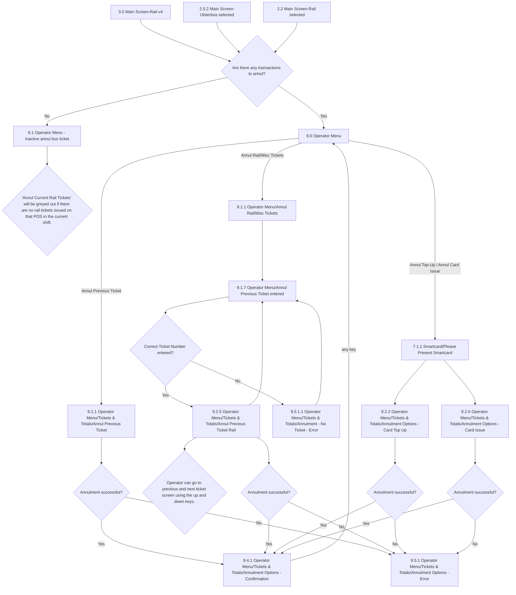

# Flow: Translink POS — Operator Menu: Annulment

- Source: `knowledge/flows/translink-pos-full-transcription-v4.0.3.md`, board "10. 9.0 Operator" —
  the Annulment portion only. Transcribed/structured 2026-08-05. Raw transcription itself was via
  the Claude Chrome extension, 2026-08-04, from Overflow (v4.0.3).
- Project: translink   Device: POS   Feature: annulment / transaction reversal
- Split note: highest financial-risk sub-flow of the "9.0 Operator" board — split out from the rest
  (sign off, break mode, totals, operator information/device management, excess tickets), which is
  covered in `translink-pos-operator-menu.md`. Same split precedent as ETM's Driver Menu board
  (`translink-etm-driver-menu-options.md` / `translink-etm-driver-menu-annulment.md`).
- Transcription confidence: **high** — verbatim, not summarized.

## Diagram

## Paths (each = one candidate scenario)
| # | Path | Feature | Tags | Covered by |
|---|---|---|---|---|
| 1 | From Main Screen (Rail-v4 / Ulsterbus selected / Rail selected), transactions exist to annul → routed to Operator Menu | annulment | — | 4099996, 4100329 |
| 2 | From Main Screen, **no** transactions exist to annul → "inactive annul bus ticket" screen (greyed out) | annulment | @destructive | 4099996, 4100329 |
| 3 | Operator Menu → Annul Previous Ticket (bus) → annulment succeeds → Confirmation → any key → Operator Menu | annulment | @destructive | 4099996, 4100505, 4100338, 4100346 |
| 4 | Operator Menu → Annul Previous Ticket (bus) → annulment **fails** → Error screen | annulment | @destructive | 4100351 |
| 5 | Operator Menu → Annul Rail/Misc Tickets → enter ticket number → **correct** → Annul Previous Ticket Rail → succeeds → Confirmation | annulment | @destructive | 4100330, 4100336, 4100342, 4100346 |
| 6 | Operator Menu → Annul Rail/Misc Tickets → enter ticket number → **incorrect** → No Ticket - Error → back to ticket-entry screen | annulment | @destructive | 4100352 |
| 7 | Annul Previous Ticket Rail → page through multiple tickets using up/down keys | annulment | — | 4105118 |
| 8 | Annul Previous Ticket Rail → annulment **fails** → Error screen | annulment | @destructive | 4100351 |
| 9 | Operator Menu → present smartcard → Card Top Up annulment → succeeds/fails | annulment | @destructive | 4099998, 4100339 |
| 10 | Operator Menu → present smartcard → Card Issue annulment → succeeds/fails | annulment | @destructive | 4099997, 4100386, 4100343 |

## Screen states (Given/Then anchors)
- **Bus-ticket annulment eligibility rule** (verbatim annotation): "If any of the following
  conditions have not been met then the 'Annul Previous Transaction' option is not available: - The
  previous transaction was a bus ticket that was issued within the last 60 seconds - The previous
  transaction was a smartcard transaction." A second annotation adds: "If most recent transaction was
  a smartcard transaction, then it can be annulled."
- **Rail/Misc annulment is looked up by ticket number**, not "last transaction only" — entering an
  incorrect number routes to a dedicated "No Ticket - Error" screen rather than the generic
  annulment error screen.
- **Receipt behaviour on success** (verbatim annotation): "An annulled ticket receipt will be printed
  showing which ticket has been annulled so that the operator can use this annulled receipt along
  with the original ticket issued to reconcile his cash takings. If the transaction used a payment
  card then the card is automatically refunded and a payment card receipt is printed."
- **Confirmation screen** (9.4.1) returns to Operator Menu on any key press (verbatim: "User will
  receive a confirmation screen and will be able to go back to operator menu, pressing any key.").
- **Error screen** (9.5.1) returns to "the previous annulment screen" on any key press (verbatim,
  stated twice in the source annotations) — the exact screen this lands on is context-dependent on
  which of the four annulment sub-flows raised it; the source does not disambiguate per sub-flow.
- Annul Rail/Misc "greyed out" annotation reads: "'Annul Current Rail Tickets' will be greyed out if
  there are no rail tickets issued on that POS in the current shift" — attached to a screen titled
  "9.1 Operator Menu - inactive annul **bus** ticket" (see Notes below for the naming mismatch).

## Notes / unknowns
- TODO: confirm whether the "Annulment successful?" decision, "9.4.1 …Confirmation" screen, and
  "9.5.1 …Error" screen are genuinely the **same shared** screens reused by all four annulment types
  (bus, rail/misc, card top-up, card issue) or four visually-identical-but-distinct instances — the
  transcription's connection list gives each source screen its own edge to a same-named decision but
  does not state whether the destination screens are literally shared.
- TODO: confirm the "9.1 Operator Menu - inactive annul bus ticket" screen — its own annotation talks
  about "Annul Current Rail Tickets" (a rail-ticket phrase) attached to a screen titled around **bus**
  ticket annulment. This looks like a mismatch/typo in the source; flag for the engineer rather than
  resolving it either way.
- "7.1.1 Smartcard/Please Present Smartcard" is a shared screen also used in board "7.0 Top Up &
  Validation" — this file only shows its entry point from the annulment menu options (Card Top Up /
  Card Issue), not the full smartcard-present mechanics.
- GAP: no screen/annotation states what happens attempting to annul a rail/misc ticket by number
  **outside** any time-window equivalent to the bus ticket's "60 seconds" rule — unlike the bus flow,
  no time-based eligibility rule is stated for rail/misc annulment by ticket number; unclear if one
  exists. Confirm live before assuming rail/misc annulment is unbounded in time.
