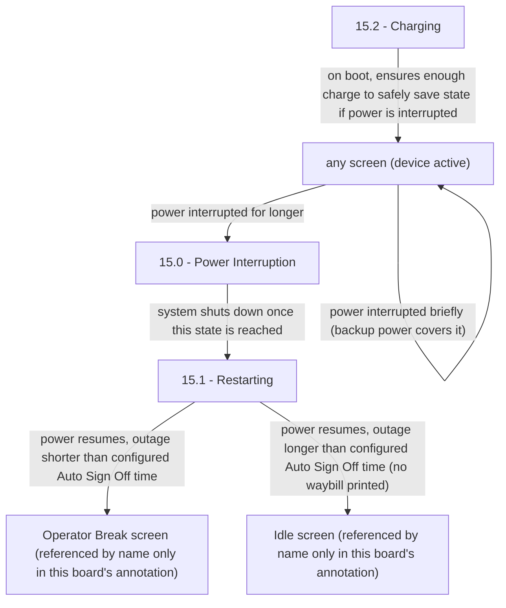

# Flow: Translink POS — Power Interruption & Audio Tones

- Source: `knowledge/flows/translink-pos-full-transcription-v4.0.3.md`, board "16.0 Power
  Interruption & Audio Tones" (Board Index item 17). Raw source transcribed verbatim via the Claude
  Chrome extension, 2026-08-04. This flow-map structured from it 2026-08-05.
- Project: translink   Device: POS   Feature: power interruption / suspend / audio tones
- Transcription confidence: **medium** — the source board itself records **0 Decision Points** and
  **0 Connections/Flow** (only 3 screens + 9 free-text annotations). The transitions below are
  reconstructed from the exact wording of those annotations, not from explicit Overflow connection
  arrows. Treat edge labels as paraphrase-free quotes of the annotation text, but the *existence* of
  an arrow (vs. a formally drawn connection) is an inference — see Notes/unknowns.

## Diagram

> The above is this board's own annotation prose turned into arrows. It does **not** show how
> "Restarting" (15.1) and "Charging" (15.2) relate to each other, since the source draws no
> connection between them at all (Connections/Flow = 0). Do not read a firm sequence into the
> diagram beyond what's quoted in Screen states below.

## Paths (each path = one candidate scenario)
| # | Path | Feature | Tags | Covered by |
|---|------|---------|------|------------|
| 1 | Power interrupted briefly on any screen → backup power covers it → device stays on / returns to the screen it was originally on | power-interruption | — | 4100360 |
| 2 | Power interrupted for longer → "15.0 - Power Interruption" screen displays → system shuts down | power-interruption | @destructive | 4100360, 4100131 |
| 3 | Power resumes after outage **shorter** than the configured Auto Sign Off time → POS goes to the Operator Break screen | power-interruption | — | 4100360 |
| 4 | Power resumes after outage **longer** than the configured Auto Sign Off time → POS goes to the Idle screen with **no waybill printed** | power-interruption | @destructive | 4100360, 4099934 |
| 5 | Boot → "15.2 - Charging" screen shown → ensures device has enough charge to safely save state if power is interrupted | power-interruption | — | 4100133 |
| 6 | Device inactive on an FLU screen for the configured Auto Sign Off period → reverts to the Idle screen with no waybill printed | power-interruption | — | STALE — 4099933, 4100436 |
| 7 | Device inactive on the Idle screen for the configured Auto Suspend period → screen turns off, device enters suspend mode | power-interruption | — | STALE — 4100436 |
| 8 | Device remains in suspend mode for the configured Suspend Duration period → automatically reboots → goes to the Idle screen | power-interruption | — | 4100436 |
| 9 | Device is in suspend mode → any key press → POS reboots → goes to the Idle screen | power-interruption | — | 4100436 |
| 10 | Top Up / Card Issue / Ticket Issue completes successfully → Success Tone plays | audio-tones | — | 4100361 |
| 11 | Any failure occurs → Error Tone plays | audio-tones | — | 4100361 |
| 12 | Smartcard left on reader → Frequent beep plays | audio-tones | — | 4100361 |

## Screen states (Given/Then anchors)
- **15.0 - Power Interruption** — "This screen appears when power is interrupted. If the power is
  interrupted temporarily, the device will take the user to the screen they were originally on."
  "If the power is interrupted for a longer time, this screen will display. The system is shutting
  down once this state is reached." Resuming power from this state routes to either the Operator
  Break screen or the Idle screen depending on outage duration vs. the configured Auto Sign Off time
  (see Paths 3/4).
- **15.1 - Restarting** — screen name only; no annotation text of its own beyond the shared
  "resuming power" behaviour quoted under 15.0. TODO: confirm exact wording/purpose specific to this
  screen — the source gives it no dedicated annotation.
- **15.2 - Charging** — "This screen appears on boot to ensure the device has enough charge to
  successfully allow the state to be saved in the event of a power interruption."
- **Audio Tones** — not a screen; a cross-cutting behaviour note with no screen node of its own:
  "Success Tone - Top Ups, Card Issues, Ticket Issues / Error Tone - Any failure / Frequent beep -
  Smartcard left on reader."
- **Auto sign off / suspend chain** — also not tied to one of this board's 3 screens; annotation
  text names "any of the FLU screens", "the Idle screen", and generic "reboot" without a specific
  screen id: "If the device is inactive on any of the FLU screens for the configured Auto Sign Off
  period then the POS will revert to the Idle screen with no waybill printed. If the device is
  inactive on the Idle screen for the configured Auto Suspend period then the POS will turn the
  screen off and go into suspend mode. If the device is in suspend mode for the configured Suspend
  Duration period then the POS will automatically reboot and go to the Idle screen. If the device is
  in suspend mode then a key press will trigger the POS to reboot and go to the Idle screen."

## Notes / unknowns
- Board transcription records **0 Decision Points** and **0 Connections/Flow** — unusually sparse
  vs. other boards. Every arrow in the Diagram above is reconstructed from the 9 free-text
  annotations, not from formally drawn Overflow connections. Treat this flow-map's diagram as
  lower-confidence than the norm for this reason.
- TODO: confirm what "Operator Break screen" and "Idle screen" in this board's annotations
  correspond to by exact screen id — other boards in the same transcription reference
  "9.2.3 Idle Screen - Driver on Break" and "1.0 Idle Screen" as distinct named screens; this board's
  own text never gives an id, only the generic names "Operator Break screen" / "Idle screen".
- **RESOLVED (partially) 2026-08-06**: a correctness-check pass flagged cases C4099933/C4100436 as
  contradicting this board's "reverts to the Idle screen" reading for the Auto-Sign-Off inactivity
  trigger. Checked `proposals/coherence-audit/gap-register.md` Q18 first — George live-confirmed on
  2026-07-21 that **"Break mode is used"** for this exact sign-off/suspend chain, which outranks this
  board's reconstructed-from-annotations text (medium confidence, 0 recorded connections). Both cases
  were left unchanged. This board's own diagram/annotations should be treated as the less reliable
  source on this specific point until someone re-confirms which screen name is current.
- TODO: confirm the relationship (sequencing/precondition) between "15.1 - Restarting" and
  "15.2 - Charging" — the source gives each screen a bare name/annotation but never states which
  comes first or under what condition either is shown relative to the other.
- TODO: confirm whether "Auto sign off" / "Auto Suspend" / "Suspend Duration" are configurable
  thresholds documented elsewhere (e.g. an admin/config board) with exact default values — this
  board only names them, it doesn't give values.
- Not split into multiple files: despite covering two named areas (Power Interruption, Audio
  Tones), the board is small (3 screens, 0 decisions, 0 connections, 9 annotations total) and Audio
  Tones has no screens of its own to anchor a separate file around — kept as one file per the
  instruction to only split when a board bundles genuinely distinct, substantial feature areas.
