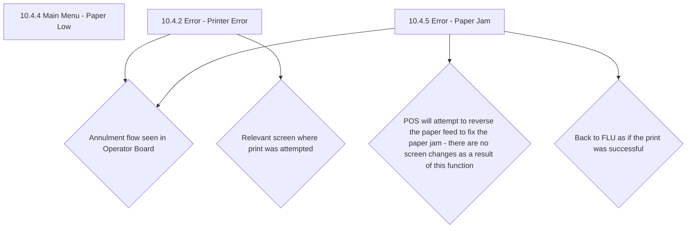

# Flow: Translink POS — Printer Errors

- Source: `knowledge/flows/translink-pos-full-transcription-v4.0.3.md`, board "16. 15.0 Printer
  Errors". Transcribed verbatim via the Claude Chrome extension, 2026-08-04. Structured into this
  flow-map 2026-08-05.
- Project: translink   Device: POS   Feature: printer errors (paper low, printer error, paper jam)
- Transcription confidence: **high** — verbatim, not summarized. Source connections list only 5
  explicit Screen→Decision links even though 8 decision-point texts are listed; the 3 extra
  decision-point texts not present in the Connections/Flow list are captured under Notes below
  rather than turned into invented arrows.

## Diagram

> Note: the source transcription gives these as literal `Screen: "X" → Decision: "Y"` pairs with no
> separate action/trigger label on the arrow — that literal structure is preserved above rather than
> inventing trigger text (e.g. "tap Annul", "tap Retry") not present in the source.

## Paths (each path = one candidate scenario)
| # | Path | Feature | Tags | Covered by |
|---|------|---------|------|------------|
| 1 | Printer Error → Annulment flow (Operator Board) | printer-errors | @destructive | 4105134 |
| 2 | Printer Error → back to relevant screen where print was attempted | printer-errors | — | 4105135 |
| 3 | Paper Jam → Annulment flow (Operator Board) | printer-errors | @destructive | 4100000, 4100358 |
| 4 | Paper Jam → POS attempts to reverse the paper feed (no screen change) | printer-errors | — | 4105136 |
| 5 | Paper Jam → print retried successfully → back to FLU as if print was successful | printer-errors | — | 4100358 |
| 6 | Main Menu - Paper Low → temporary low-paper notification (3s timeout) | printer-errors | — | 4100437 |
| 7 | Printer Error / Paper Jam on a non-transaction print (Mini Statement, Annul Ticket confirmation, Version Report, Waybill) → "Annul Transaction" option reads "Continue without Printing" | printer-errors | — | 4105137 |
| 8 | Print fails again on retry → returns to the same error screen (Printer Error / Paper Jam) → repeats until annulled | printer-errors | @destructive | 4105138 |

## Screen states (Given/Then anchors)
- **10.4.4 Main Menu - Paper Low** — shown when printer paper level is low; user gets a temporary
  notification with a **3 second timeout**.
- **10.4.2 Error - Printer Error** — reached when a print fails (malfunction, or no paper in the
  feeder while trying to print). Offers an annulment flow (as seen in the Operator Board) or,
  depending on print outcome, returns to the relevant screen where the print was attempted.
- **10.4.5 Error - Paper Jam** — reached on a paper jam. POS automatically attempts to reverse the
  paper feed to clear the jam (no screen change while this happens). Offers the same annulment flow
  as Printer Error, or can return to FLU as if the print had been successful.
- **Non-transaction print annul option label** — for both Printer Error and Paper Jam, when the
  print attempt is not a transaction (e.g. Mini Statement, Annul Ticket confirmation, Version
  Report, Waybill), the "Annul Transaction" option is instead labelled "Continue without Printing".
- **Retry loop** — if a print fails again, the device returns to the same error screen; this repeats
  indefinitely until the operator annuls, by design, to force annulment of the transaction that took
  place but could not be printed. An event is sent to CloudFare (sic, as transcribed) when a print is
  retried.

## Notes / unknowns
- Decision-point texts present in the source's "Decision Points" list but **not** wired to an
  explicit arrow in its "Connections / Flow" list: "The operator will be expected to annul the
  transaction which caused the paper jam" (Paper Jam-specific elaboration of the annulment flow) and
  the retry-loop text quoted above (applies to both Printer Error and Paper Jam) — folded into
  "Screen states" above rather than invented as diagram edges.
- TODO: confirm whether "10.4.4 Main Menu - Paper Low" has any onward navigation beyond the
  temporary notification — the source lists it as a screen but no Connections/Flow entry involves
  it.
- TODO: confirm the exact operator action that triggers each Screen→Decision arrow (e.g. tapping
  "Annul", tapping "Retry", or automatic retry) — the source transcription does not label the
  triggering action on these five connections, only the destination decision text.
- The device also emits events (per the board's Annotations) when a print fails, when a partial
  print occurs due to power loss, and when a ticket resumes printing after power loss — these
  power-loss-adjacent print events are more fully covered by the separate "16.0 Power Interruption &
  Audio Tones" board; not duplicated here beyond this pointer.
